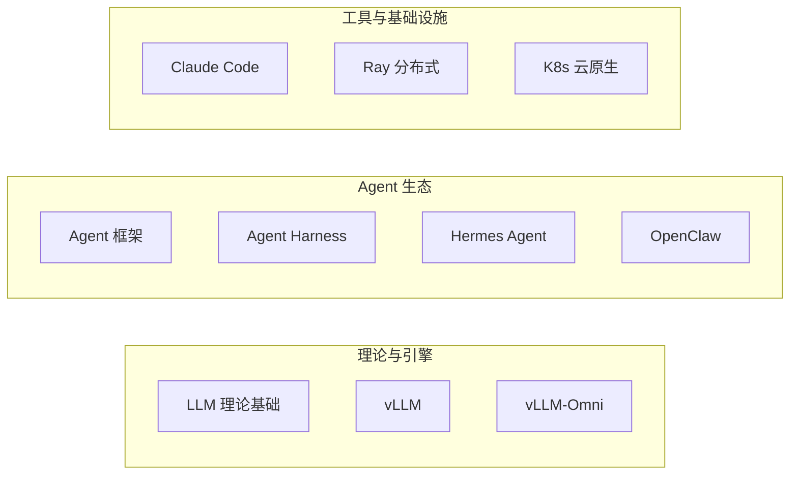
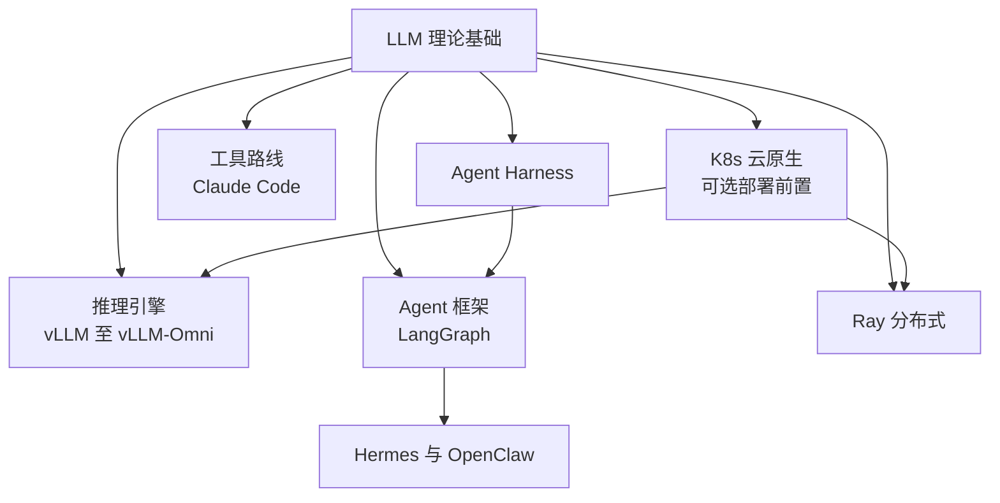

# AI 学习路径合集

AI 技术学习文档，涵盖 Claude Code 工具链、大模型原理、推理引擎源码、Agent 框架与 Harness 工程化、多模态推理、云原生部署等方向。

## 学习路径总览

---

## 各学习路径详情

### 1. [LLM 理论基础](llm-learning-path/)

从零开始系统学习大语言模型原理，覆盖数学基础到工业级案例。

| 阶段 | 内容 | 阶段 | 内容 |
|------|------|------|------|
| 00 | Python、线代、概率、PyTorch 前置 | 05 | 推理优化技术 |
| 01 | Transformer 核心原理 | 06 | 量化/蒸馏/加速 |
| 02 | GPT/LLaMA 等大模型架构 | 07 | 主流模型对比分析 |
| 03 | 预训练全流程 | 08 | 前沿进阶主题 |
| 04 | SFT/RLHF/DPO 微调 | 09 | 高级专题 |

### 2. [vLLM 源码学习](vllm-learning-path/)

通读 vLLM (v0.20.0) 源码，理解生产级 LLM 推理引擎的内部实现。

| 阶段 | 内容 | 学时 |
|------|------|------|
| 00 | [入口 — 找到正确入口，避开废弃代码](vllm-learning-path/00-入口/) | 15min |
| 01 | [用户API到引擎 — 从 LLM.generate() 追到引擎入口](vllm-learning-path/01-用户API到引擎/) | 2~3h |
| 02 | [V1引擎主循环 — EngineCore.step() 紧循环](vllm-learning-path/02-V1引擎主循环/) | 3~5h |
| 03 | [调度与KV缓存 — 调度器算法与 KV 块管理](vllm-learning-path/03-调度与KV缓存/) | 4~6h |
| 04 | [模型执行与采样 — GPUModelRunner 前向+采样](vllm-learning-path/04-模型执行与采样/) | 3~5h |
| 05 | [模型实现 — LLaMA/Qwen 等具体模型适配](vllm-learning-path/05-模型实现/) | 3~4h |
| 06 | [Attention后端 — FlashAttention/FlashInfer 等](vllm-learning-path/06-Attention后端/) | 2~3h |
| 07 | [高级特性 — Prefix Caching/Spec Decode/多模态](vllm-learning-path/07-高级特性/) | 3~5h |

> 源码位置：`code/vllm/`

### 3. [vLLM-Omni 源码学习](vllm-omni-learning-path/)

通读 vLLM-Omni 源码，理解多模态（文本/图像/视频/音频）推理引擎的多阶段流水线架构。

| 阶段 | 内容 | 学时 |
|------|------|------|
| 00 | [前置知识 — vLLM基础、全模态概念、扩散模型](vllm-omni-learning-path/00-前置知识/) | 1~2h |
| 01 | [项目总览与入口 — 符号地图、配置系统](vllm-omni-learning-path/01-项目总览与入口/) | 1~2h |
| 02 | [多阶段流水线核心 — Orchestrator、StagePool](vllm-omni-learning-path/02-多阶段流水线核心/) | 3~5h |
| 03 | [入口与API层 — Omni/AsyncOmni、OpenAI API](vllm-omni-learning-path/03-入口与API层/) | 2~3h |
| 04 | [自回归执行(AR Worker) — 文本生成调度与采样](vllm-omni-learning-path/04-自回归执行(AR%20Worker)/) | 3~4h |
| 05 | [扩散模型执行 — Diffusion Engine 图像/音频生成](vllm-omni-learning-path/05-扩散模型执行(Diffusion%20Engine)/) | 4~5h |
| 06 | [模型实现 — Qwen-Omni 等具体模型适配](vllm-omni-learning-path/06-模型实现/) | 2~3h |
| 07 | [分布式与OmniConnector — 跨Stage KV传输](vllm-omni-learning-path/07-分布式与OmniConnector/) | 2~3h |
| 08 | [高级特性 — 流式输出/批处理/性能调优](vllm-omni-learning-path/08-高级特性/) | 2~3h |

> 源码位置：`code/vllm-omni/`

### 4. [Agent 学习路径](agent-learning-path/)

系统掌握 LangChain + LangGraph 构建 AI Agent 的完整技术栈，从基础到工业级多 Agent 系统。

| 阶段 | 内容 | 学时 |
|------|------|------|
| 00 | [入口 — 学习路线总览](agent-learning-path/00-入口/) | 15min |
| 01 | [基础入门 — LangChain 核心概念、LCEL](agent-learning-path/01-入门/) | 3~5h |
| 02 | [LangGraph 核心 — StateGraph、条件分支、Checkpoint](agent-learning-path/02-图核心/) | 5~8h |
| 03 | [Agent 实战 — Tool Calling、create_agent、HITL](agent-learning-path/03-Agent/) | 5~8h |
| 04 | [Skill — SKILL.md 格式、Deep Agent、渐进式披露](agent-learning-path/04-Skill/) | 5~8h |
| 05 | [RAG + Agent 融合 — Corrective RAG、Agentic RAG](agent-learning-path/05-RAG/) | 5~8h |
| 06 | [多 Agent — Supervisor、Hierarchical、Swarm](agent-learning-path/06-多Agent/) | 8~12h |
| 07 | [生产部署 — LangSmith、LangGraph Platform、安全](agent-learning-path/07-生产部署/) | 5~8h |
| 08 | [工业级案例 — Kensho、Grab、Remote](agent-learning-path/08-案例/) | 3~5h |

### 5. [Hermes Agent 源码学习](hermes-learning-path/)

通读 Nous Research 的 Hermes Agent 源码，理解自进化 AI Agent 的完整架构——从 Agent 核心循环、工具系统、记忆/技能系统到多平台接入。

| 章节 | 内容 |
|------|------|
| [00-概述与架构总览](hermes-learning-path/00-概述与架构总览.md) | 项目定位、技术栈、结构总览 |
| [01-Agent核心循环](hermes-learning-path/01-Agent核心循环.md) | 主循环、模型交互、决策流 |
| [02-工具调用系统](hermes-learning-path/02-工具调用系统.md) | 内置工具、自定义工具、沙箱执行 |
| [03-多传输层适配](hermes-learning-path/03-多传输层适配.md) | 18+ 平台统一接入层 |
| [04-System Prompt构建](hermes-learning-path/04-System%20Prompt构建.md) | Prompt 组装、上下文注入 |
| [05-上下文压缩](hermes-learning-path/05-上下文压缩.md) | 自动摘要、对话修剪 |
| [06-记忆与技能系统](hermes-learning-path/06-记忆与技能系统.md) | FTS5 搜索、技能自进化 |
| [07-网关与多平台接入](hermes-learning-path/07-网关与多平台接入.md) | Telegram/Discord/Slack 等 |
| [08-高级特性](hermes-learning-path/08-高级特性.md) | 定时任务、语音、会话管理 |
| [09-SDK与API开发接口](hermes-learning-path/09-SDK与API开发接口.md) | Python SDK、ACP/MCP协议、Plugin、Skills |
| [10-多Agent协作模式](hermes-learning-path/10-多Agent协作模式.md) | delegate_task、子Agent隔离、Orchestrator嵌套 |
| [11-Kanban看板系统](hermes-learning-path/11-Kanban看板系统.md) | SQLite 持久化任务调度、状态机、Dispatcher/Worker、fan-out/fan-in |

> 源码位置：`code/hermes/`

### 6. [OpenClaw 源码学习](openclaw-learning-path/)

通读 OpenClaw 源码，理解开源 AI Agent 框架的完整架构——从多通道网关、ReAct 核心循环、工具/技能系统（含 ClawHub）、四层记忆栈到多 Agent Hub-Spoke 协作。**含与 Hermes Agent 的全面对比**。

| 阶段 | 内容 | 学时 |
|------|------|------|
| 00 | [入口 — 学习路线总览、环境搭建](openclaw-learning-path/00-入口/) | 1-2h |
| 01 | [概述与架构 — OpenClaw 概述、四层架构总览](openclaw-learning-path/01-概述与架构/) | 2-3h |
| 02 | [Agent 核心循环 — ReAct 循环、双引擎设计](openclaw-learning-path/02-Agent核心循环/) | 3-5h |
| 03 | [多通道网关 — Gateway 架构、Lane Queue、多平台接入](openclaw-learning-path/03-多通道网关/) | 3-5h |
| 04 | [工具与技能 — 工具调用、懒加载、ClawHub、安全护栏](openclaw-learning-path/04-工具与技能系统/) | 4-6h |
| 05 | [记忆系统 — 四层记忆栈、记忆固化机制](openclaw-learning-path/05-记忆系统/) | 3-5h |
| 06 | [上下文管理 — 上下文压缩、Workspace 文件体系](openclaw-learning-path/06-上下文管理/) | 3-5h |
| 07 | [多 Agent — Hub-Spoke 模式、sessions_spawn](openclaw-learning-path/07-多Agent协作/) | 3-5h |
| 08 | [插件与扩展 — Channel/Memory/Tool/Provider 插件、多 Provider](openclaw-learning-path/08-插件与扩展/) | 3-5h |
| 09 | [安全与可观测 — 多层护栏、沙箱、CVE 分析、OTel/Dashboard](openclaw-learning-path/09-安全与可观测/) | 3-5h |
| 10 | [与 Hermes 对比 — 架构/能力/选型三篇对比](openclaw-learning-path/10-与Hermes对比/) | 2-3h |

### 7. [Claude Code 学习路径](claude-code-learning-path/)

系统掌握 Claude Code 的完整技术栈，从 CLI 交互式开发到企业级多 Agent 生产部署。

| 阶段 | 内容 |
|------|------|
| 00 | [入口 — 学习路线、环境搭建、核心概念、常用命令](claude-code-learning-path/00-入口/) |
| 01 | [项目记忆与配置 — CLAUDE.md、自定义命令、权限安全](claude-code-learning-path/01-项目记忆与配置/) |
| 02 | [Tools 工具系统 — 内置工具、任务管理、子代理](claude-code-learning-path/02-Tools工具系统/) |
| 03 | [Skills 技能系统 — Skill 格式、渐进式披露、Plugins](claude-code-learning-path/03-Skills技能系统/) |
| 04 | [Hooks 钩子系统 — 生命周期事件、命令/Prompt钩子](claude-code-learning-path/04-Hooks钩子系统/) |
| 05 | [MCP 协议集成 — MCP 原理、常用 Server、自定义开发](claude-code-learning-path/05-MCP协议集成/) |
| 06 | [Agent SDK 开发 — SDK 架构、交互式/自动化会话](claude-code-learning-path/06-Agent-SDK开发/) |
| 07 | [生产实践 — 多Agent协作、CI/CD、企业级治理](claude-code-learning-path/07-生产实践/) |

### 8. [Ray 分布式计算框架](ray-learning-path/)

系统学习 Ray 分布式计算框架，从 Core 三大原语（Task/Actor/Object）到 AI 库（Data/Train/Tune/Serve/RLlib），再到集群部署和生产实践。

| 阶段 | 内容 | 学时 |
|------|------|------|
| 00 | [入口 — Ray 是什么、环境搭建、第一个分布式程序](ray-learning-path/00-入口/) | 2h |
| 01 | [核心抽象 — Task、Actor、Object、三大抽象配合](ray-learning-path/01-核心抽象/) | 6h |
| 02 | [对象管理 — Plasma 原理、零拷贝与内存层级、引用计数 GC](ray-learning-path/02-对象管理机制/) | 5h |
| 03 | [调度系统 — 两级调度架构、资源抽象、放置组、调度策略](ray-learning-path/03-调度系统/) | 6h |
| 04 | [容错与一致性 — 血统重建、Actor 故障恢复、GCS](ray-learning-path/04-容错与一致性/) | 5h |
| 05 | [AI 库总览 — 生态全景、Ray Data、Ray Train 入门](ray-learning-path/05-AI库总览/) | 4h |
| 06 | [训练与调优 — Ray Train 深度、Tune 超参优化、框架集成、大规模最佳实践](ray-learning-path/06-训练与调优/) | 8h |
| 07 | [模型服务 — Serve 核心概念、自动扩缩容、多模型编排、高级部署](ray-learning-path/07-模型服务/) | 6h |
| 08 | [集群与生产 — 集群架构、KubeRay 云原生部署、监控、性能调优](ray-learning-path/08-集群与生产/) | 6h |
| 09 | [高级专题 — RLlib、MLOps 集成、自定义扩展、案例研究](ray-learning-path/09-高级专题/) | 6h |
| 10 | [LLM Wiki 知识库构建 — Karpathy 方法论、编译器模式、三层架构、防幻觉](ray-learning-path/10-LLM-Wiki/) | 3h |

### 9. [Kubernetes 学习路径](k8s-learning-path/)

系统掌握 Kubernetes 容器编排，从本地 kind 集群到生产 Helm/GitOps 交付，覆盖工作负载、网络、存储、安全与可观测，末阶段衔接 vLLM 推理与 KubeRay 部署。

| 阶段 | 内容 | 学时 |
|------|------|------|
| 00 | [入口 — 学习路线总览、环境搭建](k8s-learning-path/00-入口/) | 2h |
| 01 | [架构与核心概念 — K8s 架构、Pod 与容器运行时](k8s-learning-path/01-架构与核心概念/) | 5h |
| 02 | [工作负载 — Deployment、StatefulSet、Job/CronJob](k8s-learning-path/02-工作负载/) | 6h |
| 03 | [服务与网络 — Service、Ingress、NetworkPolicy](k8s-learning-path/03-服务与网络/) | 6h |
| 04 | [存储与配置 — ConfigMap/Secret、PV/PVC、卷挂载](k8s-learning-path/04-存储与配置/) | 5h |
| 05 | [调度与弹性 — 亲和性、ResourceQuota、HPA/VPA](k8s-learning-path/05-调度与弹性/) | 6h |
| 06 | [安全与治理 — RBAC、SecurityContext、多租户](k8s-learning-path/06-安全与治理/) | 5h |
| 07 | [运维与可观测 — kubectl 调试、日志、Prometheus/Grafana](k8s-learning-path/07-运维与可观测/) | 5h |
| 08 | [生态与交付 — Helm、Operator/CRD、GitOps/ArgoCD](k8s-learning-path/08-生态与交付/) | 6h |
| 09 | [AI 工作负载实战 — 推理服务、vLLM 与 KubeRay](k8s-learning-path/09-AI工作负载实战/) | 4h |

### 10. [Agent Harness 学习路径](harness-learning-path/)

系统掌握 Agent 工程兜底层（Harness）——上下文、工具、权限、沙箱、状态、观测、HITL 与上线检查，衔接本仓库 Agent/Hermes/OpenClaw 等路径。

| 阶段 | 内容 | 学时 |
|------|------|------|
| 00 | [入口 — 路线总览、参考阅读、本仓库对照索引](harness-learning-path/00-入口/) | 1h |
| 01 | [为什么需要 Harness — 裸 Agent 风险、判断准则](harness-learning-path/01-为什么需要Harness/) | 3h |
| 02 | [架构全景 — 十一模块、执行循环](harness-learning-path/02-架构全景/) | 4h |
| 03 | [上下文与指令 — 上下文管理、Prompt 约束](harness-learning-path/03-上下文与指令/) | 4h |
| 04 | [工具与协议 — 工具注册、MCP 与 Function Call](harness-learning-path/04-工具与协议/) | 4h |
| 05 | [安全执行 — 权限边界、Sandbox 沙箱](harness-learning-path/05-安全执行/) | 4h |
| 06 | [状态与记忆 — 任务状态、Memory 系统](harness-learning-path/06-状态与记忆/) | 4h |
| 07 | [可靠性与可观测 — 重试回滚、日志、评测](harness-learning-path/07-可靠性与可观测/) | 6h |
| 08 | [人在回路 — Human Review](harness-learning-path/08-人在回路/) | 2h |
| 10 | [生产落地 — 上线检查、落地路径](harness-learning-path/10-生产落地/) | 4h |

> 速记参考：[agent-harmess/](agent-harmess/)（四篇原始导图笔记：[稳定性](agent-harmess/没有%20Harness%20的%20Agent%20为什么不稳定.md)、[十一模块关系](agent-harmess/关系.md)、[八大模块速通](agent-harmess/八大模块速通.md)、[上线检查](agent-harmess/上线检查.md)；正式章节见本路径）

---

## 学习顺序建议

- **推理引擎方向**：LLM 基础 → vLLM → vLLM-Omni
- **Agent 方向**：LLM 基础 → **Harness（工程兜底）** → Agent → Hermes（Python，深挖框架实现）→ OpenClaw（Node.js，对比学习 + 生态化思维）；速记可对照 [agent-harmess/](agent-harmess/)
- **工具方向**：已有开发经验 → Claude Code → Agent SDK 开发
- **分布式方向**：LLM 基础 → Ray（分布式训练/推理/服务的统一基础设施）
- **云原生部署方向**：K8s 基础（本路径）→ Ray 08 KubeRay / vLLM 生产部署 / LLM 服务化部署章节
