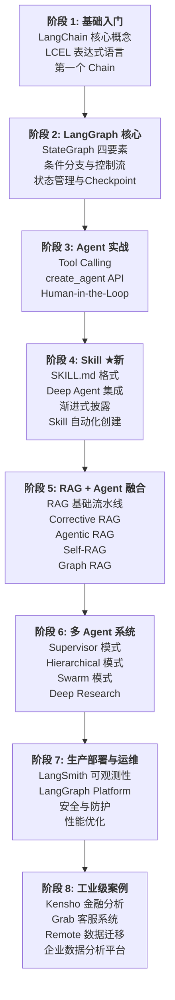

# 学习路线总览

## 目标

本学习路径帮助你系统掌握 LangChain + LangGraph 构建 AI Agent 的完整技术栈，从基础概念到工业级多 Agent 系统。

## 前置要求

- Python 3.10+
- 基础 LLM 概念（Prompt、Token、Temperature）
- 熟悉 Python 异步编程（async/await）
- 了解 REST API 和 JSON

## 8 阶段学习路线



## 建议学习周期（10-12 周）

| 周次 | 阶段 | 内容 | 预计时间 |
|------|------|------|----------|
| 1 | 基础入门 | LangChain 核心概念、LCEL、第一个 Chain | 3-5h |
| 2 | LangGraph 核心 | StateGraph、条件分支、Checkpoint | 5-8h |
| 3 | Agent 实战 | 架构概述、Tool Calling、create_agent、HITL | 5-8h |
| 4 | Skill ★ | SKILL.md 格式、Deep Agent、渐进式披露、自动化创建 | 5-8h |
| 5 | RAG 融合 | RAG 基础、Corrective RAG、Agentic RAG、Self-RAG、Graph RAG | 7-10h |
| 6 | 多 Agent(上) | Supervisor、Hierarchical 模式 | 5-8h |
| 7 | 多 Agent(下) | Swarm、Deep Research | 5-8h |
| 8 | 生产部署 | LangSmith、Platform、安全、性能 | 3-5h |
| 9 | 工业案例 | 4 个企业级案例分析 | 5-8h |

## 学习建议

1. **动手优先**：每个阶段都包含可运行代码，务必实际运行和修改
2. **渐进式复杂度**：从单 LLM 调用 → Chain → Graph → Agent → Skill → 多 Agent
3. **概念 + 代码 + 练习**：每节包含概念讲解、完整代码示例、实践练习
4. **工业案例是目标**：阶段 8 的案例展示生产级系统的真实架构，是学习的最终参照

## 核心环境依赖

```bash
pip install langchain>=1.0.0 langgraph>=1.0.0 langchain-openai langchain-community deepagents
```
