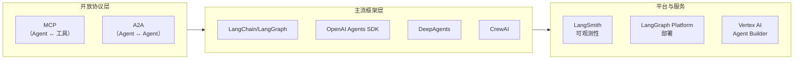
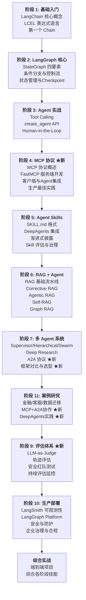

# 学习路线总览

## 2026 年 Agent 生态全景

在开始学习之前，先了解 2026 年 Agent 技术栈的全貌：



本学习路径以 **LangChain + LangGraph** 为主线（中文生态最成熟），同时覆盖 MCP/A2A 开放协议、DeepAgents Harness、OpenAI Agents SDK 对比、以及 Agent 评估与治理。

## 目标

系统掌握从单 Agent 工具调用到工业级多 Agent 协作系统的完整技术栈，覆盖 2026 年最新的 MCP 协议、A2A 协议、Agent 评估体系和企业治理实践。

## 前置要求

- Python 3.10+
- 基础 LLM 概念（Prompt、Token、Temperature）
- 熟悉 Python 异步编程（async/await）
- 了解 REST API 和 JSON
- 了解 MCP 协议基本概念（将在阶段 4 深入学习）

## 11 阶段学习路线



## 建议学习周期（11 周）

| 周次 | 阶段 | 内容 | 预计时间 |
|------|------|------|----------|
| 1 | 基础入门 | LangChain 核心概念、LCEL、第一个 Chain | 3-5h |
| 2 | LangGraph 核心 | StateGraph、条件分支、Checkpoint | 5-8h |
| 3 | Agent 实战 | 架构概述、Tool Calling、create_agent、HITL | 5-8h |
| 4 | MCP 协议 ★ | MCP 概述、FastMCP 开发、Agent 集成、最佳实践 | 5-8h |
| 5 | Agent Skills | SKILL.md 格式、DeepAgents、渐进式披露、评估治理 | 5-8h |
| 6 | RAG 融合 | RAG 基础、Corrective RAG、Agentic RAG、Self-RAG、Graph RAG | 7-10h |
| 7 | 多 Agent(上) | Supervisor、Hierarchical 模式 | 5-8h |
| 8 | 多 Agent(下) | Swarm、Deep Research、A2A 协议、框架对比 | 5-8h |
| 9 | 案例研究 | 6 个企业级案例分析 | 5-8h |
| 10 | 评估体系 ★ | LLM-as-Judge、轨迹评估、红队测试、持续监控 | 5-8h |
| 11 | 生产部署 | LangSmith、Platform、安全防护、企业治理 | 5-8h |
| 12-14 | 综合实战 | 端到端项目实践 | 10-15h |

## 学习建议

1. **动手优先**：每个阶段都包含可运行代码，务必实际运行和修改
2. **渐进式复杂度**：单 LLM 调用 → Chain → Graph → Agent → MCP → Skill → 多 Agent → 评估 → 治理
3. **概念 + 代码 + 练习**：每节包含概念讲解、完整代码示例、实践练习
4. **协议先行**：阶段 4 的 MCP 是后续所有工具集成的基础，务必扎实掌握
5. **评估贯穿**：从阶段 3 开始就可以尝试评估自己的 Agent，不要等到阶段 9
6. **框架对比**：阶段 7 的框架对比帮助你理解各框架的适用场景

## 核心环境依赖

```bash
# 核心框架
pip install langchain>=1.0.0 langgraph>=1.0.0 langchain-openai langchain-community

# DeepAgents Harness
pip install deepagents>=1.6.0

# MCP 协议
pip install "mcp[cli]>=1.0.0" langchain-mcp-adapters

# 其他框架（用于对比学习）
pip install openai-agents>=0.17.0 crewai>=1.0.0

# 评估与可观测
pip install langsmith deepeval

# 向量与图数据库（RAG 阶段使用）
pip install chromadb networkx
```
