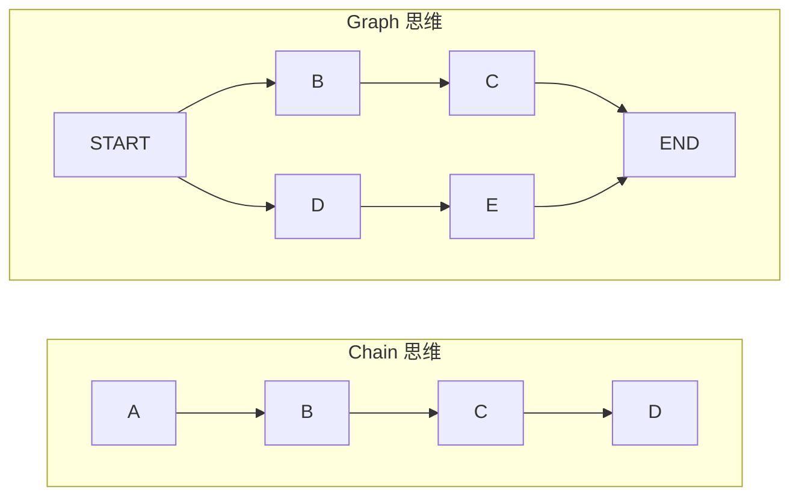
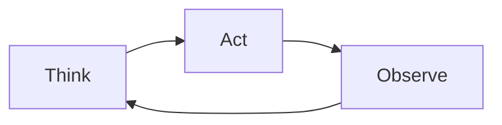

# 从 Chain 到 Graph

## LangChain Chain 的三大痛点

### 痛点 1：状态管理僵化

```python
# Chain 是线性的，数据单向流动
chain = step1 | step2 | step3

# 问题：如何在 step3 中访问 step1 的中间结果？
# Chain 只能透传或手动在每一步中携带，极易出错
```

### 痛点 2：工具调用低效

```python
# Chain 中工具调用是预设固定顺序
chain = search | analyze | response

# 问题：Agent 可能需要多次搜索、动态决定使用哪个工具
# 固定顺序无法应对开放式的工具调用需求
```

### 痛点 3：可扩展性瓶颈

```python
# 多链手动拼接，代码冗余且易出错
result1 = chain1.invoke(input)
result2 = chain2.invoke(result1)
result3 = chain3.invoke(result2)

# 问题：复杂工作流（条件分支、循环、并行）难以维护
# 没有统一的控制流抽象
```

## LangGraph 的设计哲学

LangGraph 将应用建模为**有向图（StateGraph）**，LLM 调用只是图中的节点之一。

| 维度 | Chain | StateGraph |
|------|-------|------------|
| **控制流** | 线性，A→B→C | 有向图，支持分支/循环/并行 |
| **状态** | 透传数据，无共享状态 | 全局 State 对象，所有节点可读写 |
| **工具调用** | 预设顺序 | LLM 动态决策，图中循环执行 |
| **暂停/恢复** | 不支持 | 原生 `interrupt()` 机制 |
| **持久化** | 手动实现 | 内置 Checkpoint，自动持久化 |
| **可调试性** | 黑盒 | 每步状态可追溯，支持 Time Travel |

## 核心思想：从"链"到"图"



图中的每个节点可以是：
- LLM 调用
- 工具执行
- Python 函数
- 另一个子图（Subgraph）
- Agent（完整的多步推理循环）

## 第一个 Graph：比 Chain 更清晰的 Hello World

```python
from typing import TypedDict
from langgraph.graph import StateGraph, START, END

# 1. 定义 State
class State(TypedDict):
    name: str
    greeting: str

# 2. 定义节点（普通的 Python 函数）
def greet(state: State) -> State:
    return {"greeting": f"Hello, {state['name']}!"}

# 3. 构建 Graph
builder = StateGraph(State)
builder.add_node("greet", greet)
builder.add_edge(START, "greet")
builder.add_edge("greet", END)

# 4. 编译
graph = builder.compile()

# 5. 执行
result = graph.invoke({"name": "World"})
print(result["greeting"])  # "Hello, World!"
```

## 为什么 Graph 更适合 Agent

Agent 的本质是**不确定次数的循环**：



这在 Graph 中天然表达为一个**条件循环**：

```python
def should_continue(state) -> str:
    """LLM 决定继续工具调用还是返回最终答案"""
    if state["messages"][-1].tool_calls:
        return "tools"      # 继续执行工具
    return "end"            # 结束，输出答案

builder.add_conditional_edges("agent", should_continue, {
    "tools": "tool_node",
    "end": END
})
builder.add_edge("tool_node", "agent")  # 执行完工具，返回 agent 继续思考
```

## 实践练习

1. 将阶段 1 的翻译 Chain 改写为 3 个节点的 StateGraph（preprocess → translate → postprocess）
2. 在 Graph 中增加一个条件边：如果输入已是目标语言则跳过翻译
3. 思考：什么场景下必须用 Graph 而不是 Chain？
