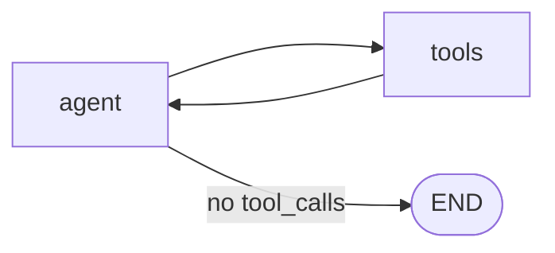
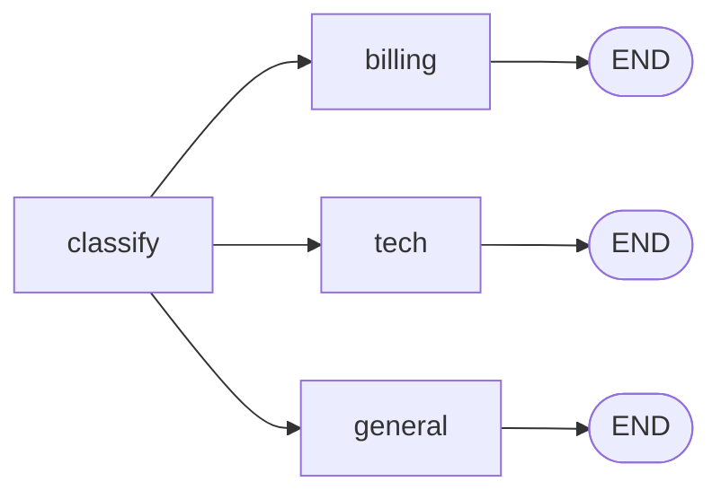
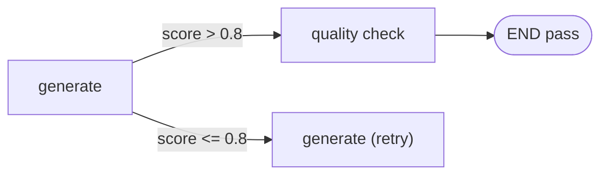

# 条件分支与控制流

## 条件边详解

条件边允许图中的路由决策**基于当前 State 动态决定**下一步执行哪个节点。

```python
builder.add_conditional_edges(
    source="agent",           # 从哪个节点出发
    path=router_function,     # 路由函数：(state) → str
    path_map={                # 路由结果映射
        "tools": "tool_node",
        "end": END
    }
)
```

### 路由函数规范

```python
def router(state: State) -> str:
    # 必须返回 path_map 中定义的 key
    # 可以读取 state 中的任何字段来做判断
    last_message = state["messages"][-1]

    if hasattr(last_message, "tool_calls") and last_message.tool_calls:
        return "continue"
    return "end"
```

## 三种常见控制流模式

### 模式 1：循环（Agent 推理循环）



```python
def should_continue(state: MessagesState) -> str:
    messages = state["messages"]
    last_message = messages[-1]
    if last_message.tool_calls:
        return "tools"
    return END

builder.add_conditional_edges("agent", should_continue, {
    "tools": "tools",
    END: END
})
builder.add_edge("tools", "agent")  # ← 形成循环
```

### 模式 2：条件分支（意图路由）



```python
def route_by_intent(state: State) -> str:
    intent = state["intent"]
    mapping = {"bill": "billing", "tech": "technical"}
    return mapping.get(intent, "general")

builder.add_conditional_edges("classify", route_by_intent, {
    "billing": "billing",
    "technical": "technical",
    "general": "general",
})
```

### 模式 3：条件终止/重试



```python
def quality_gate(state: State) -> str:
    if state.get("quality_score", 0) > 0.8:
        return "done"
    if state.get("retries", 0) >= 3:
        return "force_done"
    return "retry"

builder.add_conditional_edges("generate", quality_gate, {
    "done": "output",
    "retry": "generate",
    "force_done": "output"
})
```

## Command：路由 + 状态更新一体

`Command` 是 LangGraph 提供的特殊返回类型，可以**同时控制路由和更新状态**。

```python
from langgraph.types import Command

def human_approval_node(state: State) -> Command:
    """人工审批节点：审批通过 → 执行，拒绝 → 记录原因并结束"""
    approved = get_human_decision(state["proposal"])

    if approved:
        return Command(
            goto="execute",  # 路由到 execute 节点
            update={"approved": True}
        )
    else:
        return Command(
            goto="rejected",  # 路由到 rejected 节点
            update={"approved": False, "reason": "人工拒绝"}
        )
```

### Command 用于 Agent 间 Handoff

```python
def billing_agent(state: State) -> Command:
    result = process_billing(state)
    return Command(
        goto="supervisor",              # 返回 Supervisor
        update={
            "messages": [AIMessage(content=result)],
            "current_agent": "billing",  # 更新当前活跃 Agent
            "handoff_complete": True
        }
    )
```

## 复杂控制流实战：审核工作流

```python
from typing import TypedDict, Literal
from langgraph.graph import StateGraph, START, END
from langgraph.types import Command

class ReviewState(TypedDict):
    content: str
    review_result: str  # approved / rejected / needs_revision
    revision_count: int
    final_output: str

def review(state: ReviewState) -> dict:
    """审核内容（模拟 LLM 判断）"""
    # 实际中调用 LLM 判断内容质量
    if "违规" in state["content"]:
        return {"review_result": "rejected"}
    if "粗糙" in state["content"] or state.get("revision_count", 0) == 0:
        return {"review_result": "needs_revision"}
    return {"review_result": "approved"}

def approve_flow(state: ReviewState) -> dict:
    return {"final_output": f"✅ 已发布: {state['content']}"}

def reject_flow(state: ReviewState) -> dict:
    return {"final_output": f"❌ 已拒绝。原因：内容不符合发布标准"}

def revise(state: ReviewState) -> dict:
    """修改内容"""
    revised = state["content"].replace("粗糙", "精心打磨")
    count = state.get("revision_count", 0) + 1
    return {"content": revised, "revision_count": count}

def review_router(state: ReviewState) -> str:
    result = state.get("review_result", "needs_revision")
    if result == "approved":
        return "approve"
    if result == "rejected":
        return "reject"
    # needs_revision: 限制最多修订 3 次
    if state.get("revision_count", 0) >= 3:
        return "reject"
    return "revise"

builder = StateGraph(ReviewState)
builder.add_node("review", review)
builder.add_node("revise", revise)
builder.add_node("approve", approve_flow)
builder.add_node("reject", reject_flow)

builder.add_edge(START, "review")
builder.add_conditional_edges("review", review_router, {
    "approve": "approve",
    "reject": "reject",
    "revise": "revise"
})
builder.add_edge("revise", "review")  # ← 修订后重新审核
builder.add_edge("approve", END)
builder.add_edge("reject", END)

graph = builder.compile()

# 测试
result = graph.invoke({"content": "这是一篇粗糙的草案", "revision_count": 0})
print(result["final_output"])
```

## 实践练习

1. 在审核工作流中加入"人工终审"节点（使用 Command 实现）
2. 实现一个最多重试 3 次的网络请求节点（失败 → 重试 → 达到上限 → 降级）
3. 设计一个支持"返回上一步"的导航工作流
