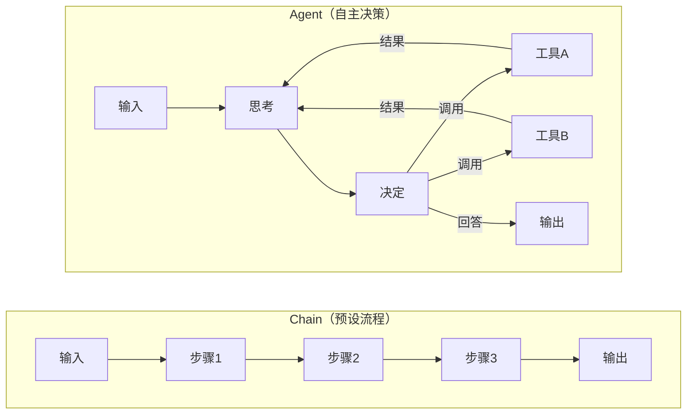
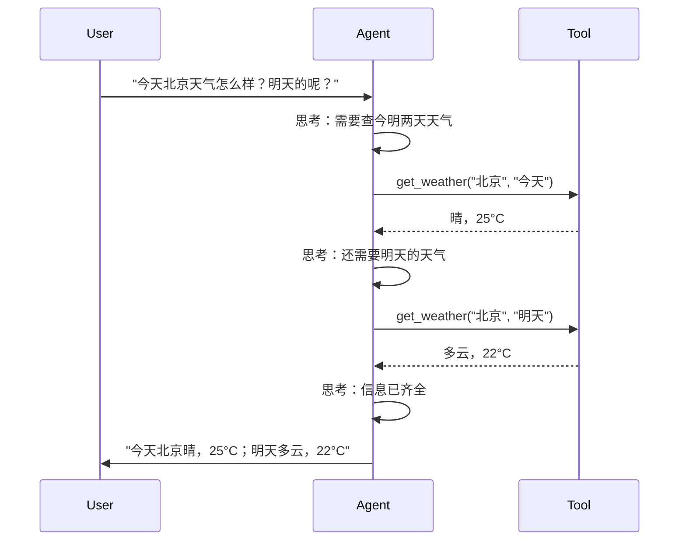
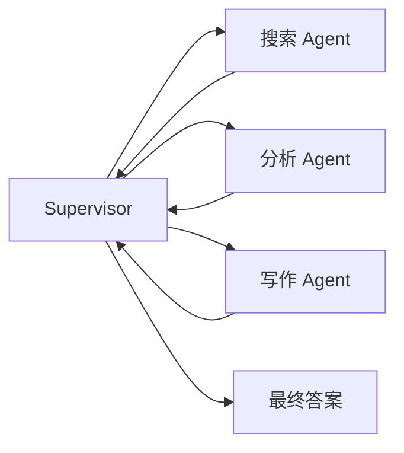
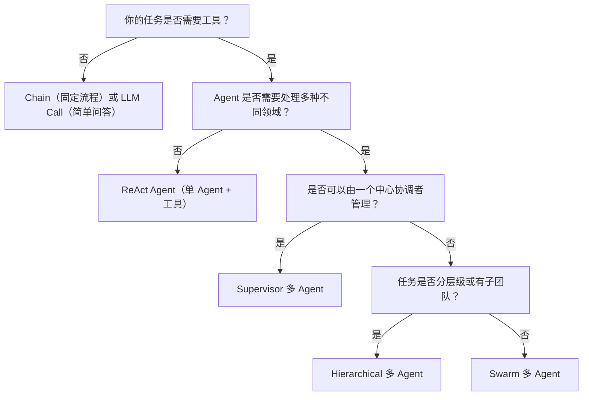

# Agent 架构概述

## 什么是 Agent

Agent（智能体）是**使用 LLM 来决定采取什么行动**的系统。与普通 Chain 的区别在于：Agent 能**自主决策**调用哪些工具、以什么顺序调用。



## 五大架构层级

| 层级 | 架构 | 说明 | 决策能力 | 适用场景 |
|------|------|------|----------|----------|
| L1 | **LLM Call** | 单次模型调用 | 无 | 简单问答、翻译 |
| L2 | **Chain** | 固定步骤流水线 | 无 | 固定流程任务 |
| L3 | **Router** | LLM 条件分支 | 一次选择 | 意图分类、分发 |
| L4 | **ReAct** | 推理→行动→观察循环 | 多步自主决策 | 工具调用 Agent |
| L5 | **Multi-Agent** | 多角色协作 | 分布式决策 | 复杂业务系统 |

## L1：LLM Call

最简单的形式，单次 LLM 调用完成。

```python
from langchain_openai import ChatOpenAI
llm = ChatOpenAI(model="gpt-4o-mini")
result = llm.invoke("2024年诺贝尔物理学奖得主是谁？")
```

## L2：Chain

固定步骤的流水线。

```python
chain = prompt | llm | parser
# 步骤完全固定，无法根据中间结果动态调整
```

## L3：Router

LLM 做一次条件判断，路由到不同分支。

```python
def route(state):
    intent = classify_intent(state["query"])
    if intent == "billing": return "billing_handler"
    if intent == "tech": return "tech_handler"
    return "general_handler"
```

## L4：ReAct（核心 Agent 模式）

**Re**asoning + **Act**ing：LLM 交替进行"思考"和"行动"。



### ReAct 在 LangGraph 中的实现

```python
from langgraph.prebuilt import ToolNode
from langgraph.graph import StateGraph, MessagesState, START, END

def should_continue(state: MessagesState) -> str:
    messages = state["messages"]
    last_message = messages[-1]
    if last_message.tool_calls:
        return "tools"
    return END

builder = StateGraph(MessagesState)
builder.add_node("agent", llm.bind_tools([get_weather]))
builder.add_node("tools", ToolNode([get_weather]))
builder.add_edge(START, "agent")
builder.add_conditional_edges("agent", should_continue, {"tools": "tools", END: END})
builder.add_edge("tools", "agent")
graph = builder.compile()
```

## L5：Multi-Agent

多个 Agent 协作完成复杂任务。详见阶段 6。



## 架构选择决策树



## 实践练习

1. 分析你做过的一个项目，判断它属于架构的哪一层级
2. 将一个固定流程的 Chain 改造为 Agent（增加工具调用的自主决策）
3. 设计一个场景，需要从 ReAct 升级到 Multi-Agent
