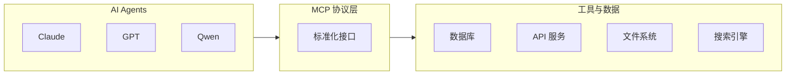
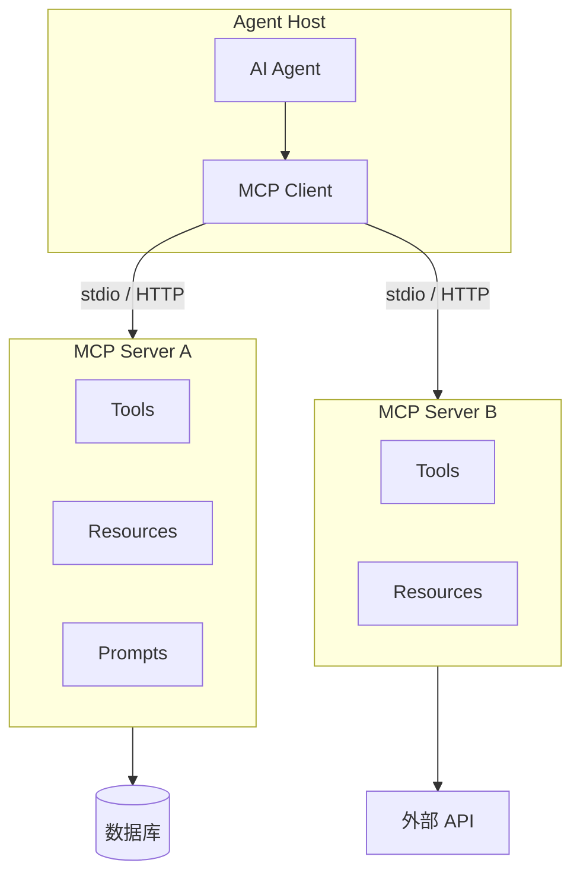

# MCP 协议概述

## 什么是 MCP

**MCP（Model Context Protocol）**是一种开放标准协议，用于连接 AI Agent 与外部工具、数据源和服务。它最初由 Anthropic 于 2024 年 11 月推出，2025 年 12 月捐赠给 Linux Foundation 下的 Agentic AI Foundation，2026 年 6 月发布 1.0 正式版。

MCP 被业界比喻为 **"AI 时代的 USB-C 接口"**——就如 USB-C 统一了设备连接标准一样，MCP 统一了 Agent 与工具的连接标准。



## 为什么需要 MCP

### 传统方式：N × M 问题

在没有统一协议之前，每个 Agent 框架与每个工具的集成都需要单独开发适配器：

```
LangChain ⇄ Slack (langchain-slack)
LangChain ⇄ GitHub (langchain-github)
OpenAI SDK ⇄ Slack (自定义集成)
OpenAI SDK ⇄ GitHub (自定义集成)
Claude SDK ⇄ Slack (自定义集成)
...
```

### MCP 方式：N + M 问题

一个 MCP Server 可以被所有兼容的 Agent 框架复用：

```
Slack MCP Server ──→ LangChain / OpenAI SDK / Claude SDK / CrewAI / ...
GitHub MCP Server ──→ LangChain / OpenAI SDK / Claude SDK / CrewAI / ...
```

## MCP 三大核心原语

MCP 协议定义了三种核心交互模式：

| 原语 | 用途 | 类比 |
|------|------|------|
| **Resources**（资源） | 暴露结构化数据（文件、数据库记录） | GET 请求 |
| **Tools**（工具） | 让模型执行操作（查询、写入、API 调用） | POST 请求 |
| **Prompts**（提示模板） | 预定义的提示词模板 | 函数模板 |

### 示例对比

```python
# 传统方式：每个工具单独定义
@tool
def search_docs(query: str) -> str: ...
@tool
def get_user(id: str) -> dict: ...
@tool
def create_ticket(title: str, body: str) -> str: ...

# MCP 方式：通过 MCP Server 统一暴露
# Server 端定义一次，所有 Agent 框架复用
mcp = FastMCP("EnterpriseTools", version="1.0.0")

@mcp.tool()
async def search_docs(query: str) -> str: ...

@mcp.resource("user://{id}")
async def get_user(id: str) -> dict: ...

@mcp.tool()
async def create_ticket(title: str, body: str) -> str: ...
```

## MCP 2026 最新进展

### MCP 2026-07-28 规范（第五版重大更新）

| 变更 | 说明 |
|------|------|
| **无状态核心** | 从双向有状态协议转为纯请求/响应模型，消除初始化握手和 Session ID，支持 Serverless 和边缘部署 |
| **版本化扩展框架** | MCP Apps（交互式 UI）和 Tasks（长时间运行操作）作为正式扩展 |
| **认证加固** | 对齐生产级 OAuth 2.0 和 OpenID Connect，支持企业身份系统 |

### 生态数据（2026 年中）

- **400M+ 月 SDK 下载量**（2026 年增长 4 倍）
- **950+ MCP Servers** 在 Claude 连接器目录中
- **40%** 的企业应用预计在 2026 年底嵌入 AI Agent（Gartner 预测）
- 支持厂商：Anthropic、OpenAI、Google、Meta、华为等

## MCP vs 传统方案对比

| 维度 | REST API | Function Calling | MCP |
|------|----------|-----------------|-----|
| **标准化** | 无 Agent 语义 | 厂商特定格式 | 开放标准，跨厂商 |
| **服务发现** | 手动文档查阅 | 无 | 自动工具列表发现 |
| **工具复用** | 每个框架单独集成 | 每个模型单独定义 | 一次编写，到处使用 |
| **传输层** | HTTP | 框架内部 | stdio / HTTP+SSE / Streamable HTTP |
| **安全模型** | API Key | 框架接管 | OAuth 2.0 + 审批策略 |
| **治理** | 无标准 | 无 | 工具级权限、审计日志 |

## MCP 架构



### 传输协议选择

| 传输方式 | 适用场景 | 特点 |
|----------|----------|------|
| **stdio** | 本地进程通信 | 零网络开销，适合本地工具 |
| **HTTP + SSE** | 远程服务 | 支持流式响应，需要公网可达 |
| **Streamable HTTP** | 生产部署 | 无状态，支持负载均衡 + Serverless |

## MCP 与 A2A 的关系

MCP 和 A2A（Agent-to-Agent Protocol）是互补的两种协议：

| | MCP | A2A |
|---|---|---|
| **解决什么问题** | Agent ↔ 工具/数据 | Agent ↔ Agent |
| **方向** | 纵向（Agent 向下访问系统） | 横向（Agent 之间对等协作） |
| **类比** | Agent 的"手" | Agent 之间的"握手" |
| **创建方** | Anthropic | Google |
| **治理** | Agentic AI Foundation (LF) | Linux Foundation |

在实际企业部署中，两者通常同时使用：MCP 让 Agent 具备工具能力，A2A 让 Agent 之间互相协作。

## 哪些框架支持 MCP

| 框架 | MCP 支持方式 | 成熟度 |
|------|-------------|--------|
| **LangChain / LangGraph** | `langchain-mcp-adapters` 官方适配器 | 生产就绪 |
| **OpenAI Agents SDK** | `MCPServerStreamableHttp` 原生支持 | 生产就绪 |
| **Claude Agent SDK** | `mcp__<server>__<tool>` 命名约定 | 生产就绪 |
| **CrewAI** | 原生 MCP Toolkit | 生产就绪 |
| **LlamaIndex** | `McpToolSpec` 官方支持 | 生产就绪 |
| **Google ADK** | 原生 MCP 兼容 | 生产就绪 |
| **Vercel AI SDK** | MCP 工具集成 | 生产就绪 |

## 实践练习

1. 列出你当前项目中 Agent 需要集成的所有外部服务，评估哪些适合通过 MCP 标准化
2. 对比你用过的一个 Function Calling 实现和 MCP 方式的差异
3. 设计一个"文档搜索 MCP Server"的资源（Resources）和工具（Tools）清单
