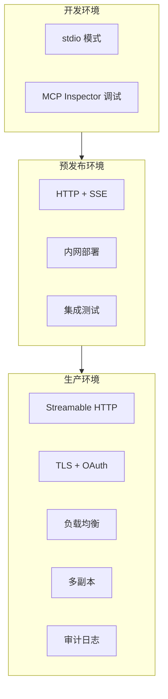

# MCP 生产最佳实践

## 工具设计原则

### 1. 描述结果，而非端点

Agent 无法查阅额外文档，工具描述是其理解的唯一途径。好的描述描述**用户要做什么**，而非 API 内部实现。

```python
# ❌ 不好：暴露内部 API 细节
@mcp.tool()
def api_get_users(page: int, limit: int, filter: str) -> str:
    """GET /api/v1/users?page={page}&limit={limit}&filter={filter}"""
    ...

# ✅ 好：描述用户意图
@mcp.tool()
def search_users(
    keyword: str,
    department: str = None,
    max_results: int = 20
) -> str:
    """搜索企业员工信息。可按姓名、工号、部门筛选，返回匹配的用户列表。"""
    ...
```

### 2. 为"零上下文"编写

Agent 没有同事可以问，没有文档可查阅。工具定义要自给自足：

```python
@mcp.tool()
def check_order_delivery_status(order_id: str) -> str:
    """查询订单的物流配送状态。

    返回信息包括：
    - 当前状态（待发货/运输中/派送中/已签收/异常）
    - 承运公司名称和运单号
    - 各节点的扫描时间和位置
    - 预计送达时间
    - 如有异常，包含异常原因和客服联系方式

    适用场景：用户询问"我的快递到哪了"、"订单什么时候到"等问题。
    不适用：修改配送地址、发起退款（这些需要其他工具处理）。
    """
    ...
```

### 3. 严格管理工具数量

工具过多会降低 Agent 决策准确率。整合相似功能：

```python
# ❌ 不好：三个独立工具
@mcp.tool()
def create_user(name: str, email: str) -> str: ...
@mcp.tool()
def update_user_name(user_id: str, name: str) -> str: ...
@mcp.tool()
def update_user_email(user_id: str, email: str) -> str: ...

# ✅ 好：一个聚合工具
from pydantic import BaseModel
from typing import Optional

class ManageUserProfile(BaseModel):
    action: str  # "create" | "update"
    user_id: Optional[str] = None
    name: Optional[str] = None
    email: Optional[str] = None

@mcp.tool()
def manage_user_profile(params: ManageUserProfile) -> str:
    """管理用户档案。支持创建新用户和更新已有用户的信息。

    创建时提供 name + email；更新时提供 user_id + 要修改的字段。
    """
    ...
```

## 安全策略

### 工具风险分级与审批

```python
from enum import Enum
from functools import wraps

class RiskLevel(Enum):
    READ_ONLY = "read_only"
    SENSITIVE_READ = "sensitive_read"
    WRITE = "write"
    DESTRUCTIVE = "destructive"

# 风险标注
@mcp.tool(annotations={"risk": "read_only"})
def search_docs(query: str) -> str: ...

@mcp.tool(annotations={"risk": "write", "requires_approval": True})
def create_order(items: list) -> str: ...

@mcp.tool(annotations={"risk": "destructive", "requires_approval": True})
def delete_account(user_id: str) -> str: ...
```

### 审批中间件

```python
import hashlib
from datetime import datetime

class ApprovalMiddleware:
    """MCP 工具调用的审批中间件"""

    def __init__(self, approval_store):
        self.store = approval_store  # Redis / DB

    async def pre_execute(self, tool_name: str, arguments: dict, risk_level: str):
        """执行前检查是否需要审批"""
        if risk_level in ("write", "destructive"):
            # 生成审批请求
            approval_id = hashlib.sha256(
                f"{tool_name}:{str(arguments)}:{datetime.now()}".encode()
            ).hexdigest()[:12]

            self.store.create_approval({
                "id": approval_id,
                "tool": tool_name,
                "arguments": arguments,
                "risk_level": risk_level,
                "status": "pending",
                "created_at": datetime.now().isoformat(),
            })

            return {
                "blocked": True,
                "message": f"⚠️ 操作需要审批。审批ID: {approval_id}",
                "approval_id": approval_id,
            }
        return {"blocked": False}

    async def check_approval(self, approval_id: str) -> bool:
        """检查审批是否通过"""
        approval = self.store.get_approval(approval_id)
        return approval and approval["status"] == "approved"
```

### 输入校验与清理

```python
import re
from mcp.server.fastmcp import FastMCP

mcp = FastMCP("SecureServer")

def sanitize_sql(sql: str) -> tuple[bool, str]:
    """SQL 安全校验"""
    sql_upper = sql.strip().upper()

    # 只允许 SELECT 和 EXPLAIN
    if not (sql_upper.startswith("SELECT") or sql_upper.startswith("EXPLAIN")):
        return False, "仅允许 SELECT 和 EXPLAIN 查询"

    # 禁止危险关键字
    dangerous = {"INSERT", "UPDATE", "DELETE", "DROP", "ALTER",
                 "TRUNCATE", "CREATE", "EXEC", "EXECUTE", "MERGE"}
    for keyword in dangerous:
        if keyword in sql_upper.split():
            return False, f"包含禁止的关键字: {keyword}"

    return True, "OK"

@mcp.tool()
async def query_database(sql: str) -> str:
    """执行只读 SQL 查询"""
    is_safe, reason = sanitize_sql(sql)
    if not is_safe:
        return f"❌ 不安全的查询: {reason}"
    return await db.execute(sql)
```

### 凭证管理

```python
# ❌ 绝对不要：在工具描述或代码中暴露凭证
@mcp.tool()
def call_external_api(query: str) -> str:
    api_key = "sk-abc123..."  # 危险！
    headers = {"Authorization": f"Bearer {api_key}"}
    ...

# ✅ 使用环境变量 + 密钥管理服务
import os
from cryptography.fernet import Fernet

@mcp.tool()
def call_external_api(query: str) -> str:
    api_key = os.environ["EXTERNAL_API_KEY"]
    # 或从密钥管理服务获取
    # api_key = vault.get_secret("external-api-key")
    ...
```

### MCP Tunnels（Anthropic，2026）

MCP Tunnels 是一种出站代理，让 Agent 安全访问企业内部 MCP Server，无需：
- 公网可达的端点
- 入站防火墙规则
- 凭证经过 Agent 上下文

```
Agent (Anthropic Infra) → MCP Tunnel (出站) → 企业内网 MCP Server
                                     ↑ 凭证在此侧注入
```

## 传输安全

### stdio 模式

本地进程通信，天然安全，适合开发和个人使用。

### HTTP 模式

生产部署必须启用 TLS + 认证：

```python
# Server 端：强制 HTTPS
mcp.run(
    transport="streamable-http",
    host="0.0.0.0",
    port=443,
    ssl_certfile="/etc/ssl/certs/server.crt",
    ssl_keyfile="/etc/ssl/private/server.key",
)

# Client 端：Token 认证
async with streamablehttp_client(
    "https://mcp.example.com/mcp",
    headers={"Authorization": "Bearer mcp_token_xxx"}
) as (read, write):
    ...
```

### 传输安全清单

| 层次 | 措施 |
|------|------|
| 传输层 | TLS 1.3，证书管理 |
| 认证层 | Bearer Token / OAuth 2.0 / mTLS |
| 授权层 | 工具级权限控制 |
| 审计层 | 所有工具调用日志 |
| 网络层 | VPC 内网隔离，防火箱规则 |

## 多 Server 管理与配置

### mcp.json 标准配置

```json
{
  "mcpServers": {
    "docs": {
      "command": "python",
      "args": ["-m", "docs_mcp_server"],
      "env": {
        "DB_URL": "postgresql://localhost/docs"
      }
    },
    "github": {
      "url": "https://mcp.github.com/mcp",
      "headers": {
        "Authorization": "Bearer ${GITHUB_TOKEN}"
      }
    },
    "slack": {
      "url": "https://mcp.slack.com/mcp",
      "headers": {
        "Authorization": "Bearer ${SLACK_BOT_TOKEN}"
      }
    }
  }
}
```

### 动态 Server 管理

```python
class MCPServerManager:
    """MCP Server 生命周期管理"""

    def __init__(self):
        self.servers: dict[str, dict] = {}
        self.active_connections: dict[str, ClientSession] = {}

    async def add_server(self, name: str, config: dict):
        """添加 MCP Server"""
        self.servers[name] = config

    async def remove_server(self, name: str):
        """移除 MCP Server"""
        if name in self.active_connections:
            await self.active_connections[name].close()
            del self.active_connections[name]
        self.servers.pop(name, None)

    async def reconnect_server(self, name: str):
        """重连 MCP Server"""
        await self.remove_server(name)
        await self.connect_server(name)

    async def connect_server(self, name: str) -> ClientSession:
        """建立连接"""
        config = self.servers[name]
        if "command" in config:
            params = StdioServerParameters(**config)
            read, write = await stdio_client(params).__aenter__()
        else:
            read, write = await streamablehttp_client(
                config["url"],
                headers=config.get("headers", {})
            ).__aenter__()

        session = ClientSession(read, write)
        await session.initialize()
        self.active_connections[name] = session
        return session

    async def get_tools(self) -> list:
        """获取所有已连接 Server 的工具"""
        all_tools = []
        for name, session in self.active_connections.items():
            tools = await load_mcp_tools(session)
            for tool in tools:
                tool.name = f"{name}__{tool.name}"
            all_tools.extend(tools)
        return all_tools
```

## 审计与监控

### 结构化审计日志

```python
import json
import time
import logging
from dataclasses import dataclass, asdict
from datetime import datetime, timezone

@dataclass
class AuditRecord:
    timestamp: str
    server_name: str
    tool_name: str
    arguments_summary: str
    result_summary: str
    duration_ms: float
    user_id: str
    risk_level: str
    status: str  # success / blocked / error

audit_logger = logging.getLogger("mcp_audit")

def audit_tool_call(func):
    """工具调用审计装饰器"""
    @wraps(func)
    async def wrapper(*args, **kwargs):
        start = time.perf_counter()
        status = "success"
        result_summary = ""

        try:
            result = await func(*args, **kwargs)
            result_summary = str(result)[:200]
            return result
        except Exception as e:
            status = "error"
            result_summary = str(e)[:200]
            raise
        finally:
            duration = (time.perf_counter() - start) * 1000
            record = AuditRecord(
                timestamp=datetime.now(timezone.utc).isoformat(),
                server_name="EnterpriseTools",
                tool_name=func.__name__,
                arguments_summary=str(kwargs)[:200],
                result_summary=result_summary,
                duration_ms=round(duration, 2),
                user_id=kwargs.get("user_id", "unknown"),
                risk_level=getattr(func, "risk_level", "read_only"),
                status=status,
            )
            audit_logger.info(json.dumps(asdict(record), ensure_ascii=False))

    return wrapper
```

### 监控指标

```python
# 关键指标
METRICS = {
    "mcp_tool_calls_total": "工具调用总数（按 tool_name, status 分组）",
    "mcp_tool_duration_seconds": "工具调用延迟（P50/P95/P99）",
    "mcp_connection_status": "MCP Server 连接状态",
    "mcp_approval_pending": "待审批操作数量",
    "mcp_error_rate": "错误率（按 error_type 分组）",
}
```

## 部署模式



### Docker 部署

```dockerfile
FROM python:3.12-slim

WORKDIR /app
COPY requirements.txt .
RUN pip install --no-cache-dir -r requirements.txt

COPY server.py .

EXPOSE 8000
CMD ["python", "server.py"]
```

```yaml
# docker-compose.yml
services:
  mcp-docs:
    build: ./docs-server
    ports: ["8001:8000"]
    environment:
      - DB_URL=postgresql://docs-db:5432/docs
    restart: always

  mcp-tickets:
    build: ./tickets-server
    ports: ["8002:8000"]
    environment:
      - REDIS_URL=redis://redis:6379
    restart: always
```

## 常见陷阱

| 陷阱 | 说明 | 解决方案 |
|------|------|----------|
| **工具描述过简** | Agent 不知道何时使用 | 写清楚使用场景、输入输出、边界条件 |
| **工具数量过多** | 决策准确性下降 | 合并相似功能，每个 Server ≤ 10 个 Tool |
| **无超时保护** | 慢工具阻塞 Agent 循环 | 所有工具设 timeout（默认 30s） |
| **大输出** | 撑爆上下文窗口 | 截断/分页，超过 4000 字符摘要化 |
| **错误信息泄露** | 异常堆栈暴露给用户 | catch 后返回友好错误消息 |
| **无凭证保护** | API Key 暴露在工具描述中 | 环境变量 / 密钥管理服务 |
| **无审计日志** | 生产事故无法追溯 | 所有工具调用入审计日志 |

## 实践练习

1. 为你之前创建的 MCP Server 添加审批中间件，对写操作要求审批
2. 实现 SQL 注入防护和输入校验逻辑
3. 将 MCP Server 容器化部署，配置 TLS + Token 认证
