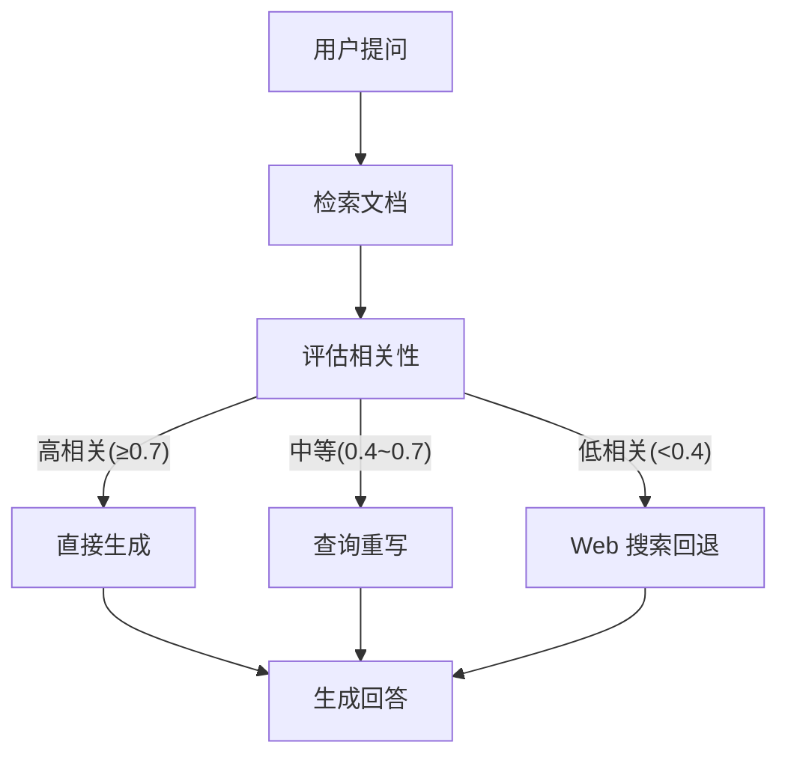

# Corrective RAG (CRAG)

## 什么是 Corrective RAG

标准 RAG 的直接检索可能返回不相关或低质量文档，导致 LLM 生成错误答案。Corrective RAG 在检索后**评估文档质量**，并在质量不足时**纠正检索策略**。

## CRAG 工作流



## LangGraph 实现

```python
from typing import TypedDict, Annotated
import operator
from langgraph.graph import StateGraph, START, END
from langgraph.checkpoint.memory import MemorySaver
from langchain_openai import ChatOpenAI, OpenAIEmbeddings
from langchain_core.tools import tool

class CRAGState(TypedDict):
    question: str
    documents: Annotated[list[str], operator.add]  # 累加而非覆盖
    doc_scores: Annotated[list[float], operator.add]
    rewritten_query: str
    generation: str

llm = ChatOpenAI(model="gpt-4o-mini")
embeddings = OpenAIEmbeddings(model="text-embedding-3-small")

def retrieve(state: CRAGState) -> dict:
    """第一步：检索相关文档"""
    docs = vectorstore.similarity_search_with_relevance_scores(
        state["question"], k=5
    )
    documents = [doc.page_content for doc, _ in docs]
    scores = [score for _, score in docs]
    return {"documents": documents, "doc_scores": scores}

def evaluate_relevance(state: CRAGState) -> dict:
    """第二步：使用 LLM 评估文档与问题的相关性"""
    if not state["documents"]:
        return {"doc_scores": [0.0]}  # 无文档 → 低相关

    prompt = f"""问题：{state['question']}

检索到的文档：
{chr(10).join([f'[文档{i+1}] {doc[:300]}' for i, doc in enumerate(state['documents'])])}

请评估每篇文档与问题的相关性，给出 0.0-1.0 的分数。
返回 JSON 格式：{{"scores": [0.8, 0.3, 0.9, ...]}}"""

    response = llm.invoke(prompt)
    try:
        import json
        result = json.loads(response.content)
        return {"doc_scores": result.get("scores", state["doc_scores"])}
    except:
        return {}

def route_by_relevance(state: CRAGState) -> str:
    """第三步：根据最高相关度分数决定路由"""
    scores = state.get("doc_scores", [])
    if not scores:
        return "web_fallback"

    max_score = max(scores)
    if max_score >= 0.7:
        return "generate"        # 直接生成
    elif max_score >= 0.4:
        return "rewrite_query"   # 重写查询重试
    return "web_fallback"        # Web 搜索回退

def rewrite_query(state: CRAGState) -> dict:
    """查询重写：优化查询以获得更好的检索结果"""
    prompt = f"""原始查询："{state['question']}"
检索到的文档评分较低（最高: {max(state.get('doc_scores', [0])):.2f}）。

请将原始查询改写为更具体、更可能匹配知识库中内容的形式。
只返回改写后的查询，不要添加其他内容。"""

    rewritten = llm.invoke(prompt).content.strip()
    return {"rewritten_query": rewritten}

def re_retrieve(state: CRAGState) -> dict:
    """用改写后的查询重新检索"""
    query = state.get("rewritten_query", state["question"])
    docs = vectorstore.similarity_search_with_relevance_scores(query, k=5)
    documents = [doc.page_content for doc, _ in docs]
    scores = [score for _, score in docs]
    return {"documents": documents, "doc_scores": scores}

@tool
def web_search(query: str) -> str:
    """Web 搜索回退"""
    # 实际对接 Tavily 等搜索 API
    return f"[Web 搜索结果] 关于 '{query}' 的信息：..."

def web_fallback(state: CRAGState) -> dict:
    """知识库无相关结果时，回退到 Web 搜索"""
    results = web_search.invoke(state["question"])
    return {"documents": [results]}

def generate(state: CRAGState) -> dict:
    """基于（经过验证的）文档生成最终答案"""
    docs_text = "\n\n".join([
        f"[{i+1}] {doc[:500]}" for i, doc in enumerate(state["documents"])
    ])

    prompt = f"""基于以下文档回答用户问题。如果文档信息不足，请坦诚说明。

文档：
{docs_text}

问题：{state['question']}

回答："""

    response = llm.invoke(prompt)
    return {"generation": response.content}

# ── 构建 Graph ──
builder = StateGraph(CRAGState)
builder.add_node("retrieve", retrieve)
builder.add_node("evaluate", evaluate_relevance)
builder.add_node("rewrite_query", rewrite_query)
builder.add_node("re_retrieve", re_retrieve)
builder.add_node("web_fallback", web_fallback)
builder.add_node("generate", generate)

builder.add_edge(START, "retrieve")
builder.add_edge("retrieve", "evaluate")
builder.add_conditional_edges("evaluate", route_by_relevance, {
    "generate": "generate",
    "rewrite_query": "rewrite_query",
    "web_fallback": "web_fallback",
})
builder.add_edge("rewrite_query", "re_retrieve")
builder.add_edge("re_retrieve", "evaluate")     # 重新评估
builder.add_edge("web_fallback", "generate")
builder.add_edge("generate", END)

crag_graph = builder.compile(checkpointer=MemorySaver())
```

## 查询重写策略

| 策略 | 说明 | 适用场景 |
|------|------|----------|
| **语义重写** | 用更精确的术语改写 | 知识库有专业术语但用户用了口语 |
| **拆分重写** | 将复杂问题拆为子问题 | 多跳推理类问题 |
| **补全重写** | 补充上下文信息 | 用户问题过于简短 |
| **抽象重写** | 提取核心概念 | 用户问题包含大量无关细节 |

## 关键设计考量

- **评估器成本**：每次检索后增加一次 LLM 调用。对小规模知识库，可改用向量相似度阈值判断
- **循环控制**：重写查询 → 重检索 → 重评估可能形成循环。应设置最大重写次数（如 3 次）
- **回退策略**：Web 搜索回退在内部知识库场景中可能需要审计（是否会泄露内部问题到外部）

## 实践练习

1. 加入最大重试次数限制（重写查询不超过 3 次）
2. 对 evaluate 步骤记录详细日志（使用 LangSmith）
3. 实现"部分相关"处理：只保留评分 > 0.6 的文档用于生成
