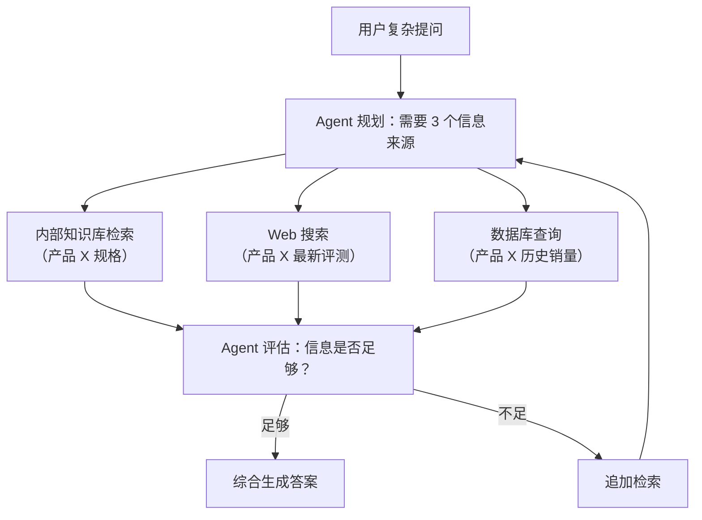

# Agentic RAG

## 从 RAG 到 Agentic RAG

传统的 RAG 是"先检索，后生成"，而 Agentic RAG 让 Agent **自主决策**检索策略——何时检索、用什么工具检索、检索几次、是否需要补充检索。

| 维度 | 传统 RAG | Agentic RAG |
|------|---------|-------------|
| 检索决策 | 固定流程 | Agent 自主决定 |
| 工具选择 | 单一向量库 | 多源（向量库+Web+API+数据库） |
| 检索轮次 | 一次检索 | 多轮迭代，按需补充 |
| 问题分解 | 不支持 | Agent 拆分复杂问题 |

## Agentic RAG 架构



## LangGraph 实现

```python
from typing import TypedDict, Annotated
import operator
from langgraph.graph import StateGraph, MessagesState, START, END
from langgraph.prebuilt import ToolNode
from langgraph.types import Command
from langchain_openai import ChatOpenAI
from langchain.agents import create_agent

class ResearchState(MessagesState):
    """Agentic RAG 的扩展 State"""
    research_findings: Annotated[list[str], operator.add]  # 累积研究发现
    sources_checked: Annotated[list[str], operator.add]     # 已使用的数据源
    research_complete: bool
    final_report: str

# ── 定义工具 ──
@tool
def internal_kb_search(query: str) -> str:
    """搜索内部知识库。包含产品文档、公司政策、技术规范。"""
    docs = vectorstore.similarity_search(query, k=3)
    return format_docs(docs)

@tool
def web_search(query: str) -> str:
    """搜索互联网获取公开信息。用于竞品分析、市场趋势、最新动态。"""
    # 实际对接 Tavily / Brave Search API
    return f"[Web] {query}: 最新信息..."

@tool
def database_query(sql: str) -> str:
    """执行只读 SQL 查询。用于获取结构化业务数据。"""
    # 实际环境中需要 SQL 校验和权限控制
    return f"[DB] 执行结果: ..."

# ── 研究 Agent（核心循环） ──
research_agent = create_agent(
    model=ChatOpenAI(model="gpt-4o"),
    tools=[internal_kb_search, web_search, database_query],
    system_prompt="""你是一个研究助手。对于用户的每个问题：

1. 分析需要哪些信息源
2. 选择合适的工具获取信息
3. 如果第一次检索不充分，用不同查询重试
4. 当所有必要信息都已获取，输出 "RESEARCH_COMPLETE" 标记

在回答中注明使用了哪些数据源。"""
)

# ── 主工作流 ──
def conduct_research(state: ResearchState) -> dict:
    """执行一轮研究"""
    result = research_agent.invoke({
        "messages": [{"role": "user", "content": state["messages"][0].content}]
    })

    last_msg = result["messages"][-1].content
    is_complete = "RESEARCH_COMPLETE" in last_msg

    return {
        "messages": result["messages"],
        "research_complete": is_complete
    }

def synthesize(state: ResearchState) -> dict:
    """综合所有研究发现，生成结构化报告"""
    messages = state.get("messages", [])

    # 提取工具调用结果
    findings = []
    for msg in messages:
        if hasattr(msg, "name") and msg.name:
            findings.append(f"[{msg.name}]: {msg.content}")

    prompt = f"""基于以下研究发现，生成一份简洁的综合报告。

研究发现：
{chr(10).join(findings)}

原始问题：{state['messages'][0].content}

请生成结构化的报告（包含关键发现、数据支撑、结论建议）："""

    report = ChatOpenAI(model="gpt-4o").invoke(prompt).content
    return {"final_report": report}

def should_continue_research(state: ResearchState) -> str:
    """判断是否需要继续研究"""
    if state.get("research_complete"):
        return "synthesize"
    # 最多 3 轮研究
    msg_count = len(state.get("messages", []))
    if msg_count > 20:
        return "synthesize"
    return "continue"

# ── 构建主 Graph ──
builder = StateGraph(ResearchState)
builder.add_node("research", conduct_research)
builder.add_node("synthesize", synthesize)

builder.add_edge(START, "research")
builder.add_conditional_edges("research", should_continue_research, {
    "continue": "research",
    "synthesize": "synthesize"
})
builder.add_edge("synthesize", END)

agentic_rag = builder.compile()
```

## 多源融合策略

```python
class MultiSourceRAG:
    """按优先级依次尝试不同数据源"""

    def __init__(self):
        self.sources = [
            ("internal_kb", internal_kb_search, 0.9),   # 最高优先级
            ("database", database_query, 0.7),
            ("web", web_search, 0.5),                    # 最低优先级
        ]

    def search(self, query: str, min_confidence: float = 0.6) -> dict:
        findings = {}
        for name, tool, priority in self.sources:
            try:
                result = tool.invoke(query)
                confidence = self.evaluate_confidence(result, query)
                if confidence >= min_confidence:
                    findings[name] = {"content": result, "confidence": confidence}
            except Exception as e:
                findings[name] = {"error": str(e)}
        return findings
```

## 实践练习

1. 为 Agentic RAG 增加"来源引用"功能：最终报告中的每条事实标注来源
2. 实现自适应检索深度：简单问题 1 次检索，复杂问题允许多轮
3. 对比 Agentic RAG 与传统 RAG 在复杂多跳问题上的表现差异
