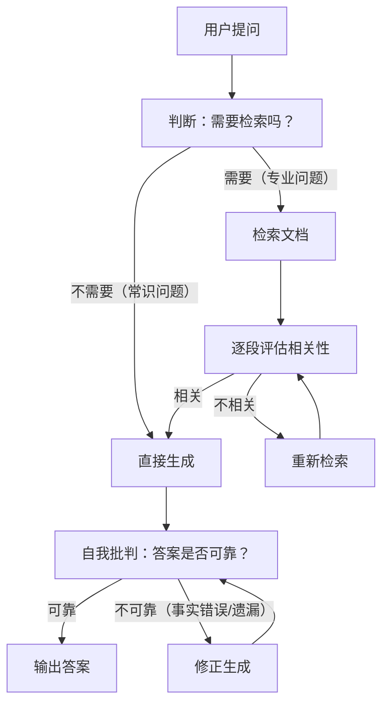

# Self-RAG

## 什么是 Self-RAG

Self-RAG（Self-Reflective RAG）让 LLM **自主决定**何时需要检索、评估检索到的文档质量、批判自身生成结果，并在必要时自我修正。与 CRAG（检索后评估）不同，Self-RAG 在**每一步都进行反思判断**。

```
用户提问 → 需要检索? → [是] 检索文档 → 文档相关? → [是] 生成 → 答案可靠? → [否] 修正
              ↓ [否]             ↓ [否]                ↓ [是]
           直接生成            重新检索              输出答案
```

### 与其他 RAG 范式的区别

| 维度 | 基础 RAG | CRAG | Agentic RAG | Self-RAG |
|------|---------|------|-------------|----------|
| 检索决策 | 始终检索 | 始终检索 | Agent 工具调用 | **模型自主判断** |
| 质量评估 | 无 | 检索后评估 | Agent 判断 | **逐段 + 逐答案反思** |
| 自我修正 | 无 | 重写查询 | 多轮迭代 | **批判 → 修正生成** |
| 是否需要特训 | 否 | 否 | 否 | **是（Reflection Tokens）** |

## Self-RAG 工作流



## 核心机制：Reflection Tokens

Self-RAG 在训练时为模型注入了特殊的 **反思标记（Reflection Tokens）**：

| 标记类型 | 示例 | 含义 |
|---------|------|------|
| **Retrieve** | `<RETRIEVE>` / `<NO_RETRIEVE>` | 当前是否需要检索外部知识 |
| **IsRel** | `<RELEVANT>` / `<IRRELEVANT>` | 检索到的文档段落是否与问题相关 |
| **IsSup** | `<FULLY_SUPPORTED>` / `<PARTIALLY_SUPPORTED>` / `<NO_SUPPORT>` | 生成答案是否得到文档支持 |
| **IsUse** | `[有用性评分 1-5]` | 生成的答案对用户有多大帮助 |

> **注意**：标准 LLM 没有经过 Self-RAG 特训，不会输出 Reflection Tokens。在 LangGraph 实现中，我们用独立的 LLM 调用来模拟每个反思步骤。

## LangGraph 实现

```python
from typing import TypedDict, Annotated
import operator
from langgraph.graph import StateGraph, START, END
from langchain_openai import ChatOpenAI
from langchain_core.prompts import ChatPromptTemplate

class SelfRAGState(TypedDict):
    question: str
    need_retrieval: bool            # Reflection: 是否需要检索
    documents: Annotated[list[str], operator.add]
    relevant_docs: list[str]        # 筛选后的相关文档
    generation: str
    critique: str                   # 自我批判结果
    is_reliable: bool               # 生成是否可靠
    final_answer: str

llm = ChatOpenAI(model="gpt-4o")

# ── 步骤 1：判断是否需要检索 ──
def decide_retrieval(state: SelfRAGState) -> dict:
    """Self-RAG 的 Retrieve 判断：这个问题需要外部知识吗？"""
    prompt = f"""判断以下问题是否需要检索外部知识才能准确回答。

问题：{state['question']}

判断标准：
- 常识/通用知识（如"1+1等于几"、"今天天气不错用英语怎么说"）→ 不需要检索
- 需要特定事实/数据/专业知识（如"2024年某公司财报"、"某技术规范细节"）→ 需要检索

只返回 YES 或 NO。"""

    response = llm.invoke(prompt).content.strip().upper()
    return {"need_retrieval": "YES" in response}

# ── 步骤 2：检索文档 ──
def retrieve(state: SelfRAGState) -> dict:
    """检索相关文档"""
    docs = vectorstore.similarity_search(state["question"], k=5)
    documents = [doc.page_content for doc in docs]
    return {"documents": documents}

# ── 步骤 3：逐段评估相关性（IsRel） ──
def evaluate_relevance(state: SelfRAGState) -> dict:
    """对每段检索结果评估是否与问题相关"""
    relevant = []
    for i, doc in enumerate(state["documents"]):
        prompt = f"""判断以下文档段落是否与问题相关。

问题：{state['question']}
文档段落：{doc[:500]}

只返回 RELEVANT 或 IRRELEVANT。"""
        result = llm.invoke(prompt).content.strip().upper()
        if "RELEVANT" in result:
            relevant.append(doc)

    # 如果没有相关文档，返回空（触发重新检索）
    return {"relevant_docs": relevant}

# ── 步骤 4：基于相关文档生成 ──
def generate(state: SelfRAGState) -> dict:
    """使用筛选后的相关文档生成答案"""
    if not state.get("relevant_docs"):
        return {"generation": "未找到相关信息"}

    docs_text = "\n\n---\n\n".join([
        f"[{i+1}] {doc[:800]}" for i, doc in enumerate(state["relevant_docs"])
    ])

    prompt = f"""基于以下文档回答问题。如果文档信息不足以回答，请明确说明。

文档：
{docs_text}

问题：{state['question']}

要求：
1. 每个关键陈述标注来源文档编号
2. 不确定的地方注明"据文档推断"或"文档未提及"

回答："""

    response = llm.invoke(prompt).content
    return {"generation": response}

# ── 步骤 5：自我批判（IsSup + IsUse） ──
def critique(state: SelfRAGState) -> dict:
    """对生成的答案进行自我批判"""
    prompt = f"""请严格批判以下答案的质量。

问题：{state['question']}

参考文档：
{chr(10).join([f'[{i+1}] {doc[:300]}' for i, doc in enumerate(state.get('relevant_docs', []))])}

待评估答案：
{state['generation']}

请从以下维度评分（1-5）并说明理由：
1. 事实准确性：答案是否与参考文档一致？
2. 完整性：是否遗漏了文档中的重要信息？
3. 幻觉风险：有没有文档不支持的陈述？

最后给出结论：RELIABLE（3 项均 ≥ 4 分）或 NEEDS_REVISION。"""

    response = llm.invoke(prompt).content
    is_reliable = "RELIABLE" in response.upper() and "NEEDS_REVISION" not in response.upper()
    return {"critique": response, "is_reliable": is_reliable}

# ── 步骤 6：修正生成 ──
def revise(state: SelfRAGState) -> dict:
    """根据批判意见修正答案"""
    prompt = f"""根据以下批判意见，修正你的答案。

原始问题：{state['question']}

原始答案：
{state['generation']}

批判意见：
{state['critique']}

请生成修正后的答案，确保：
1. 修正批判中指出的所有事实错误
2. 补充遗漏的关键信息
3. 移除无依据的陈述

只返回修正后的答案。"""

    revised = llm.invoke(prompt).content
    return {"generation": revised}

# ── 路由函数 ──
def route_after_decide(state: SelfRAGState) -> str:
    return "retrieve" if state["need_retrieval"] else "generate"

def route_after_evaluate(state: SelfRAGState) -> str:
    if not state.get("relevant_docs"):
        return "retrieve"  # 重新检索
    return "generate"

def route_after_critique(state: SelfRAGState) -> str:
    if state.get("is_reliable"):
        return "finalize"
    return "revise"

# ── 构建 Graph ──
builder = StateGraph(SelfRAGState)

builder.add_node("decide", decide_retrieval)
builder.add_node("retrieve", retrieve)
builder.add_node("evaluate", evaluate_relevance)
builder.add_node("generate", generate)
builder.add_node("critique", critique)
builder.add_node("revise", revise)

builder.add_edge(START, "decide")
builder.add_conditional_edges("decide", route_after_decide, {
    "retrieve": "retrieve",
    "generate": "generate",
})
builder.add_edge("retrieve", "evaluate")
builder.add_conditional_edges("evaluate", route_after_evaluate, {
    "retrieve": "retrieve",
    "generate": "generate",
})
builder.add_edge("generate", "critique")
builder.add_conditional_edges("critique", route_after_critique, {
    "finalize": END,
    "revise": "revise",
})
builder.add_edge("revise", "critique")  # 修正后再次评估

self_rag_graph = builder.compile()
```

## 关键设计考量

### 1. 反思成本 vs 收益

每一步反思都需要额外的 LLM 调用。典型场景下，Self-RAG 比基础 RAG 多 2-4 次 LLM 调用：

| 步骤 | LLM 调用次数 |
|------|------------|
| decide_retrieval | 1 次 |
| evaluate_relevance | N 次（每段 1 次，可并行） |
| critique | 1 次 |
| revise（如需） | 1 次 |

**优化建议**：对简单问题可跳过 critique 步骤，或使用更小/更便宜的模型做评估。

### 2. 循环终止条件

```python
MAX_RETRIEVAL_RETRIES = 3
MAX_REVISION_ROUNDS = 2

def route_after_evaluate_with_limit(state: SelfRAGState) -> str:
    state.setdefault("retrieval_attempts", 0)
    if not state.get("relevant_docs"):
        state["retrieval_attempts"] += 1
        if state["retrieval_attempts"] >= MAX_RETRIEVAL_RETRIES:
            return "generate"  # 强制生成，但注明信息不足
        return "retrieve"
    return "generate"
```

### 3. 何时不适合 Self-RAG

- **实时性要求高的场景**：多次 LLM 调用增加延迟
- **超短问答（< 20 tokens）**：评估成本超过收益
- **低风险场景**：基础 RAG 足够时无需增加复杂度

## 实践练习

1. 为 `retrieve` 节点增加查询重写（参考 CRAG 章节），在重新检索时自动优化查询
2. 实现并行段落评估：用 `asyncio.gather` 对多个文档段落同时做 relevance 判断
3. 在 `critique` 节点中加入"来源引用检查"：验证答案中每条事实陈述是否真的出现在文档中
