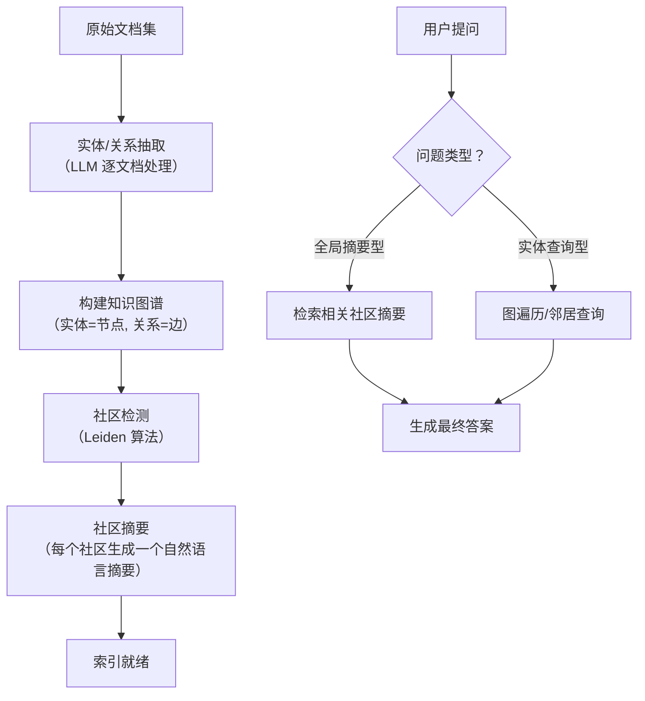
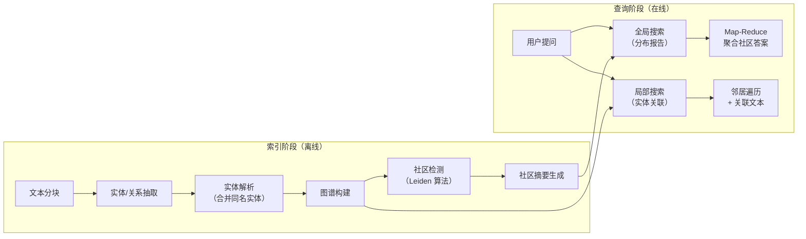

# Graph RAG

## 什么是 Graph RAG

Graph RAG 用**知识图谱**替代（或补充）向量检索：先从文档中抽取实体和关系构建图谱，再通过社区检测识别主题簇，最后用社区摘要回答全局性问题。

```
非结构化文档 → 实体/关系抽取 → 知识图谱构建 → 社区检测 → 社区摘要 → 查询回答
```

### Graph RAG vs 向量 RAG

| 维度 | 向量 RAG | Graph RAG |
|------|---------|-----------|
| 检索方式 | 语义相似度（Top-K 片段） | 图遍历 / 社区摘要 |
| 适合问题 | 事实查找（"某产品的价格"） | **全局分析**（"这个数据集的主要主题"） |
| 信息粒度 | 文本片段级 | 实体 → 社区 → 全局三级 |
| 关系表达 | 隐式（依赖相似度） | **显式**（实体间的命名关系） |
| 构建成本 | 低（Embedding） | 高（逐文档 LLM 抽取） |
| 查询延迟 | 毫秒级 | 毫秒级（图查询）到秒级（摘要生成） |

## Graph RAG 工作流



## Microsoft GraphRAG 架构

Microsoft 在 2024 年开源的 [GraphRAG](https://github.com/microsoft/graphrag) 是目前最成熟的 Graph RAG 实现，核心流程如下：



### 索引阶段详解

**1. 实体/关系抽取**：对每个文本块，用 LLM 提取 `(主体, 关系, 客体)` 三元组。

```python
# 示例：从文本中抽取的三元组
# "苹果公司在 2024 年发布了 iPhone 16"
# → (苹果公司, 发布, iPhone 16)
# → (iPhone 16, 发布时间, 2024年)
```

**2. 社区检测**：使用 Leiden 算法将图谱划分为层级社区（类似社交网络中的社群发现）。

**3. 社区摘要**：对每个社区，LLM 生成一个"社区报告"，概括该主题簇的核心内容。

## LangGraph 轻量级实现

以下是一个简化的 Graph RAG 实现，适合在没有完整 Microsoft GraphRAG 依赖时学习和实验：

```python
from typing import TypedDict, Annotated
import operator
from langgraph.graph import StateGraph, START, END
from langchain_openai import ChatOpenAI
from langchain_core.prompts import ChatPromptTemplate
from langchain_community.graphs import Neo4jGraph
import json

llm = ChatOpenAI(model="gpt-4o-mini")

# ── State 定义 ──
class GraphRAGState(TypedDict):
    documents: list[str]
    triples: Annotated[list[dict], operator.add]    # (主体, 关系, 客体)
    entities: Annotated[list[str], operator.add]     # 实体列表
    communities: list[list[str]]                     # 社区分组
    community_summaries: Annotated[list[str], operator.add]
    question: str
    global_answer: str
    local_answer: str
    final_answer: str

# ── 步骤 1：实体/关系抽取 ──
def extract_triples(state: GraphRAGState) -> dict:
    """从每篇文档中抽取（主体, 关系, 客体）三元组"""
    prompt = """从以下文本中抽取所有（主体, 关系, 客体）三元组。
以 JSON 数组格式返回，每个元素包含 subject, relation, object 三个字段。

文本：{text}

只返回 JSON，不要其他内容。"""

    all_triples = []
    all_entities = set()

    for doc in state["documents"]:
        response = llm.invoke(prompt.format(text=doc[:2000]))
        try:
            triples = json.loads(response.content)
            for t in triples:
                all_triples.append(t)
                all_entities.add(t["subject"])
                all_entities.add(t["object"])
        except:
            continue

    return {
        "triples": all_triples,
        "entities": list(all_entities)
    }

# ── 步骤 2：构建图并检测社区 ──
def build_graph_and_detect_communities(state: GraphRAGState) -> dict:
    """使用 NetworkX 构建图并用 Louvain 算法检测社区"""
    try:
        import networkx as nx
        from networkx.algorithms.community import louvain_communities
    except ImportError:
        # 无 networkx 时用简单规则分组
        return _simple_grouping(state)

    G = nx.Graph()
    for t in state["triples"]:
        G.add_edge(t["subject"], t["relation"], label=t["relation"])
        G.add_edge(t["relation"], t["object"], label="→")
        G.add_node(t["relation"], type="relation")

    # Louvain 社区检测（Leiden 算法的近似替代）
    communities = louvain_communities(G.to_undirected())
    community_list = [list(c) for c in communities]

    return {"communities": community_list}

def _simple_grouping(state: GraphRAGState) -> dict:
    """回退方案：按关联实体简单分组"""
    groups = {}
    for t in state["triples"]:
        key = t["subject"]
        groups.setdefault(key, []).append(f"{t['relation']} → {t['object']}")
    # 取前 10 个最大组
    sorted_groups = sorted(groups.items(), key=lambda x: len(x[1]), reverse=True)[:10]
    return {"communities": [[k] for k, _ in sorted_groups]}

# ── 步骤 3：生成社区摘要 ──
def generate_community_summaries(state: GraphRAGState) -> dict:
    """为每个社区生成摘要报告"""
    summaries = []
    for i, community in enumerate(state.get("communities", [])[:10]):  # 限制社区数量
        # 找到属于该社区的三元组
        community_triples = [
            t for t in state["triples"]
            if t["subject"] in community or t["object"] in community
        ]

        if not community_triples:
            continue

        triples_text = "\n".join([
            f"- ({t['subject']}) --[{t['relation']}]--> ({t['object']})"
            for t in community_triples[:20]
        ])

        prompt = f"""基于以下知识图谱三元组，生成该主题社区的摘要报告（2-3 句话）。

三元组：
{triples_text}

社区报告："""

        summary = llm.invoke(prompt).content
        summaries.append(f"[社区 {i+1}] {summary}")

    return {"community_summaries": summaries}

# ── 步骤 4a：全局搜索（使用社区摘要） ──
def global_search(state: GraphRAGState) -> dict:
    """对全局性问题，搜索相关社区摘要并生成答案"""
    summaries = state.get("community_summaries", [])

    # 用向量相似度或 LLM 筛选相关社区
    summaries_text = "\n\n".join(summaries[:5])

    prompt = f"""基于以下社区摘要回答全局性问题。

社区摘要：
{summaries_text}

问题：{state['question']}

这需要理解数据集中的整体主题和趋势。提供结构化的分析和具体引证。"""

    answer = llm.invoke(prompt).content
    return {"global_answer": answer}

# ── 步骤 4b：局部搜索（实体查询） ──
def local_search(state: GraphRAGState) -> dict:
    """对实体型问题，在图中查找相关实体及其邻居"""
    # 先用 LLM 从问题中提取关键实体
    prompt = f"""从以下问题中提取关键实体（人名、组织、产品、概念等）。
以逗号分隔的列表返回。

问题：{state['question']}

实体："""

    key_entities = llm.invoke(prompt).content.strip().split(", ")

    # 在图谱中查找这些实体关联的三元组
    related_triples = []
    for entity in key_entities:
        for t in state["triples"]:
            if entity.lower() in t["subject"].lower() or entity.lower() in t["object"].lower():
                related_triples.append(t)

    triples_text = "\n".join([
        f"({t['subject']}) --[{t['relation']}]--> ({t['object']})"
        for t in related_triples[:15]
    ])

    answer_prompt = f"""基于以下知识图谱三元组回答问题。

关联三元组：
{triples_text}

问题：{state['question']}

如果三元组信息不足，请明确说明。"""

    answer = llm.invoke(answer_prompt).content
    return {"local_answer": answer}

# ── 路由：判断问题类型 ──
def classify_question(state: GraphRAGState) -> str:
    """判断问题是全局型还是实体型"""
    prompt = f"""判断以下问题的类型。

问题：{state['question']}

类型选择：
- GLOBAL：要求概括、总结、分析趋势、比较主题（如"这个数据集主要讨论了什么？"）
- LOCAL：查询特定实体/事实（如"苹果公司发布了什么产品？"）

只返回 GLOBAL 或 LOCAL。"""

    result = llm.invoke(prompt).content.strip().upper()
    return "global" if "GLOBAL" in result else "local"

# ── 构建 Graph ──
builder = StateGraph(GraphRAGState)

builder.add_node("extract_triples", extract_triples)
builder.add_node("detect_communities", build_graph_and_detect_communities)
builder.add_node("summarize_communities", generate_community_summaries)
builder.add_node("global_search", global_search)
builder.add_node("local_search", local_search)

builder.add_edge(START, "extract_triples")
builder.add_edge("extract_triples", "detect_communities")
builder.add_edge("detect_communities", "summarize_communities")
builder.add_conditional_edges("summarize_communities", classify_question, {
    "global": "global_search",
    "local": "local_search",
})
builder.add_edge("global_search", END)
builder.add_edge("local_search", END)

graph_rag = builder.compile()
```

## 其他 Graph RAG 方案

| 方案 | 特点 | 适合场景 |
|------|------|----------|
| **Microsoft GraphRAG** | 全流程实现、社区摘要出众 | 大规模文档集的全局理解 |
| **Neo4j + GraphRAG** | 企业级图数据库 + LLM 插件 | 已有 Neo4j 基础设施的团队 |
| **LlamaIndex KnowledgeGraphIndex** | 轻量级、与 LlamaIndex 生态集成 | 快速原型、中小规模图谱 |
| **LightRAG** | 轻量、支持增量更新 | 学术研究、快速实验 |

## 关键设计考量

### 1. 构建成本高

索引阶段需要对每篇文档调用 LLM 做实体/关系抽取 + 社区摘要，成本远高于向量化。
**建议**：对高频更新的文档集，考虑增量抽取策略。

### 2. 适合/不适合的场景

| 适合 | 不适合 |
|------|--------|
| 大面积数据集的主题理解（"这篇文章集总共有哪些论点？"） | 精确事实查找（"某函数参数是什么？"） |
| 需要理解实体间关系的推理问题 | 实时数据（索引有延迟） |
| 多跳推理（A → B → C） | 简短文本（图太稀疏） |
| 合规/审计（可追溯的实体关系链） | Token 预算敏感的场景 |

### 3. 混合策略：Graph + Vector

最佳实践通常是将 Graph RAG 和向量 RAG 结合：
- **全局/摘要问题** → Graph RAG（社区摘要）
- **事实/细节问题** → 向量 RAG（片段检索）
- **实体关系问题** → Graph RAG（图遍历）
- **不确定时** → 双路检索 + LLM 合并

## 实践练习

1. 用 `python -m graphrag index` 对一组技术博客运行 Microsoft GraphRAG 索引，对比社区摘要的质量
2. 实现"Graph + Vector 混合路由"：根据问题类型自动选择 Graph RAG 或向量 RAG
3. 对相同文档集，对比 Graph RAG 和基础 RAG 在全局性问题上（如"这些文档的主要主题是什么？"）的回答质量
