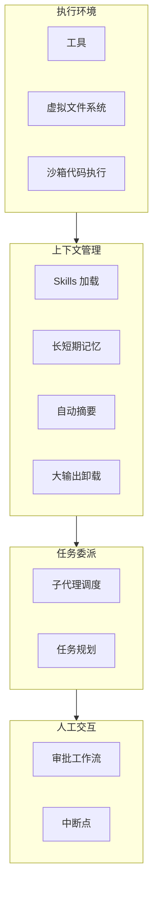
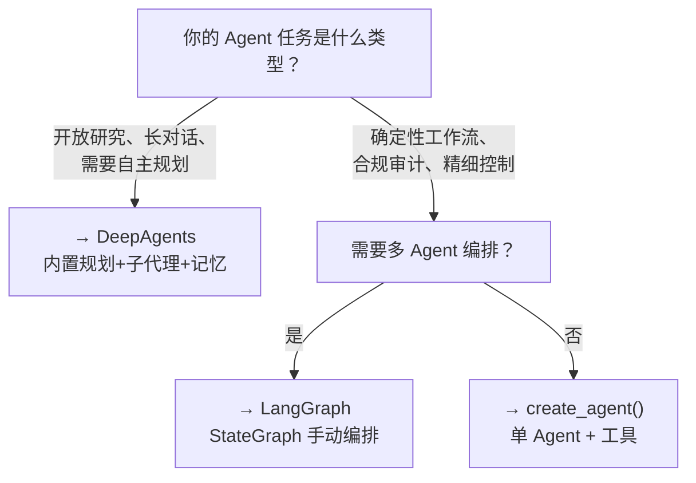

# Deep Agent 与 Skills 集成

## 什么是 Deep Agent

Deep Agent 是 LangChain 生态的**高级 Agent Harness**（`deepagents` 包），为 Agent 提供电池全包含的能力：任务规划、子代理调度、长短期记忆、上下文管理。它是构建复杂 Agent 系统的推荐起点。

> **经验法则**：用 DeepAgents 起步。需要完全控制 Agent 循环时降级到 LangChain `create_agent()`，需要精细图控制时降级到 LangGraph。

### DeepAgents vs LangChain create_agent vs LangGraph

| 维度 | DeepAgents | create_agent() | LangGraph |
|------|-----------|----------------|-----------|
| **抽象层级** | 最高（Harness） | 中等（单 Agent） | 最低（图编排） |
| **内置任务规划** | ✅ TodoListMiddleware | ❌ | ❌ 需手动实现 |
| **子代理** | ✅ SubAgentMiddleware | ❌ | 需手动 Send API |
| **上下文管理** | ✅ 自动摘要+卸载 | ❌ | 需手动实现 |
| **长期记忆** | ✅ CompositeBackend | ❌ | Store API |
| **学习曲线** | 低 | 中 | 高 |
| **灵活性** | 中 | 高 | 最高 |
| **适用场景** | 开放任务、研究、长对话 | 有界 Agent | 确定性工作流 |

## 核心架构（四层模型）



## 安装与快速开始

```bash
pip install deepagents>=1.6.0 langchain langchain-openai
```

### 最简 Agent

```python
from deepagents import create_deep_agent
from langchain_openai import ChatOpenAI

agent = create_deep_agent(
    model=ChatOpenAI(model="gpt-4o"),
    system_prompt="你是一个有用的 AI 助手。",
)

# 一步创建即可使用
result = agent.invoke({
    "messages": [{"role": "user", "content": "帮我研究一下量子计算的最新进展"}]
})
```

## 任务规划（TodoListMiddleware）

TodoListMiddleware 默认启用，为 Agent 提供 `write_todos` 和 `read_todos` 工具，让 Agent 自主分解复杂任务。

```python
# Agent 在收到复杂任务后自动调用 write_todos
# 内部生成的任务列表示例：
# [
#   {"id": "1", "content": "搜索量子计算基础资料", "status": "in_progress"},
#   {"id": "2", "content": "研究量子纠错最新进展", "status": "pending"},
#   {"id": "3", "content": "调研量子机器学习应用", "status": "pending"},
#   {"id": "4", "content": "整理为结构化报告", "status": "pending", "dependencies": ["1","2","3"]},
# ]

# Agent 会自动更新任务状态，跟踪整体进展
```

## 子代理调度（SubAgentMiddleware）

SubAgentMiddleware 让主编排 Agent 通过 `task` 工具将子任务委派给专门的子代理。每个子代理在**独立的上下文窗口**中运行，防止主代理上下文膨胀。

### 定义子代理

```python
# 声明式子代理（最简单）
research_subagent = {
    "name": "research-agent",
    "description": "用于深度研究问题，搜索和收集信息",
    "system_prompt": "你是专业研究员。使用搜索工具收集信息，标注信息来源。",
    "tools": [web_search],
    "model": "openai:gpt-4o-mini",  # 可选：子代理用轻量模型
}

coder_subagent = {
    "name": "coder-agent",
    "description": "用于编写和执行代码",
    "system_prompt": "你是程序员。编写、测试和解释代码。",
    "tools": [python_repl],
}

# 支持传入预编译的 LangGraph 工作流作为子代理
# from deepagents import CompiledSubAgent
# advanced_subagent = CompiledSubAgent(my_langgraph_workflow)

agent = create_deep_agent(
    model=ChatOpenAI(model="gpt-4o"),
    subagents=[research_subagent, coder_subagent],
    system_prompt="你是项目主管。将任务分派给合适的子代理。",
)
```

### 异步子代理（v1.9.0+）

```python
# DeepAgents v1.9.0 支持异步子代理
# 主 Agent 可以同时启动多个子代理，在后台并行执行

# Agent 内部行为：
# task("research-agent", "研究主题 A")  ─┐
# task("research-agent", "研究主题 B")  ─┤  并行执行
# task("research-agent", "研究主题 C")  ─┘
# 主 Agent 继续响应其他请求，子代理完成后通知
```

## 中间件全栈（11 层，执行顺序）

```python
# DeepAgents 的中间件按以下顺序执行：
MIDDLEWARE_STACK = [
    "1. TodoListMiddleware",        # 任务规划
    "2. SkillsMiddleware",          # 渐进式 Skill 加载
    "3. FilesystemMiddleware",      # 文件操作 + 权限
    "4. SubAgentMiddleware",        # 子代理调度
    "5. SummarizationMiddleware",   # 上下文压缩
    "6. PatchToolCallsMiddleware",  # 修复异常工具调用
    # 7. 你的自定义中间件
    # 8. Harness 平台额外中间件
    "9. PromptCachingMiddleware",   # Anthropic Prompt 缓存
    "10. MemoryMiddleware",         # 持久化记忆
    "11. HumanInTheLoopMiddleware", # 审批门控
]

# 自定义中间件
from deepagents.middleware import AgentMiddleware

class MyCustomMiddleware(AgentMiddleware):
    """自定义中间件：记录所有工具调用"""

    async def on_tool_start(self, tool_name: str, args: dict, context: dict):
        logger.info(f"🔧 调用工具: {tool_name}({str(args)[:100]})")
        return {"tool_name": tool_name, "args": args}

    async def on_tool_end(self, tool_name: str, result: str, context: dict):
        logger.info(f"✅ 工具完成: {tool_name} → {str(result)[:100]}")
        return {"result": result}

agent = create_deep_agent(
    model=ChatOpenAI(model="gpt-4o"),
    middleware=[MyCustomMiddleware()],
    # ... 其他配置
)
```

## 长短期记忆

### 短期记忆（会话内）：AGENTS.md

```python
# 通过 memory 参数加载偏好和上下文
agents_md = """
# 用户偏好
- 输出语言：中文
- 代码风格：Python 3.12+，使用 type hints
- 报告格式：Markdown，含表格对比
- 术语处理：专业术语保留英文
"""

agent = create_deep_agent(
    model=ChatOpenAI(model="gpt-4o"),
    memory=[agents_md],  # 加载偏好，Agent 可在交互中更新
)
```

### 长期记忆（跨会话）：CompositeBackend

```python
from deepagents.backends import CompositeBackend
from deepagents.backends.state import StateBackend
from deepagents.backends.store import StoreBackend

# 分层记忆架构
memory_backend = CompositeBackend(
    routes={
        "/session/*": StateBackend(),       # 会话内状态
        "/memories/*": StoreBackend(        # 跨会话持久记忆
            store=PostgresStore(connection_string=os.environ["DATABASE_URL"])
        ),
    },
    default=FilesystemBackend(root_dir="./agent_data"),
)

agent = create_deep_agent(
    model=ChatOpenAI(model="gpt-4o"),
    backend=memory_backend,
)

# 结合向量数据库（Milvus）实现语义记忆检索
# 重要对话自动嵌入，后续相关任务时语义检索
```

## 上下文管理（SummarizationMiddleware）

```python
# 自动行为（v1.6.0+）：
# 1. 上下文达到模型 max_input_tokens 的 85% 时自动触发摘要
# 2. LLM 生成结构化摘要（会话意图、关键发现、待办事项）
# 3. 原始对话写入文件系统（/session_summary.txt）
# 4. 超过 20k tokens 的工具输出自动卸载到文件

agent = create_deep_agent(
    model=ChatOpenAI(model="gpt-4o"),
    # SummarizationMiddleware 默认启用，可配置：
    # summarization={
    #     "trigger_threshold": 0.85,
    #     "max_tool_output_tokens": 20000,
    # }
)
```

## 完整实战：科研助手 Agent（v2 更新版）

```python
"""
DeepAgents 科研助手（2026 更新版）
使用异步子代理 + 长期记忆
"""
import os
from deepagents import create_deep_agent
from deepagents.backends import CompositeBackend, StateBackend, StoreBackend
from langchain_openai import ChatOpenAI
from langchain_core.tools import tool

# ── 定义工具 ──
@tool
def web_search(query: str, max_results: int = 5) -> str:
    """搜索互联网获取最新信息"""
    # 对接 Tavily / Brave / SerpAPI
    return f"搜索 '{query}' 的结果..."

@tool
def calculator(expression: str) -> str:
    """安全计算数学表达式"""
    try:
        return str(eval(expression))
    except Exception as e:
        return f"计算错误: {e}"

# ── 定义子代理 ──
research_subagent = {
    "name": "research-agent",
    "description": "深度研究特定主题。用于需要搜索和收集信息的任务。",
    "system_prompt": """你是专业研究员。
1. 用多个关键词从不同角度搜索
2. 提取关键事实、数据和不同观点
3. 标注每条信息的来源和时效性
4. 区分"已确认事实"和"观点/预测"
输出结构化研究发现。""",
    "tools": [web_search],
    "model": "openai:gpt-4o-mini",
}

analysis_subagent = {
    "name": "analysis-agent",
    "description": "多维度对比分析。用于需要比较多个选项或数据源的任务。",
    "system_prompt": """你是数据分析专家。
从以下维度进行对比：功能、性能、定价、优劣势、适用场景。
输出对比表格 + 每个维度的详细分析。""",
    "tools": [calculator],
    "model": "openai:gpt-4o",
}

writer_subagent = {
    "name": "writer-agent",
    "description": "将研究发现整理为结构化报告。",
    "system_prompt": """你是技术报告撰写者。
报告结构：执行摘要 → 背景 → 发现与对比 → 结论建议 → 参考来源。
使用 Markdown 格式，语言专业但易读。""",
    "tools": [],
}

# ── 配置记忆 ──
backend = CompositeBackend(
    routes={
        "/session/*": StateBackend(),
        "/memories/*": StoreBackend(
            store=None  # 生产环境替换为 PostgresStore
        ),
    },
    default=None,
)

# ── 配置用户偏好（AGENTS.md） ──
user_preferences = """
# 研究偏好
- 输出语言：中文
- 报告格式：Markdown 含对比表格
- 引用要求：明确标注来源和时效性
- 深度要求：至少涵盖 3 个不同视角
"""

# ── 创建 Agent ──
agent = create_deep_agent(
    model=ChatOpenAI(model="gpt-4o"),
    tools=[web_search, calculator],
    subagents=[research_subagent, analysis_subagent, writer_subagent],
    system_prompt="""你是 AI 研究助手。工作流程：
1. 用 write_todos 制定研究计划
2. 分派子任务给合适的子代理
3. 监控进展，确保研究质量
4. 综合所有发现生成最终报告

质量标准：来源可靠、观点平衡、区分事实与观点。""",
    memory=[user_preferences],
    backend=backend,
)

# ── 使用 ──
config = {"configurable": {"thread_id": "research-session-1"}}
result = agent.invoke(
    {"messages": [{"role": "user",
                   "content": "对比 2026 年三大云服务商的 AI Agent 开发平台"}]},
    config=config,
)
print(result["messages"][-1].content)
```

## DeepAgents vs LangGraph 选型决策



| 选择 DeepAgents | 选择 LangGraph |
|:---|:---|
| 需要内置任务规划 | 需要完全控制状态流转 |
| 需要子代理隔离上下文 | 需要复杂的分支和合并逻辑 |
| 需要自动上下文管理 | 需要时间旅行调试 |
| 需要内建记忆系统 | 需要 Human-in-the-Loop 精细控制 |
| 快速原型（~50 行代码） | 生产级工作流（~200 行代码） |
| 不关心中间步骤控制 | 每个步骤都需要审计追踪 |

## 成果数据（2026 更新）

| 指标 | 无 Skills 基础 Agent | DeepAgents + Skills | 提升 |
|------|---------------------|---------------------|------|
| 复杂任务完成率 | 29% | **95%** | +66% |
| 平均 Token 消耗 | 基准 | -40% | 渐进式披露 + 上下文管理 |
| 工具选择准确率 | 基准 | +50% | 上下文聚焦 |
| 长任务稳定性（20+ 步） | 40% | **92%** | 摘要 + 子代理隔离 |

## 实践练习

1. 用 `create_deep_agent()` 创建一个带 3 个子代理的研究助手
2. 配置 CompositeBackend 实现跨会话记忆，测试 Agent 是否记住之前的对话
3. 观察长任务（15+ 步骤）中的自动摘要行为，记录触发时机和效果
