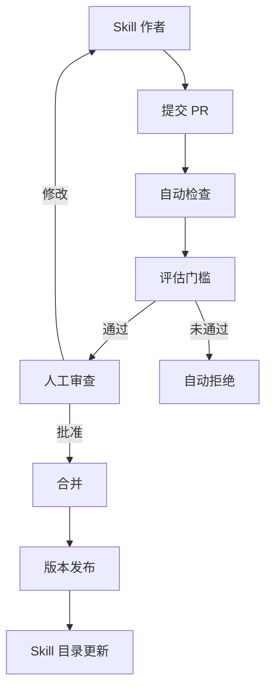

# Skill 评估与治理

## 为什么 Skill 需要评估

Skill 是 Agent 的"操作手册"——如果手册本身有误或不完整，Agent 的行为就会出现偏差。Skill 评估确保每个 Skill 可衡量地提升 Agent 能力，而非增加上下文噪声。

> **核心原则：没有评估门槛 = 不上线。** 一个不能可衡量地改善评估指标的 Skill，只是在消耗上下文成本。

## Skill 评估的两个维度

| 维度 | 评估什么 | 方法 |
|------|----------|------|
| **激活评估** | Skill 是否在正确的时机被触发 | 应该触发/不应该触发的测试查询 |
| **输出评估** | Skill 激活后的任务完成质量 | 正确性、合规性、工具选择、格式 |

## 激活评估（Activation Eval）

### 测试用例设计

```python
SKILL_ACTIVATION_TESTS = {
    "arxiv-research": {
        # ✓ 应该触发的查询
        "should_trigger": [
            "搜索最新的 transformer 论文",
            "帮我找几篇关于 RAG 的学术文章",
            "最近有什么关于 agent 的 arxiv 论文",
            "做一次文献综述，主题是 LLM 安全",
        ],
        # ✗ 不应该触发的查询（近距迷惑）
        "should_not_trigger": [
            "搜索一下 Python 教程",          # 不是学术
            "transformers 库怎么用",         # 库使用，非论文
            "RAG 是什么意思",               # 定义查询
            "agent 开发的 best practice",   # 实践指南，非论文
        ],
        # 边界情况
        "edge_cases": [
            "arxiv 上有没有关于 AI agent 的综述？（含 arxiv 关键字但口语化）",
            "帮我找论文，任何来源都行（未指定 arxiv）",
        ]
    }
}
```

### 激活测试运行器

```python
import json
from typing import TypedDict
from langchain_openai import ChatOpenAI

class ActivationTestResult(TypedDict):
    skill_name: str
    precision: float   # 触发准确率
    recall: float      # 应该触发时的召回率
    false_positives: list[str]
    false_negatives: list[str]

def test_skill_activation(agent, skill_name: str, test_cases: dict) -> ActivationTestResult:
    """测试 Skill 的激活准确性"""

    judge = ChatOpenAI(model="gpt-4o-mini")
    false_positives = []
    false_negatives = []

    # 测试应该触发但没触发的情况
    for query in test_cases.get("should_trigger", []):
        result = agent.invoke({
            "messages": [{"role": "user", "content": query}]
        })
        # 检查 Skill 是否被调用
        was_activated = _check_skill_activated(result, skill_name)
        if not was_activated:
            false_negatives.append(query)

    # 测试不应该触发却触发的情况
    for query in test_cases.get("should_not_trigger", []):
        result = agent.invoke({
            "messages": [{"role": "user", "content": query}]
        })
        was_activated = _check_skill_activated(result, skill_name)
        if was_activated:
            false_positives.append(query)

    should_count = len(test_cases.get("should_trigger", []))
    should_not_count = len(test_cases.get("should_not_trigger", []))

    recall = (should_count - len(false_negatives)) / should_count if should_count else 1.0
    precision_denom = should_not_count + should_count
    precision = (should_count - len(false_negatives) + len(false_positives)) / precision_denom if precision_denom else 0
    precision = max(0, min(1, precision))  # clamp

    return {
        "skill_name": skill_name,
        "precision": precision,
        "recall": recall,
        "false_positives": false_positives,
        "false_negatives": false_negatives,
    }

def _check_skill_activated(result: dict, skill_name: str) -> bool:
    """检查 Skill 是否在 Agent 执行中被激活"""
    messages = result.get("messages", [])
    for msg in messages:
        content = str(getattr(msg, "content", ""))
        if skill_name in content.lower():
            return True
        # 检查工具调用中的 skill 引用
        if hasattr(msg, "tool_calls"):
            for tc in msg.tool_calls:
                if isinstance(tc, dict) and skill_name in str(tc).lower():
                    return True
    return False
```

## 输出评估（Output Eval）

### 多维度质量评估

```python
def evaluate_skill_output(
    skill_name: str,
    task_description: str,
    agent_output: str,
    expected_elements: list[str],
    reference: str = None
) -> dict:
    """评估 Skill 激活后的输出质量"""

    judge = ChatOpenAI(model="gpt-4o")

    eval_prompt = f"""评估 Agent 使用 Skill「{skill_name}」完成任务的质量。

## 任务
{task_description}

## Agent 输出
{agent_output[:2000]}

## 评估维度（每项 0-10 分）

1. **任务完成度**: 是否完成了任务的所有步骤
2. **输出格式**: 是否符合 Skill 定义的输出格式
3. **工具使用**: 是否使用了 Skill 推荐的工具
4. **合规性**: 是否遵循了 Skill 中的注意事项和约束
5. **输出质量**: 内容的准确性和完整性

## 期望包含的元素
{json.dumps(expected_elements, ensure_ascii=False)}

{f'## 参考答案\\n{reference}' if reference else ''}

返回 JSON：
{{
    "task_completion": <0-10>,
    "format_adherence": <0-10>,
    "tool_usage": <0-10>,
    "compliance": <0-10>,
    "quality": <0-10>,
    "overall": <0-10>,
    "missing_elements": ["..."] ,
    "issues": ["..."]
}}"""

    return json.loads(judge.invoke(eval_prompt).content)
```

## Skill 治理

### 治理模型



### 版本固定

```yaml
# skill-versions.yaml
# 在生产环境中固定 Skill 版本，防止意外更新

arxiv-research: "1.2.0"
code-review: "2.0.1"
deployment-checklist: "1.0.0"
pii-redaction: "1.3.0"
```

```python
# 代码中加载固定版本
agent = create_deep_agent(
    model="gpt-4o",
    skills=[
        {"name": "arxiv-research", "version": "1.2.0"},
        {"name": "code-review", "version": "2.0.1"},
    ],
    # skills_dir="./skills",  # 自动扫描 skills/ 目录
)
```

### 供应链安全

```python
import hashlib
import json

class SkillSupplyChain:
    """Skill 供应链安全检查"""

    @staticmethod
    def verify_integrity(skill_path: str, expected_hash: str) -> bool:
        """验证 Skill 文件完整性"""
        with open(f"{skill_path}/SKILL.md", "rb") as f:
            content = f.read()
        actual_hash = hashlib.sha256(content).hexdigest()
        return actual_hash == expected_hash

    @staticmethod
    def check_source(skill_path: str) -> dict:
        """检查 Skill 来源"""
        skill_md = f"{skill_path}/SKILL.md"

        checks = {
            "has_scripts": False,
            "has_external_urls": False,
            "scripts_count": 0,
            "warnings": [],
        }

        import os
        import re

        # 检查是否有 scripts/ 目录
        scripts_dir = os.path.join(skill_path, "scripts")
        if os.path.exists(scripts_dir):
            checks["has_scripts"] = True
            checks["scripts_count"] = len(os.listdir(scripts_dir))
            checks["warnings"].append(
                f"包含 {checks['scripts_count']} 个脚本文件，请审查脚本内容"
            )

        # 检查 SKILL.md 中是否有外部 URL
        with open(skill_md, "r") as f:
            content = f.read()
        urls = re.findall(r'https?://[^\s\)"]+', content)
        if urls:
            checks["has_external_urls"] = True
            checks["warnings"].append(f"包含 {len(urls)} 个外部链接")

        return checks

    @staticmethod
    def scan_scripts(skill_path: str) -> list[str]:
        """扫描脚本中的安全问题"""
        scripts_dir = os.path.join(skill_path, "scripts")
        if not os.path.exists(scripts_dir):
            return []

        issues = []
        dangerous_patterns = [
            (r'os\.system\(', "不安全的系统调用"),
            (r'subprocess\.call\(', "子进程调用"),
            (r'eval\(', "动态代码执行"),
            (r'exec\(', "动态代码执行"),
            (r'requests\.post\(', "外部网络请求"),
            (r'open\(.*[\'"]w[\'"]', "文件写入操作"),
            (r'__import__\(', "动态导入"),
        ]

        import re
        for filename in os.listdir(scripts_dir):
            filepath = os.path.join(scripts_dir, filename)
            if not filename.endswith(('.py', '.sh', '.js')):
                continue
            with open(filepath, "r") as f:
                code = f.read()
            for pattern, desc in dangerous_patterns:
                if re.search(pattern, code):
                    issues.append(f"[{filename}] {desc}")

        return issues
```

### Skill 审计日志

```python
class SkillAuditTrail:
    """Skill 使用审计"""

    def __init__(self):
        self.records = []

    def log_activation(self, skill_name: str, trigger_query: str, user_id: str):
        """记录 Skill 激活"""
        self.records.append({
            "event": "skill_activated",
            "skill": skill_name,
            "trigger": trigger_query[:200],
            "user_id": user_id,
            "timestamp": datetime.now(timezone.utc).isoformat(),
        })

    def log_output(self, skill_name: str, output_summary: str, tokens_used: int):
        """记录 Skill 输出"""
        self.records.append({
            "event": "skill_completed",
            "skill": skill_name,
            "output_preview": output_summary[:200],
            "tokens_used": tokens_used,
            "timestamp": datetime.now(timezone.utc).isoformat(),
        })

    def log_failure(self, skill_name: str, error: str):
        """记录 Skill 失败"""
        self.records.append({
            "event": "skill_failed",
            "skill": skill_name,
            "error": str(error)[:500],
            "timestamp": datetime.now(timezone.utc).isoformat(),
        })

    def generate_report(self) -> dict:
        """生成 Skill 使用报告"""
        skills_used = {}
        for r in self.records:
            name = r["skill"]
            skills_used.setdefault(name, {
                "activations": 0, "successes": 0, "failures": 0, "total_tokens": 0
            })
            if r["event"] == "skill_activated":
                skills_used[name]["activations"] += 1
            elif r["event"] == "skill_completed":
                skills_used[name]["successes"] += 1
                skills_used[name]["total_tokens"] += r.get("tokens_used", 0)
            elif r["event"] == "skill_failed":
                skills_used[name]["failures"] += 1

        return skills_used
```

## 常见错误

| 错误 | 后果 | 修复 |
|------|------|------|
| **描述过于宽泛** | Skill 被频繁误触发 | 缩小触发条件，添加"不适用场景" |
| **描述过于狭窄** | 应该触发时不触发 | 增加多种措辞的触发示例 |
| **缺少版本固定** | 更新后行为静默变化 | 生产环境固定版本号 |
| **大量 Token 正文** | 每次激活消耗过多上下文 | 拆分 > 5000 token 的 Skill |
| **忽略脚本审查** | 恶意或危险代码执行 | 供应链安全检查 |
| **无评估数据** | 不知道 Skill 是否有效 | 激活评估 + 输出评估 |

## 实践练习

1. 为你的一个 Skill 编写激活测试用例（至少 5 个 should_trigger + 5 个 should_not_trigger）
2. 运行激活测试，分析误触发和漏触发的原因，优化 SKILL.md 的 description
3. 实现 Skill 供应链安全检查，扫描 scripts/ 目录中的危险调用
