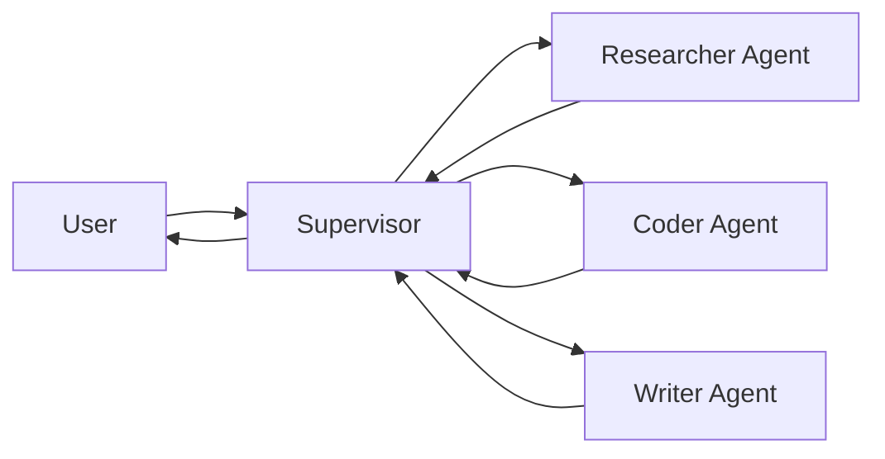

# Supervisor 多 Agent 模式

## 模式概述

Supervisor 模式是多 Agent 系统最常用的架构。一个**中心 Supervisor Agent** 将任务分发给**专门的 Worker Agent**，各 Worker 完成后返回 Supervisor，由 Supervisor 决定下一步。



### 与单 Agent 的对比

| 维度 | 单 Agent | Supervisor 多 Agent |
|------|---------|---------------------|
| 工具管理 | 所有工具在一个 Agent | 每个 Agent 专属工具 |
| Prompt 复杂度 | 一个长 Prompt | 每个 Agent 短而专注 |
| 上下文窗口 | 所有信息混在一起 | 各 Agent 独立上下文 |
| 可维护性 | 工具多时 Prompt 膨胀 | 独立开发、测试、部署 |
| 成本 | 单次决策 | 多次调用（Supervisor + Worker） |

## 方式一：langgraph-supervisor 库

```python
from langgraph_supervisor import create_supervisor
from langchain.agents import create_agent
from langchain_openai import ChatOpenAI

model = ChatOpenAI(model="gpt-4o")

# 创建专门的 Worker Agent
research_agent = create_agent(
    model=model,
    tools=[web_search, internal_kb_search],
    name="researcher",
    system_prompt="你是研究员。负责搜索和收集信息。"
)

coder_agent = create_agent(
    model=model,
    tools=[python_repl, file_reader],
    name="coder",
    system_prompt="你是程序员。负责编写和执行代码。"
)

writer_agent = create_agent(
    model=model,
    tools=[],
    name="writer",
    system_prompt="你是技术写手。负责将研究发现和代码结果整理成清晰的文档。"
)

# 创建 Supervisor（自动生成 transfer_to_* 工具）
supervisor = create_supervisor(
    agents=[research_agent, coder_agent, writer_agent],
    model=ChatOpenAI(model="gpt-4o"),  # Supervisor 用更强的模型
    prompt=(
        "你是一个项目经理 Supervisor。根据任务需求，将工作分发给合适的 Agent。\n"
        "- researcher：需要搜索信息、查找资料时\n"
        "- coder：需要编写或执行代码时\n"
        "- writer：需要生成文档或报告时\n"
        "先让 researcher 搜索信息，然后根据需要让 coder 写代码，"
        "最后由 writer 生成最终报告。"
    ),
    output_mode="last"  # 只返回最后一个 Agent 的输出
)

# 编译并运行
app = supervisor.compile()
result = app.invoke({
    "messages": [{
        "role": "user",
        "content": "分析 Python 3.13 的新特性，并给出一个使用新特性的代码示例"
    }]
})
```

## 方式二：手动 StateGraph 实现

```python
from typing import TypedDict, Annotated, Literal
import operator
from langgraph.graph import StateGraph, MessagesState, START, END
from langgraph.types import Command
from langchain_openai import ChatOpenAI

class MultiAgentState(MessagesState):
    next_agent: str
    task_results: Annotated[list[str], operator.add]

# ── 定义 Worker ──
llm = ChatOpenAI(model="gpt-4o-mini")

def researcher_node(state: MultiAgentState) -> Command:
    """研究员：搜索信息"""
    last_msg = state["messages"][-1].content
    result = research_agent.invoke({
        "messages": [{"role": "user", "content": f"搜索以下信息：{last_msg}"}]
    })
    response = result["messages"][-1].content
    return Command(
        goto="supervisor",
        update={
            "messages": [{"role": "assistant", "content": f"[研究员] {response}"}],
            "task_results": [f"research: {response[:200]}"]
        }
    )

def coder_node(state: MultiAgentState) -> Command:
    """程序员：编写代码"""
    last_msg = state["messages"][-1].content
    result = coder_agent.invoke({
        "messages": [{"role": "user", "content": f"编写以下代码：{last_msg}"}]
    })
    response = result["messages"][-1].content
    return Command(
        goto="supervisor",
        update={
            "messages": [{"role": "assistant", "content": f"[程序员] {response}"}],
            "task_results": [f"code: {response[:200]}"]
        }
    )

def writer_node(state: MultiAgentState) -> Command:
    """写手：生成最终文档"""
    task_context = "\n".join(state.get("task_results", []))
    prompt = f"基于以下工作成果，生成最终报告：\n{task_context}"
    result = writer_agent.invoke({
        "messages": [{"role": "user", "content": prompt}]
    })
    return Command(
        goto="supervisor",
        update={
            "messages": [{"role": "assistant", "content": f"[写手] FINAL:\n{result['messages'][-1].content}"}],
        }
    )

# ── Supervisor 路由逻辑 ──
def supervisor_router(state: MultiAgentState) -> Literal["researcher", "coder", "writer", "__end__"]:
    """Supervisor 决定下一步派给谁"""
    system_prompt = """你是一个项目经理。根据当前对话和已完成的任务，决定下一步：

选项：
- researcher：需要搜索新信息
- coder：需要编写或执行代码
- writer：信息已足够，开始撰写最终报告
- FINISH：工作已完成

只回复选项名称，不要解释。"""

    response = llm.invoke([
        {"role": "system", "content": system_prompt},
        *state["messages"][-10:]  # 最近 10 条消息
    ])

    decision = response.content.strip().lower()

    if "finish" in decision:
        return END
    if "writer" in decision:
        return "writer"
    if "coder" in decision:
        return "coder"
    return "researcher"

# ── 构建图 ──
builder = StateGraph(MultiAgentState)
builder.add_node("supervisor", lambda s: s)  # 纯路由节点
builder.add_node("researcher", researcher_node)
builder.add_node("coder", coder_node)
builder.add_node("writer", writer_node)

builder.add_edge(START, "supervisor")
builder.add_conditional_edges("supervisor", supervisor_router, {
    "researcher": "researcher",
    "coder": "coder",
    "writer": "writer",
    END: END,
})
builder.add_edge("researcher", "supervisor")
builder.add_edge("coder", "supervisor")
builder.add_edge("writer", "supervisor")

multi_agent = builder.compile()
```

## Handoff 机制详解

每次 Worker → Supervisor 的 Handoff 包含：
1. **路由信息**：`goto="supervisor"` 将控制权交还
2. **状态更新**：Worker 的工作成果写入 State
3. **元信息**：可选地标注当前活跃 Agent、任务完成状态

## 关键设计决策

| 决策点 | 建议 |
|--------|------|
| Supervisor 模型 | 使用更强的模型（如 gpt-4o），Worker 可用轻量模型 |
| Worker 数量 | 3-7 个。太少不必要，太多 Supervisor 决策困难 |
| 路由粒度 | Supervisor 应做"大方向"决策，不要过度微观管理 |
| 输出模式 | `output_mode="last"` 只返回最终结果，`"all"` 返回所有 Agent 输出 |
| 防止无限循环 | 设置 `max_turns` 或任务状态追踪 |

## 实践练习

1. 用 `create_supervisor()` 创建一个 3 个 Worker 的研究 Supervisor
2. 手动实现 Supervisor 模式，加入任务完成度追踪
3. 对比 Worker 用 gpt-4o-mini vs gpt-4o 时最终报告质量的差异
