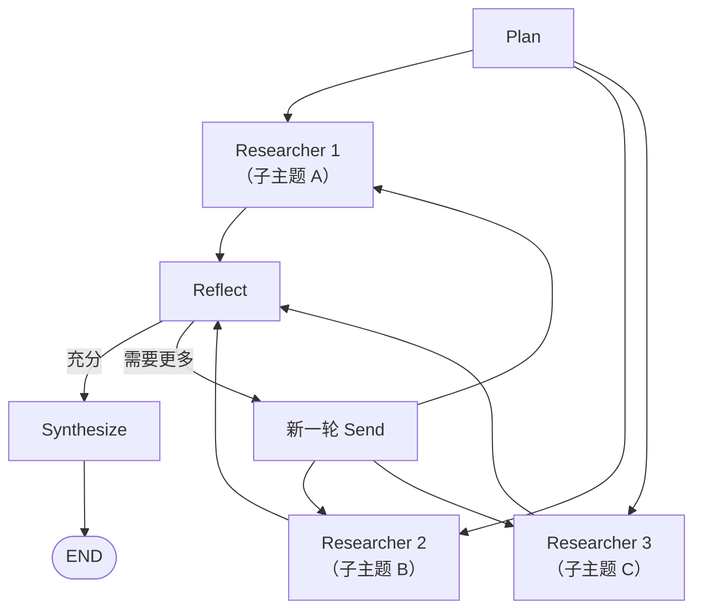

# Deep Research 模式

## 模式概述

Deep Research 是最复杂的 Agent 模式，模拟人类研究员的完整工作流程：**规划 → 并行调研 → 反思 → 补充调研 → 综合**。



## 核心组件

| 组件 | 职责 | 使用模型 |
|------|------|----------|
| **Planner** | 将复杂问题分解为 3-5 个子主题 | 强模型（gpt-4o） |
| **Researcher** | 并行研究各子主题，使用搜索工具 | 轻量模型（gpt-4o-mini） |
| **Reflector** | 评估研究充分性，生成补充问题 | 中等模型 |
| **Synthesizer** | 合并所有发现，生成最终报告 | 最强模型 |

## LangGraph 完整实现

```python
from typing import TypedDict, Annotated
import operator
from pydantic import BaseModel, Field
from langgraph.graph import StateGraph, START, END
from langgraph.types import Send
from langgraph.checkpoint.memory import MemorySaver
from langchain_openai import ChatOpenAI
from langchain.agents import create_agent

# ── 数据模型 ──
class SubTopic(BaseModel):
    """研究子主题"""
    title: str = Field(description="子主题标题")
    query: str = Field(description="搜索查询")
    rationale: str = Field(description="为什么研究这个子主题")

class Finding(BaseModel):
    """单条研究发现"""
    subtopic: str
    content: str
    sources: list[str] = Field(default_factory=list)

class ResearchState(TypedDict):
    # 输入
    question: str
    # 规划结果
    subtopics: list[dict]         # SubTopic 列表
    iteration: int                 # 当前迭代轮次
    # 研究发现（累加合并并行结果）
    findings: Annotated[list[dict], operator.add]
    # 反思
    is_sufficient: bool
    followup_subtopics: list[dict]
    # 最终输出
    final_report: str

# ── 模型配置 ──
planner_llm = ChatOpenAI(model="gpt-4o")
researcher_llm = ChatOpenAI(model="gpt-4o-mini")
reflector_llm = ChatOpenAI(model="gpt-4o")
synthesizer_llm = ChatOpenAI(model="gpt-4o")

# ── Researcher Agent ──
@tool
def web_search(query: str) -> str:
    """Search the web for information."""
    # 实际对接搜索 API
    return f"Search results for: {query}"

researcher_agent = create_agent(
    model=researcher_llm,
    tools=[web_search],
    system_prompt="""你是一个研究助手。深入研究给定的子主题，收集关键信息。

要求：
1. 使用不同的搜索词多角度检索
2. 记录每条信息的来源
3. 输出结构化的研究发现，包含 facts（事实）、data（数据）、insights（洞察）

输出格式：
## 研究发现：{subtopic}
### 关键事实
- ...
### 数据支撑
- ...
### 洞察
- ...
### 来源
- ..."""
)

# ── 节点实现 ──
def plan(state: ResearchState) -> dict:
    """第一步：分解研究问题"""

    prompt = f"""将以下研究问题分解为 3-5 个具体的子主题。

研究问题：{state['question']}

要求：
- 每个子主题应独立可研究
- 子主题之间应有互补关系（不同维度）
- 为每个子主题提供最优的搜索查询

返回 JSON 格式：{{"subtopics": [{{"title": "...", "query": "...", "rationale": "..."}}]}}"""

    response = planner_llm.invoke(prompt)

    import json
    try:
        data = json.loads(response.content)
        subtopics = data.get("subtopics", [])
    except:
        # Fallback: simple split
        subtopics = [{"title": f"维度 {i+1}", "query": state["question"]}
                      for i in range(3)]

    return {"subtopics": subtopics, "iteration": 0, "findings": []}

def dispatch_researchers(state: ResearchState) -> list[Send]:
    """第二步：为每个子主题并行启动一个 Researcher"""
    subtopics = state.get("subtopics", [])

    return [
        Send(
            "research",
            {
                "subtopic": st,
                "iteration": state.get("iteration", 0)
            }
        )
        for st in subtopics
    ]

def research(state: dict) -> dict:
    """第三步：单个研究员执行（会被并行调用 N 次）"""
    subtopic = state["subtopic"]

    result = researcher_agent.invoke({
        "messages": [{
            "role": "user",
            "content": f"研究以下子主题：\n标题：{subtopic['title']}\n查询：{subtopic['query']}\n原因：{subtopic.get('rationale', 'N/A')}"
        }]
    })

    finding = {
        "subtopic": subtopic["title"],
        "content": result["messages"][-1].content,
        "sources": []  # 实际可从工具调用中提取
    }

    return {"findings": [finding]}

def reflect(state: ResearchState) -> dict:
    """第四步：反思研究发现是否充分"""

    findings_text = "\n\n".join([
        f"### {f['subtopic']}\n{f['content'][:500]}"
        for f in state.get("findings", [])
    ])

    prompt = f"""评估以下研究是否足以回答原始问题。

原始问题：{state['question']}
当前迭代：{state.get('iteration', 0) + 1}

研究发现：
{findings_text}

评估标准：
1. 是否涵盖了问题的所有关键维度？
2. 每个维度的信息是否足够深入？
3. 是否有冲突或矛盾的信息需要进一步验证？

如果研究已充分（score >= 8/10），返回 {{"sufficient": true}}。
如果不够，返回 {{"sufficient": false, "gaps": ["需要补充的方向1", "方向2"...]}}"""

    response = reflector_llm.invoke(prompt)

    import json
    try:
        result = json.loads(response.content)
    except:
        result = {"sufficient": True}

    is_sufficient = result.get("sufficient", True)
    gaps = result.get("gaps", [])

    followup_subtopics = [
        {"title": f"补充: {gap}", "query": gap}
        for gap in gaps
    ] if not is_sufficient else []

    # 最多 3 轮反思
    if state.get("iteration", 0) >= 2:
        is_sufficient = True

    return {
        "is_sufficient": is_sufficient,
        "followup_subtopics": followup_subtopics,
        "iteration": state.get("iteration", 0) + 1
    }

def should_continue(state: ResearchState) -> str:
    """判断是否需要补充研究"""
    if state.get("is_sufficient", False):
        return "synthesize"
    # 替换为新子主题
    new_topics = state.get("followup_subtopics", [])
    if new_topics:
        # 更新 subtopics 为补充方向
        return "continue"
    return "synthesize"

def prepare_for_retry(state: ResearchState) -> dict:
    """准备下一轮研究"""
    return {"subtopics": state.get("followup_subtopics", state["subtopics"])}

def synthesize(state: ResearchState) -> dict:
    """最后一步：综合所有发现生成最终报告"""

    findings_text = "\n\n".join([
        f"## {f['subtopic']}\n{f['content']}"
        for f in state.get("findings", [])
    ])

    prompt = f"""基于以下研究发现，生成一份综合研究报告。

原始问题：{state['question']}
研究轮次：{state.get('iteration', 0)}

{findings_text}

请生成一份结构化的研究报告，包含：
1. 执行摘要
2. 分维度的关键发现
3. 综合分析
4. 结论与建议
5. 信息来源说明"""

    report = synthesizer_llm.invoke(prompt).content
    return {"final_report": report}

# ── 构建 Deep Research Graph ──
builder = StateGraph(ResearchState)

builder.add_node("plan", plan)
builder.add_node("research", research)
builder.add_node("reflect", reflect)
builder.add_node("prepare_retry", prepare_for_retry)
builder.add_node("synthesize", synthesize)

builder.add_edge(START, "plan")
builder.add_conditional_edges("plan", dispatch_researchers, ["research"])
builder.add_edge("research", "reflect")
builder.add_conditional_edges("reflect", should_continue, {
    "synthesize": "synthesize",
    "continue": "prepare_retry",
})
builder.add_conditional_edges("prepare_retry", dispatch_researchers, ["research"])
builder.add_edge("synthesize", END)

deep_research = builder.compile(checkpointer=MemorySaver())
```

## 数据流图

```mermaid
flowchart TD
    INVOKE['invoke({"question": "..."})'] --> PLAN["[plan]\n→ subtopics = [A, B, C]"]
    PLAN -->|"Send"| RA["Send\nresearch A"]
    PLAN -->|"Send"| RB["Send\nresearch B"]
    PLAN -->|"Send"| RC["Send\nresearch C"]
    RA --> WAIT(["等待所有完成\noperator.add 合并 findings"])
    RB --> WAIT
    RC --> WAIT
    WAIT --> REFLECT["[reflect]"]
    REFLECT -->|"sufficient"| SYNTH["[synthesize]"]
    REFLECT -->|"insufficient"| SEND2["Send\nresearch new_topics"]
    SEND2 --> REFLECT
```

## 关键技巧

### Send API 动态并行

```python
# Send 的第二个参数会被合并到 State 中
# 多个 Send 的结果通过 operator.add reducer 合并
Send("research", {"subtopic": sub_a})  ─┐
Send("research", {"subtopic": sub_b})  ─┤  同时开始
Send("research", {"subtopic": sub_c})  ─┘  并行完成
```

### 迭代深度控制

```python
# 限制反思轮次防止无限循环
MAX_ITERATIONS = 3

def reflect(state):
    if state["iteration"] >= MAX_ITERATIONS:
        return {"is_sufficient": True}
    # ... 正常反思逻辑
```

## 成本估算

以研究"AI 对软件工程的影响"为例：

| 步骤 | 模型 | Token 估算 |
|------|------|-----------|
| Plan | gpt-4o | ~500 tokens |
| Research × 4 | gpt-4o-mini × 4 | ~2000 tokens × 4 |
| Reflect | gpt-4o | ~1000 tokens |
| Synthesize | gpt-4o | ~2000 tokens |
| **总计（1 轮）** | | **~11,500 tokens** |
| **总计（2 轮）** | | **~20,000 tokens** |

## 实践练习

1. 用 Deep Research 研究一个你感兴趣的复杂技术问题
2. 调整并行 Researcher 数量（3 vs 5 vs 7），观察报告质量和成本
3. 在反思阶段加入"发现矛盾时启动独立验证研究"
