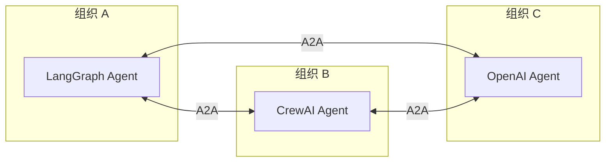
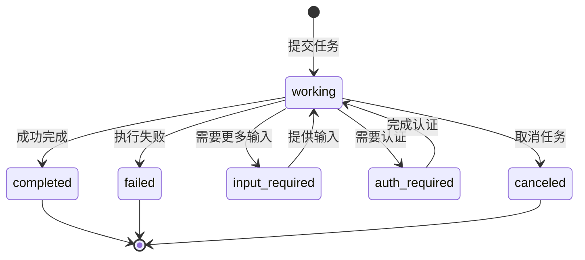

# A2A 协议与跨框架协作

## 什么是 A2A

**A2A（Agent-to-Agent Protocol）**是 Google 于 2025 年 4 月推出的开放标准，2026 年 3 月发布 v1.0，由 Linux Foundation 治理。它解决了一个核心问题：**不同框架构建的 Agent 之间如何互相发现、通信和协作**。

如果说 MCP 是 Agent 的"手"（使用工具），A2A 就是 Agent 之间的"握手"（互相协作）。



## A2A 核心概念

### 三大组件

| 组件 | 说明 | 类比 |
|------|------|------|
| **Agent Card** | Agent 的名片，声明能力、端点、认证方式 | OpenAPI Spec |
| **Task** | 一次协作的工作单元，有生命周期状态 | HTTP Request + State Machine |
| **Message Parts** | 类型化消息体（文本/文件/结构化数据） | Multipart MIME |

### Agent Card

每个 A2A Agent 通过 `/.well-known/agent.json` 暴露自己的能力描述：

```json
{
  "name": "Financial Research Agent",
  "description": "提供金融数据分析和研究报告生成服务",
  "url": "https://agents.example.com/financial-research",
  "version": "1.0.0",
  "capabilities": {
    "streaming": true,
    "pushNotifications": true
  },
  "skills": [
    {
      "id": "stock-analysis",
      "name": "股票分析",
      "description": "分析上市公司财务数据，生成研究报告",
      "tags": ["finance", "equity", "research"],
      "examples": [
        "分析苹果公司 2026 Q2 财报",
        "对比特斯拉和比亚迪的毛利率趋势"
      ]
    },
    {
      "id": "market-overview",
      "name": "市场概览",
      "description": "生成指定行业或市场的整体分析",
      "tags": ["finance", "macro", "overview"],
      "examples": [
        "2026 年上半年新能源汽车市场分析"
      ]
    }
  ],
  "defaultInputModes": ["text"],
  "defaultOutputModes": ["text", "file"],
  "authentication": {
    "type": "oauth2",
    "authority": "https://auth.example.com"
  }
}
```

### Task 生命周期



## A2A vs MCP

| 维度 | A2A | MCP |
|------|-----|-----|
| **连接对象** | Agent ↔ Agent | Agent ↔ 工具/数据 |
| **方向** | 横向（对等协作） | 纵向（Agent 使用工具） |
| **通信模式** | 任务驱动（Task） | 请求/响应 |
| **发现机制** | Agent Card | 工具列表 |
| **创建方** | Google | Anthropic |
| **治理** | Linux Foundation | Agentic AI Foundation (LF) |
| **典型场景** | "帮我把这个任务转给专家 Agent" | "帮我在数据库中搜索这个信息" |

**两者互补，非替代关系。** 在企业部署中，MCP 让 Agent 具备工具能力，A2A 让 Agent 之间协作。

## LangGraph + A2A 集成

### 作为 A2A Client（调用远程 Agent）

```python
import httpx
import json
from typing import TypedDict
from langgraph.graph import StateGraph, START, END

class A2AClientState(TypedDict):
    user_query: str
    remote_agent_url: str
    remote_task_id: str
    remote_result: str
    final_answer: str

def discover_agent(url: str) -> dict:
    """发现远程 Agent 的能力"""
    agent_card_url = f"{url}/.well-known/agent.json"
    response = httpx.get(agent_card_url)
    response.raise_for_status()
    return response.json()

def send_task_to_remote(state: A2AClientState) -> dict:
    """向远程 A2A Agent 发送任务"""
    task_payload = {
        "jsonrpc": "2.0",
        "method": "tasks/send",
        "params": {
            "message": {
                "role": "user",
                "parts": [{"type": "text", "text": state["user_query"]}]
            }
        },
        "id": "1"
    }

    response = httpx.post(
        state["remote_agent_url"],
        json=task_payload,
        headers={"Content-Type": "application/json"}
    )

    result = response.json()
    task_id = result.get("result", {}).get("id")

    return {"remote_task_id": task_id}

def poll_task_result(state: A2AClientState) -> dict:
    """轮询远程任务结果"""
    import time

    max_attempts = 30
    for i in range(max_attempts):
        response = httpx.post(
            state["remote_agent_url"],
            json={
                "jsonrpc": "2.0",
                "method": "tasks/get",
                "params": {"id": state["remote_task_id"]},
                "id": "2"
            }
        )

        task = response.json().get("result", {})
        status = task.get("status", {}).get("state")

        if status == "completed":
            # 提取结果
            artifacts = task.get("artifacts", [])
            result_text = ""
            for artifact in artifacts:
                for part in artifact.get("parts", []):
                    if part["type"] == "text":
                        result_text += part["text"]
            return {"remote_result": result_text}

        elif status == "failed":
            error = task.get("status", {}).get("message", {}).get("message", "未知错误")
            return {"remote_result": f"远程 Agent 执行失败: {error}"}

        time.sleep(1)

    return {"remote_result": "远程 Agent 执行超时"}

def synthesize_answer(state: A2AClientState) -> dict:
    """综合远程结果生成最终回答"""
    llm = ChatOpenAI(model="gpt-4o-mini")
    prompt = f"""基于远程 Agent 的分析结果，生成最终回答：

用户问题：{state['user_query']}

远程分析结果：
{state['remote_result']}"""

    return {"final_answer": llm.invoke(prompt).content}

# 构建 A2A Client Graph
builder = StateGraph(A2AClientState)
builder.add_node("send_task", send_task_to_remote)
builder.add_node("poll_result", poll_task_result)
builder.add_node("synthesize", synthesize_answer)

builder.add_edge(START, "send_task")
builder.add_edge("send_task", "poll_result")
builder.add_edge("poll_result", "synthesize")
builder.add_edge("synthesize", END)

a2a_client = builder.compile()
```

### 作为 A2A Server（暴露 Agent 能力）

```python
# a2a_server.py
from flask import Flask, request, jsonify
import uuid
import threading
import time

app = Flask(__name__)

# Agent Card 端点
@app.route("/.well-known/agent.json")
def agent_card():
    return jsonify({
        "name": "Financial Research Agent",
        "description": "金融数据分析和研究报告生成",
        "url": "https://agents.example.com/financial-research",
        "version": "1.0.0",
        "capabilities": {"streaming": False, "pushNotifications": False},
        "skills": [
            {"id": "stock-analysis", "name": "股票分析",
             "description": "分析上市公司财务数据"},
            {"id": "market-overview", "name": "市场概览",
             "description": "行业/市场整体分析"},
        ],
        "defaultInputModes": ["text"],
        "defaultOutputModes": ["text"],
    })

# Task 执行端点
tasks_store = {}

@app.route("/", methods=["POST"])
def handle_request():
    """处理 A2A JSON-RPC 请求"""
    body = request.get_json()
    method = body.get("method")

    if method == "tasks/send":
        # 创建任务
        task_id = str(uuid.uuid4())
        message = body["params"]["message"]
        user_text = ""
        for part in message.get("parts", []):
            if part["type"] == "text":
                user_text += part["text"]

        # 异步执行 Agent
        tasks_store[task_id] = {
            "id": task_id,
            "status": {"state": "working"},
            "artifacts": [],
        }
        threading.Thread(target=execute_agent_task, args=(task_id, user_text)).start()

        return jsonify({"result": tasks_store[task_id]})

    elif method == "tasks/get":
        task_id = body["params"]["id"]
        task = tasks_store.get(task_id, {"status": {"state": "not_found"}})
        return jsonify({"result": task})

    return jsonify({"error": "unknown method"}), 400

def execute_agent_task(task_id: str, user_text: str):
    """实际执行 Agent 逻辑"""
    try:
        # 调用你的 LangGraph / LangChain Agent
        result = financial_agent.invoke({
            "messages": [{"role": "user", "content": user_text}]
        })
        answer = result["messages"][-1].content

        tasks_store[task_id] = {
            "id": task_id,
            "status": {"state": "completed"},
            "artifacts": [{
                "parts": [{"type": "text", "text": answer}]
            }],
        }
    except Exception as e:
        tasks_store[task_id] = {
            "id": task_id,
            "status": {
                "state": "failed",
                "message": {"message": str(e)}
            },
        }

if __name__ == "__main__":
    app.run(host="0.0.0.0", port=8080)
```

## 跨框架协作示例

### LangGraph Agent 调用 CrewAI Agent

```python
# ── CrewAI 侧：作为 A2A Server 运行 ──
# crewai_server.py
from crewai import Agent as CrewAgent, Task, Crew
from flask import Flask, jsonify, request

app = Flask(__name__)

def create_research_crew(topic: str):
    """创建研究 Crew"""
    researcher = CrewAgent(
        role="研究员",
        goal=f"深入研究{topic}",
        backstory="你是一个经验丰富的研究员",
    )
    writer = CrewAgent(
        role="报告撰写",
        goal="将研究发现整理为结构化报告",
        backstory="你是专业的技术报告撰写者",
    )
    research_task = Task(description=f"研究{topic}", agent=researcher)
    write_task = Task(description="将研究结果整理为报告", agent=writer)

    crew = Crew(agents=[researcher, writer], tasks=[research_task, write_task])
    return crew.kickoff()

@app.route("/", methods=["POST"])
def handle_a2a():
    body = request.get_json()
    if body["method"] == "tasks/send":
        task_id = str(uuid.uuid4())
        user_text = body["params"]["message"]["parts"][0]["text"]
        # 异步执行 CrewAI
        result = create_research_crew(user_text)
        return jsonify({"result": {
            "id": task_id,
            "status": {"state": "completed"},
            "artifacts": [{"parts": [{"type": "text", "text": result}]}]
        }})
    # ...

# ── LangGraph 侧：作为 A2A Client 调用 CrewAI ──
def call_crewai_via_a2a(state: dict) -> dict:
    """LangGraph Agent 通过 A2A 调用 CrewAI Agent"""
    crewai_url = "https://crewai-agents.example.com"

    response = httpx.post(crewai_url, json={
        "jsonrpc": "2.0",
        "method": "tasks/send",
        "params": {
            "message": {
                "role": "user",
                "parts": [{"type": "text", "text": state["research_topic"]}]
            }
        },
        "id": "1"
    })

    result = response.json()["result"]
    return {"crewai_research_result": result["artifacts"][0]["parts"][0]["text"]}
```

## A2A 2026 生态

### 采用数据

- **150+ 组织**正式支持
- **22,000+ GitHub Stars**
- 云平台原生集成：Azure AI Foundry、AWS Bedrock、Google Cloud
- 5 个官方 SDK：Python、JavaScript、Java、Go、.NET
- 生产部署行业：供应链、金融服务、保险、IT 运维

### 相关协议生态（A2Family）

| 协议 | 用途 | 状态 |
|------|------|------|
| **A2A** | Agent 间通信 | v1.0 生产就绪 |
| **AP2** | Agent 支付协议 | 60+ 组织支持 |
| **A2UI** | Agent → 用户界面 | 标准化中 |
| **UCP** | 通用商务协议（用户同意加密证明） | 发展中 |

## A2A vs 框架内置多 Agent

| 维度 | A2A 跨框架协作 | 框架内置多 Agent |
|------|----------------|-------------------|
| **跨框架** | ✅ 任何框架 | ❌ 仅限同一框架 |
| **跨组织** | ✅ 通过 Agent Card 发现 | ❌ 需要共享基础设施 |
| **延迟** | 网络调用（ms-s） | 进程内（μs-ms） |
| **状态共享** | 显式（通过 Task artifacts） | 隐式（共享 State） |
| **错误处理** | 标准 Task 生命周期 | 框架特定 |
| **适用场景** | 跨团队、跨公司协作 | 同一团队内的紧密编排 |

## 实践练习

1. 实现一个 A2A Agent Card 端点，暴露你的 Agent 能力
2. 通过 A2A 协议让一个 LangGraph Agent 调用远程的模拟 Agent
3. 设计一个场景，需要 LangGraph Agent + CrewAI Agent + OpenAI Agent 三方协作
