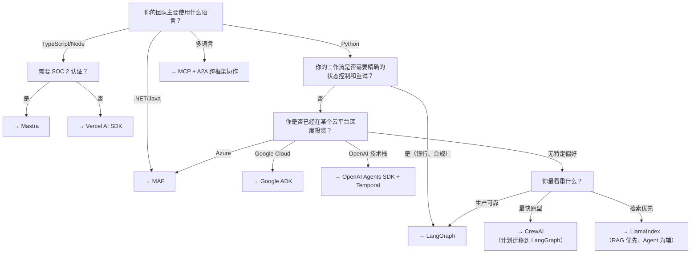

# 框架对比与选型

## 2026 年 Agent 框架格局

Agent 框架生态在 2026 年经历了显著整合。关键变化：

- **MCP 成为通用工具协议**（400M+ 月下载），所有主流框架支持
- **A2A v1.0 发布**，跨框架 Agent 通信成为可能
- **AutoGen 进入维护模式**，Microsoft 统一到 Microsoft Agent Framework (MAF)
- **OpenAI Swarm 被 Agents SDK 取代**，Assistants API 2026 年中退役
- **LangGraph 在企业采用率上超过 CrewAI**

> **核心结论：框架不再是锁定的风险（MCP + A2A 解决了互操作问题），但协调模型仍是关键设计决策。**

## 六大框架速览

### 1. LangGraph（LangChain）

| 维度 | 详情 |
|------|------|
| **心智模型** | 有向状态图：节点、边、条件分支、循环 |
| **核心优势** | 时间旅行调试（重放任意 Checkpoint）、持久化状态、Human-in-the-Loop |
| **适用场景** | 银行、合规、需要确定性控制和重试的长期工作流 |
| **语言** | Python（主）+ TypeScript |
| **学习曲线** | ⚠️ 较陡，代码量较大 |
| **GitHub Stars** | 最高（企业采用驱动） |

```python
# LangGraph 思维方式
builder = StateGraph(MyState)
builder.add_node("step1", node1)
builder.add_node("step2", node2)
builder.add_conditional_edges("step1", router, {"a": "step2", "b": END})
```

### 2. OpenAI Agents SDK

| 维度 | 详情 |
|------|------|
| **心智模型** | 轻量 Agent + Handoff 原语 |
| **核心优势** | OpenAI 新功能首发支持、内置 Tracing、无需外部工具 |
| **适用场景** | OpenAI 技术栈上紧密范围的助手、基于委托的工作流 |
| **语言** | Python + TypeScript |
| **注意** | OpenAI 优先设计；多供应商需适配器；需搭配 Temporal/DBOS 实现持久化执行 |

```python
# OpenAI Agents SDK 思维方式
agent = Agent(name="Support", instructions="...", tools=[...], handoffs=[billing_agent])
result = await Runner.run(agent, "I need help")
```

### 3. Google ADK（Agent Development Kit）

| 维度 | 详情 |
|------|------|
| **心智模型** | 生产级 Agent 工具包，原生 Vertex AI 集成 |
| **核心优势** | GCP 全栈部署（`adk web`/`adk run`/`adk api_server`）、Memory Bank |
| **适用场景** | Google Cloud 优先团队、Vertex AI Agent Builder |
| **⚠️ 关键警告** | 会话隔离缺陷：内存会话在 Cloud Run 重启时丢失，必须显式配置外部持久化存储 |
| **语言** | Python |

### 4. Microsoft Agent Framework (MAF)

| 维度 | 详情 |
|------|------|
| **心智模型** | 统一 AutoGen + Semantic Kernel 的框架 |
| **核心优势** | gRPC 分布式运行时、Magentic-One 通用 Agent、Cosmos DB Checkpoint |
| **适用场景** | Azure 优先、.NET/Java 企业 |
| **⚠️ 注意** | AutoGen 仅维护模式，新项目直接使用 MAF |
| **语言** | Python + .NET + Java |

### 5. CrewAI

| 维度 | 详情 |
|------|------|
| **心智模型** | 基于角色的 Crew：Agent 有 role/goal/backstory |
| **核心优势** | 最快到工作原型的路径（~20 行代码） |
| **适用场景** | 营销内容流水线、研究流水线、快速原型 |
| **⚠️ 注意** | 简单工作流上的 Token 开销约 3 倍于 LangGraph；角色模型可隐藏复杂性 |
| **常见模式** | CrewAI 原型 → LangGraph 生产迁移 |

### 6. Mastra

| 维度 | 详情 |
|------|------|
| **心智模型** | 电池全包含的 TS 框架：工作流、RAG、评估、记忆、OTel 追踪 |
| **核心优势** | **唯一** SOC 2 Type II 认证的框架、3,300+ 模型（94 供应商） |
| **适用场景** | TypeScript 优先团队 |
| **GitHub Stars** | 22k+，300k+ npm 周下载 |

## 六维对比矩阵

| 维度 | LangGraph | OpenAI SDK | Google ADK | MAF | CrewAI | Mastra |
|------|-----------|------------|------------|-----|--------|--------|
| **控制粒度** | ⭐⭐⭐⭐⭐ | ⭐⭐⭐ | ⭐⭐⭐ | ⭐⭐⭐⭐ | ⭐⭐ | ⭐⭐⭐ |
| **快速原型** | ⭐⭐ | ⭐⭐⭐⭐ | ⭐⭐⭐ | ⭐⭐⭐ | ⭐⭐⭐⭐⭐ | ⭐⭐⭐⭐ |
| **持久化执行** | ⭐⭐⭐⭐⭐ | ⭐⭐ | ⭐⭐⭐ | ⭐⭐⭐ | ⭐⭐ | ⭐⭐⭐ |
| **Human-in-the-Loop** | ⭐⭐⭐⭐⭐ | ⭐⭐⭐ | ⭐⭐⭐ | ⭐⭐⭐ | ⭐⭐ | ⭐⭐⭐ |
| **可观测性** | ⭐⭐⭐⭐⭐ | ⭐⭐⭐⭐ | ⭐⭐⭐ | ⭐⭐⭐ | ⭐⭐⭐ | ⭐⭐⭐⭐ |
| **多供应商 LLM** | ⭐⭐⭐⭐⭐ | ⭐⭐⭐ | ⭐⭐⭐⭐ | ⭐⭐⭐⭐ | ⭐⭐⭐⭐⭐ | ⭐⭐⭐⭐⭐ |
| **MCP 支持** | ✅ | ✅ | ✅ | ✅ | ✅ | ✅ |
| **A2A 支持** | ✅ | ✅ | ✅ | ✅ | ✅ | ✅ |
| **企业合规** | LangSmith ABAC | 沙箱 | GCP IAM | Azure Entra | 有限 | SOC 2 Type II |

## 决策树



## 选型检查清单（6 步淘汰法）

| # | 检查项 | 淘汰 |
|---|--------|------|
| 1 | **团队主力语言** | Python → LangGraph/CrewAI/OpenAI/ADK；TS → Mastra/Vercel；.NET → MAF |
| 2 | **团队能调试的控制粒度** | 高控制 → LangGraph/MAF；低控制（快）→ CrewAI/LangChain |
| 3 | **工作流是否超过单个进程生命周期** | 超过 → LangGraph + PostgresSaver 或 OpenAI SDK + Temporal |
| 4 | **统计参与协作的角色数量** | 单 Agent → 跳过多 Agent 编排；角色委派 → CrewAI；图状态共享 → LangGraph |
| 5 | **检索是否是主导关注点** | 是 → LlamaIndex 为主，Agent 框架为辅 |
| 6 | **能否在编码前画出步骤** | 能 → 可能只做 API 调用就够了；不能 → 确实需要 Agent 框架 |

## 常见生产故障模式

| 故障 | 表现 | 预防 |
|------|------|------|
| **按原型速度选框架** | CrewAI 48 小时 Demo → 数月定制才能生产 | 从 Day 1 考虑生产需求 |
| **跳过上下文架构审查** | Agent 部署后发现无法跨 Crew 共享定义 | 先设计上下文层，后选框架 |
| **框架层治理** | 框架层护栏在生产中失效 | 治理放在上下文/数据层（MCP 暴露治理上下文） |
| **将 Checkpoint 当作持久化** | 进程结束后状态丢失 | 底层搭配 Temporal/DBOS/Vercel Workflows |
| **评估太多框架** | 决策疲劳，无法深入评估 | 短名单最多 2-3 个框架 |

## 迁移路径

### AutoGen → MAF
```python
# AutoGen (已废弃)
from autogen import AssistantAgent
agent = AssistantAgent(name="helper", ...)

# MAF (新)
from microsoft.agent_framework import Agent
agent = Agent(name="helper", ...)
# 核心概念兼容，代码改动量小
```

### OpenAI Swarm → Agents SDK
```python
# Swarm (已废弃)
from swarm import Swarm, Agent
agent = Agent(name="Support", instructions="...", functions=[...])

# Agents SDK (新)
from agents import Agent
agent = Agent(name="Support", instructions="...", tools=[...])
# 心智模型相同：Agent + Handoff
```

### CrewAI 原型 → LangGraph 生产
```python
# 先在 CrewAI 快速验证概念
crew = Crew(agents=[researcher, writer], tasks=[...])
result = crew.kickoff()

# 确认可行后，迁移到 LangGraph 实现精细控制
builder = StateGraph(State)
builder.add_node("research", research_node)
builder.add_node("write", write_node)
# ...
```

## 推荐组合

| 你的画像 | 推荐框架 | 配套工具 |
|----------|----------|----------|
| 复杂有状态工作流、合规、HITL | **LangGraph** | LangSmith + PostgresSaver |
| OpenAI 纯栈，要最新功能 | **OpenAI Agents SDK** | Temporal/DBOS + OpenAI Tracing |
| Google Cloud 原生 | **Google ADK** | 显式配置外部存储 |
| Microsoft/Azure 企业 | **MAF** | Cosmos DB + Azure Monitor |
| TypeScript 优先 | **Mastra** | Mastra Model Router |
| 检索密集型 | **LlamaIndex** 为主 | LangGraph 作为 Agent 编排层 |
| 多框架混合 | **MCP + A2A** | 按团队选择各自框架 |

## 实践练习

1. 用决策树分析你当前/计划的项目，确定最适合的框架
2. 用至少 2 个框架实现同一个简单 Agent（如天气查询），对比代码量和开发体验
3. 设计一个 LangGraph Agent 通过 A2A 调用 OpenAI Agents SDK Agent 的场景
