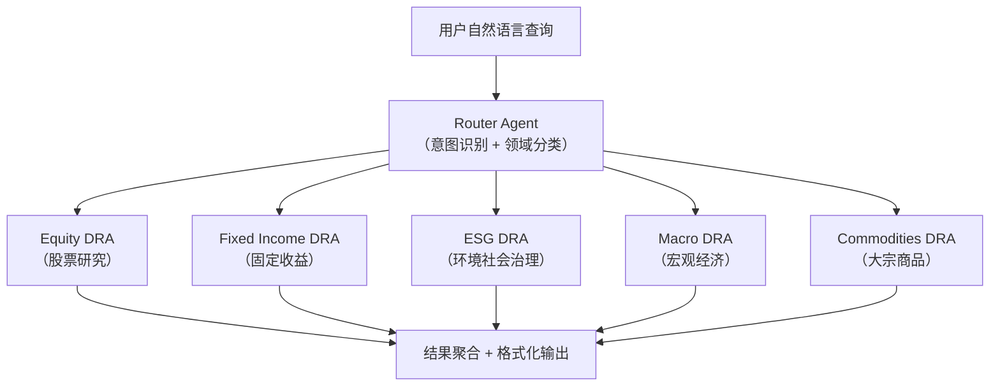

# 案例 1：Kensho 金融数据分析多 Agent 框架

## 背景

**公司**：Kensho（S&P Global 旗下 AI 研发中心）
**场景**：为 S&P Global 海量金融数据提供统一的自然语言查询入口
**技术栈**：LangGraph + 多 Agent + 自定义数据检索协议

## 业务挑战

S&P Global 拥有全球最大的金融数据集之一，涵盖股票研究、固定收益、ESG（环境/社会/治理）、宏观经济等数十个业务线。数据分散在不同业务单元中，格式各异，研究人员和客户需要学习不同工具来查询不同领域的数据。

**核心痛点**：
1. 数据碎片化：同一个问题需要查询 5+ 个不同系统
2. 格式不一致：各业务线的数据 Schema 不统一
3. 查询门槛高：需要了解每个数据集的特定查询语法

## 架构设计

### Router Graph：统一查询入口



### 核心概念：Data Retrieval Agent (DRA)

每个 DRA 是特定数据领域的专用 Agent，遵循统一的协议：

```python
# DRA 协议（Kensho 自定义）
class DRAResponse(BaseModel):
    """所有 DRA 必须返回的统一格式"""
    domain: str                    # 数据领域
    query_understanding: str       # Agent 对问题的理解
    data_result: dict              # 结构化查询结果
    confidence: float              # 置信度
    sources: list[str]             # 数据来源
    caveats: list[str]             # 使用注意事项
```

### LangGraph 实现模式

```python
from typing import TypedDict
from langgraph.graph import StateGraph, START, END
from langgraph.types import Command
from langchain.agents import create_agent

class FinancialQueryState(TypedDict):
    query: str
    domain: str
    dra_results: dict
    final_response: str

# Router Agent 负责意图分类和领域路由
router = create_agent(
    model=ChatOpenAI(model="gpt-4o"),
    tools=[],
    system_prompt="""分析用户查询，判断属于哪个金融数据领域。

领域列表：
- equity：股票、公司财务、估值
- fixed_income：债券、利率、信用
- esg：环境、社会责任、治理
- macro：GDP、通胀、就业
- commodities：能源、金属、农产品

如果查询涉及多个领域，标记为 multi_domain。
返回 JSON：{"domain": "...", "sub_query": "精简后的查询"}"""
)

# 各 DRA 作为独立 Agent
equity_dra = create_agent(
    model=ChatOpenAI(model="gpt-4o-mini"),
    tools=[equity_db_query],
    system_prompt="你是股票研究数据专家。查询公司财务、估值、市场数据。"
)

fixed_income_dra = create_agent(
    model=ChatOpenAI(model="gpt-4o-mini"),
    tools=[bond_db_query],
    system_prompt="你是固定收益数据专家。查询债券收益率、利差、信用评级数据。"
)

# 在 LangGraph 中编排
def route_to_dra(state: FinancialQueryState) -> str:
    domain = state.get("domain", "multi_domain")
    dra_map = {
        "equity": "equity_dra",
        "fixed_income": "fixed_income_dra",
        "esg": "esg_dra",
        "macro": "macro_dra",
        "commodities": "commodities_dra",
    }
    return dra_map.get(domain, "multi_domain_handler")

# ... Graph 构建与编译
```

## 关键工程实践

### 1. 统一数据协议

Kensho 制定了 DRA 协议（类似网络协议的分层思想），确保任何新增的数据领域 Agent 都能无缝接入 Router：

```python
class DRAProtocol:
    """数据检索 Agent 协议接口"""

    def understand_query(query: str) -> str:
        """返回对查询的理解（可评审）"""
        ...

    def fetch_data(params: dict) -> dict:
        """执行数据查询"""
        ...

    def format_response(raw_data: dict) -> DRAResponse:
        """格式化为统一响应"""
        ...

    def score_confidence(response: DRAResponse) -> float:
        """自评估置信度"""
        ...
```

### 2. 多阶段评估体系

Kensho 在开发中采用了三级评估：

| 层级 | 评估内容 | 频率 |
|------|----------|------|
| **单 DRA** | 查询理解准确率、数据召回率 | 每次部署 |
| **Router** | 领域分类准确率 | 每周 |
| **端到端** | 用户满意度、回答质量评分 | 每日 |

### 3. 持续协议优化

通过 LangSmith 追踪所有查询，分析失败模式，持续优化 DRA 协议和 Router 的分类 Prompt。

## 成果与数据

- **统一入口**：单个 NL 查询替代 5+ 个不同工具
- **产品化速度**：基于同一框架快速推出股票研究助手、ESG 合规助手等多个产品
- **可扩展性**：新增数据领域只需实现 DRA 协议接口，无需改动 Router

## 可复用的设计模式

1. **Router Graph + 统一协议**：适合多领域数据查询场景
2. **DRA 协议**：定义团队间接口标准，降低耦合
3. **多阶段评估**：组件级 + 端到端双轨评估，确保每个环节可控

## 实践练习

1. 为"电商数据分析"场景设计类似 Kensho 的 Router Graph（订单 DRA、商品 DRA、用户 DRA）
2. 定义你的 DRA 协议接口（包含哪些字段和方法）
3. 设计路由器的分类 Prompt，使其能准确区分你的 DRA 领域
