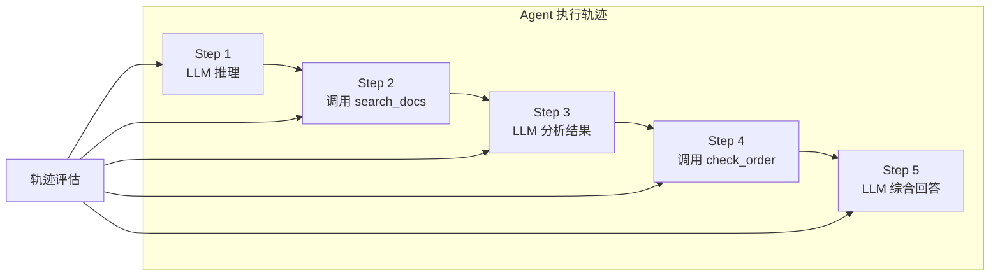
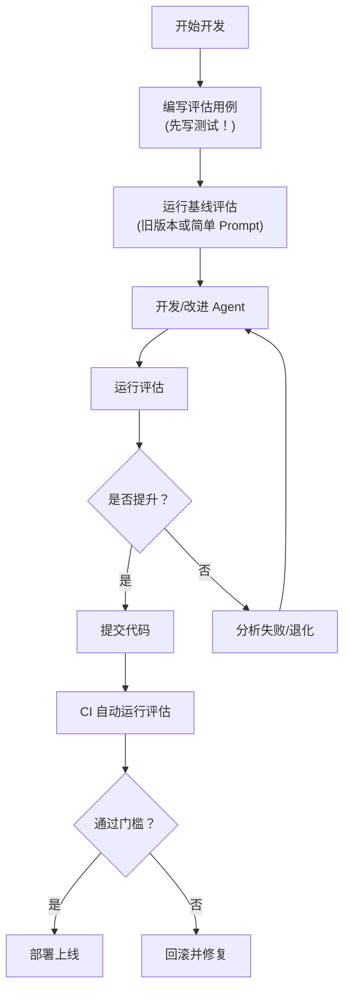

# 轨迹评估实战

## 什么是轨迹评估

Agent 的**轨迹（Trajectory）**是它从接收输入到产生输出的完整执行路径：每一步推理、每一次工具调用、每一轮循环决策。轨迹评估不只看最终答案，更关注 Agent **如何**得到答案。



## LangSmith 轨迹评估

### 配置

```python
import os
os.environ["LANGCHAIN_TRACING_V2"] = "true"
os.environ["LANGCHAIN_API_KEY"] = "ls_..."
os.environ["LANGCHAIN_PROJECT"] = "agent-eval"
```

### 基础：断言式评估

```python
from langsmith.evaluation import evaluate
from langsmith.schemas import Run, Example

def exact_match(outputs: dict, reference_outputs: dict) -> dict:
    """检查输出是否包含预期关键词"""
    answer = str(outputs.get("output", "")).lower()
    expected = str(reference_outputs.get("expected_keywords", "")).lower()
    matches = all(kw.lower() in answer for kw in expected.split(","))
    return {"key": "keyword_match", "score": 1.0 if matches else 0.0}

def length_check(outputs: dict, reference_outputs: dict) -> dict:
    """检查输出长度是否合理"""
    answer = str(outputs.get("output", ""))
    min_len = reference_outputs.get("min_length", 20)
    max_len = reference_outputs.get("max_length", 4000)
    is_ok = min_len <= len(answer) <= max_len
    return {"key": "length_ok", "score": 1.0 if is_ok else 0.0}

# 运行评估
results = evaluate(
    lambda x: {"output": agent.invoke({"messages": [{"role": "user", "content": x["question"]}]})["messages"][-1].content},
    data="customer_support_eval",
    evaluators=[exact_match, length_check],
    experiment_prefix="v2.0-baseline",
)
```

### 高级：LLM 评判式评估

```python
from langchain_openai import ChatOpenAI

judge = ChatOpenAI(model="gpt-4o")

def trajectory_quality(outputs: dict, reference_outputs: dict) -> dict:
    """评估 Agent 执行轨迹质量"""
    # 从 LangSmith Run 中获取完整轨迹
    # (在 evaluate 的 predict 函数中返回 run_id 以关联)
    prompt = f"""评估以下 Agent 执行轨迹的质量。

参考期望轨迹：{reference_outputs.get('expected_trajectory', 'N/A')}

实际轨迹：
{outputs.get('trajectory_summary', 'N/A')}

最终输出：
{outputs['output']}

评分维度（每项 0-10）：
1. 工具选择是否最优
2. 执行步骤数是否合理（不冗余、不遗漏）
3. 是否检查了工具调用的返回结果
4. 推理路径是否可解释

返回 JSON：{{"score": <0-10>, "issues": ["问题1", ...], "highlights": ["亮点1", ...]}}"""

    response = judge.invoke(prompt)
    import json
    result = json.loads(response.content)
    return {
        "key": "trajectory_quality",
        "score": result.get("score", 0) / 10,
        "comment": f"Issues: {result.get('issues', [])}; Highlights: {result.get('highlights', [])}"
    }

def tool_call_accuracy(outputs: dict, reference_outputs: dict) -> dict:
    """评估工具调用准确性"""
    expected_tools = set(reference_outputs.get("expected_tools", []))
    actual_tools = set(outputs.get("tools_called", []))

    # 不应该调用的工具
    forbidden_tools = set(reference_outputs.get("forbidden_tools", []))

    # 评分逻辑
    if forbidden_tools & actual_tools:
        return {"key": "tool_accuracy", "score": 0.0,
                "comment": f"调用了禁止的工具: {forbidden_tools & actual_tools}"}

    if not expected_tools:
        return {"key": "tool_accuracy", "score": 1.0}

    overlap = len(expected_tools & actual_tools) / len(expected_tools)
    extra = len(actual_tools - expected_tools)

    score = max(0, overlap - extra * 0.2)  # 调用额外工具轻微扣分
    return {"key": "tool_accuracy", "score": score}
```

### 完整评估 Pipeline

```python
from typing import TypedDict
from langsmith.evaluation import evaluate
from langsmith import Client
import json

client = Client()

class EvalResult(TypedDict):
    keyword_match: float
    tool_accuracy: float
    trajectory_quality: float
    safety_check: float
    overall: float

def run_full_evaluation(agent, dataset_name: str, experiment_name: str) -> dict:
    """运行完整评估 Pipeline"""

    def predict(example: dict) -> dict:
        """执行 Agent 并返回输出 + 元数据"""
        import time
        start = time.time()

        result = agent.invoke({
            "messages": [{"role": "user", "content": example["question"]}]
        })

        messages = result["messages"]
        last_msg = messages[-1].content

        # 提取工具调用信息
        tools_called = []
        for msg in messages:
            if hasattr(msg, "tool_calls"):
                for tc in msg.tool_calls:
                    tools_called.append(tc.get("name", "unknown"))

        return {
            "output": last_msg,
            "tools_called": tools_called,
            "message_count": len(messages),
            "latency_ms": (time.time() - start) * 1000,
        }

    # 多维度评估器
    evaluators = [
        exact_match,
        tool_call_accuracy,
        trajectory_quality,
        safety_evaluator,
    ]

    results = evaluate(
        predict,
        data=dataset_name,
        evaluators=evaluators,
        experiment_prefix=experiment_name,
    )

    # 汇总结果
    summary = {}
    for r in results:
        for eval_result in r.get("evaluation_results", []):
            key = eval_result.key
            if key not in summary:
                summary[key] = []
            summary[key].append(eval_result.score)

    # 计算平均分
    avg_scores = {k: sum(v)/len(v) for k, v in summary.items()}
    avg_scores["overall"] = sum(avg_scores.values()) / len(avg_scores)

    print(f"\n📊 评估结果汇总 ({experiment_name})")
    print(f"{'='*50}")
    for k, v in avg_scores.items():
        bar = "█" * int(v * 20)
        print(f"  {k:<20s}: {v:.2%} {bar}")
    print(f"{'='*50}")

    return avg_scores

# 对比两个实验
baseline = run_full_evaluation(agent_v1, "customer_support_eval", "v2.0-baseline")
improved = run_full_evaluation(agent_v2, "customer_support_eval", "v2.1-improved")

# 检查是否退化
for key in baseline:
    if improved.get(key, 0) < baseline[key]:
        print(f"⚠️ {key} 退化: {baseline[key]:.2%} → {improved[key]:.2%}")
```

## 轨迹对比分析

### 查找失败轨迹

```python
def analyze_failures(experiment_name: str) -> list[dict]:
    """分析评估中失败的案例"""
    client = Client()

    # 获取实验结果
    experiment = None
    for exp in client.list_experiments():
        if exp.name.startswith(experiment_name):
            experiment = exp
            break

    if not experiment:
        return []

    failures = []
    for result in client.list_experiment_results(experiment.id):
        # 筛选低分结果
        scores = {r.key: r.score for r in result.evaluation_results}
        if scores.get("overall", 1.0) < 0.6:
            failures.append({
                "question": result.example.inputs.get("question", ""),
                "answer": result.outputs.get("output", "")[:500],
                "scores": scores,
                "trace_url": result.run.url if result.run else "N/A",
            })

    # 按失败原因分组
    failure_categories = {}
    for f in failures:
        min_score_key = min(f["scores"], key=f["scores"].get)
        failure_categories.setdefault(min_score_key, []).append(f)

    print(f"共 {len(failures)} 个失败案例")
    for category, cases in failure_categories.items():
        print(f"\n## {category} 问题 ({len(cases)} 例)")
        for case in cases[:3]:
            print(f"  - Q: {case['question'][:80]}...")
            print(f"    Score: {case['scores']}")
            print(f"    Trace: {case['trace_url']}")

    return failures
```

### 轨迹可视化

```python
def visualize_trajectory(run_id: str):
    """可视化单个 Agent 执行轨迹"""
    from langsmith import Client
    client = Client()

    run = client.read_run(run_id)
    print(f"🔍 轨迹分析: {run.name}")
    print(f"{'='*60}")

    # 递归展示子 Run
    def print_tree(run, depth=0):
        indent = "  " * depth
        run_type = run.run_type

        if run_type == "llm":
            print(f"{indent}🤖 LLM 调用 ({run.total_tokens} tokens, {run.latency_ms}ms)")
        elif run_type == "tool":
            print(f"{indent}🔧 工具: {run.name}")
            if run.inputs:
                print(f"{indent}   输入: {str(run.inputs)[:100]}")
            if run.outputs:
                print(f"{indent}   输出: {str(run.outputs)[:100]}")
        else:
            print(f"{indent}📦 {run.name} ({run_type})")

        # 子 Run
        for child in client.list_runs(parent_run_id=run.id):
            print_tree(child, depth + 1)

    print_tree(run)
```

## 对比实验：A/B 测试 Agent

```python
def compare_agent_versions(
    agent_a, agent_b,
    dataset_name: str,
    n_samples: int = 20
) -> dict:
    """A/B 对比两个 Agent 版本"""
    client = Client()

    # 获取测试样例
    examples = list(client.list_examples(dataset_name=dataset_name))[:n_samples]

    results_a = []
    results_b = []

    for example in examples:
        question = example.inputs["question"]

        # Agent A
        output_a = agent_a.invoke({
            "messages": [{"role": "user", "content": question}]
        })["messages"][-1].content

        # Agent B
        output_b = agent_b.invoke({
            "messages": [{"role": "user", "content": question}]
        })["messages"][-1].content

        # 让评判模型做对偶比较
        judge = ChatOpenAI(model="gpt-4o")
        compare_prompt = f"""比较以下两个 Agent 对同一问题的回答。

问题：{question}

回答 A：{output_a}

回答 B：{output_b}

请选择更好的回答（A 或 B），并说明理由。
返回 JSON：{{"winner": "A"|"B"|"tie", "reason": "..."}}"""

        comparison = json.loads(judge.invoke(compare_prompt).content)
        results_a.append(comparison.get("winner") == "A")
        results_b.append(comparison.get("winner") == "B")

    win_rate_a = sum(results_a) / len(results_a)
    win_rate_b = sum(results_b) / len(results_b)

    print(f"🏆 A/B 对比结果 ({n_samples} 个样例)")
    print(f"  Agent A 胜率: {win_rate_a:.1%}")
    print(f"  Agent B 胜率: {win_rate_b:.1%}")
    print(f"  平局: {1 - win_rate_a - win_rate_b:.1%}")

    return {"agent_a_win_rate": win_rate_a, "agent_b_win_rate": win_rate_b}
```

## 评估驱动开发流程



## 实践练习

1. 为你的 Agent 设置 LangSmith 评估，至少包含 3 个评估器
2. 找到一次 Agent 失败的 Trace，分析失败的根本原因（工具选择？推理错误？信息不足？）
3. 对你的 Agent 做一次 A/B 测试：修改 System Prompt 后，用相同测试集对比新旧版本的胜率
