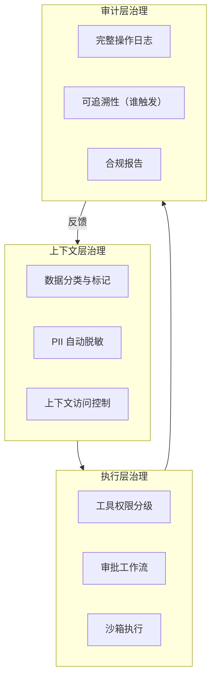
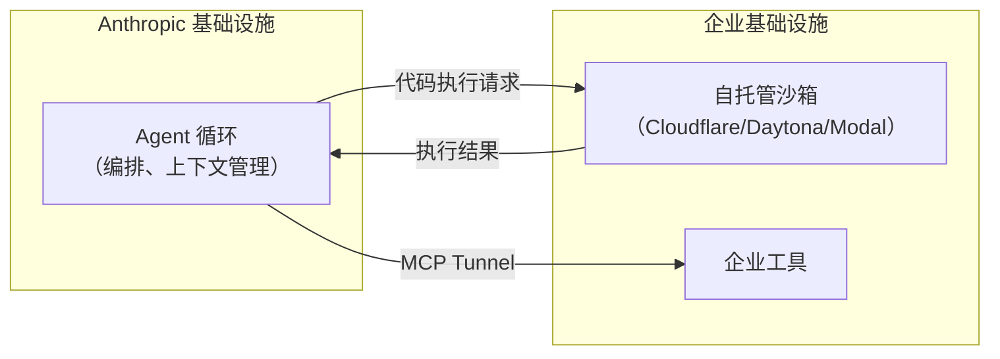

# 企业级治理与合规

## 为什么 Agent 治理需要新思路

传统软件治理依赖代码审查、权限控制、变更管理。Agent 系统引入了新的挑战：

- **非确定性行为**：同样的输入可能产生不同输出
- **自主工具调用**：Agent 自主决定调用哪些工具、传什么参数
- **LLM 作为攻击面**：提示注入、间接注入、越狱攻击
- **上下文污染**：敏感数据可能在 Agent 的推理链中被泄露

> **核心洞察（2026 行业共识）：框架层的治理是暂时的，上下文和数据层的治理是持久的。** 只有 28% 的组织能追溯到 Agent 操作的发起人。

## 治理架构



## 数据分类与保护

### 自动 PII 检测与脱敏

```python
import re
from typing import TypedDict

class PIIMatch(TypedDict):
    type: str
    value: str
    start: int
    end: int

PII_PATTERNS = {
    "email": r'\b[A-Za-z0-9._%+-]+@[A-Za-z0-9.-]+\.[A-Z|a-z]{2,}\b',
    "phone_cn": r'\b1[3-9]\d{9}\b',
    "id_card": r'\b\d{17}[\dXx]\b',
    "credit_card": r'\b\d{4}[- ]?\d{4}[- ]?\d{4}[- ]?\d{4}\b',
    "ip_address": r'\b\d{1,3}\.\d{1,3}\.\d{1,3}\.\d{1,3}\b',
}

class PIIGuard:
    """PII 检测与脱敏 Guard"""

    def detect(self, text: str) -> list[PIIMatch]:
        """检测文本中的 PII"""
        matches = []
        for pii_type, pattern in PII_PATTERNS.items():
            for match in re.finditer(pattern, text):
                matches.append({
                    "type": pii_type,
                    "value": match.group(),
                    "start": match.start(),
                    "end": match.end(),
                })
        return matches

    def mask(self, text: str) -> tuple[str, list[PIIMatch]]:
        """脱敏文本"""
        matches = self.detect(text)
        result = text
        for m in sorted(matches, key=lambda x: x["start"], reverse=True):
            masked_value = self._mask_value(m["type"], m["value"])
            result = result[:m["start"]] + masked_value + result[m["end"]:]

        return result, matches

    def _mask_value(self, pii_type: str, value: str) -> str:
        """按类型脱敏"""
        if pii_type == "email":
            parts = value.split("@")
            return f"{parts[0][:2]}***@{parts[1]}"
        elif pii_type in ("phone_cn", "credit_card"):
            return f"{value[:3]}****{value[-4:]}"
        elif pii_type == "id_card":
            return f"{value[:6]}********{value[-4:]}"
        return "***"

    def should_block(self, text: str) -> tuple[bool, str]:
        """判断是否应阻止传递包含敏感信息的文本"""
        matches = self.detect(text)
        critical_types = {"credit_card", "id_card"}

        critical_matches = [m for m in matches if m["type"] in critical_types]
        if critical_matches:
            return True, f"文本包含敏感信息: {[m['type'] for m in critical_matches]}"

        return False, ""

# 在 Agent 输入/输出中使用
pii_guard = PIIGuard()

def secure_agent_invoke(agent, user_input: str, user_id: str) -> dict:
    """安全的 Agent 调用（含 PII 保护）"""

    # 1. 输入阶段：检测并记录
    should_block, reason = pii_guard.should_block(user_input)
    if should_block:
        audit_log("pii_blocked", user_id, reason)
        return {"error": "输入包含敏感信息，已阻止处理", "blocked": True}

    # 2. 脱敏后输入 Agent
    safe_input, _ = pii_guard.mask(user_input)

    # 3. 执行 Agent
    result = agent.invoke({
        "messages": [{"role": "user", "content": safe_input}]
    })

    # 4. 输出阶段：二次检查
    output_text = result["messages"][-1].content
    output_has_pii, _ = pii_guard.should_block(output_text)
    if output_has_pii:
        output_text, _ = pii_guard.mask(output_text)
        audit_log("pii_masked_in_output", user_id, "输出包含PII，已脱敏")

    result["messages"][-1].content = output_text
    return result
```

## 访问控制

### ABAC（Attribute-Based Access Control）

```python
from dataclasses import dataclass
from typing import Optional
from datetime import datetime, timezone

@dataclass
class AccessContext:
    user_id: str
    user_role: str           # customer / support_staff / admin
    department: str          # engineering / sales / finance
    clearance_level: int     # 1-5
    location: str            # 国家/地区
    session_age_minutes: float
    mfa_verified: bool

class ABACEngine:
    """基于属性的访问控制引擎"""

    # 策略规则
    RULES = {
        "query_financial_data": {
            "required_clearance": 3,
            "allowed_roles": ["analyst", "admin", "finance_manager"],
            "allowed_locations": ["CN", "US", "SG"],
            "require_mfa": True,
        },
        "approve_refund": {
            "required_clearance": 3,
            "allowed_roles": ["support_lead", "admin"],
            "max_amount": 10000,
            "require_mfa": True,
        },
        "delete_record": {
            "required_clearance": 4,
            "allowed_roles": ["admin"],
            "max_session_age": 60,  # 分钟内
            "require_mfa": True,
        },
        "export_user_data": {
            "required_clearance": 4,
            "allowed_roles": ["admin", "data_officer"],
            "require_mfa": True,
            "require_legal_approval": True,
        },
    }

    def check_permission(self, context: AccessContext, action: str,
                         params: dict = None) -> tuple[bool, str]:
        """检查是否允许执行操作"""
        rules = self.RULES.get(action)
        if not rules:
            return False, f"未定义的操作: {action}"

        # 1. 角色检查
        if context.user_role not in rules.get("allowed_roles", []):
            return False, f"角色 {context.user_role} 不允许 {action}"

        # 2. 安全级别检查
        if context.clearance_level < rules.get("required_clearance", 0):
            return False, f"安全级别不足: 需要 {rules['required_clearance']}, 当前 {context.clearance_level}"

        # 3. MFA 检查
        if rules.get("require_mfa") and not context.mfa_verified:
            return False, f"{action} 需要 MFA 验证"

        # 4. 地理位置检查
        if "allowed_locations" in rules:
            if context.location not in rules["allowed_locations"]:
                return False, f"位置 {context.location} 不允许 {action}"

        # 5. 会话时长检查
        max_age = rules.get("max_session_age")
        if max_age and context.session_age_minutes > max_age:
            return False, f"会话超时，需要重新认证"

        # 6. 参数约束检查
        if action == "approve_refund" and params:
            amount = params.get("amount", 0)
            if amount > rules.get("max_amount", 0):
                return False, f"退款金额超过上限: {amount} > {rules['max_amount']}"

        # 7. 法律审批检查
        if rules.get("require_legal_approval"):
            if not params or not params.get("legal_approval_id"):
                return False, f"{action} 需要法务审批"

        return True, "OK"

# 与 Agent 集成
def create_governed_agent(user_context: AccessContext):
    """创建受治理的 Agent（工具权限动态限制）"""
    abac = ABACEngine()

    # 获取用户可用的所有工具
    all_tools = [query_db, approve_refund, delete_record, export_data]

    # 按用户权限过滤工具
    allowed_tools = []
    for tool in all_tools:
        can_use, reason = abac.check_permission(user_context, tool.name)
        if can_use:
            allowed_tools.append(tool)
        else:
            logger.info(f"用户 {user_context.user_id} 无权限使用 {tool.name}: {reason}")

    agent = create_agent(
        model=ChatOpenAI(model="gpt-4o"),
        tools=allowed_tools,
        system_prompt=f"""当前用户角色: {user_context.user_role}
安全级别: {user_context.clearance_level}
可用工具: {[t.name for t in allowed_tools]}
请仅使用可用工具，不要尝试未授权操作。"""
    )

    return agent
```

## 审计日志架构

```python
@dataclass
class AuditEntry:
    """标准审计日志条目"""
    timestamp: str
    event_type: str         # agent_invoke / tool_call / approval / data_access
    user_id: str
    user_role: str
    agent_id: str
    action: str
    action_params_summary: str  # 脱敏后的参数摘要
    result_summary: str         # 脱敏后的结果摘要
    status: str                 # success / denied / error
    trace_id: str              # LangSmith / OpenTelemetry Trace ID
    compliance_tags: list[str]  # gdpr / sox / pci / hipaa

class AuditLogger:
    """企业审计日志"""

    def __init__(self, storage_backend):
        self.storage = storage_backend  # 不可变存储（如 S3 + Glacier）

    def log(self, entry: AuditEntry):
        """写入审计日志"""
        self.storage.append(entry)

        # 高风险事件告警
        if entry.event_type in ("data_access", "tool_call") and \
           "pii" in entry.compliance_tags:
            self.alert_security_team(entry)

    def query(self, filters: dict, time_range: tuple) -> list[AuditEntry]:
        """查询审计日志（用于合规审查）"""
        return self.storage.query(filters, time_range)

    def generate_compliance_report(self, month: str, regulation: str) -> dict:
        """生成合规报告"""
        entries = self.query(
            {"compliance_tags": regulation},
            time_range=(f"{month}-01", f"{month}-31")
        )

        return {
            "regulation": regulation,
            "month": month,
            "total_events": len(entries),
            "by_event_type": self._group_by(entries, "event_type"),
            "denied_actions": [e for e in entries if e.status == "denied"],
            "data_accesses": [e for e in entries if e.event_type == "data_access"],
        }

    def alert_security_team(self, entry: AuditEntry):
        """安全告警"""
        # 集成企业告警系统（PagerDuty/Slack/飞书）
        pass

    def _group_by(self, entries, field):
        result = {}
        for e in entries:
            val = getattr(e, field, "unknown")
            result[val] = result.get(val, 0) + 1
        return result
```

## 合规框架对齐

### GDPR / 个人信息保护法

```python
class GDPRCompliance:
    """GDPR / 个人信息保护法合规工具"""

    @staticmethod
    def right_to_access(user_id: str) -> dict:
        """数据访问权：导出用户的所有数据"""
        return {
            "user_id": user_id,
            "conversations": get_user_conversations(user_id),
            "tool_calls": get_user_tool_calls(user_id),
            "personal_data_stored": get_user_stored_data(user_id),
        }

    @staticmethod
    def right_to_be_forgotten(user_id: str) -> dict:
        """被遗忘权：删除用户的所有数据"""
        deletions = {
            "conversations_deleted": delete_user_conversations(user_id),
            "tool_call_history_anonymized": anonymize_tool_calls(user_id),
            "personal_data_erased": erase_user_data(user_id),
            "embeddings_removed": remove_user_embeddings(user_id),
        }
        audit_logger.log(AuditEntry(
            timestamp=datetime.now(timezone.utc).isoformat(),
            event_type="gdpr_deletion",
            user_id=user_id,
            user_role="system",
            agent_id="compliance-bot",
            action="right_to_be_forgotten",
            action_params_summary=f"删除用户 {user_id} 的所有数据",
            result_summary=str(deletions),
            status="success",
            trace_id="",
            compliance_tags=["gdpr"],
        ))
        return deletions

    @staticmethod
    def data_residency_check(data_location: str, user_region: str) -> bool:
        """数据驻留检查"""
        # 中国用户数据必须存储在中国境内
        if user_region == "CN" and data_location != "CN":
            return False
        # EU 用户数据必须在 EU 或充分性认定国家
        if user_region in EU_COUNTRIES and data_location not in ADEQUATE_COUNTRIES:
            return False
        return True
```

## 沙箱执行

### LangSmith Sandboxes（2026 Private Preview）

```python
# LangSmith Sandbox: 安全隔离的代码执行环境
from langsmith.sandbox import Sandbox

sandbox = Sandbox(
    image="python:3.12",
    timeout_seconds=300,
    max_memory_mb=512,
    network="none",            # 无网络访问
    read_only_rootfs=True,     # 只读根文件系统
    allowed_paths=["/workspace/output"],  # 唯一可写路径
)

def execute_code_safely(code: str) -> str:
    """在沙箱中安全执行代码"""
    result = sandbox.run(code)
    return result.stdout or result.stderr
```

### 企业自托管沙箱（Anthropic Managed Agents, 2026 Public Beta）



## 治理成熟度模型

| 级别 | 能力 | 特征 |
|------|------|------|
| **L1: 基础** | 工具权限分级 | 只读/写/破坏性分级 |
| **L2: 可追溯** | 审计日志 | 所有 Agent 操作有记录 |
| **L3: 可控制** | ABAC + 审批流 | 细粒度权限 + 敏感操作审批 |
| **L4: 可证明** | 合规报告 + 自动脱敏 | 可生成 GDPR/SOX 合规报告 |
| **L5: 自适应** | 风险感知的动态策略 | 根据上下文自动调整安全级别 |

## 实践练习

1. 为你的 Agent 系统实现一个 PII 自动脱敏 Guard
2. 设计 ABAC 策略，至少覆盖 3 种用户角色和 5 种操作
3. 实现一个基本的审计日志系统，记录所有工具调用和敏感操作
