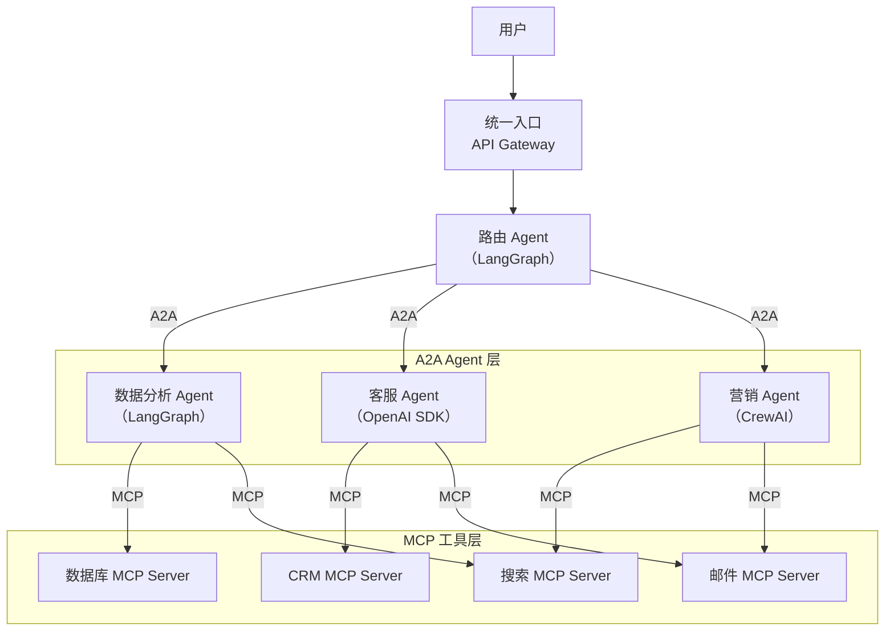
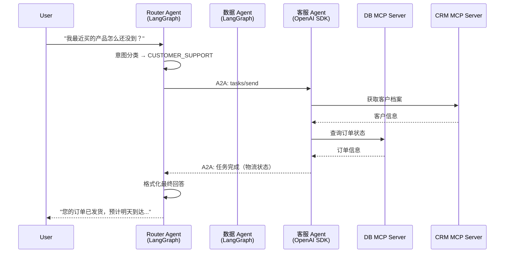

# 案例 5：MCP + A2A 多框架协作

## 背景

**场景**：某跨国零售集团需要构建统一的 AI 助手平台，但面临以下现实约束：
- **数据团队**已用 LangGraph 构建了数据分析 Agent
- **客服团队**使用 OpenAI Agents SDK 构建了客服 Agent
- **市场团队**用 CrewAI 搭建了营销内容生成 Agent
- 各 Agent 使用的工具分散在不同系统中（数据库、CRM、邮件服务）

**目标**：让三个团队的 Agent 协作完成任务，而不是重写所有 Agent。

## 架构设计



**设计原则**：
- **MCP** 统一工具接入：所有 Agent 通过 MCP 使用工具，解决 N×M 集成问题
- **A2A** 统一 Agent 通信：Router Agent 通过 A2A 协议协调各专业 Agent
- **各团队保留自主权**：每个团队用自己熟悉的框架

## MCP 工具层实现

### 数据库 MCP Server

```python
# mcp_servers/database_server.py
from mcp.server.fastmcp import FastMCP
import asyncpg

mcp = FastMCP("EnterpriseDatabase", version="1.0.0")

@mcp.tool()
async def query_orders(user_id: str, days: int = 30) -> str:
    """查询用户最近 N 天的订单"""
    conn = await asyncpg.connect(os.environ["DATABASE_URL"])
    rows = await conn.fetch("""
        SELECT order_id, product_name, amount, status, created_at
        FROM orders
        WHERE user_id = $1 AND created_at > NOW() - INTERVAL '1 day' * $2
        ORDER BY created_at DESC
    """, user_id, days)
    await conn.close()
    return format_table(rows)

@mcp.tool()
async def query_inventory(product_id: str) -> str:
    """查询产品库存"""
    ...

@mcp.resource("schema://orders")
def get_orders_schema() -> str:
    """返回订单表结构（供 Agent 理解数据模型）"""
    return json.dumps({
        "table": "orders",
        "columns": {
            "order_id": "VARCHAR(36) PRIMARY KEY",
            "user_id": "VARCHAR(36)",
            "product_name": "VARCHAR(255)",
            "amount": "DECIMAL(10,2)",
            "status": "VARCHAR(20)",
            "created_at": "TIMESTAMP",
        }
    }, indent=2)
```

### CRM MCP Server

```python
# mcp_servers/crm_server.py
mcp = FastMCP("CRM", version="1.0.0")

@mcp.tool()
async def get_customer_profile(user_id: str) -> str:
    """获取客户完整档案（含标签、历史交互、偏好）"""
    ...

@mcp.tool()
async def update_customer_tags(user_id: str, tags: list[str]) -> str:
    """更新客户标签（用于个性化推荐）"""
    # 审批检查
    if not await approval_service.check("update_customer_tags", user_id):
        return "❌ 操作需要审批"
    ...
```

## A2A Agent 层实现

### 路由 Agent（LangGraph）

```python
# router_agent.py
from langgraph.graph import StateGraph, START, END
from langchain_openai import ChatOpenAI
import httpx

class RouterState(TypedDict):
    user_query: str
    intent: str
    target_agent_url: str
    agent_result: str
    final_answer: str

def classify_intent(state: RouterState) -> dict:
    """分类用户意图，决定路由到哪个 Agent"""
    llm = ChatOpenAI(model="gpt-4o-mini")

    prompt = f"""分析用户意图，返回以下分类之一：

- DATA_QUERY：需要查询订单、库存、销售数据
- CUSTOMER_SUPPORT：需要客服帮助、投诉、退换货
- MARKETING_CONTENT：需要生成营销文案、活动方案

用户消息：{state['user_query']}

只返回分类标签。"""

    intent = llm.invoke(prompt).content.strip()

    # Agent Card URL 映射
    agent_urls = {
        "DATA_QUERY": "https://agents.company.com/data-analysis",
        "CUSTOMER_SUPPORT": "https://agents.company.com/customer-support",
        "MARKETING_CONTENT": "https://agents.company.com/marketing",
    }

    return {
        "intent": intent,
        "target_agent_url": agent_urls.get(intent, agent_urls["CUSTOMER_SUPPORT"])
    }

def call_remote_agent(state: RouterState) -> dict:
    """通过 A2A 调用远程 Agent"""
    # 先获取 Agent Card（能力发现）
    agent_card = httpx.get(
        f"{state['target_agent_url']}/.well-known/agent.json"
    ).json()
    print(f"路由到: {agent_card['name']} ({agent_card['skills']})")

    # 发送 A2A Task
    response = httpx.post(state["target_agent_url"], json={
        "jsonrpc": "2.0",
        "method": "tasks/send",
        "params": {
            "message": {
                "role": "user",
                "parts": [{"type": "text", "text": state["user_query"]}]
            }
        },
        "id": "1"
    })

    task = response.json()["result"]
    result_text = extract_text_from_task(task)

    return {"agent_result": result_text}

def format_final_answer(state: RouterState) -> dict:
    """格式化最终回答"""
    llm = ChatOpenAI(model="gpt-4o-mini")
    prompt = f"""基于专家 Agent 的分析，生成用户友好的最终回答：

用户问题：{state['user_query']}
专家分析：{state['agent_result']}

要求：
1. 使用自然对话语言
2. 突出关键信息
3. 如有必要，提供下一步建议"""

    return {"final_answer": llm.invoke(prompt).content}

# 构建路由器图
builder = StateGraph(RouterState)
builder.add_node("classify", classify_intent)
builder.add_node("call_agent", call_remote_agent)
builder.add_node("format", format_final_answer)

builder.add_edge(START, "classify")
builder.add_edge("classify", "call_agent")
builder.add_edge("call_agent", "format")
builder.add_edge("format", END)

router_agent = builder.compile()
```

### 数据分析 Agent（LangGraph + MCP）

```python
# data_agent.py
async def create_data_agent():
    # 通过 MCP 加载工具
    async with stdio_client(StdioServerParameters(command="python", args=["database_server.py"])) as (read, write):
        async with ClientSession(read, write) as session:
            await session.initialize()
            db_tools = await load_mcp_tools(session)

            agent = create_agent(
                model=ChatOpenAI(model="gpt-4o"),
                tools=db_tools,
                system_prompt="你是数据分析专家。使用数据库工具查询和分析数据。"
            )
            return agent
```

## 完整执行流程



## 关键工程实践

### 1. 统一错误处理

```python
class A2AErrorHandler:
    """跨 Agent 调用的统一错误处理"""

    ERROR_RESPONSES = {
        "timeout": "远程 Agent 响应超时，已转人工处理",
        "agent_unavailable": "该服务暂时不可用，请稍后再试",
        "auth_failed": "服务认证失败，已通知运维团队",
        "task_failed": "任务处理失败，已记录并转人工",
    }

    @staticmethod
    async def call_with_fallback(url: str, task: dict) -> str:
        """带降级的 A2A 调用"""
        try:
            response = await httpx.post(url, json=task, timeout=30.0)
            response.raise_for_status()
            return response.json()

        except httpx.TimeoutException:
            # 降级：转人工
            await create_human_ticket(task, reason="timeout")
            return {"error": "timeout"}

        except httpx.ConnectError:
            # 降级：使用备用 Agent
            fallback_url = get_fallback_agent_url(url)
            if fallback_url:
                return await A2AErrorHandler.call_with_fallback(fallback_url, task)
            return {"error": "agent_unavailable"}
```

### 2. 跨 Agent 追踪

```python
from opentelemetry import trace
from opentelemetry.trace.propagation import TraceContextTextMapPropagator

tracer = trace.get_tracer(__name__)
propagator = TraceContextTextMapPropagator()

async def traced_a2a_call(url: str, task: dict) -> dict:
    """带分布式追踪的 A2A 调用"""
    with tracer.start_as_current_span("a2a_call") as span:
        span.set_attribute("target_url", url)
        span.set_attribute("task_id", task.get("params", {}).get("id", ""))

        # 注入 Trace Context 到 A2A 请求头
        headers = {}
        propagator.inject(headers)

        response = await httpx.post(url, json=task, headers=headers)
        return response.json()
```

### 3. 服务发现

```python
class AgentRegistry:
    """Agent 注册中心（基于 Agent Card）"""

    def __init__(self, redis_client):
        self.redis = redis_client
        self.cache_ttl = 300  # 5 分钟缓存

    async def register(self, agent_card: dict):
        """注册 Agent"""
        agent_id = agent_card["url"]
        await self.redis.setex(
            f"agent:{agent_id}",
            self.cache_ttl,
            json.dumps(agent_card)
        )

    async def discover(self, required_skill: str) -> list[dict]:
        """根据 Skill 发现 Agent"""
        agents = []
        # 扫描所有已注册 Agent
        async for key in self.redis.scan_iter("agent:*"):
            card_json = await self.redis.get(key)
            card = json.loads(card_json)
            # 匹配 Skill
            for skill in card.get("skills", []):
                if required_skill.lower() in skill.get("name", "").lower():
                    agents.append(card)
                    break
        return agents

    async def get_agent(self, url: str) -> dict:
        """获取单个 Agent Card"""
        card_json = await self.redis.get(f"agent:{url}")
        if card_json:
            return json.loads(card_json)
        # 回退到直接请求
        response = await httpx.get(f"{url}/.well-known/agent.json")
        return response.json()
```

## 成果与数据

- **工具集成成本降低 75%**：通过 MCP 标准化，新增工具的集成从 2-3 天（16-24 工时）减少到 4-6 小时
- **跨团队 Agent 协作**：A2A 使三个独立团队的系统可以互相调用，无需重写
- **框架自主权**：每个团队保留自己的框架选择，仅需实现 A2A Agent Card
- **可观测性统一**：通过 OpenTelemetry 实现跨框架、跨 Agent 的分布式追踪

## 可复用的设计模式

1. **MCP 工具层**：所有工具通过 MCP 暴露，Agent 通过 MCP Client 消费
2. **A2A 协作层**：Router Agent 通过 A2A 分派任务，专业 Agent 通过 A2A 暴露能力
3. **Agent Card 注册中心**：Redis 缓存 Agent Card，支持按 Skill 动态发现
4. **统一降级策略**：超时/不可用 → 备用 Agent → 人工

## 实践练习

1. 设计一个多 Agent 协作场景，画出来 MCP 工具层和 A2A 协作层的架构图
2. 实现一个简单的 Agent Card 注册和发现机制
3. 模拟跨框架调用：用 LangGraph 做路由，调用一个模拟的远程 Agent
