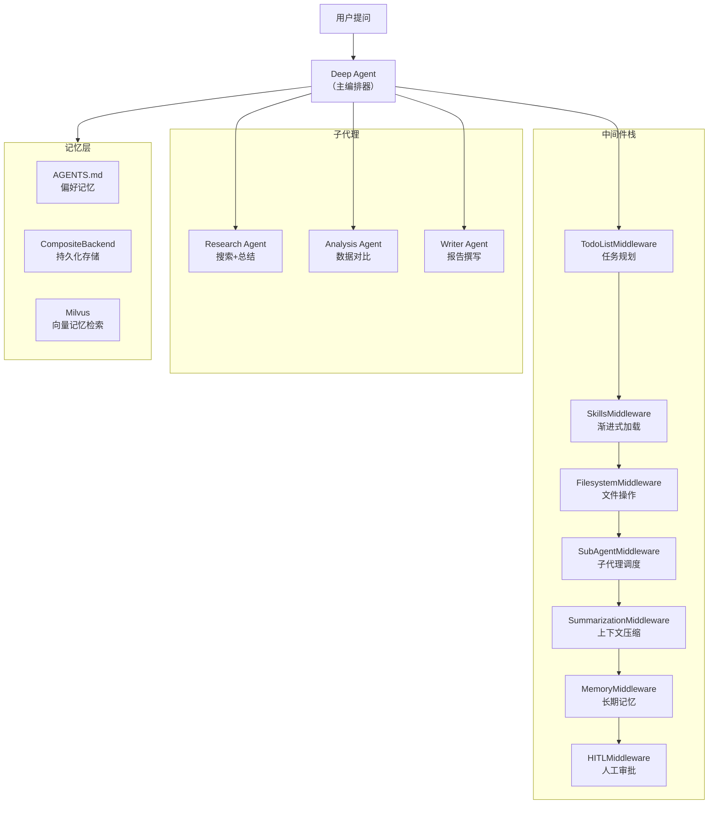
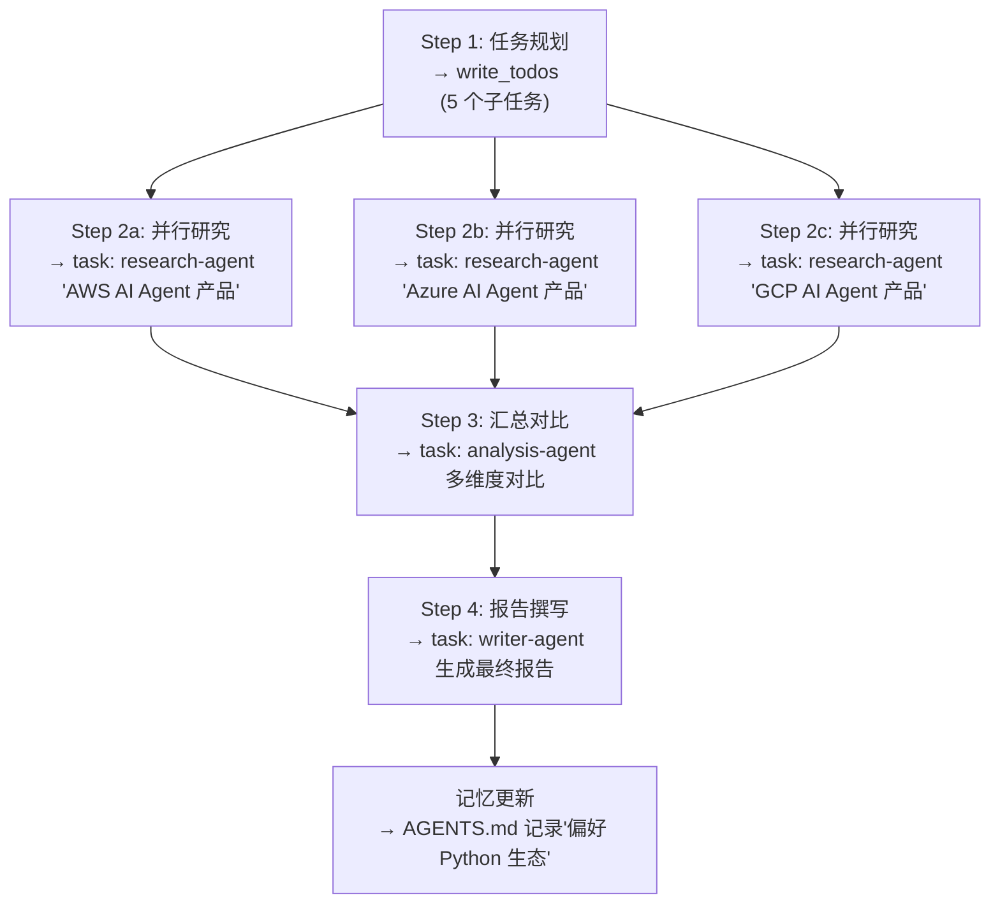

# 案例 6：DeepAgents 生产实践

## 背景

**基于**：Interrupt 2026 DeepAgents Workshop（`langchain-samples/interrupt26-deepagents`）

**场景**：某 SaaS 公司需要构建一个内部"AI 研究助手"，能够：
1. 接收开放性的研究问题（如"对比三个云服务商的 AI 产品"）
2. 自动规划研究计划
3. 并行搜索和收集信息
4. 生成结构化的研究报告
5. 记住用户偏好，越用越智能

**技术选型**：DeepAgents（LangChain 生态的 Agent Harness），因其内置任务规划、子代理、长期记忆等能力。

## 架构设计



## 核心实现

### 1. 创建 Deep Agent

```python
from deepagents import create_deep_agent
from langchain_openai import ChatOpenAI

# 定义子代理
research_subagent = {
    "name": "research-agent",
    "description": "深度研究特定主题，搜索和收集信息。用于需要事实查找和信息收集的任务。",
    "system_prompt": """你是一个专业研究员。使用 web_search 工具搜索信息。

研究流程：
1. 先用多个关键词从不同角度搜索
2. 提取关键事实、数据和观点
3. 标注每条信息的来源
4. 区分"已确认的事实"和"观点/预测"

输出格式：
## 研究发现
### 关键事实
- [事实]（来源：...）
### 数据支撑
- [数据]（来源：...）
### 不同观点
- [观点1]（来源：...）
- [观点2]（来源：...）""",
    "tools": [web_search],
    "model": "openai:gpt-4o-mini",  # 子代理用轻量模型
}

analysis_subagent = {
    "name": "analysis-agent",
    "description": "对比分析多个选项或数据源，生成结构化对比报告。用于需要多维度比较的任务。",
    "system_prompt": """你是一个数据分析专家。基于提供的研究发现，进行多维度对比分析。

分析维度：
1. 功能对比
2. 性能/规模
3. 定价模式
4. 优劣势
5. 适用场景

输出对比表格 + 每个维度的详细分析。""",
    "tools": [],
    "model": "openai:gpt-4o",
}

writer_subagent = {
    "name": "writer-agent",
    "description": "将研究发现和分析结果整理为结构化报告或文章。",
    "system_prompt": """你是专业的技术报告撰写者。基于研究发现和对比分析，生成结构化报告。

报告结构：
1. 执行摘要（200字以内）
2. 背景与方法
3. 发现与对比（使用表格）
4. 结论与建议
5. 参考来源

使用 Markdown 格式，语言专业但易读。""",
    "tools": [],
    "model": "openai:gpt-4o-mini",
}

# 创建主编排 Agent
agent = create_deep_agent(
    model=ChatOpenAI(model="gpt-4o"),
    tools=[web_search],
    system_prompt="""你是一个 AI 研究助手。当收到研究问题时：

1. 使用 write_todos 制定研究计划
2. 将子任务分派给合适的子代理（task 工具）
3. 监控子代理的进展
4. 确保研究质量（信息充分、来源可靠、观点平衡）
5. 综合所有发现生成最终报告

研究质量标准：
- 每个声明必须有来源支撑
- 涵盖至少 3 个不同视角
- 区分事实与观点
- 标注信息的时效性""",
    subagents=[research_subagent, analysis_subagent, writer_subagent],
)
```

### 2. 任务规划（TodoListMiddleware）

Deep Agent 自动使用 `write_todos` 工具规划任务：

```python
# Agent 在收到任务后自动调用 write_todos
# 示例：Agent 内部生成的规划
todos = [
    {"id": "1", "content": "研究 AWS AI 产品线", "status": "pending"},
    {"id": "2", "content": "研究 Azure AI 产品线", "status": "pending"},
    {"id": "3", "content": "研究 GCP AI 产品线", "status": "pending"},
    {"id": "4", "content": "多维度对比分析", "status": "pending",
     "dependencies": ["1", "2", "3"]},
    {"id": "5", "content": "撰写最终研究报告", "status": "pending",
     "dependencies": ["4"]},
]
```

### 3. 子代理任务分派

```python
# Deep Agent 通过 task 工具调用子代理
# 内部实际调用：

# Step 1: 并行启动研究子代理
task_1 = agent.invoke({
    "messages": [{"role": "user",
                   "content": "task: research-agent\n研究 AWS 的 AI/ML 产品线"}]
})

task_2 = agent.invoke({
    "messages": [{"role": "user",
                   "content": "task: research-agent\n研究 Azure 的 AI/ML 产品线"}]
})

task_3 = agent.invoke({
    "messages": [{"role": "user",
                   "content": "task: research-agent\n研究 GCP 的 AI/ML 产品线"}]
})

# Step 2: 汇总后启动分析子代理
analysis_result = agent.invoke({
    "messages": [{"role": "user",
                   "content": f"""task: analysis-agent
对比分析以下三家云服务商的 AI 产品：

## AWS
{task_1['messages'][-1].content}

## Azure
{task_2['messages'][-1].content}

## GCP
{task_3['messages'][-1].content}"""}]
})

# Step 3: 启动撰写子代理
final_report = agent.invoke({
    "messages": [{"role": "user",
                   "content": f"""task: writer-agent
基于以下对比分析生成最终研究报告：

{analysis_result['messages'][-1].content}"""}]
})
```

### 4. 长期记忆

```python
from deepagents.backends import CompositeBackend
from deepagents.backends.state import StateBackend
from deepagents.backends.store import StoreBackend
from langgraph.store.memory import InMemoryStore

# 配置分层记忆
memory_backend = CompositeBackend(
    routes={
        # 会话内记忆 → StateBackend
        "/session/*": StateBackend(),

        # 跨会话记忆 → StoreBackend（持久化）
        "/memories/*": StoreBackend(
            store=InMemoryStore()  # 生产环境替换为 PostgresStore
        ),
    },
    # 默认 → 文件系统
    default=FilesystemBackend(root_dir="./agent_data"),
)

# AGENTS.md：用户偏好记忆
# 自动加载并可在交互中更新
agents_md = """
# 我的偏好

## 研究风格
- 偏好结构化报告（含对比表格）
- 需要明确的来源标注
- 同时看学术来源和行业报告

## 格式偏好
- 使用中文撰写
- 专业术语保留英文原名
- 代码块使用语法高亮

## 技术栈偏好
- 优先 Python 生态
- 关注开源方案
"""

# 创建带记忆的 Agent
agent = create_deep_agent(
    model=ChatOpenAI(model="gpt-4o"),
    tools=[web_search],
    system_prompt="你是 AI 研究助手...",
    subagents=[research_subagent, analysis_subagent, writer_subagent],
    memory=[agents_md],  # 加载用户偏好
    backend=memory_backend,
)
```

### 5. 上下文管理

Deep Agents 的 SummarizationMiddleware 在上下文接近模型限制时自动压缩：

```python
# 自动行为（无需手动配置）：
# 1. 当上下文达到模型的 max_input_tokens 的 85% 时触发摘要
# 2. 生成结构化摘要（会话意图、关键发现、下一步）
# 3. 原始对话保存为文件（/session_summary.txt）
# 4. 大工具输出（>20k tokens）自动卸载到文件

# 手动配置（可选）
agent = create_deep_agent(
    model=ChatOpenAI(model="gpt-4o"),
    # ... 其他配置
    summarization={
        "trigger_threshold": 0.85,  # 85% 触发
        "max_tool_output_tokens": 20000,  # 工具输出上限
        "summary_max_tokens": 2000,  # 摘要的最大 Token
    }
)
```

## 执行示例

### 输入

```
用户：对比 AWS、Azure、GCP 在 AI Agent 开发方面的产品能力，给出选型建议。
我们的团队是 10 人的 Python 开发团队，主要做企业内部应用。
```

### 执行过程



### 输出（节选）

```markdown
# AI Agent 开发平台对比：AWS vs Azure vs GCP

## 执行摘要
针对 10 人 Python 团队的内部应用场景，推荐优先级：**GCP > AWS > Azure**。
GCP 的 Vertex AI Agent Builder 提供最完整的 Python SDK 和最简化的部署流程...

## 对比分析

| 维度 | AWS | Azure | GCP |
|------|-----|-------|-----|
| Python SDK 成熟度 | ⭐⭐⭐⭐ | ⭐⭐⭐ | ⭐⭐⭐⭐⭐ |
| 部署复杂度 | 中等 | 较高 | 低（adk deploy） |
| MCP 支持 | ✅ Bedrock | ✅ Foundry | ✅ Vertex |
| A2A 支持 | ✅ | ✅ | ✅ 原生 |
| 中小企业定价 | $0.15/h | $0.20/h | $0.12/h |

## 结论
建议先从 GCP Vertex AI Agent Builder 开始 PoC...
```

## 关键工程实践

### 1. 子代理错误隔离

```python
class ResilientSubAgent:
    """带错误隔离的子代理包装"""

    def __init__(self, subagent_config: dict, max_retries: int = 2):
        self.config = subagent_config
        self.max_retries = max_retries

    async def execute(self, task: str) -> dict:
        for attempt in range(self.max_retries + 1):
            try:
                result = await self._run_subagent(task)
                return {"success": True, "output": result}

            except ContextOverflowError:
                # 上下文溢出：用更小的模型重试
                if attempt < self.max_retries:
                    logger.warning(f"子代理 {self.config['name']} 上下文溢出，降级重试")
                    self.config["model"] = "openai:gpt-4o-mini"
                    continue
                return {"success": False, "error": "上下文溢出，多次重试失败"}

            except Exception as e:
                if attempt < self.max_retries:
                    logger.warning(f"子代理 {self.config['name']} 错误: {e}, 重试中...")
                    continue
                return {"success": False, "error": str(e)}

        return {"success": False, "error": "未知错误"}
```

### 2. 记忆演化

```python
class EvolvingMemory:
    """根据用户反馈自动演化的记忆系统"""

    def __init__(self, backend):
        self.backend = backend

    async def capture_feedback(self, user_id: str, interaction: dict, feedback: str):
        """从用户反馈中学习"""
        if "太详细" in feedback or "简洁" in feedback:
            await self.update_preference(user_id, "verbosity", "concise")

        if "需要表格" in feedback or "对比" in feedback:
            await self.update_preference(user_id, "format", "table_preferred")

        if "不需要背景" in feedback or "直接" in feedback:
            await self.update_preference(user_id, "style", "direct")

        # 保存更新后的偏好
        await self.backend.put(
            f"/memories/{user_id}/preferences",
            self.preferences[user_id]
        )

    async def update_preference(self, user_id: str, key: str, value: str):
        """增量更新用户偏好"""
        if user_id not in self.preferences:
            self.preferences[user_id] = load_default_preferences()

        old_value = self.preferences[user_id].get(key)
        self.preferences[user_id][key] = value

        logger.info(f"用户 {user_id} 偏好变化: {key} [{old_value}] → [{value}]")
```

## 成果与数据

- **研究耗时减少 92%**：从手动 3 小时的研究 + 撰写 → Agent 15 分钟
- **记忆使交互轮次减少 40%**：用户不再需要重复说明偏好
- **子代理隔离**：单个子代理失败不影响整体任务
- **上下文管理**：20 步以上的长任务无需手动清理上下文

## 与 LangGraph 原语的对比

| 需求 | LangGraph 方式 | DeepAgents 方式 |
|------|---------------|-----------------|
| 任务规划 | 手动写 Plan 节点 | `write_todos` 自动规划 |
| 子任务委派 | 手动 Send API | `task` 工具自动管理 |
| 上下文管理 | 手动摘要节点 | SummarizationMiddleware 自动 |
| 记忆 | 手动 Checkpoint 管理 | MemoryMiddleware + CompositeBackend |
| 代码量 | ~200 行 | ~50 行 |

> **经验法则：用 DeepAgents 起步，在需要完全控制 Agent 循环时降级到 LangGraph。**

## 实践练习

1. 用 DeepAgents 创建一个带 3 个子代理的研究助手
2. 配置长期记忆，使 Agent 在多次会话间记住用户的研究偏好
3. 观察大型研究任务（10+ 步骤）中 SummarizationMiddleware 的自动摘要行为
