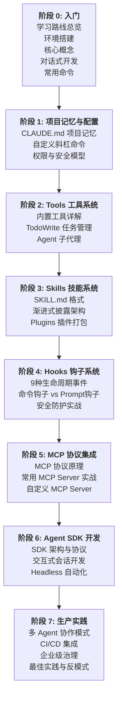

# 学习路线总览

## 目标

本学习路径帮助你系统掌握 Claude Code 的完整技术栈，从 CLI 交互式开发到企业级多 Agent 生产部署。

## 前置要求

- 命令行基本操作（Terminal / Shell）
- 基础 Git 操作（commit、branch、push）
- 了解 LLM 基本概念（Prompt、Token、Context Window）
- 有任意编程语言的开发经验

## 7 阶段学习路线

## Claude Code 技术全景

| 层级 | 说明 |
|------|------|
| CLI 核心 | Agent Loop、工具调用、上下文管理、权限系统 |
| 配置层 | CLAUDE.md、settings.json、.mcp.json |
| 扩展层 | Skills、Hooks、MCP Servers、Custom Commands |
| 编程层 | Agent SDK（Python/TS/Go）、Headless 模式 |
| 治理层 | AI Gateway、成本追踪、OTEL 可观测性、RBAC |

## 核心能力矩阵

| 能力 | 说明 | 对应阶段 |
|------|------|----------|
| 环境搭建与核心概念 | 安装、Agent Loop、对话式开发基础 | 阶段 0 |
| 项目记忆与配置 | CLAUDE.md 持久化上下文、自定义命令、权限安全 | 阶段 1 |
| 工具调用 | Read/Write/Edit/Bash/Grep 等内置工具 | 阶段 2 |
| 子代理委托 | 并行子代理，隔离上下文执行专项任务 | 阶段 2 |
| 技能复用 | 可复用的工作流模板，渐进式加载 | 阶段 3 |
| 生命周期钩子 | 事件驱动的自动化（格式化、检查、通知） | 阶段 4 |
| 外部系统集成 | 通过 MCP 连接数据库、API、浏览器等 | 阶段 5 |
| 编程嵌入 | 在自己的应用中嵌入 Claude Code 能力 | 阶段 6 |
| 企业级部署 | 多 Agent 编排、CI/CD、治理与可观测性 | 阶段 7 |

## 建议学习周期（6-8 周）

| 周次 | 阶段 | 重点 |
|------|------|------|
| 第 1 周 | 阶段 0-1 | 安装上手、熟悉 CLI、掌握 CLAUDE.md 和命令 |
| 第 2 周 | 阶段 2 | 精通全部内置工具、子代理并行工作 |
| 第 3 周 | 阶段 3-4 | 编写自定义 Skill、配置自动化 Hooks |
| 第 4 周 | 阶段 5 | 连接外部系统、开发自定义 MCP Server |
| 第 5 周 | 阶段 6 | Agent SDK 编程，嵌入到自己的应用中 |
| 第 6-8 周 | 阶段 7 | 多 Agent 编排、CI/CD 集成、企业级治理 |

## 学习建议

1. **边学边练**: 每个阶段都提供可运行的示例和实践练习
2. **从简单到复杂**: 先掌握单会话工作流，再扩展到多 Agent 编排
3. **关注安全**: 权限配置和钩子安全防护贯穿整个学习路径
4. **参考官方文档**: 本文档配合 [docs.claude.com](https://docs.claude.com) 使用效果最佳
