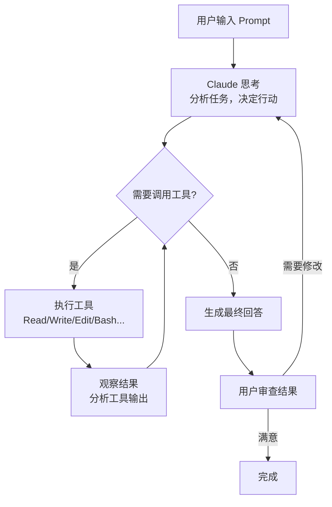
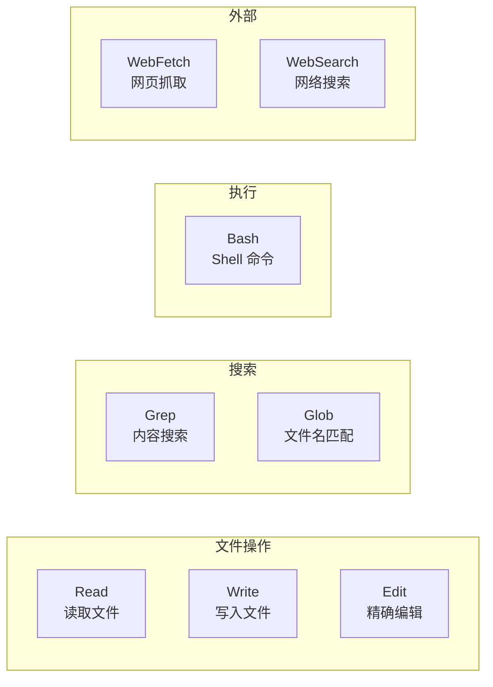

# 核心概念

## Agent Loop（代理循环）

Claude Code 的核心是一个自主 Agent 循环，它不断执行"思考-行动-观察"的迭代过程。



这个循环的核心思想是：**Claude 可以自主决定下一步做什么，而不仅仅是回答一个问题**。它可以读取文件、修改代码、运行命令、根据结果调整策略。

## 核心要素

### 1. System Prompt（系统提示）

每次会话启动时，Claude Code 会注入一个系统提示，它定义了 Claude 的角色、行为规范、可用工具等。这包括：

- 你是谁（一个 AI 编程助手）
- 你拥有哪些工具
- 你应该如何行为（简洁、安全优先、不猜测 URL）
- 上下文管理策略

### 2. Context Window（上下文窗口）

Claude Code 支持 **200K 到 1M token** 的上下文窗口。整个对话历史、文件内容、工具输出都在这个窗口内。

| 概念 | 说明 |
|------|------|
| Token | 文本的最小单位，英文约 0.75 词 = 1 token |
| Context Window | 一次会话能"记住"的最大 token 数 |
| Compaction | 上下文接近上限时的自动压缩机制 |

### 3. Tools（工具）

Claude Code 拥有丰富的内置工具来与文件系统和外部世界交互：



### 4. Permission System（权限系统）

工具调用需要用户授权。权限分为三个层级：

```
默认拒绝（最安全）
    ↓
需要用户授权（default mode）
    ↓
自动允许（accept-edits mode）
```

权限可以基于规则精细控制，例如：允许 `git status` 但阻止 `git push --force`。

### 5. 项目记忆（CLAUDE.md）

`CLAUDE.md` 是 Claude Code 的项目记忆文件，在每次会话启动时自动加载。它包含：

- 项目架构说明
- 常用命令
- 编码规范
- 注意事项和陷阱

## Claude Code vs 传统 AI 聊天

| 维度 | AI 聊天（ChatGPT Web） | Claude Code |
|------|------------------------|-------------|
| 交互方式 | 一问一答 | 自主多步执行 |
| 文件系统 | 无法访问 | 直接读写编辑 |
| 命令执行 | 无 | 完整的 Shell 环境 |
| 上下文 | 手动管理 | 自动压缩/持久化 |
| 工具链 | 无 | MCP 连接外部系统 |
| 自动化 | 无 | Hooks + Skills + SDK |

## Agent 能力边界

Claude Code 的 Agent 能做和不能做的事：

| 能做 | 不能做（或需要授权） |
|------|---------------------|
| 读写项目文件 | 访问系统敏感目录 |
| 执行 git 命令 | 未经确认的 force push |
| 搜索代码库 | 猜测或伪造 URL |
| 运行测试和构建 | 跳过 git hooks |
| 管理包依赖 | 修改 ~/.claude 之外的全局配置 |
| 网络搜索和抓取 | 访问需要认证的私有服务 |

## 实践练习

1. 在 Claude Code 中执行一个多步任务（如"重构这个函数并确保测试通过"），观察 Agent Loop 的执行过程
2. 使用 `/cost` 查看一个会话的 token 消耗
3. 体验不同的权限模式：`plan` 模式 vs `accept-edits` 模式
