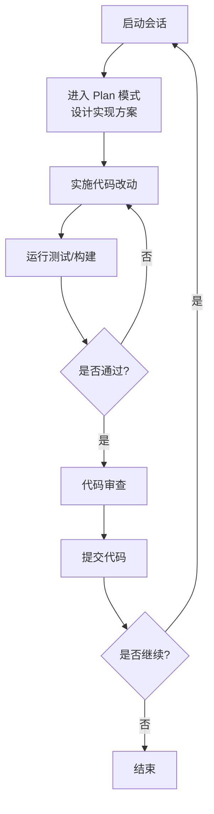
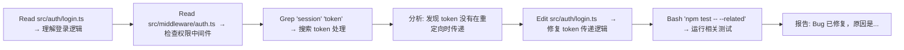

# 对话式开发

## 第一个 Claude Code 会话

启动 Claude Code：

```bash
cd your-project
claude
```

你会看到一个交互式 REPL 界面，直接输入自然语言指令即可。

## 基本交互模式

### 模式 1：简单问答

```
> 这个项目的入口文件是什么？
```

Claude 会搜索代码库，找到入口文件并解释。

### 模式 2：代码修改

```
> 在 src/utils.js 中添加一个 debounce 函数
```

Claude 会先读取文件，理解代码结构，然后执行编辑。

### 模式 3：多步重构

```
> 把所有的 var 声明改成 const/let，并确保测试通过
```

Claude 会：
1. 搜索所有 `var` 声明
2. 逐个替换为 `const` 或 `let`
3. 运行测试验证
4. 如有失败则修复

### 模式 4：探索式开发

```
> 我想给 API 添加分页功能，帮我设计并实现
```

Claude 会：
1. 先探索现有 API 代码结构
2. 提出设计方案
3. 等你确认后实施
4. 添加测试

## 交互技巧

### 1. 提供清晰的上下文

```
差: fix the bug
好: 用户列表页面在搜索后分页重置了，帮我在 src/pages/Users.tsx 中修复
```

### 2. 使用 Thinking 策略关键字

| 关键字 | 效果 |
|--------|------|
| `think` | 快速规划 |
| `think hard` | 详细分析 |
| `ultrathink` | 最大深度分析 |

### 3. 逐步引导而非一步到位

```
第1步: 先看一下认证中间件的实现
第2步: 好，现在添加 JWT 刷新逻辑
第3步: 更新测试覆盖新逻辑
```

### 4. 使用 @ 引用文件

```
> 根据 @src/types.ts 中的 User 接口，在 @src/api/users.ts 中添加 CRUD 端点
```

### 5. 提供期望的输出格式

```
> 用表格对比这三个方案：
> - 方案 A: Redis 缓存
> - 方案 B: 内存缓存
> - 方案 C: 文件缓存
> 对比维度：性能、复杂度、持久化、适用场景
```

## 对话管理命令

| 命令 | 作用 |
|------|------|
| `/clear` | 清空会话上下文，开始新对话 |
| `/compact` | 压缩上下文（保留关键信息，释放 token） |
| `/cost` | 查看当前会话 token 消耗 |
| `/status` | 查看版本、模型、账号信息 |
| `/rewind` | 回退对话或代码改动 |

### 何时使用 /clear

- 话题已经完全改变（从 bug 修复切换到新功能开发）
- 上下文过长导致响应变慢
- Claude 出现"幻觉"或重复行为

### 何时使用 /compact

- 上下文接近窗口上限
- 想保留当前工作流但释放空间
- 长会话中途的性能优化

## 会话工作流最佳实践



## 实际案例：修复一个 Bug

假设有一个登录失败的 bug：

```
> 用户反馈登录后跳转到 /dashboard 时 403 错误。
> 帮我排查 src/auth/ 和 src/middleware/ 相关代码。
```

Claude 的典型执行过程：



## 实践练习

1. 在你的项目中启动 Claude Code，完成一个简单的代码修改任务
2. 练习使用 `@` 引用文件和 `think` 关键字
3. 体验一次完整的工作流：探索 → 修改 → 测试 → 提交
4. 尝试使用 `/compact` 压缩一个长会话
