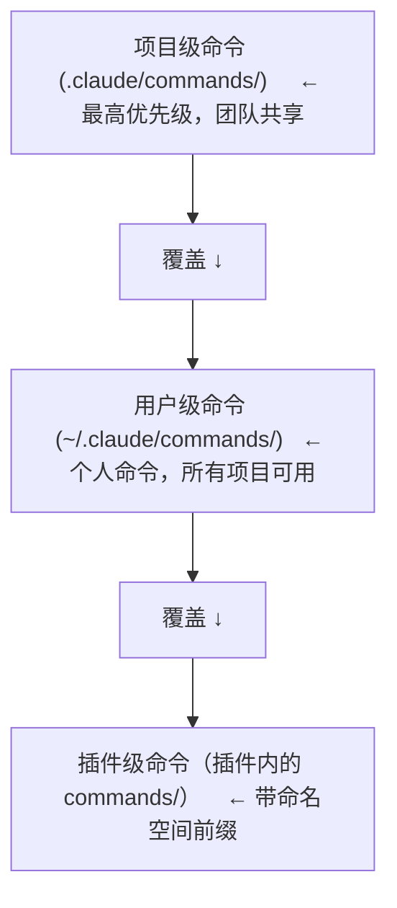
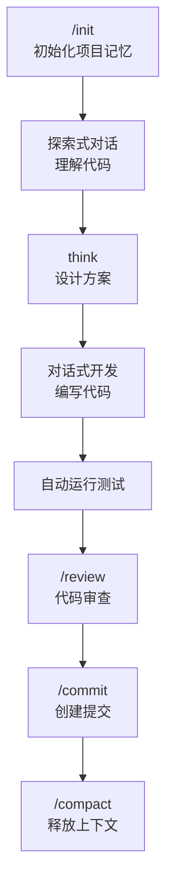

# 常用命令

## 内置斜杠命令速查表

### 会话管理

| 命令 | 说明 | 示例 |
|------|------|------|
| `/help` | 列出所有可用命令 | `/help` |
| `/clear` | 清空会话上下文 | `/clear` |
| `/compact` | 压缩上下文释放 token | `/compact` |
| `/cost` | 查看 token 消耗统计 | `/cost` |
| `/status` | 显示版本、模型等信息 | `/status` |
| `/rewind` | 回退到之前的对话状态 | `/rewind` |

### 项目配置

| 命令 | 说明 | 示例 |
|------|------|------|
| `/init` | 扫描项目生成 CLAUDE.md | `/init` |
| `/config` | 打开设置 UI | `/config` |
| `/model` | 切换 AI 模型 | `/model` |
| `/permissions` | 管理工具权限 | `/permissions` |
| `/memory` | 编辑 CLAUDE.md | `/memory` |

### 扩展管理

| 命令 | 说明 | 示例 |
|------|------|------|
| `/mcp` | 管理 MCP 服务器 | `/mcp` |
| `/agents` | 管理自定义子代理 | `/agents` |
| `/plugin` | 管理插件 | `/plugin install owner/repo` |
| `/hooks` | 查看已加载的钩子 | `/hooks` |

### 代码操作

| 命令 | 说明 | 示例 |
|------|------|------|
| `/review` | 代码审查 | `/review` |
| `/commit` | 创建规范的 git commit | `/commit` |
| `/fix-issue` | 从 issue 到修复的完整流程 | `/fix-issue 123` |

## 自定义斜杠命令

在 `.claude/commands/` 目录下创建 `.md` 文件即可定义自定义命令。

### 基本结构

```markdown
---
description: 创建符合团队规范的 git commit
argument-hint: [issue-number]
allowed-tools: Bash(git add:*), Bash(git status:*), Bash(git commit:*)
---

<objective>
创建当前改动的原子化 commit。
</objective>

<context>
- 当前状态: !`git status`
- 改动内容: !`git diff HEAD`
- 最近提交: !`git log --oneline -5`
</context>

<process>
1. 审查暂存和未暂存的改动
2. 按 Conventional Commits 格式暂存相关文件
3. 编写提交信息：type(scope): 描述
4. 创建提交
</process>

<success_criteria>
- 所有相关改动已暂存
- 提交信息遵循格式规范
- 提交成功无错误
</success_criteria>
```

### Frontmatter 参考

| 字段 | 必须 | 说明 |
|------|------|------|
| `description` | 是 | 命令描述，显示在 `/help` 中 |
| `argument-hint` | 否 | 参数提示，如 `[issue-number] [priority]` |
| `allowed-tools` | 否 | 限制命令可用的工具 |
| `model` | 否 | 为该命令指定模型 |
| `disable-model-invocation` | 否 | 设为 true 禁止 Claude 自动触发 |

### 高级特性

**参数传递：**

```markdown
argument-hint: [pr-number] [priority] [assignee]
审查 PR #$1，优先级 $2，分配给 $3。
```

使用：`/review-pr 456 high alice`

**Bash 执行：**

```markdown
当前 git 状态: !`git status`
暂存改动: !`git diff --cached`
```

注意：需要在 frontmatter 的 `allowed-tools` 中声明对应的 Bash 权限。

**文件引用：**

```markdown
参考 @src/utils/helpers.js
遵循 @docs/security-rules.md
```

## 命令层级覆盖



## 常用命令组合工作流



## 实践练习

1. 为你的项目创建 3 个自定义命令（如 `/commit`、`/review`、`/fix`）
2. 练习使用 `$ARGUMENTS` 和 `!` 执行 Bash
3. 对比项目级命令和用户级命令的区别
4. 使用 `/help` 查看所有可用的命令列表
