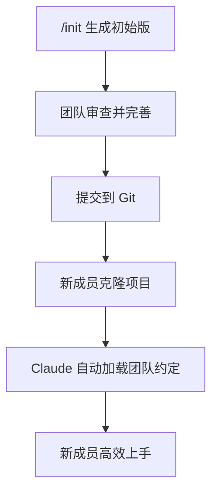

# CLAUDE.md 详解

## 什么是 CLAUDE.md？

`CLAUDE.md` 是 Claude Code 的**项目记忆文件**。每次会话启动时，Claude Code 会自动加载项目根目录的 `CLAUDE.md`（以及用户目录的 `~/.claude/CLAUDE.md`）。它让你不必在每个会话中重新解释项目背景、约定和注意事项。

## 快速开始

在项目根目录运行：

```
/init
```

Claude Code 会扫描整个代码库，自动生成 `CLAUDE.md`，内容通常包括：

- 项目简介
- 技术栈
- 目录结构
- 常用构建/测试命令
- 代码风格偏好

## CLAUDE.md 应该包含什么

```markdown
# 项目名

## 快速命令
- 构建: `npm run build`
- 测试: `npm test`
- 开发: `npm run dev`
- Lint: `npm run lint`

## 项目架构
- `src/app/` - Next.js App Router 页面
- `src/components/` - 共享 UI 组件
- `src/lib/` - 工具函数和 API 客户端
- `prisma/` - 数据库 Schema 和迁移

## 技术栈
- Next.js 14 + TypeScript
- Prisma ORM + PostgreSQL
- Tailwind CSS
- Jest + Playwright

## 注意事项
- 不要手动修改 `src/generated/` 目录，由代码生成器管理
- 环境变量在 `.env.example` 中定义，不要提交 `.env`
- API 响应格式统一使用 `{ data, error }` 结构
- 使用 Server Components 优先，除非需要交互

## 代码风格
- 文件名使用 kebab-case
- 组件使用 named export
- 类型定义放在同目录的 types.ts
```

### 内容指南

| 应包含 | 不应包含 |
|--------|---------|
| 构建/测试命令 | 敏感信息（API Key 等） |
| 技术栈说明 | 频繁变动的状态 |
| 架构约定 | 冗长的文档 |
| 常见陷阱 | 可推导的信息 |
| 代码风格偏好 | 过时的内容 |

## 层级覆盖模型

Claude Code 支持多层 CLAUDE.md 文件，按照**由广到精**的顺序加载：

```
~/.claude/CLAUDE.md          ← 个人全局记忆（所有项目）
    ↓
项目根/CLAUDE.md             ← 项目级记忆（团队共享）
    ↓
子目录/CLAUDE.md             ← 子模块记忆（特定上下文）
```

### 目录级 CLAUDE.md

你可以在子目录放置 `CLAUDE.md`，当 Claude 操作该目录中的文件时，会加载对应的记忆：

```
my-project/
├── CLAUDE.md              ← 全局项目约定
├── src/
│   ├── CLAUDE.md           ← src-specific 约定
│   └── api/
│       └── CLAUDE.md       ← API 开发约定
```

## 使用 @ 引用外部文件

对于大型文档，可以拆分为模块并引用：

```markdown
## 架构详情
详见 @docs/architecture.md

## API 规范
参考 @docs/api-conventions.md
```

## 交互式更新

不需要手动编辑 CLAUDE.md。直接在对话中说：

```
"更新 CLAUDE.md，把构建命令改成 pnpm build"
"在 CLAUDE.md 中添加说明：所有 API 必须带错误处理"
```

或者按 `#` 键，Claude 会自动将当前行为的经验教训添加到 CLAUDE.md。

## 团队协作



### 最佳实践

1. **保持更新**: CLAUDE.md 应该是活文档，随着项目演进持续更新
2. **简洁为上**: 每个要点一两句话即可，Claude 会自行推断细节
3. **团队约定优先**: 写入团队所有成员都需要遵守的约定
4. **个人偏好分离**: 个人风格放在 `~/.claude/CLAUDE.md`
5. **版本控制**: 项目级 CLAUDE.md 应该纳入 Git 版本控制

## CLAUDE.md 模板

```markdown
# [项目名]

## 快速命令
- 构建: ``
- 测试: ``
- 开发: ``

## 架构概览
（2-3 句话描述整体架构思路）

## 目录结构
- `src/` - 主代码
- `tests/` - 测试
- `docs/` - 文档

## 技术栈
- 运行时: 
- 框架: 
- 数据库: 
- 测试框架: 

## 编码约定
- 命名: 
- 格式: 
- 导入顺序: 

## 注意事项
- 
- 

## 参考文档
- @docs/
```

## 实践练习

1. 在项目中运行 `/init`，审查生成的 CLAUDE.md
2. 手动添加至少 5 条团队约定
3. 创建一个子目录级 CLAUDE.md
4. 使用 `@` 引用拆分大型文档为多个模块
