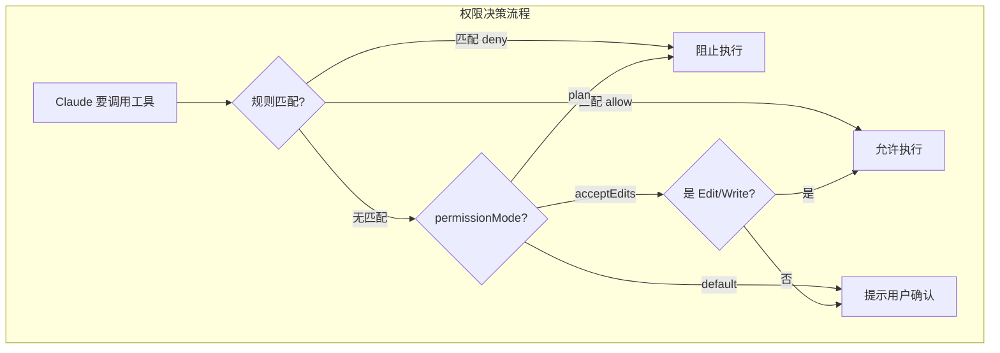
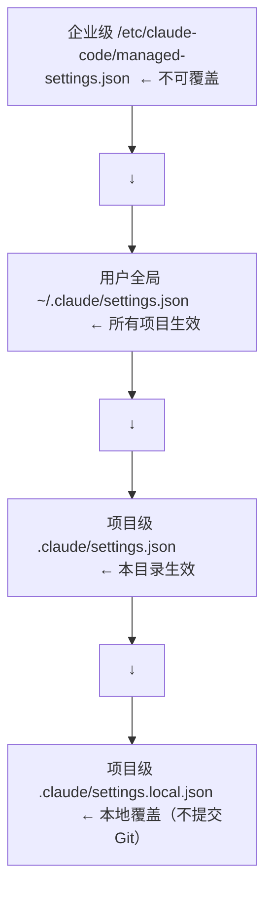

# 权限与安全配置

## 权限系统概述

Claude Code 的权限系统确保对所有工具调用（特别是文件写操作和 Shell 命令）进行访问控制。

## 三种权限模式

| 模式 | 行为 | 适用场景 |
|------|------|---------|
| `default` | 工具调用需要用户确认 | 日常开发（推荐） |
| `plan` | 只读模式，拒绝所有写操作 | 代码审查、探索 |
| `acceptEdits` | 自动接受编辑，其他仍需确认 | 信任度高的项目 |

```bash
# 启动时指定模式
claude --permission-mode plan

# 会话中切换
/permissions
```

## 权限配置模型



## 配置文件结构

### settings.json（权限部分）

```json
{
  "permissions": {
    "allow": [
      "Bash(git status:*)",
      "Bash(git diff:*)",
      "Bash(git log:*)",
      "Bash(npm test:*)",
      "Bash(npm run lint:*)"
    ],
    "deny": [
      "Bash(git push:*)",
      "Bash(rm:*)",
      "Bash(sudo:*)",
      "Write(**/*.env)",
      "Write(**/*.pem)",
      "Write(**/credentials*)"
    ],
    "ask": [
      "Bash(git commit:*)",
      "Bash(npm install:*)",
      "Write(**/config*)"
    ]
  }
}
```

### 规则语法

| 模式 | 说明 | 示例 |
|------|------|------|
| `工具名` | 匹配所有该工具的调用 | `Write` |
| `工具名(子命令)` | 匹配特定子命令 | `Bash(git status:*)` |
| `工具名(参数:匹配)` | 匹配参数模式 | `Write(**/*.ts)` |
| `*` | 通配符 | `Bash(npm *)` |
| `**` | 递归通配 | `Write(**/secret*)` |

## 安全配置最佳实践

### 1. 保护敏感文件

```json
{
  "permissions": {
    "deny": [
      "Write(**/*.env)",
      "Write(**/*.env.*)",
      "Write(**/credentials*)",
      "Write(**/*.pem)",
      "Write(**/*-key.json)",
      "Write(**/secrets/**)"
    ]
  }
}
```

### 2. 阻止危险命令

```json
{
  "permissions": {
    "deny": [
      "Bash(rm -rf:*)",
      "Bash(sudo:*)",
      "Bash(chmod 777:*)",
      "Bash(git push --force:*)",
      "Bash(git reset --hard:*)",
      "Bash(:**|**)"
    ]
  }
}
```

### 3. 精细的 Git 权限

```json
{
  "permissions": {
    "allow": [
      "Bash(git status:*)",
      "Bash(git diff:*)",
      "Bash(git log:*)",
      "Bash(git branch:*)",
      "Bash(git add:*)"
    ],
    "ask": [
      "Bash(git commit:*)",
      "Bash(git push:*)"
    ],
    "deny": [
      "Bash(git push --force:*)",
      "Bash(git reset --hard:*)"
    ]
  }
}
```

## 权限配置层级



## 上下文安全

### 系统提示注入防护

Claude Code 内置了上下文注入的检测和防护机制。如果外部内容（工具输出、网页）包含可疑的注入企图，系统会标记并告知你。

### 推荐设置

```json
{
  "permissions": {
    "deny": [
      "Write(**/.claude/settings.json)",
      "Write(**/.claude/settings.local.json)",
      "Write(**/CLAUDE.md)"
    ]
  }
}
```

这样可以防止 Claude 修改自身的配置和记忆文件。

## 安全审计命令

```bash
# 检查当前会话的权限设置
/permissions

# 查看最近被阻止的操作
claude --debug 2>&1 | grep "permission denied"
```

## 权限配置模板

### 宽松模板（个人项目）

```json
{
  "permissionMode": "acceptEdits",
  "permissions": {
    "deny": [
      "Bash(rm -rf:*)",
      "Bash(sudo:*)",
      "Bash(git push --force:*)"
    ]
  }
}
```

### 严格模板（团队项目）

```json
{
  "permissionMode": "default",
  "permissions": {
    "allow": [
      "Bash(git status:*)",
      "Bash(git diff:*)"
    ],
    "deny": [
      "Bash(sudo:*)",
      "Bash(rm:*)",
      "Write(**/*.env*)",
      "Write(**/credentials*)"
    ]
  }
}
```

## 实践练习

1. 为你的项目创建一套权限配置（allow/deny/ask）
2. 测试 `plan` 模式：尝试修改文件观察被阻止
3. 配置敏感文件保护规则
4. 体验企业级模板配置的效果
