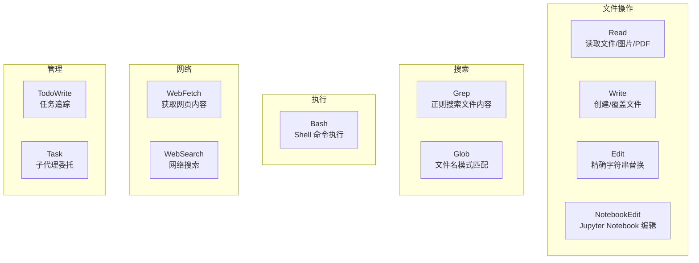

# 内置工具详解

## 工具系统概述

Claude Code 内置了丰富的工具来与文件系统、Shell 和外部世界交互。这些工具是 Agent Loop 的基础——Claude 自主决定何时调用哪个工具、如何处理返回结果。



## Read — 文件读取

最基础的工具，用于读取文件系统上的任何文本文件、图片和 PDF。

**典型用法：**
```
Claude 读取 src/components/Header.tsx 理解现有组件结构
```

**能力：**
- 读取文本文件（指定行范围）
- 读取图片文件（PNG、JPG 等，多模态理解）
- 读取 PDF 文件（按页范围）
- 读取 Jupyter Notebook（.ipynb）
- 读取目录结构

**最佳实践：**
- 先探索目录，再读取关键文件
- 对大型文件指定行范围（offset + limit）
- 不要重复读取刚编辑过的文件（编辑结果会被追踪）

## Write — 文件创建/覆盖

创建新文件或完全覆盖已有文件。使用前必须先 Read 已有文件。

**适用场景：**
- 创建新文件
- 完全重写小文件
- 写入配置文件

**注意事项：**
- 修改已有文件时优先使用 Edit（仅传 diff，更高效）
- 权限系统可以限制 Write 的文件范围

## Edit — 精确编辑

对文件进行精确的字符串替换。这是 Claude Code 最高频使用的编辑工具。

**工作原理：**
1. 提供 `old_string`（要替换的精确文本）
2. 提供 `new_string`（替换后的文本）
3. `old_string` 必须在文件中唯一，否则需要更多上下文使其唯一
4. 使用 `replace_all` 替换所有出现

**最佳实践：**
- `old_string` 需要足够的上下文确保唯一性
- 缩进和空白必须精确匹配
- 一次 Edit 处理一处修改，不要在一个 Edit 中修改多处逻辑独立的代码

## Bash — Shell 命令执行

在用户的 Shell 环境中执行命令。这是功能最强大也最需要小心的工具。

**常用场景：**

```bash
# 版本控制
git status
git diff
git log --oneline -5

# 包管理
npm install lodash
pip install requests

# 构建与测试
npm test
npm run build
npm run lint

# 文件操作
ls -la
find . -name "*.test.ts"
mkdir -p new-directory
```

**安全约束：**
- 由权限系统控制可执行的命令范围
- 默认需要用户确认，除非在 allow 规则中
- 支持超时设置（默认 120 秒，最大 600 秒）

## Grep — 内容搜索

按正则表达式搜索文件内容，返回匹配的行和上下文。

**使用模式：**
```
查找所有 "useState" 的使用：grep "useState"
查找 TODO 注释：grep "TODO"
查找特定导入：grep "import.*from.*lodash"
```

**vs Glob：** Grep 搜索**文件内容**，Glob 搜索**文件名**。

## Glob — 文件名匹配

按模式匹配文件名，用于快速定位文件。

**模式示例：**
```
所有 TypeScript 文件: **/*.ts
src 下的组件: src/components/**/*.tsx
测试文件: **/*.test.*
```

## WebFetch — 网页抓取

获取 URL 内容并转换为 Markdown 进行分析。

**适用场景：**
- 查阅最新框架文档
- 获取 GitHub README
- 检查 API 文档

**限制：**
- 无法访问需要认证的私有页面
- 结果可能会被截断
- 有 15 分钟缓存

## WebSearch — 网络搜索

执行网络搜索并返回结果摘要。

**适用场景：**
- 获取最新信息（Claude Code 知识截止后的变化）
- 搜索技术文档和最佳实践
- 查找 bug 解决方案

**来源引用：** 搜索结果必须标注来源链接。

## 工具调用统计

在一次典型的开发会话中，工具调用的大致分布：

```
Edit:     ████████████████████ 40%
Read:     ████████████ 25%
Bash:     ██████████ 20%
Grep:     ██████ 10%
Other:    ██ 5%
```

## 实践练习

1. 用 Read 读取并理解一个陌生的源文件
2. 用 Edit 进行一次精确的代码重构（不要用 Write 重写）
3. 用 Grep 找出项目中所有的 deprecated 用法
4. 用 WebFetch 查阅最新版本的框架文档并应用到代码中
5. 对比 Edit 和 Write 的适用场景
