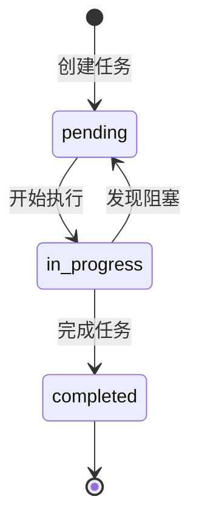

# TodoWrite 与任务管理

## 什么是 TodoWrite？

TodoWrite 是 Claude Code 的任务追踪工具。Claude 使用它来规划、跟踪和执行复杂的多步骤任务。

## 何时使用 TodoWrite

### 自动触发条件

Claude Code 在以下情况会自动使用 TodoWrite：

1. **多步骤任务**：任务需要 3 个或更多独立步骤
2. **复杂操作**：需要仔细规划和组织的工作
3. **用户明确要求**：用户提供了任务列表

### 任务状态



| 状态 | 含义 |
|------|------|
| `pending` | 任务已创建，尚未开始 |
| `in_progress` | 正在执行（同时只能有一个） |
| `completed` | 已完成 |

## TodoWrite 的结构

每个任务条目包含：

```json
{
  "content": "Add dark mode toggle to Settings",
  "status": "in_progress",
  "activeForm": "Adding dark mode toggle to Settings"
}
```

| 字段 | 说明 |
|------|------|
| `content` | 祈使式描述（"做什么"） |
| `status` | 任务状态 |
| `activeForm` | 进行时描述（"正在做什么"） |

## 使用场景

### 场景 1：新功能开发

Claude 自动分解为子任务：

```
1. [in_progress] 创建设置页面的暗色模式开关组件
2. [pending] 添加暗色模式状态管理（Context/Store）
3. [pending] 实现暗色主题的 CSS 样式
4. [pending] 更新现有组件支持主题切换
5. [pending] 运行测试并确保构建通过
```

### 场景 2：大规模重构

```
1. [pending] 搜索所有 getCwd 引用位置
2. [pending] 在 src/utils/fs.ts 中重命名函数
3. [pending] 更新 src/components/ 下的 8 个引用
4. [pending] 更新 src/api/ 下的 5 个引用
5. [pending] 更新测试文件
6. [pending] 运行完整测试套件
```

### 场景 3：Bug 修复

```
1. [in_progress] 复现并定位分页重置 bug
2. [pending] 修复搜索参数的状态保持逻辑
3. [pending] 添加分页状态的回归测试
4. [pending] 验证边界情况（空结果、单页结果）
```

## 最佳实践

### 粒度控制

- **太粗**："实现用户系统"——一个任务覆盖 20 个文件
- **太细**："添加 import 语句"——琐碎到不值得追踪
- **合适**："创建用户注册 API 端点"——明确定义且可在一个会话中完成

### 执行原则

1. **一次只做一个**：任何时刻只有一个 `in_progress` 任务
2. **立即更新状态**：完成就标记 completed，不批量更新
3. **遇到阻塞不标完成**：创建新任务描述阻塞原因
4. **清理无关任务**：不再相关的任务直接移除

### 何时不使用

以下情况不需要 TodoWrite：

- 单一简单任务（如"添加一个注释"）
- 信息查询（如"打印 Hello World 怎么写"）
- 琐碎操作（如"运行 npm install"）

## TodoWrite 如何帮助 Claude

1. **防止遗漏**：多项需求不会在执行过程中丢失
2. **展示进度**：用户可看到整体进展
3. **自我约束**：限制为一次只做一件事，提高质量
4. **上下文管理**：复杂任务不会因压缩而丢失进度

## 实践练习

1. 给 Claude 一个涉及 5 个以上文件的任务，观察 TodoWrite 的自动分解
2. 手动说 "用 todo list 跟踪" 启动任务追踪
3. 观察 Claude 如何按顺序执行 pending → in_progress → completed
4. 对比有 TodoWrite 和没有 TodoWrite 时复杂任务的成功率
