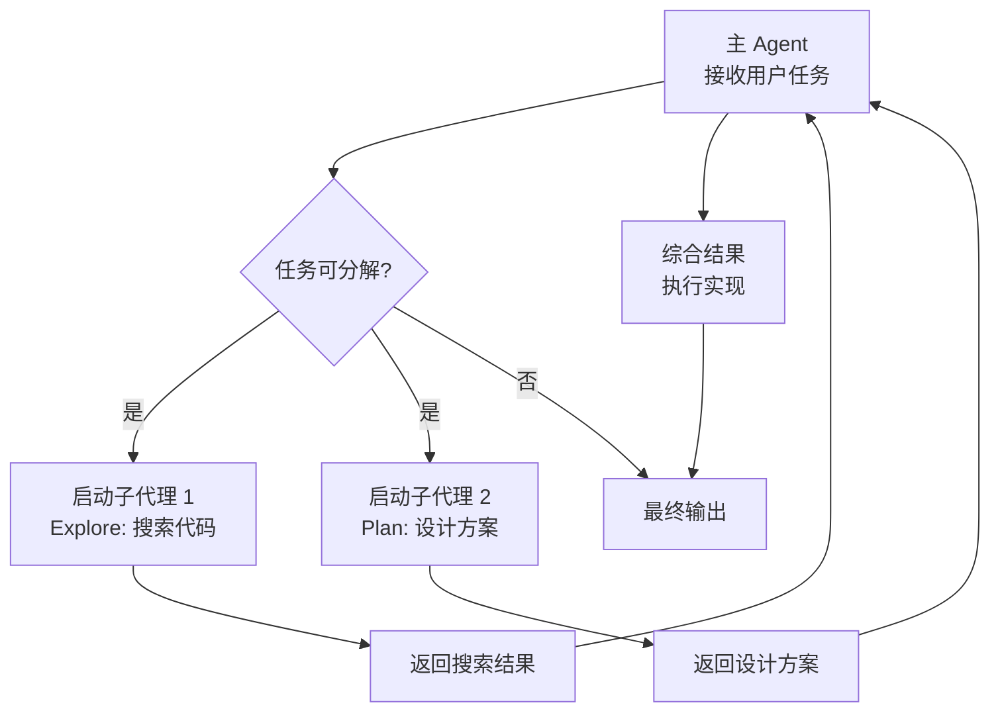
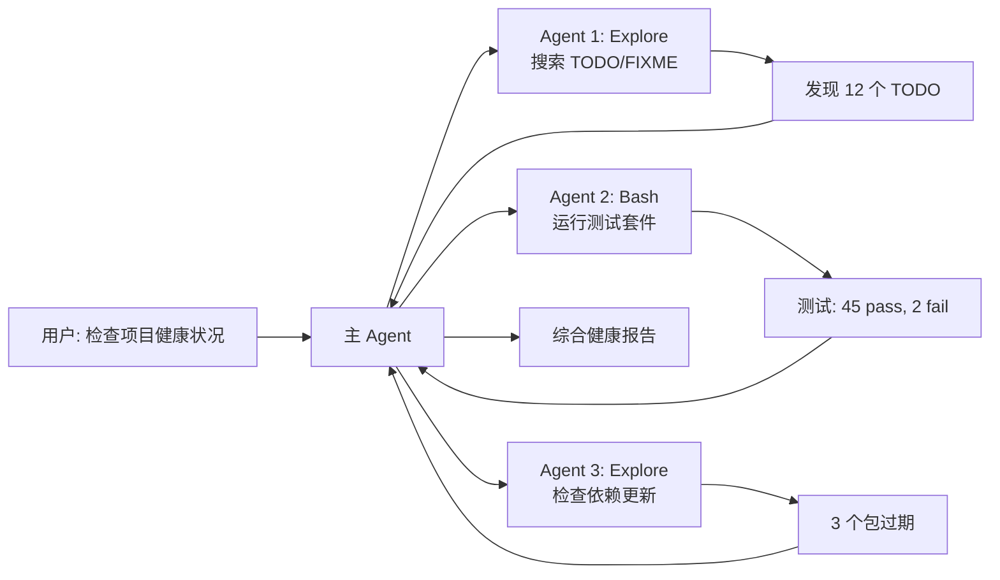

# Agent 子代理

## 什么是子代理（Sub-Agent）？

子代理是 Claude Code 中的一种任务委托机制。Claude 可以将大型或独立的子任务派发给专门的子代理执行。每个子代理有独立的上下文窗口，不会污染主代理的上下文。

## 子代理类型

| 类型 | 用途 | 典型场景 |
|------|------|---------|
| `general-purpose` | 通用复杂多步骤任务 | 研究、代码编写、多文件操作 |
| `Explore` | 快速只读代码搜索 | 查找定义、定位引用、探索结构 |
| `Plan` | 架构设计和实现规划 | 需求分析、方案设计、风险评估 |
| `claude-code-guide` | Claude Code 自身使用咨询 | 功能询问、配置问题 |
| `statusline-setup` | 配置状态栏 | 设置 Claude Code UI |

## 子代理工作原理



## 何时使用子代理

### 使用子代理的场景

1. **大规模代码搜索**：需要在多个目录和模式中搜索，结果量大
2. **独立分析任务**：不同的分析维度可以并行处理
3. **减少上下文污染**：搜索结果太多会撑满主窗口，用子代理承载
4. **并行加速**：多个独立任务同时执行

### 不应使用子代理的场景

- 简单的单文件操作
- 需要主代理全部上下文的决策
- 几步就能完成的任务

## 使用方式

### 自动调用

Claude Code 在以下情况会自动使用子代理：

```
用户: "审查整个项目中的认证逻辑"
→ Claude 自动启动 Explore 子代理搜索所有相关代码
→ 综合结果后给出分析
```

### 并行子代理

多个独立的子代理可以**并行执行**：



### 子代理隔离模式

```bash
# 使用 git worktree 隔离子代理
# 每个子代理在独立的 worktree 中工作，互不影响
```

## 专用子代理详解

### Explore Agent

用于快速只读代码搜索。

**优势：**
- 速度极快，只读操作无需用户确认
- 独立上下文，不消耗主代理 token
- 并行搜索多个方向

**最佳实践：**
- "搜索 src/components/**/*.tsx 中的模式"
- "找到 X 在哪里定义，哪些文件引用了 Y"
- "快速或中等" 控制搜索广度

### Plan Agent

用于软件架构和实现规划。

**优势：**
- 独立分析和设计
- 考虑多种方案和权衡
- 输出结构化的实现计划

### General-Purpose Agent

通用代理，可处理完整的复杂任务。

**优势：**
- 拥有全部工具访问权
- 可执行多步骤任务
- 独立上下文窗口

## 提示词编写技巧

子代理看不到你的对话历史，所以提示词必须**自包含**：

```
差: "根据之前的讨论，修这个 bug"
好: "在 src/auth/login.ts 中，当 JWT token 过期时，
     前端没有正确处理 401 响应。
     需要：
     1. 在 catch 块中检查 error.status === 401
     2. 自动调用 refreshToken()
     3. 重试原始请求
     背景：前端使用 axios，token 通过 interceptor 附加"
```

### 良好提示词的要素

1. **明确目标**：要完成什么
2. **相关背景**：为什么这样做，有哪些约束
3. **已发现的线索**：你排查过的方向
4. **输出要求**：期望什么格式、多长

## 上下文管理

### 上下文隔离

```
主 Agent 上下文: 200K tokens
  ├── 子代理 1 上下文: 独立 200K tokens
  ├── 子代理 2 上下文: 独立 200K tokens
  └── 子代理 3 上下文: 独立 200K tokens
```

子代理结束后，只有结果摘要返回主代理，详细的中间过程不会污染主上下文。

### Worktree 隔离（高级）

```bash
# 子代理使用独立 worktree
# 代码改动在自己的分支上
# 可以安全地独立测试
# 通过 PR 合并结果
```

## 实践练习

1. 给 Claude 分配一个需要大规模搜索的任务，观察它如何自动启动子代理
2. 请求 Claude 对 3 个独立模块并行分析
3. 编写一个高质量的 Explore 子代理提示词
4. 对比使用子代理和不使用子代理的上下文消耗（通过 `/cost`）
