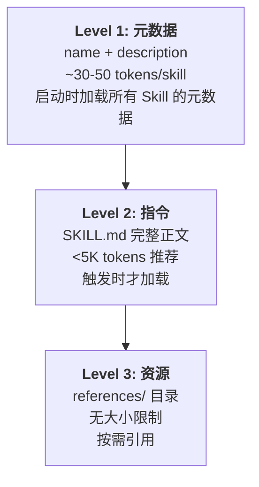
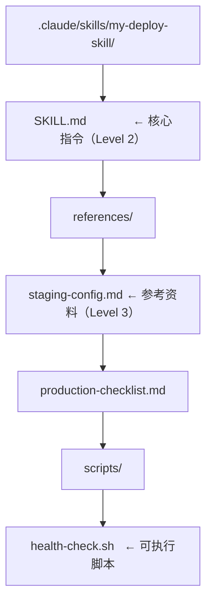

# Skill 概念与格式

## 什么是 Skill？

Skill 是 Claude Code 的**可复用工作流模板**。它将专业知识、操作步骤和最佳实践打包成文件，供 Claude 在需要时加载并执行。

对比自定义斜杠命令，Skill 是它的进化版本——更灵活、更强大、支持渐进式加载。

## Skill vs 斜杠命令

| 特性 | 斜杠命令 | Skill |
|------|---------|------|
| 加载时机 | 手动 `/command` | 手动 + 自动触发 |
| 触发方式 | 只有 `/` 前缀 | `/skill` 或自动匹配 |
| 上下文消耗 | 全量加载 | 渐进式披露（3 级） |
| 资源文件 | 不支持 | 支持 references/ |
| 跨平台 | 仅有 Claude Code | Claude.ai + API 通用 |
| 子代理执行 | 不支持 | 支持 `context: fork` |

## 渐进式披露架构

Skill 的核心设计理念是**渐进式披露**——只在需要时才加载更多信息：



### 为什么这很重要？

- **100 个 Skill 也不会撑爆上下文**：不触发就只消耗 ~5K tokens（元数据）
- **每个 Skill 可以有大量参考资料**：不使用时零消耗
- **响应更快**：不需要把所有 Skill 都塞进提示词

## SKILL.md 格式

### 基本结构

```markdown
---
name: my-skill
description: What this skill does and when to use it. Third person, 1024 char max.
disable-model-invocation: false
allowed-tools: Read, Write, Edit, Grep, Glob
---

# Skill 标题

## 快速开始
具体的使用说明...

## 详细步骤
1. 首先...
2. 然后...

## 参考
详细的参考资料放在 references/ 目录中。
```

### Frontmatter 字段

| 字段 | 必须 | 说明 |
|------|------|------|
| `name` | 是 | Skill 标识名，kebab-case |
| `description` | 是 | 功能和触发条件，第三人称，最多 1024 字符 |
| `allowed-tools` | 否 | 限制 Skill 可用的工具 |
| `disable-model-invocation` | 否 | `true` = 只能手动 `/skill-name` 触发 |
| `context` | 否 | `fork` = 在子代理中运行，隔离上下文 |

## 放置位置

| 位置 | 作用范围 |
|------|---------|
| `.claude/skills/<name>/SKILL.md` | 项目级，团队共享 |
| `~/.claude/skills/<name>/SKILL.md` | 用户级，所有项目可用 |
| 插件 `skills/<name>/SKILL.md` | 插件级，带命名空间 |

## 目录结构



## Skill 触发方式

### 自动触发

Claude 分析用户请求，匹配 Skill 的 `description` 中描述的场景：


### 手动触发

```
/deploy-skill staging
```

## description 编写指南

description 是 Skill 能否被正确触发的关键。

```yaml
# 差 - 太模糊
description: Helps with deployment

# 好 - 具体描述场景和触发条件
description: >
  Deploy the application to staging or production environments.
  Use when the user wants to deploy, release, or ship code.
  Handles environment-specific configuration, health checks,
  and rollback procedures.
```

## 实践练习

1. 查看系统中已有的 Skill：检查 `.claude/skills/` 和 `~/.claude/skills/`
2. 写一个简单的 Skill：只需 SKILL.md 的 name + description
3. 测试渐进式披露：创建 references/ 中的大文件，观察不触发时不消耗上下文
4. 对比自动触发 vs 手动触发（`disable-model-invocation: true`）
