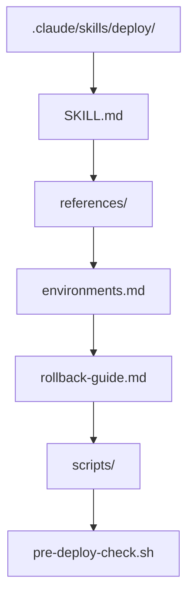

# 编写自定义 Skill

## 设计原则

在编写 Skill 之前，先问自己：

1. **这个工作流会重复使用吗？**（如果只用一次，直接对话即可）
2. **是否有明确的最佳实践？**（Skill 应该体现团队共识）
3. **是否需要领域知识？**（Skill 可以携带专业参考资料）

## 实战：编写部署 Skill

### 目录结构



### SKILL.md

```markdown
---
name: deploy
description: >
  Deploy the application to a target environment (staging or production).
  Use when user wants to deploy, release, ship code, or push to an environment.
  Runs pre-deploy checks, builds, deploys, and verifies health.
allowed-tools: Bash(npm *), Bash(git *), Bash(docker *), Read, WebFetch
---

# 部署 Skill

## 参数
- 目标环境：staging / production（默认 staging）
- 版本标签：可选，默认使用 git describe

## 执行流程

### 1. 预部署检查
运行 `scripts/pre-deploy-check.sh`：
- 确认在正确的分支上
- 确认工作区干净（无未提交改动）
- 确认所有测试通过

### 2. 构建
```bash
npm run build
```

### 3. 部署
- Staging: `docker compose -f docker-compose.staging.yml up -d`
- Production: 参考 references/environments.md 中的生产部署流程

### 4. 健康检查
```bash
curl -f http://localhost:3000/health
```

### 5. 验证
检查关键端点响应正常。

## 失败处理
如果任何步骤失败，参考 references/rollback-guide.md 执行回滚。

## 参考
- 环境配置: references/environments.md
- 回滚指南: references/rollback-guide.md
```

### references/environments.md

```markdown
# 环境配置参考

## Staging
- URL: https://staging.example.com
- 服务器: staging-server-01
- 数据库: staging-db (PostgreSQL 16)
- 自动构建: 合并到 main 时触发

## Production
- URL: https://example.com
- 服务器: prod-server-01, prod-server-02
- 数据库: prod-db-primary (PostgreSQL 16, Multi-AZ)
- 部署策略: 蓝绿部署
- 审批要求: 需要 Tech Lead 审批
```

### scripts/pre-deploy-check.sh

```bash
#!/bin/bash
set -e

echo "=== Pre-Deploy Check ==="

# Check branch
BRANCH=$(git branch --show-current)
if [ "$1" = "production" ] && [ "$BRANCH" != "main" ]; then
  echo "ERROR: Production deploy requires 'main' branch"
  exit 1
fi

# Check clean
if [ -n "$(git status --porcelain)" ]; then
  echo "ERROR: Working directory not clean"
  exit 1
fi

# Check tests
echo "Running tests..."
npm test -- --ci

echo "Pre-deploy check passed!"
```

## 高级特性

### context: fork（子代理隔离）

```yaml
---
name: code-review
description: >
  Comprehensive code review of recent changes.
  Use when user requests a review, audit, or quality check.
context: fork
allowed-tools: Read, Grep, Glob, Bash(git *)
---
```

设置 `context: fork` 后，Skill 会在一个独立的子代理中运行。优势：

- **隔离上下文**：不会污染主会话窗口
- **并行执行**：多个 fork skill 可以同时运行
- **专注执行**：子代理只看 Skill 的内容，不受主对话干扰

### 参数传递（$ARGUMENTS）

```yaml
---
name: fix-issue
description: >
  Fix a GitHub issue. Use when user provides an issue number to fix.
---

# 修复 Issue #$ARGUMENTS

修复 GitHub Issue #$ARGUMENTS 描述的 bug。

1. 获取 Issue: !`gh issue view $ARGUMENTS --json title,body`
2. 分析问题根因
3. 实现修复
4. 添加测试
5. 验证修复
```

### 工具限制

```yaml
---
name: docs-generator
description: Generate documentation from source code. Use when user wants docs.
allowed-tools: Read, Grep, Glob, Write
---

# 文档生成器

只读源码，只写文档文件。
不能执行命令或编辑源码。
```

## Skill 编写清单

- [ ] `name` 使用 kebab-case
- [ ] `description` 用第三人称，明确触发条件
- [ ] 正文简洁，主要流程在 SKILL.md，详细资料在 references/
- [ ] 复杂 Skill 设置 `context: fork` 隔离执行
- [ ] 限制 `allowed-tools` 提高安全性
- [ ] 包含明确的成功标准和失败处理

## 实践练习

1. 为你的项目编写一个完整的部署 Skill
2. 测试 `context: fork` 与非 fork 的区别
3. 在多 Skill 共存的情况下测试自动触发的准确性
4. 为 Skill 编写 references/ 参考资料
