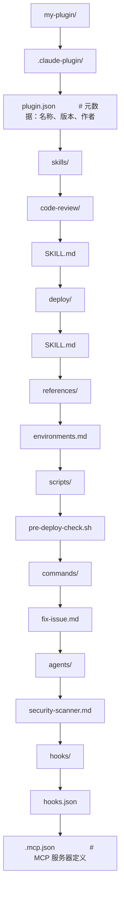

# Plugins 插件打包

## 什么是 Plugin？

Plugin 是将 Skills、Commands、Hooks、Agents 和 MCP Servers 打包在一起的分发单元。它让你可以跨项目、跨团队分享 Claude Code 的扩展功能。

## 五大扩展组件回顾

| 组件 | 格式 | 位置 |
|------|------|------|
| Skills | `SKILL.md` | `skills/<name>/SKILL.md` |
| Commands | `.md` | `commands/<name>.md` |
| Hooks | `hooks.json` | `hooks/hooks.json` |
| Agents | `.md` | `agents/<name>.md` |
| MCP Servers | `.mcp.json` | `.mcp.json` |

Plugin 将五者集成到一个目录中，用 `plugin.json` 声明元数据。

## Plugin 目录结构



## plugin.json

```json
{
  "name": "my-devops-plugin",
  "version": "1.0.0",
  "description": "DevOps automation toolkit - deploy, monitor, and rollback",
  "author": {
    "name": "Your Name",
    "email": "you@example.com"
  },
  "repository": "https://github.com/you/my-devops-plugin",
  "license": "MIT"
}
```

## hooks.json

```json
{
  "description": "Code quality hooks",
  "hooks": {
    "PostToolUse": [
      {
        "matcher": "Edit|Write",
        "hooks": [
          {
            "type": "command",
            "command": "jq -r '.tool_input.file_path' | xargs npx prettier --write",
            "timeout": 30
          }
        ]
      }
    ],
    "Stop": [
      {
        "matcher": "",
        "hooks": [
          {
            "type": "prompt",
            "prompt": "Verify: tests pass, build succeeds, no linter errors. Return 'approve' or 'block'.",
            "timeout": 30
          }
        ]
      }
    ]
  }
}
```

## Plugin 生命周期命令

```bash
# 安装插件
/plugin install owner/repo

# 启用/禁用
/plugin enable my-plugin
/plugin disable my-plugin

# 验证当前目录
/plugin validate .

# 列出已安装
/plugin list

# 添加开发市场
/plugin marketplace add /path/to/local/plugins
```

## 命名空间

Plugin 中的组件自动带命名空间，避免冲突：

```
/my-plugin:deploy staging       # 调用 my-plugin 的 deploy skill
/my-plugin:fix-issue 42        # 调用 my-plugin 的 fix-issue 命令
```

## 安装源

| 源 | 命令 |
|----|------|
| GitHub Release | `/plugin install owner/repo` |
| 本地目录 | `/plugin install ./path/to/plugin` |
| Git URL | `/plugin install https://github.com/...` |
| 市场 | `/plugin install marketplace/name` |

## 发布 Plugin

### 步骤


### GitHub Release 要求

1. Tag 格式使用语义版本：`v1.0.0`
2. Release 包含完整的 Plugin 源码
3. README 说明安装方法：`/plugin install owner/repo`

## 安全最佳实践

| 原则 | 说明 |
|------|------|
| 不在 manifest 中存储密钥 | 使用环境变量 |
| 使用 `${CLAUDE_PLUGIN_ROOT}` | 不硬编码路径 |
| 限制 `allowed-tools` | 最小权限原则 |
| 钩子不做危险操作 | 不执行 rm、不修改系统配置 |
| 验证输入 | 参数中的路径、命令做安全检查 |

## 实践练习

1. 将之前的 deploy skill 打包为 Plugin
2. 添加 hooks.json 实现自动格式化
3. 测试 `/plugin validate` 验证打包正确性
4. 练习命名空间：检查 `/help` 中 Plugin 命令的前缀
5. 发布到 GitHub 并在另一个项目中安装测试
