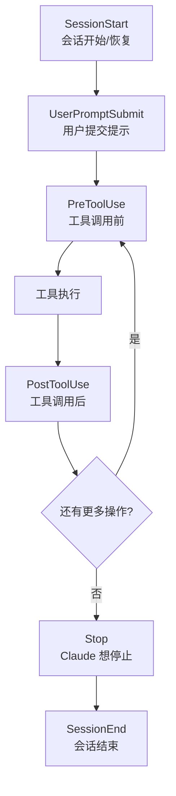

# 钩子事件与生命周期

## 什么是 Hooks？

Hooks 是 Claude Code 的**事件驱动自动化系统**。它们在特定生命周期事件发生时自动执行，实现确定性的、可预测的行为控制。



## 完整的 10 个生命周期事件

| 事件 | 触发时机 | 典型用途 |
|------|---------|---------|
| **SessionStart** | 会话开始或恢复 | 注入上下文、设置环境 |
| **UserPromptSubmit** | 用户提交提示词 | 注入动态上下文、安全检查 |
| **PreToolUse** | 任何工具调用**之前**（可阻止） | 阻止危险文件写入、验证 Bash 命令 |
| **PostToolUse** | 工具调用成功**之后** | 自动格式化、运行 Linter、发送通知 |
| **Notification** | Claude 需要用户注意 | 桌面通知、Slack 提醒 |
| **Stop** | Claude 考虑停止响应 | 验证任务完成、运行最终检查 |
| **SubagentStart** | 子代理启动 | 设置子代理环境 |
| **SubagentStop** | 子代理停止 | 子代理任务验证 |
| **PreCompact** | 上下文压缩前 | 保存关键信息 |
| **SessionEnd** | 会话结束 | 清理、日志记录 |

## 事件详解

### PreToolUse

最关键的安全控制点——可以在工具执行前阻止它。

**常见场景：**
- 阻止写入 `.env`、`credentials.json` 等敏感文件
- 验证 Bash 命令不包含危险操作
- 对特定类型的文件强制执行额外审查

```json
{
  "hooks": {
    "PreToolUse": [
      {
        "matcher": "Write",
        "hooks": [
          {
            "type": "command",
            "command": "bash ${CLAUDE_PLUGIN_ROOT}/hooks/validate-write.sh"
          }
        ]
      }
    ]
  }
}
```

### PostToolUse

执行后自动处理——格式化、检查、通知。

**常见场景：**
- 每次 Edit/Write 后自动运行 Prettier
- Git commit 后自动运行测试
- 文件修改后更新依赖图

### Stop

Claude 完成任务准备停止时触发。这是质量保证的最后一道关卡。

**常见场景：**
- 验证所有测试通过
- 确认没有遗留 TODO
- 确保构建成功

### UserPromptSubmit

用户每次提交提示时触发，用于注入上下文。

**常见场景：**
- 自动附加当前 git 分支和时间戳
- 注入安全检查提示
- 添加团队规范提醒

## 配置位置

### settings.json 格式（直接）

```json
{
  "hooks": {
    "PostToolUse": [
      {
        "matcher": "Edit|Write",
        "hooks": [
          {
            "type": "command",
            "command": "npx prettier --write ${CLAUDE_PROJECT_DIR}/$TOOL_FILE_PATH"
          }
        ]
      }
    ]
  }
}
```

### hooks.json 格式（Plugin 内）

```json
{
  "description": "Code quality automation",
  "hooks": {
    "PostToolUse": [
      {
        "matcher": "Edit|Write",
        "hooks": [{ "type": "command", "command": "..." }]
      }
    ]
  }
}
```

## Matcher 模式

`matcher` 决定了钩子对哪些工具调用生效：

| Matcher | 匹配范围 |
|---------|---------|
| `"Write"` | 只匹配 Write 工具 |
| `"Edit|Write"` | 匹配 Edit 或 Write |
| `"Bash(git *)"` | 匹配特定 Bash 子命令 |
| `"*"` | 匹配所有工具（不推荐，影响性能） |

### Matcher 最佳实践

```
差: "*"                          ← 太宽泛，影响所有工具
差: "Write|Edit|Bash|Read|..."   ← 手动列举所有
好: "Edit|Write"                 ← 精确的意图表达
好: "Bash(git commit:*)"        ← 精确的子命令匹配
```

## 钩子加载规则

1. **会话启动时加载**——修改钩子配置后需要重新启动会话
2. **匹配的所有钩子并行执行**——钩子之间不应有依赖
3. **每个钩子独立运行**——看不到其他钩子的输出
4. **查看已加载的钩子**：使用 `/hooks` 命令

## 调试

```bash
# 启动调试模式查看钩子执行
claude --debug

# 审查钩子配置
/hooks
```

## 实践练习

1. 配置 PostToolUse 钩子，在每次编辑后自动运行 ESLint
2. 配置 PreToolUse 钩子，阻止对 `.env` 文件的写入
3. 配置 Stop 钩子，确保停止前测试全部通过
4. 使用 `/hooks` 审查已加载的钩子配置
