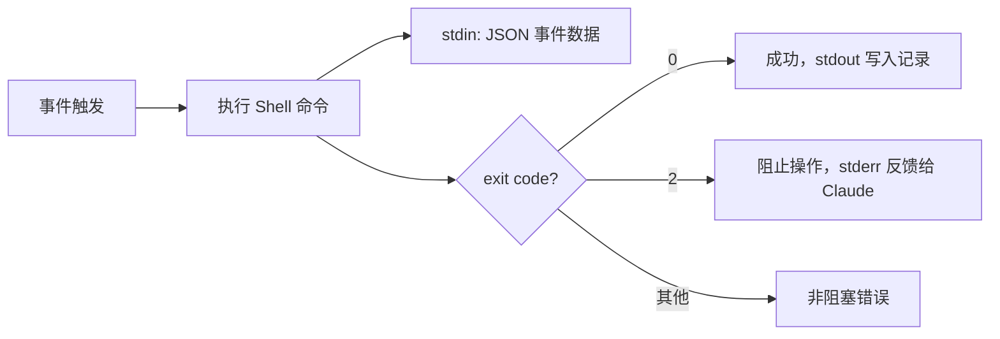
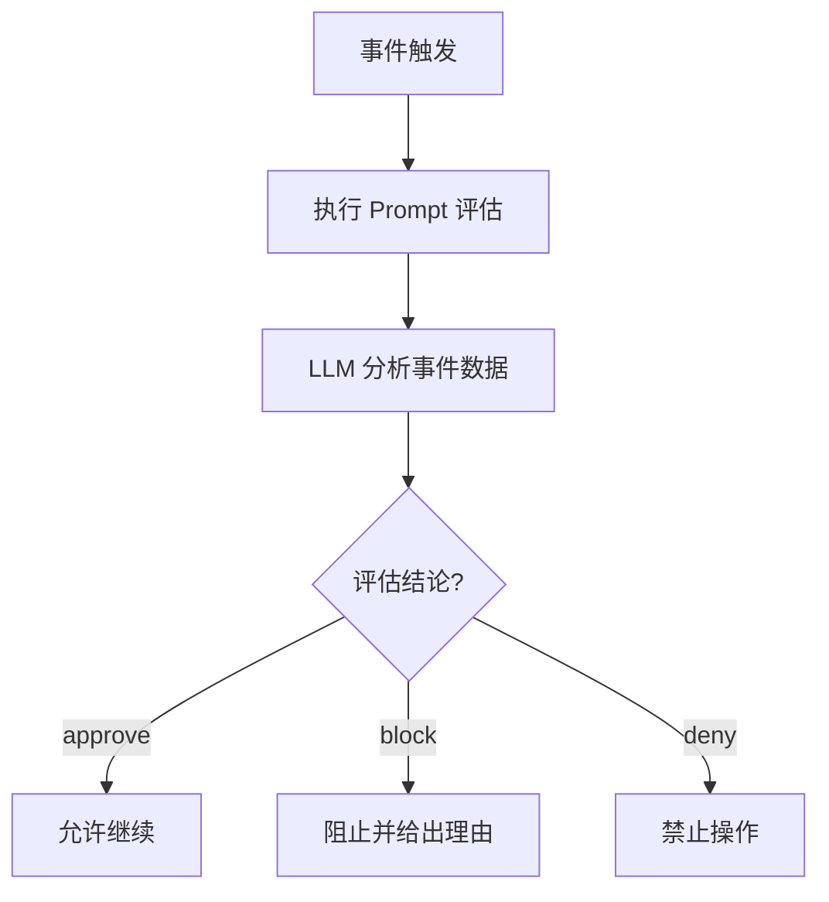
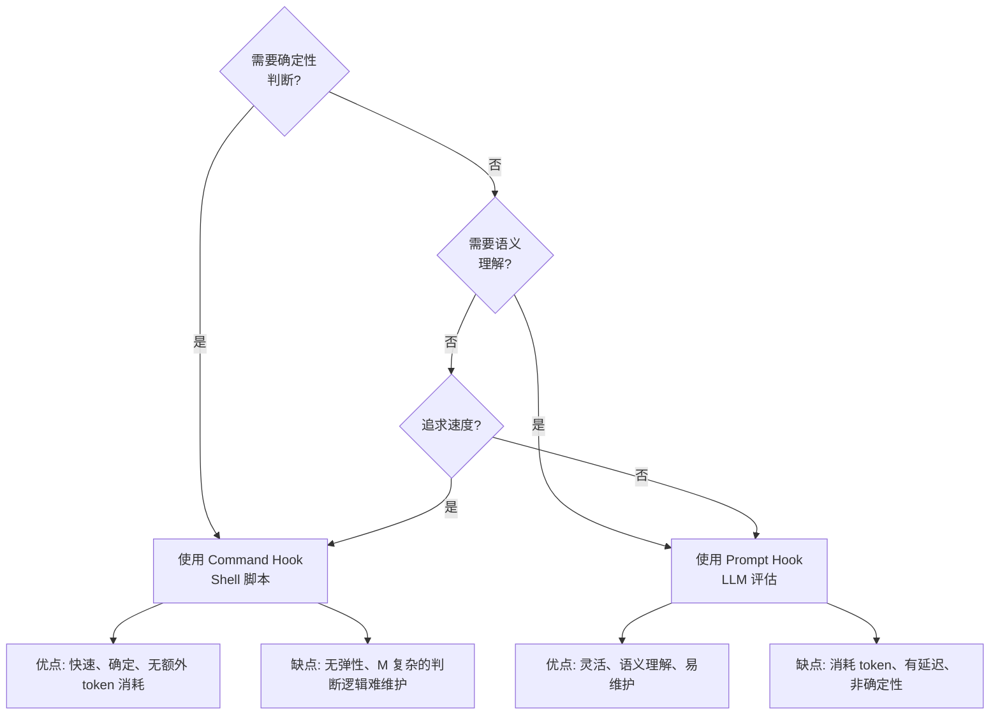

# 命令钩子与 Prompt 钩子

## 两种钩子类型

Claude Code 支持两种钩子实现方式：

| 类型 | 实现 | 适用场景 |
|------|------|---------|
| **Command Hook** | Shell 命令 | 确定性检查、文件操作、快速验证 |
| **Prompt Hook** | LLM 提示词 | 语义判断、复杂决策、自然语言推理 |

## Command Hook

### 工作原理



### 基本格式

```json
{
  "type": "command",
  "command": "bash /path/to/script.sh",
  "timeout": 60
}
```

### 实战 1：敏感文件保护

`hooks/protect-sensitive.sh`：

```bash
#!/bin/bash
# 从 stdin 读取 JSON 输入
INPUT=$(cat)
FILE_PATH=$(echo "$INPUT" | jq -r '.tool_input.file_path // ""')

# 检查敏感路径模式
SENSITIVE_PATTERNS=(
  "*.env" "*.env.*" "*credentials*" "*.pem"
  "*secret*" "*.key" "*password*"
)

for pattern in "${SENSITIVE_PATTERNS[@]}"; do
  if [[ "$FILE_PATH" == $pattern ]]; then
    echo "{\"hookSpecificOutput\": {\"permissionDecision\": \"deny\"}, \"systemMessage\": \"Blocked write to sensitive file: $FILE_PATH\"}"
    exit 2
  fi
done

exit 0
```

配置：

```json
{
  "hooks": {
    "PreToolUse": [
      {
        "matcher": "Write",
        "hooks": [
          {
            "type": "command",
            "command": "bash ${CLAUDE_PLUGIN_ROOT}/hooks/protect-sensitive.sh",
            "timeout": 10
          }
        ]
      }
    ]
  }
}
```

### 实战 2：自动格式化

`hooks/auto-format.sh`：

```bash
#!/bin/bash
INPUT=$(cat)
TOOL_NAME=$(echo "$INPUT" | jq -r '.tool_name')
FILE_PATH=$(echo "$INPUT" | jq -r '.tool_input.file_path // ""')

if [ "$TOOL_NAME" = "Edit" ] || [ "$TOOL_NAME" = "Write" ]; then
  if [[ "$FILE_PATH" == *.ts ]] || [[ "$FILE_PATH" == *.tsx ]]; then
    npx prettier --write "$FILE_PATH" 2>/dev/null
    echo "Formatted: $FILE_PATH"
  fi
fi

exit 0
```

### 退出码规则

| 退出码 | 含义 |
|--------|------|
| `0` | 成功，stdout 会显示在记录中 |
| `2` | 阻止操作，stderr 作为反馈给 Claude |
| 其他 | 非阻塞错误，仅记录警告 |

## Prompt Hook

### 工作原理

Prompt Hook 让 LLM 来判断是否允许操作或任务是否完成。



### 基本格式

```json
{
  "type": "prompt",
  "prompt": "Evaluate if this operation should be allowed. Consider security, correctness, and project conventions.",
  "timeout": 30
}
```

### 实战 3：智能 Stop 验证

```json
{
  "hooks": {
    "Stop": [
      {
        "matcher": "",
        "hooks": [
          {
            "type": "prompt",
            "prompt": "Evaluate whether Claude has truly completed the task. Check: (1) Were all requested changes made? (2) Do tests pass? (3) Is there any unfinished work? Return 'approve' if done, 'block' with specific reasons if not.",
            "timeout": 30
          }
        ]
      }
    ]
  }
}
```

### 实战 4：智能 PreToolUse

```json
{
  "hooks": {
    "PreToolUse": [
      {
        "matcher": "Bash",
        "hooks": [
          {
            "type": "prompt",
            "prompt": "Review this bash command for safety: $TOOL_INPUT. Check for: destructive operations (rm -rf), force push, sudo usage, or modifying system files. Return 'approve' if safe, 'deny' if dangerous, with reason.",
            "timeout": 10
          }
        ]
      }
    ]
  }
}
```

## Command vs Prompt：如何选择



### 选择指南

| 场景 | 推荐 | 原因 |
|------|------|------|
| 阻止写入 `.env` | Command | 确定性模式匹配，不需 LLM |
| 自动运行 formatter | Command | 快速、确定性操作 |
| 验证任务完成质量 | Prompt | 需要语义理解 |
| 判断 Bash 命令安全性 | Prompt | 需要理解命令意图 |
| 文件路径白名单 | Command | 简单匹配 |

## Hook 可用变量

在 Hook 脚本中可用的环境变量：

| 变量 | 说明 |
|------|------|
| `CLAUDE_PROJECT_DIR` | 项目根目录 |
| `CLAUDE_PLUGIN_ROOT` | 当前 Plugin 根目录 |
| `$TOOL_INPUT` | 工具的输入参数（Prompt Hook） |
| stdin JSON | 完整的事件数据（Command Hook） |

## 实践练习

1. 编写 Command Hook 阻止写入 `.env` 和 `.pem` 文件
2. 编写 Prompt Hook 在 Stop 事件验证任务完成
3. 对比两种类型在同一个场景（如 Bash 命令验证）下的行为差异
4. 使用 `claude --debug` 调试钩子执行过程
