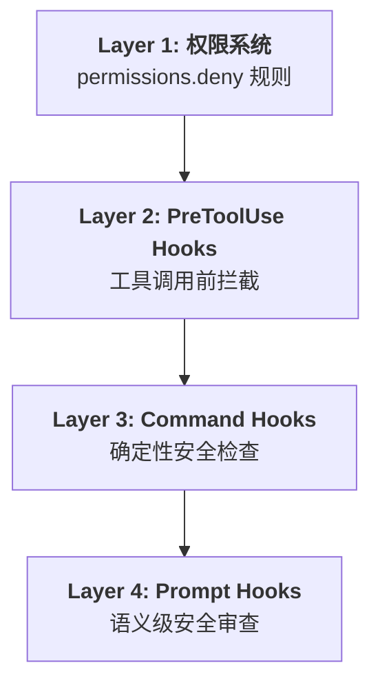

# 安全防护实战

## 安全威胁模型

Claude Code 拥有文件写入和 Shell 执行能力，必须建立多层安全防护。



## 防护场景与实现

### 场景 1：敏感文件保护

防止 Claude 读取或修改凭据文件。

```json
{
  "permissions": {
    "deny": [
      "Write(**/*.env)",
      "Write(**/*.env.*)",
      "Write(**/credentials*)",
      "Write(**/*.pem)",
      "Write(**/*.key)",
      "Write(**/secrets/**)",
      "Write(**/.ssh/**)"
    ]
  }
}
```

**Command Hook 增强（处理边缘情况）：**

```bash
#!/bin/bash
# hooks/block-sensitive-read.sh
INPUT=$(cat)
FILE_PATH=$(echo "$INPUT" | jq -r '.tool_input.file_path // ""')

# 即便使用 Read，也阻止读取敏感文件
if [[ "$FILE_PATH" == *.env ]] || [[ "$FILE_PATH" == *credentials* ]]; then
  echo "{\"hookSpecificOutput\":{\"permissionDecision\":\"deny\"},\"systemMessage\":\"Security: Cannot access credential files\"}"
  exit 2
fi
exit 0
```

### 场景 2：路径遍历防护

阻止 `../` 逃逸到项目目录之外。

```bash
#!/bin/bash
# hooks/block-path-traversal.sh
INPUT=$(cat)
FILE_PATH=$(echo "$INPUT" | jq -r '.tool_input.file_path // ""')

# 检测路径遍历
if echo "$FILE_PATH" | grep -q '\.\.'; then
  echo "{\"hookSpecificOutput\":{\"permissionDecision\":\"deny\"},\"systemMessage\":\"Security: Path traversal detected in: $FILE_PATH\"}"
  exit 2
fi

# 检测绝对路径指向项目外部
if [[ "$FILE_PATH" == /* ]]; then
  PROJECT_DIR="${CLAUDE_PROJECT_DIR}"
  if [[ "$FILE_PATH" != "$PROJECT_DIR"* ]]; then
    echo "{\"hookSpecificOutput\":{\"permissionDecision\":\"deny\"},\"systemMessage\":\"Security: Access outside project directory: $FILE_PATH\"}"
    exit 2
  fi
fi

exit 0
```

### 场景 3：危险命令拦截

```bash
#!/bin/bash
# hooks/block-dangerous-commands.sh
INPUT=$(cat)
COMMAND=$(echo "$INPUT" | jq -r '.tool_input.command // ""')

# 危险命令模式
DANGEROUS=(
  "rm -rf /"
  "sudo "
  "chmod 777"
  "git push --force"
  "git reset --hard"
  "> /dev/sda"
  "mkfs."
  "dd if="
  ":(){ :|:& };:"  # fork bomb
)

for pattern in "${DANGEROUS[@]}"; do
  if echo "$COMMAND" | grep -qi "$pattern"; then
    echo "{\"hookSpecificOutput\":{\"permissionDecision\":\"deny\"},\"systemMessage\":\"Security: Dangerous command blocked: $pattern\"}"
    exit 2
  fi
done

exit 0
```

### 场景 4：命令注入防护

```bash
#!/bin/bash
# hooks/block-command-injection.sh
INPUT=$(cat)
COMMAND=$(echo "$INPUT" | jq -r '.tool_input.command // ""')

# 检测命令注入模式
if echo "$COMMAND" | grep -qE '[;&|`$]'; then
  echo "{\"hookSpecificOutput\":{\"permissionDecision\":\"deny\"},\"systemMessage\":\"Security: Potential command injection\"}"
  exit 2
fi

exit 0
```

### 场景 5：Prompt Hook 综合审查

```json
{
  "hooks": {
    "PreToolUse": [
      {
        "matcher": "Bash|Write",
        "hooks": [
          {
            "type": "prompt",
            "prompt": "Security review. Check: (1) Is this writing to a sensitive location? (2) Is the bash command destructive? (3) Could there be data exfiltration? (4) Is credential exposure possible? Return 'approve' if safe or 'deny' with specific reason.",
            "timeout": 15
          }
        ]
      }
    ]
  }
}
```

## 完整安全配置模板

```json
{
  "permissions": {
    "deny": [
      "Write(**/*.env)",
      "Write(**/*.pem)",
      "Write(**/credentials*)",
      "Write(**/secrets/**)",
      "Bash(sudo:*)",
      "Bash(rm -rf:*)",
      "Bash(git push --force:*)"
    ],
    "ask": [
      "Bash(git commit:*)",
      "Bash(npm publish:*)",
      "Bash(docker push:*)"
    ]
  },
  "hooks": {
    "PreToolUse": [
      {
        "matcher": "Write|Bash",
        "hooks": [
          {
            "type": "command",
            "command": "bash ${CLAUDE_PLUGIN_ROOT}/hooks/security-check.sh",
            "timeout": 30
          }
        ]
      }
    ],
    "Stop": [
      {
        "matcher": "",
        "hooks": [
          {
            "type": "prompt",
            "prompt": "Final security review: Did this session touch credential files, modify auth logic, or change permissions? Return 'approve' or 'block'.",
            "timeout": 20
          }
        ]
      }
    ]
  }
}
```

## 安全检查清单

- [ ] `.env` 等凭据文件不可写入
- [ ] 路径遍历（`../`）被拦截
- [ ] 危险 Shell 命令被阻止
- [ ] Git force push 需要确认
- [ ] 系统级命令（sudo）完全禁止
- [ ] 配置文件和记忆文件保护
- [ ] Stop 钩子做最终安全审查

## 实践练习

1. 部署完整的安全配置模板到一个测试项目
2. 尝试让 Claude 写入 `.env` 文件，验证被阻止
3. 尝试让 Claude 执行 `rm -rf`，验证被拦截
4. 用 Prompt Hook 实现 Stop 事件的最终安全审查
