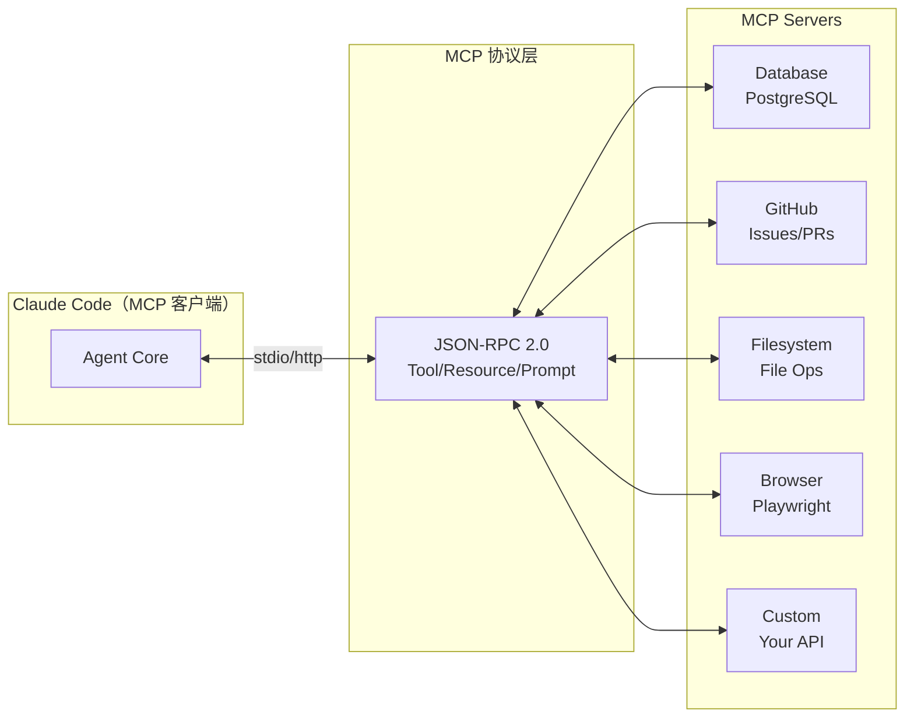
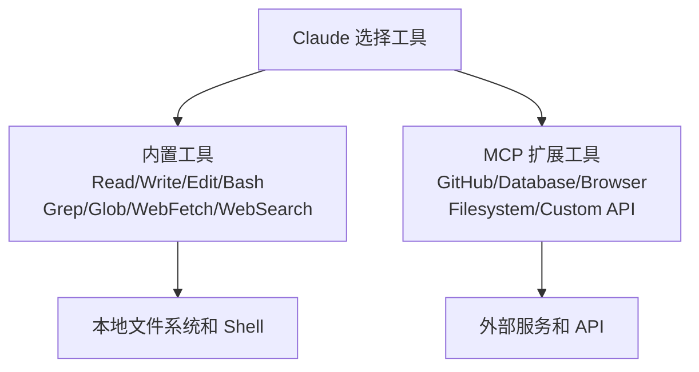
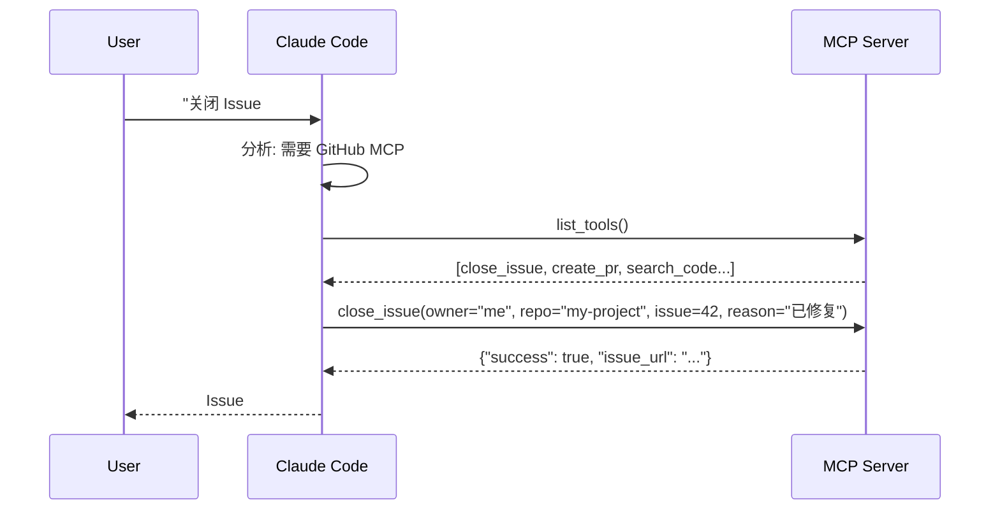

# MCP 协议概述

## 什么是 MCP？

**MCP（Model Context Protocol）** 是 Anthropic 发布的开放标准协议，用于连接 AI 模型与外部工具和数据源。可以理解为 **"AI 世界的 USB 协议"**——它提供了统一的接口，让 AI 能发现和调用任何外部服务。



## 核心概念

### 三个原语

| 原语 | 说明 | 示例 |
|------|------|------|
| **Tools** | 可执行的操作 | 查询数据库、创建 Issue、获取天气 |
| **Resources** | 可读取的数据 | 数据库 Schema、文件内容、API 文档 |
| **Prompts** | 预定义的提示模板 | SQL 查询模板、代码审查提示 |

### 三种传输模式

| 模式 | 工作原理 | 使用场景 | 占比 |
|------|---------|---------|------|
| **stdio** | MCP Server 作为本地子进程 | 本地工具（最常用） | 80% |
| **HTTP** | 连接到远程 HTTP 服务器 | 云服务、OAuth 认证 | 15% |
| **SSE** | Server-Sent Events | 已逐步被 HTTP 替代 | 5% |

## MCP 与内置工具的关系



## 配置 MCP Server

### 配置文件

MCP 配置在 `.mcp.json`（项目级）或 `~/.claude.json`（用户级）的 `mcpServers` 字段中。

### stdio 模式（本地）

```json
{
  "mcpServers": {
    "filesystem": {
      "command": "npx",
      "args": ["-y", "@modelcontextprotocol/server-filesystem", "/path/to/allowed/dir"]
    },
    "github": {
      "command": "npx",
      "args": ["-y", "@modelcontextprotocol/server-github"],
      "env": {
        "GITHUB_PERSONAL_ACCESS_TOKEN": "ghp_xxxx"
      }
    }
  }
}
```

### HTTP 模式（远程）

```json
{
  "mcpServers": {
    "remote-api": {
      "transport": "http",
      "url": "https://mcp-server.example.com",
      "headers": {
        "Authorization": "Bearer ${API_TOKEN}"
      }
    }
  }
}
```

## MCP 管理命令

```bash
# 添加 stdio 服务器
claude mcp add github -- npx -y @modelcontextprotocol/server-github

# 添加 HTTP 服务器
claude mcp add --transport http my-api https://mcp.example.com

# 列出所有服务器
claude mcp list

# 测试连接
claude mcp get github

# 交互式管理
/mcp
```

## MCP 执行流程



## 安全考量

| 层面 | 措施 |
|------|------|
| 传输加密 | HTTP 模式使用 HTTPS + TLS |
| 认证 | 通过 env 传 API Key，通过 HTTP headers 传 Token |
| 权限控制 | permissions 规则可限制 MCP 工具调用 |
| 沙箱 | stdio 模式运行在子进程中 |
| 审计 | 所有 MCP 工具调用被记录在会话历史中 |

### 安全配置示例

```json
{
  "permissions": {
    "allow": [
      "MCP(github:search_code)",
      "MCP(github:get_issue)"
    ],
    "ask": [
      "MCP(github:close_issue)",
      "MCP(github:create_pr)"
    ],
    "deny": [
      "MCP(github:delete_repo)"
    ]
  }
}
```

## MCP 生态

目前已有 **300+** 可用的 MCP Server，覆盖：

- **数据库**：PostgreSQL、SQLite、MySQL、MongoDB
- **云服务**：AWS、GCP、Cloudflare
- **开发工具**：GitHub、GitLab、Jira、Linear
- **浏览器**：Playwright、Puppeteer
- **监控**：Sentry、Datadog、Prometheus
- **设计**：Figma
- **搜索**：Brave Search、Tavily

## 实践练习

1. 安装并配置 GitHub MCP Server
2. 使用 Claude Code 通过 MCP 创建和关闭一个 GitHub Issue
3. 对比 MCP 工具和内置工具的权限配置差异
4. 探索 `claude mcp list` 和 `/mcp` 交互界面
