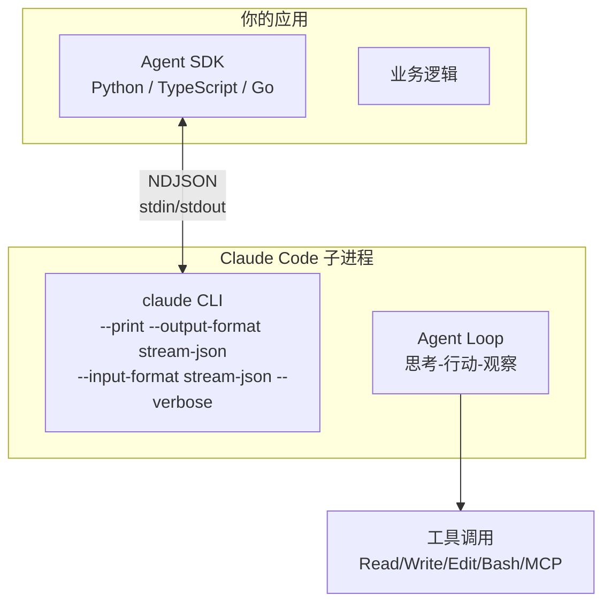
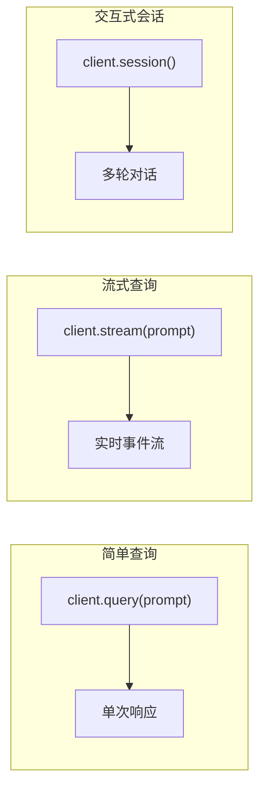

# Agent SDK 概述与架构

## 什么是 Agent SDK？

**Claude Agent SDK**（原名 Claude Code SDK）让你将 Claude Code 的 Agent 能力**编程式地嵌入到自己的应用中**。它启动 Claude Code CLI 作为子进程，通过 NDJSON（Newline-Delimited JSON）在 stdin/stdout 上进行通信。



## SDK 语言支持

| 语言 | 包名 | 状态 |
|------|------|------|
| Python | `claude-agent-sdk` | 官方支持 |
| TypeScript/JS | `@anthropic-ai/claude-agent-sdk` | 官方支持 |
| Go | `claude-agent-sdk-go` | 社区移植 |
| Rust | `apiari-claude-sdk` | 社区移植 |

## 安装

### Python

```bash
pip install claude-agent-sdk
```

### TypeScript

```bash
npm install @anthropic-ai/claude-agent-sdk
```

## 核心概念

### 三种使用模式



### 简单查询

```python
from claude_agent_sdk import ClaudeAgentClient

async with ClaudeAgentClient() as client:
    response = await client.query("What is 2+2?")
    print(response)  # "2 + 2 = 4"
```

### 流式查询

```python
from claude_agent_sdk import ClaudeAgentClient

async with ClaudeAgentClient() as client:
    async for event in client.stream("Explain the architecture of this project"):
        if event.type == "assistant":
            print(event.text, end="", flush=True)
        elif event.type == "tool_use":
            print(f"\n[Using tool: {event.tool_name}]")
```

### 交互式会话

```python
from claude_agent_sdk import ClaudeAgentClient

async with ClaudeAgentClient() as client:
    async with client.session() as session:
        # 多轮对话
        await session.send("Create a new React component")
        response1 = await session.receive()

        await session.send("Now add TypeScript types to it")
        response2 = await session.receive()

        # 分叉会话
        fork = await session.fork()
```

## 架构详解

### 子进程协议

SDK 启动 `claude` CLI 时使用以下标志：

```
--print --output-format stream-json --input-format stream-json --verbose
```

- `--print`：非交互模式
- `--output-format stream-json`：以 JSON 流输出事件
- `--input-format stream-json`：从 stdin 读取 JSON 消息
- `--verbose`：详细的调试信息

### 事件流

```typescript
// 典型的事件流
[
  { type: "system", message: "Session started" },
  { type: "assistant", text: "I'll help you create..." },
  { type: "tool_use", tool: "Read", input: { file_path: "src/app.ts" } },
  { type: "tool_result", output: "// file contents..." },
  { type: "assistant", text: "Now I'll edit..." },
  { type: "tool_use", tool: "Edit", input: { ... } },
  { type: "tool_result", output: "Edit successful" },
  { type: "result", text: "Task completed" },
  { type: "rate_limit", remaining: 50000, reset: "..." }
]
```

### 事件类型

| 事件 | 说明 |
|------|------|
| `System` | 系统消息、会话状态 |
| `Assistant` | Claude 的文本响应 |
| `Stream` | 流式文本增量 |
| `ToolUse` | 工具调用开始 |
| `ToolResult` | 工具调用结果 |
| `Result` | 任务完成 |
| `RateLimit` | Token 速率限制 |

## 配置选项

```python
from claude_agent_sdk import ClaudeAgentClient, Config

config = Config(
    model="sonnet",                    # opus / sonnet / haiku
    permission_mode="default",         # default / plan / accept-edits
    allowed_tools=["Read", "Write", "Edit", "Bash(git *)"],
    denied_tools=["Bash(rm *)", "Bash(sudo *)"],
    max_turns=50,                      # 最大对话轮次
    timeout=300,                       # 超时（秒）
    system_prompt="You are a code reviewer...",
    mcp_servers={                      # MCP 服务器配置
        "github": {
            "command": "npx",
            "args": ["-y", "@modelcontextprotocol/server-github"]
        }
    }
)

async with ClaudeAgentClient(config=config) as client:
    response = await client.query("Review this code")
```

## SDK vs Managed Agents vs API

| 维度 | Agent SDK | Managed Agents | Anthropic API |
|------|-----------|----------------|---------------|
| 运行时 | 你管理 | Anthropic 托管 | 你管理 |
| 工具执行 | CLI 处理 | Anthropic 处理 | 你实现每个工具 |
| 会话状态 | 内置 resume/fork | 自动持久化 | 你管理 |
| 文件系统 | 直接访问 | 隔离沙箱 | 无 |
| 适用场景 | 自定义编排、本地开发 | 无运维的云 Agent | 自定义聊天机器人 |
| 认证 | CLI 登录态（无需 API Key） | Anthropic 账号 | API Key |

## 实践练习

1. 用 Python 写一个简单的 `client.query()` 程序
2. 实现流式输出，展示实时的事件流
3. 创建交互式会话，体验多轮对话和会话分叉
4. 对比配置 `permission_mode="plan"` 和 `"accept-edits"` 的行为差异
