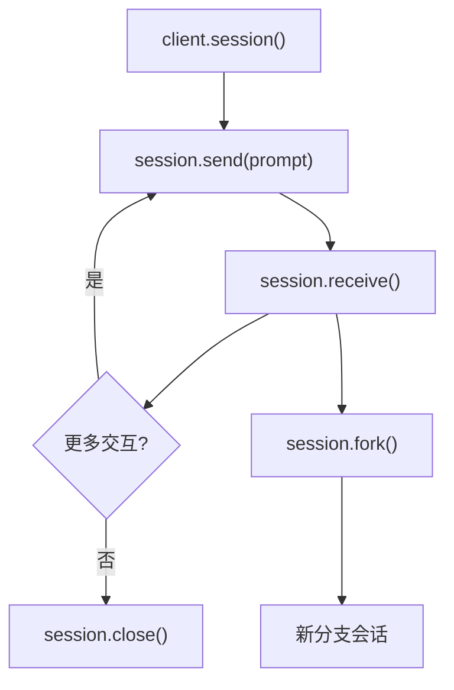

# 交互式会话开发

## Session 模型

Session 是 Agent SDK 的核心抽象，代表一个持久的、有状态的对话。



## Python 交互式会话

### 基础会话

```python
import asyncio
from claude_agent_sdk import ClaudeAgentClient


async def main():
    async with ClaudeAgentClient() as client:
        async with client.session() as session:
            # 第一轮对话
            await session.send("分析 src/ 目录下的代码结构")
            response = await session.receive()
            print(f"Claude: {response.text}")

            # 根据上下文继续
            await session.send("重构重复的代码")
            response = await session.receive()
            print(f"Claude: {response.text}")

            # 检查会话状态
            stats = await session.get_stats()
            print(f"Token 消耗: {stats.total_tokens}")


asyncio.run(main())
```

### 流式响应处理

```python
async def stream_example():
    async with ClaudeAgentClient() as client:
        async with client.session() as session:
            await session.send("创建一个 To-do 应用")

            async for event in session.stream():
                match event.type:
                    case "assistant":
                        print(event.text, end="", flush=True)
                    case "tool_use":
                        print(f"\n[调用工具: {event.tool_name}]")
                        print(f"  参数: {event.tool_input}")
                    case "tool_result":
                        print(f"[工具完成]")
                    case "result":
                        print(f"\n任务完成!")
                    case "error":
                        print(f"\n错误: {event.message}")
                    case "rate_limit":
                        print(f"[速率: {event.remaining} tokens 剩余]")


asyncio.run(stream_example())
```

## 权限回调

通过权限回调，你可以精细控制每个工具调用的授权。

```python
from claude_agent_sdk import ClaudeAgentClient, Config


async def permission_callback(tool_name: str, tool_input: dict) -> str:
    """返回 'allow', 'deny', 或 'ask'"""
    # 自动允许 git status
    if tool_name == "Bash" and "git status" in str(tool_input):
        return "allow"

    # 阻止写入 .env 文件
    if tool_name == "Write" and ".env" in str(tool_input.get("file_path", "")):
        print("[安全] 阻止写入 .env 文件")
        return "deny"

    # 阻止危险命令
    if tool_name == "Bash":
        command = tool_input.get("command", "")
        if "rm -rf" in command or "sudo" in command:
            print(f"[安全] 阻止危险命令: {command}")
            return "deny"

    # 其余需要用户确认
    return "ask"


config = Config(
    permission_mode="custom",
    permission_callback=permission_callback
)

async with ClaudeAgentClient(config=config) as client:
    response = await client.query("修复这个 bug")
```

## Hooks 集成

在 SDK 中也可以注册钩子：

```python
from claude_agent_sdk import ClaudeAgentClient, Config


def post_tool_hook(event):
    """每次工具调用后自动格式化"""
    if event.tool_name in ("Edit", "Write"):
        file_path = event.tool_input.get("file_path", "")
        if file_path.endswith((".ts", ".tsx")):
            import subprocess
            subprocess.run(["npx", "prettier", "--write", file_path])
            print(f"[Hook] 格式化: {file_path}")


config = Config(
    hooks={
        "PostToolUse": [post_tool_hook]
    }
)
```

## 会话管理

### 分叉（Fork）

从当前会话分叉出一个新分支，探索不同的方案：

```python
async with client.session() as session:
    await session.send("优化数据库查询")

    # 方案 A：使用 Redis 缓存
    fork_a = await session.fork()
    await fork_a.send("用 Redis 缓存实现")
    result_a = await fork_a.receive()

    # 方案 B：优化 SQL 查询
    fork_b = await session.fork()
    await fork_b.send("用 SQL 优化实现")
    result_b = await fork_b.receive()

    # 对比两个方案
    await session.send(f"对比方案 A: {result_a.text} 和方案 B: {result_b.text}")
```

### 恢复（Resume）

恢复之前的会话，保留完整上下文：

```python
# 保存会话 ID
session_id = session.id
# ... 之后 ...
resumed = await client.resume_session(session_id)
await resumed.send("继续上次的工作")
```

### 压缩（Compact）

手动触发上下文压缩：

```python
await session.compact()
# 或自动压缩
config = Config(auto_compact=True, compact_threshold=0.8)
```

## TypeScript 示例

```typescript
import { ClaudeAgentClient } from "@anthropic-ai/claude-agent-sdk";

async function main() {
  const client = new ClaudeAgentClient({
    model: "sonnet",
    permissionMode: "default"
  });

  // 简单查询
  const response = await client.query(
    "What does git status do?"
  );
  console.log(response);

  // 会话模式
  const session = await client.session();
  await session.send("Create a REST API for users");
  const result = await session.receive();
  console.log(result.text);

  session.close();
}

main();
```

## 错误处理与重试

```python
import asyncio
from claude_agent_sdk import ClaudeAgentClient, SessionError


async def robust_query(prompt: str, max_retries: int = 3):
    async with ClaudeAgentClient() as client:
        for attempt in range(max_retries):
            try:
                return await client.query(
                    prompt,
                    timeout=120
                )
            except SessionError as e:
                if attempt < max_retries - 1:
                    print(f"重试 {attempt + 1}/{max_retries}: {e}")
                    await asyncio.sleep(2 ** attempt)
                else:
                    raise
```

## 实践练习

1. 编写一个使用流式输出的交互式 ChatGPT 风格 CLI
2. 实现权限回调，对敏感文件写入进行阻止
3. 使用 fork 功能并行探索 3 个不同的重构方案
4. 集成 PostToolUse 钩子实现自动 ESLint 检查
