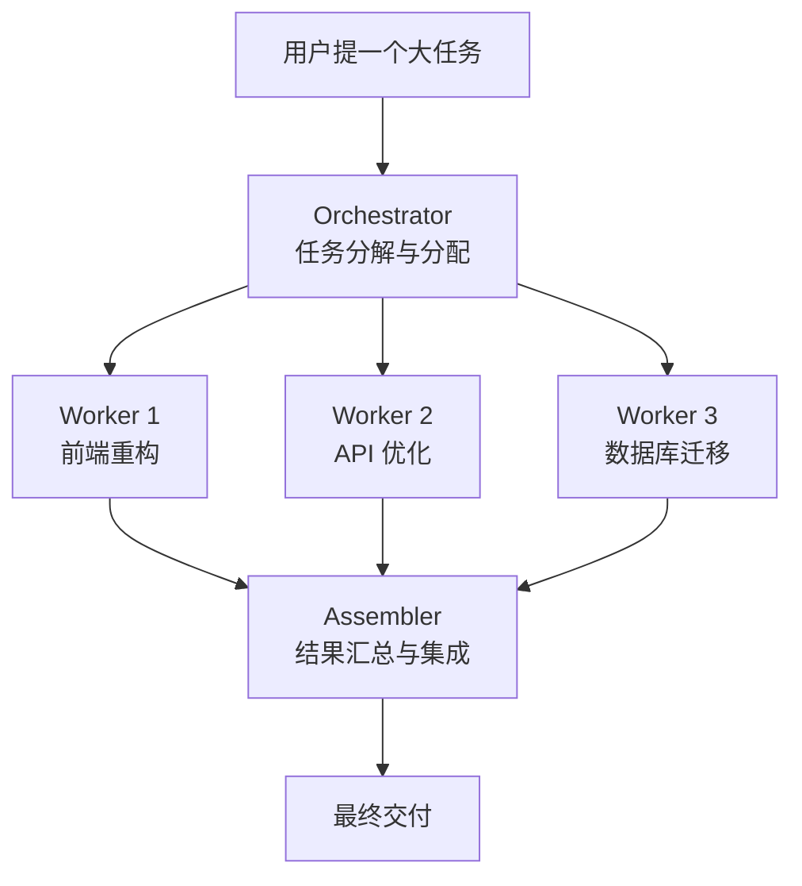
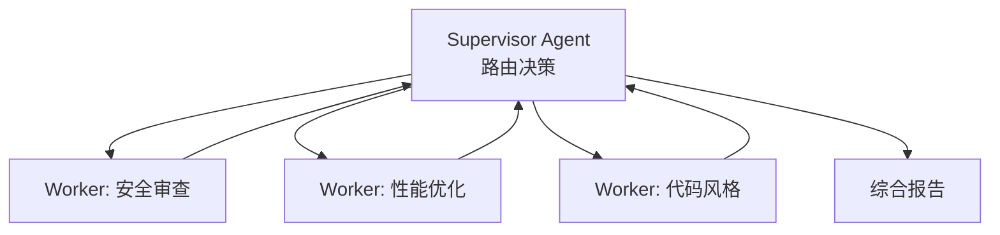
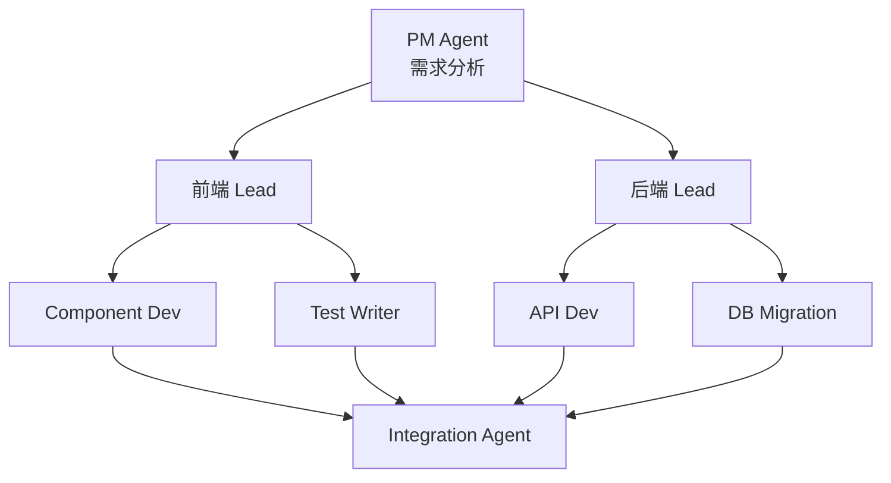
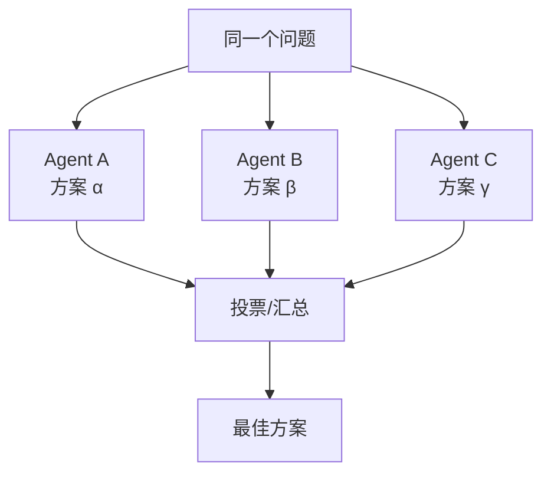
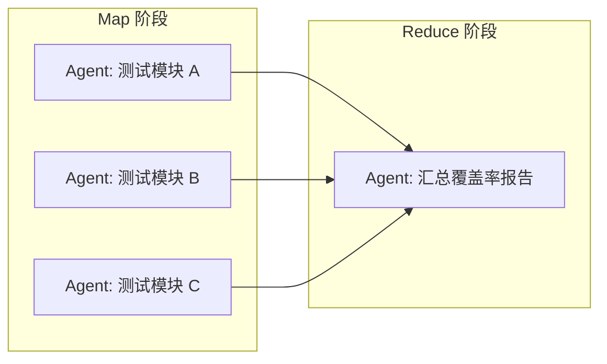
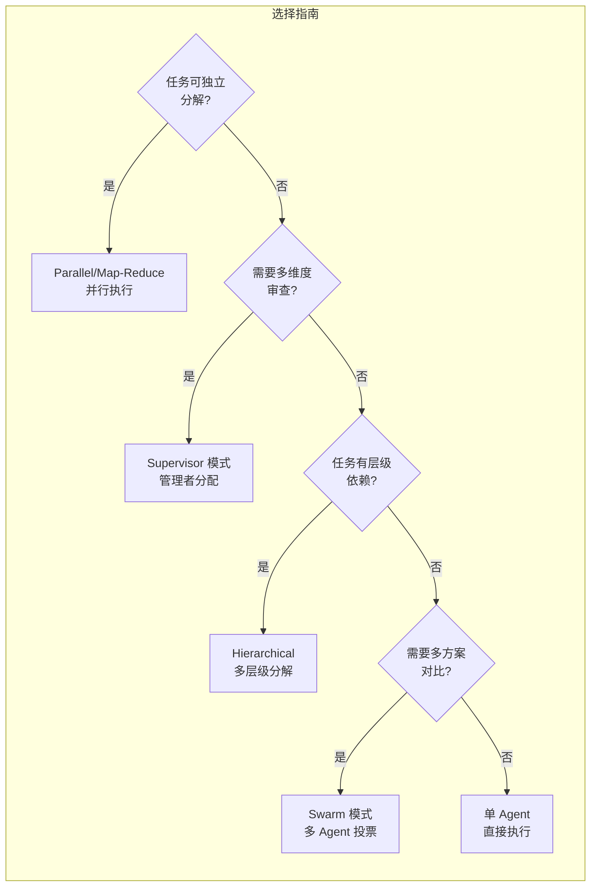

# 多 Agent 协作模式

## 为什么需要多 Agent？

单个 Agent 在遇到超大型任务时受限于上下文窗口和专注能力。多 Agent 协作通过分工和并行处理突破了这些限制。



## 四种协作模式

### 1. Supervisor 模式（管理者模式）

一个 Supervisor 管理多个专用的 Worker。



**适用场景：**
- PR 审查（安全、性能、风格三个维度）
- 项目健康检查（测试、依赖、TODO 追踪）
- 代码审计

### 2. Hierarchical 模式（层级模式）

多层树形结构，上层 Agent 分解任务给下层。



**适用场景：**
- 全栈功能开发
- 大型重构项目
- 微服务架构变更

### 3. Swarm 模式（群体模式）

多个 Agent 独立解决同一个问题，然后投票或汇总。



**适用场景：**
- 架构决策
- 复杂 bug 分析
- 方案评估与选择

### 4. Parallel/Map-Reduce 模式（并行模式）

将大任务切分为互不依赖的子任务，并行执行后汇总。



**适用场景：**
- 为多个模块生成单元测试
- 批量代码迁移
- 多语言文档翻译

## 实战：PR 审查 Supervisor

```python
import asyncio
from claude_agent_sdk import ClaudeAgentClient


async def pr_review_supervisor(pr_number: int):
    """Supervisor 协调 3 个维度的 PR 审查"""
    async with ClaudeAgentClient() as client:

        # 启动 3 个审查 Agent
        async with client.session() as sup:
            await sup.send(f"""
            For PR #{pr_number}, spawn 3 review agents:
            1. Security reviewer: check for vulnerabilities
            2. Performance reviewer: find bottlenecks
            3. Style reviewer: check code conventions

            After all complete, synthesize into a single review report.
            """)

            result = await sup.receive()
            return result
```

## Worktree 隔离

在实际项目中，多 Agent 需要在隔离的环境中工作，避免文件冲突。

```bash
# 启动 3 个 Claude Code 实例，每个在独立的 git worktree
claude --worktree --tmux &   # Agent 1
claude --worktree --tmux &   # Agent 2
claude --worktree --tmux &   # Agent 3
```

每个 worktree：
- 有独立的文件系统
- 有自己的 git 分支
- 可以独立运行测试
- 通过 PR 合并结果

## 工作流模式总结



## 最佳实践

| 实践 | 说明 |
|------|------|
| **任务独立性** | 尽量使子任务不依赖彼此，最大化并行度 |
| **清晰的接口** | 每个 Agent 的输入/输出格式要明确 |
| **结果校验** | Supervisor 要验证 Worker 的输出质量 |
| **失败隔离** | 一个 Worker 失败不应影响其他 Worker |
| **Worktree 隔离** | 多 Agent 写入时使用独立 worktree |

## 反模式

| 反模式 | 为什么不好 |
|--------|-----------|
| 过度分解 | 管理成本超过执行成本 |
| 循环依赖 | Worker A 等 B 的结果，B 等 A |
| 无结果校验 | 错误在汇总阶段才暴露，难以定位 |
| 共享写入 | 多个 Agent 写同一文件导致冲突 |

## 实践练习

1. 用 Supervisor 模式实现 PR 的三维度审查
2. 用 Parallel 模式为 10 个文件同时生成测试
3. 体验 Worktree 隔离：同时运行 3 个 Claude Code 实例
4. 对比 4 种模式在不同场景的效率和准确性
