# 多 Agent 协作模式

## 为什么需要多 Agent？

单个 Agent 在遇到超大型任务时受限于上下文窗口和专注能力。多 Agent 协作通过分工和并行处理突破了这些限制。

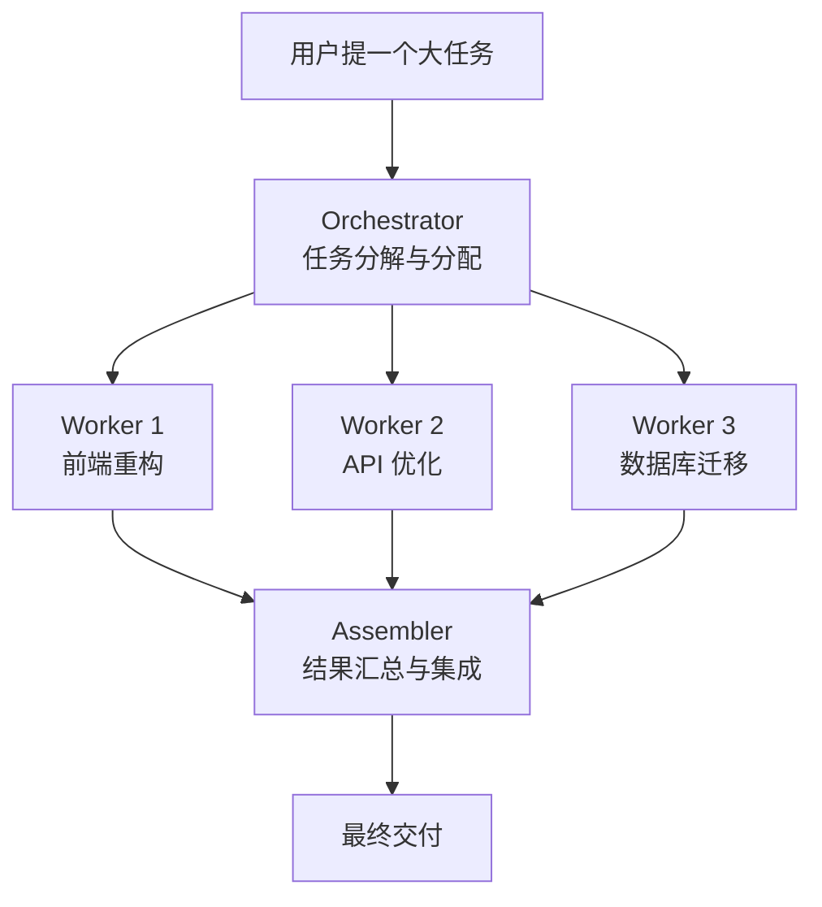

## 四种协作模式

### 1. Supervisor 模式（管理者模式）

一个 Supervisor 管理多个专用的 Worker。

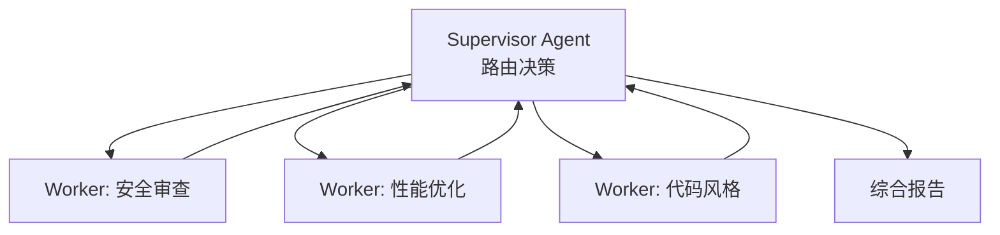

**适用场景：**
- PR 审查（安全、性能、风格三个维度）
- 项目健康检查（测试、依赖、TODO 追踪）
- 代码审计

### 2. Hierarchical 模式（层级模式）

多层树形结构，上层 Agent 分解任务给下层。

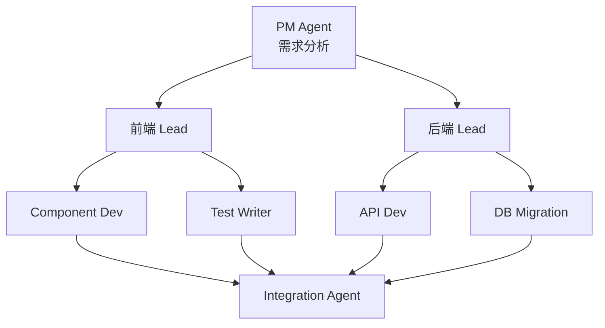

**适用场景：**
- 全栈功能开发
- 大型重构项目
- 微服务架构变更

### 3. Swarm 模式（群体模式）

多个 Agent 独立解决同一个问题，然后投票或汇总。

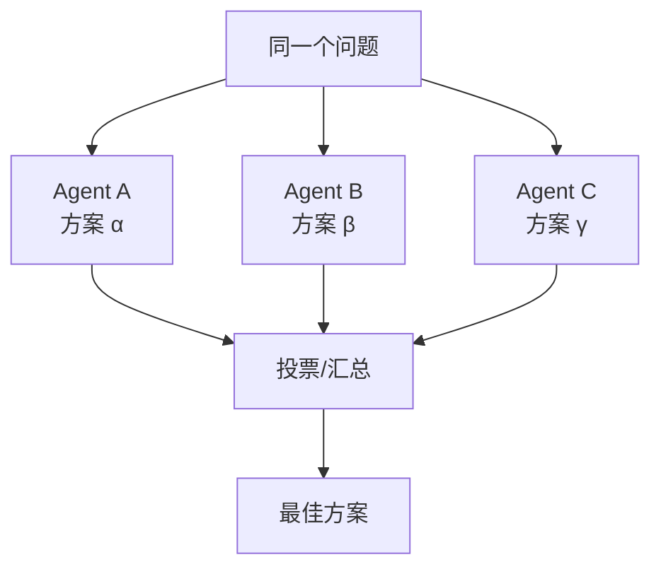

**适用场景：**
- 架构决策
- 复杂 bug 分析
- 方案评估与选择

### 4. Parallel/Map-Reduce 模式（并行模式）

将大任务切分为互不依赖的子任务，并行执行后汇总。

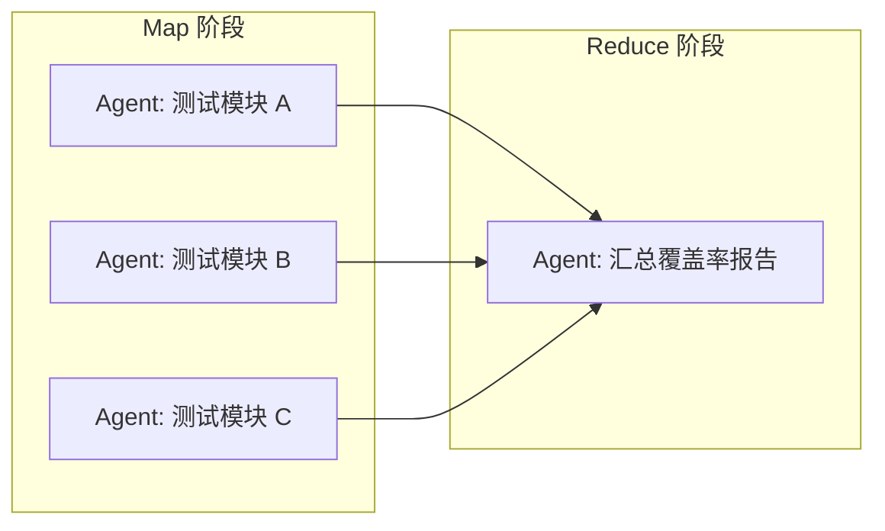

**适用场景：**
- 为多个模块生成单元测试
- 批量代码迁移
- 多语言文档翻译

## 实战：PR 审查 Supervisor

```python
import asyncio
from claude_agent_sdk import ClaudeAgentClient


async def pr_review_supervisor(pr_number: int):
    """Supervisor 协调 3 个维度的 PR 审查"""
    async with ClaudeAgentClient() as client:

        # 启动 3 个审查 Agent
        async with client.session() as sup:
            await sup.send(f"""
            For PR #{pr_number}, spawn 3 review agents:
            1. Security reviewer: check for vulnerabilities
            2. Performance reviewer: find bottlenecks
            3. Style reviewer: check code conventions

            After all complete, synthesize into a single review report.
            """)

            result = await sup.receive()
            return result
```

## Worktree 隔离

在实际项目中，多 Agent 需要在隔离的环境中工作，避免文件冲突。

```bash
# 启动 3 个 Claude Code 实例，每个在独立的 git worktree
claude --worktree --tmux &   # Agent 1
claude --worktree --tmux &   # Agent 2
claude --worktree --tmux &   # Agent 3
```

每个 worktree：
- 有独立的文件系统
- 有自己的 git 分支
- 可以独立运行测试
- 通过 PR 合并结果

## 两种实现方式

多 Agent 协同有两种实现途径：

| 方式 | 机制 | 适用场景 | 示例 |
|------|------|---------|------|
| **对话模式** | 在交互式会话中，自然语言描述任务，Claude 自动调用内置 `Agent` 工具并行启动子代理 | 一次性分析、探索性任务、日常开发 | "检查项目健康状态，并行分析测试覆盖率、依赖过期、TODO 分布" |
| **编程模式** | 通过 SDK（`ClaudeAgentClient`）或 Headless 模式（`claude -p`）编写脚本调度 | CI/CD 流水线、批量自动化、可复现工作流 | Python 脚本并行调用 `claude -p` 处理 200 个文件 |

**对话模式的核心机制**：

```
用户在交互式会话中输入指令
        ↓
主 Agent 解析任务，决定启动几个子代理
        ↓
主 Agent 调用 Agent 工具（run_in_background: true）
   → 子代理1（独立上下文 200K tokens）
   → 子代理2（独立上下文 200K tokens）
   → 子代理3（独立上下文 200K tokens）
        ↓
子代理返回结果摘要（不污染主上下文）
        ↓
主 Agent 综合汇总，输出最终结果
```

对话模式无需任何代码，Claude Code 原生支持。以下每个案例同时展示两种实现方式。

## 多 Agent 使用案例

### 案例 1：全栈功能开发（Hierarchical + Parallel 混合）

**场景**：给电商系统添加 "商品收藏" 功能，涉及数据库、API、前端三个层面。

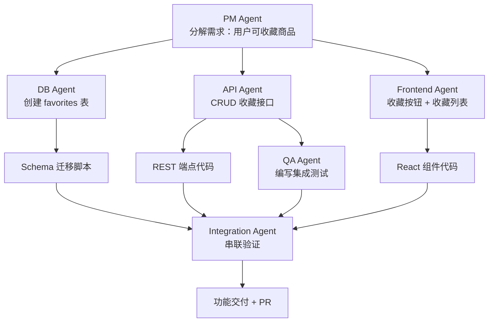

**Agent 分配**：

| Agent | 角色 | 任务 | 模型 |
|-------|------|------|------|
| PM | 需求分解 | 分析需求，拆分子任务，定义接口契约 | Opus |
| DB | 数据库 | 建迁移脚本，添加索引 | Sonnet |
| API | 后端 | 实现 CRUD 端点 + 权限校验 | Sonnet |
| FE | 前端 | 收藏按钮 + 收藏列表页面 | Sonnet |
| QA | 测试 | 编写集成测试用例 | Sonnet |
| Integration | 串联 | 验证全链路功能正确 | Sonnet |

**对话方式**（在 Claude Code 交互式会话中直接说）：

```
帮我给电商系统添加"商品收藏"功能。先分解需求确定接口契约，
然后并行启动 3 个子代理分别实现数据库迁移、API 端点和前端组件。
都完成后运行集成测试验证全链路。每个子代理用 worktree 隔离。
```

Claude 会自动调用 Agent 工具并行启动子代理，等待结果后汇总。整个过程在同一个对话中完成。

**编程方式**（Headless + worktree）：

整个流程由开发者在一个 Claude Code 交互式会话中启动，通过 SDK 或 Headless 模式协调多个子 Agent。

**Step 1 — PM Agent 分解需求**：

```bash
# 在主会话中启动 PM 分析
claude -p "分析'商品收藏'功能需求，将其分解为数据库、API、前端三个子任务，
并输出每个子任务的具体接口契约（DB schema / API spec / 组件接口）。
输出 JSON 格式：{db_task: {...}, api_task: {...}, fe_task: {...}}" \
  --output-format json > contracts.json
```

PM Agent 输出的契约文件 `contracts.json` 作为后续子 Agent 的输入约束。

**Step 2 — 并行启动 3 个开发 Agent**（Headless 模式，在隔离 worktree 中执行）：

```bash
# DB Agent: 根据契约创建迁移脚本
claude --worktree -p "$(cat <<'PROMPT'
根据以下接口契约创建数据库迁移脚本：
$(cat contracts.json | jq '.db_task')
要求：1. 创建 favorites 表 2. 添加 user_id + product_id 联合索引
3. 添加 created_at 时间戳 4. 外键约束
PROMPT
)" --allowedTools "Read,Write,Edit,Bash" --output-format json > db_result.json &

# API Agent: 根据契约实现 REST 端点
claude --worktree -p "$(cat <<'PROMPT'
根据以下接口契约实现收藏功能的 REST API：
$(cat contracts.json | jq '.api_task')
要求：1. POST/GET/DELETE /api/favorites 2. JWT 权限校验
3. 分页支持 4. 输入验证
PROMPT
)" --allowedTools "Read,Write,Edit,Bash" --output-format json > api_result.json &

# FE Agent: 根据契约实现前端组件
claude --worktree -p "$(cat <<'PROMPT'
根据以下接口契约实现收藏功能的前端组件：
$(cat contracts.json | jq '.fe_task')
要求：1. 收藏按钮（HeartIcon 切换）2. 收藏列表页 3. 调用 /api/favorites
4. 乐观更新（optimistic update）5. 错误状态处理
PROMPT
)" --allowedTools "Read,Write,Edit,Bash" --output-format json > fe_result.json &

wait
```

每个 Agent 在自己的 worktree 中独立工作，产物通过 `*_result.json` 返回。

**Step 3 — QA Agent 编写集成测试**（依赖 API 输出后执行）：

```bash
claude -p "根据 API 实现 $(cat api_result.json) 编写集成测试，覆盖：
1. 正常 CRUD 流程 2. 未登录拒绝 3. 重复收藏处理 4. 分页边界" \
  --allowedTools "Read,Write,Edit,Bash(npm test:*)" --output-format json > qa_result.json
```

**Step 4 — Integration Agent 串联验证**：

```bash
claude -p "$(cat <<'PROMPT'
验证全链路功能完整性：
- DB 迁移: $(cat db_result.json)
- API 端点: $(cat api_result.json)
- 前端组件: $(cat fe_result.json)
- 测试结果: $(cat qa_result.json)

1. 启动项目并验证端到端流程
2. 检查前端调用的 API 端点是否与后端一致
3. 确认 DB schema 与 API 的数据结构匹配
4. 运行测试套件
5. 输出验证报告，标注 blocking / warning 问题
PROMPT
)" --allowedTools "Read,Edit,Bash" --output-format json > integration_report.json
```

### 案例 2：遗留系统迁移（Map-Reduce 模式）

**场景**：将 200 个文件的 JavaScript 代码库迁移到 TypeScript，逐个文件处理。

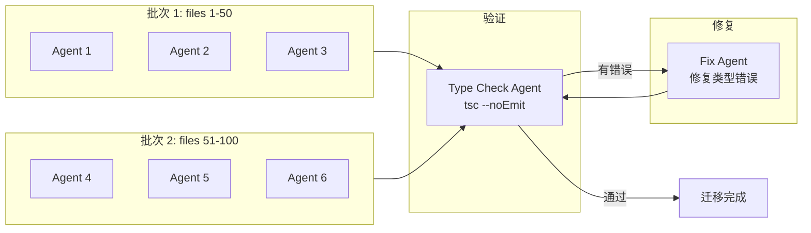

**对话方式**：

```
把 src/ 下所有 .js 文件迁移到 TypeScript。分批并行处理，
每批 10 个文件，迁移完一批后跑 tsc --noEmit 验证类型，
有错误立即修复再继续。
```

> 小规模（<20 文件）对话方式完全可以。200 个文件的大规模迁移建议用下面的编程模式分批自动化。

**编程方式**（批量 Headless 迁移）：

```python
import asyncio
import subprocess
from pathlib import Path


async def migrate_file(file_path: str) -> dict:
    """迁移单个 JS 文件到 TS"""
    prompt = f"""Convert {file_path} to TypeScript:

    Rules:
    1. Rename .js → .ts (or .jsx → .tsx)
    2. Add type annotations to all function parameters and returns
    3. Convert PropTypes to TypeScript interfaces
    4. Handle .default imports correctly
    5. Use strict mode conventions
    6. Update imports to use .ts extensions

    Write the new TypeScript file and delete the old JS file.
    """
    result = subprocess.run(
        ["claude", "-p", prompt, "--output-format", "json",
         "--allowedTools", "Read,Write,Edit,Bash(mv *,rm *)",
         "--max-turns", "20"],
        capture_output=True, text=True, timeout=300
    )
    return {"file": file_path, "status": "success" if result.returncode == 0 else "failed"}


async def batch_migrate(js_files: list[str], batch_size: int = 10):
    """分批迁移，每批并行 10 个文件"""
    for i in range(0, len(js_files), batch_size):
        batch = js_files[i:i + batch_size]
        print(f"Batch {i//batch_size + 1}: {len(batch)} files")
        results = await asyncio.gather(*[migrate_file(f) for f in batch])

        # 每批迁移后检查类型
        subprocess.run(["npx", "tsc", "--noEmit"], check=False)

        failed = [r for r in results if r["status"] == "failed"]
        if failed:
            print(f"  Failed: {[f['file'] for f in failed]}")


# 使用
js_files = [str(p) for p in Path("src").rglob("*.js")]
asyncio.run(batch_migrate(js_files))
```

### 案例 3：多维度 PR 审查（Supervisor 模式）

**场景**：对每个 PR 执行 5 个维度的并行审查。

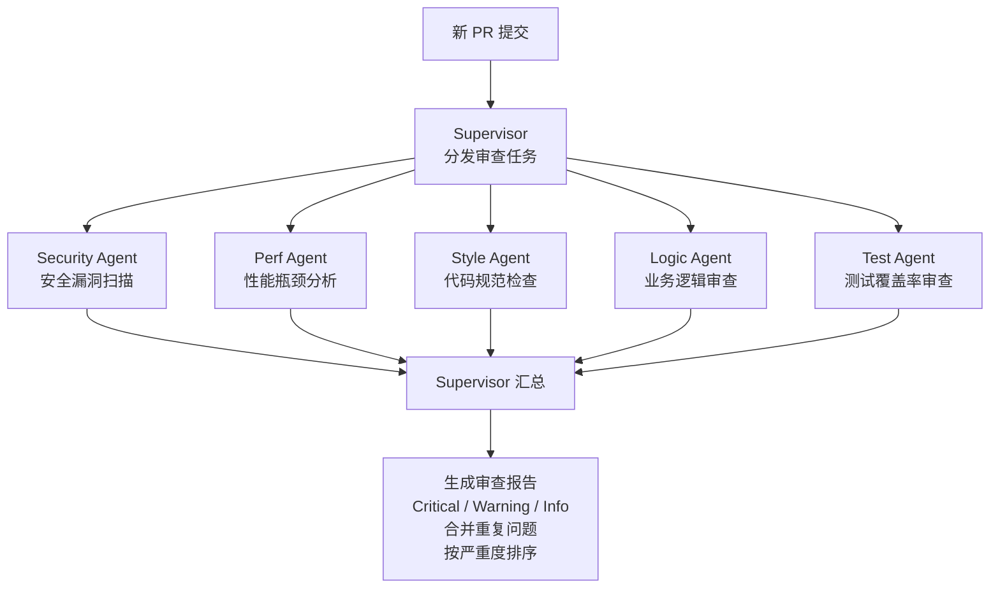

**每个 Agent 的审查维度**：

| Agent | 关注点 | 输出 |
|-------|--------|------|
| Security | SQL 注入、XSS、密钥泄露、路径遍历、不安全的反序列化 | 安全问题列表 + 严重度 |
| Performance | N+1 查询、不必要的重新渲染、内存泄漏、大文件加载 | 性能瓶颈 + 优化建议 |
| Style | 命名规范、代码重复、函数长度、导入顺序 | 风格问题 + 自动修复 |
| Logic | 边界情况、错误处理、空值处理、并发安全 | 逻辑缺陷 + 修复方案 |
| Test | 测试覆盖率、边界测试、模拟准确性 | 测试缺口 + 建议用例 |

**对话方式**：

```
审查这个 PR。并行启动 5 个子代理分别审查安全、性能、代码风格、
业务逻辑、测试覆盖率，然后汇总成一份综合审查报告，按严重度排序。
```

**编程方式**（GitHub Actions CI）：

```yaml
# .github/workflows/multi-agent-review.yml
jobs:
  review:
    runs-on: ubuntu-latest
    steps:
      - uses: actions/checkout@v4
      - name: Parallel Review
        run: |
          # 5 个 Agent 并行审查
          claude -p "Security review of PR changes" --output-format json --max-turns 15 > security.json &
          claude -p "Performance review of PR changes" --output-format json --max-turns 15 > perf.json &
          claude -p "Code style review of PR changes" --output-format json --max-turns 15 > style.json &
          claude -p "Business logic review of PR changes" --output-format json --max-turns 15 > logic.json &
          claude -p "Test coverage review of PR changes" --output-format json --max-turns 15 > test.json &
          wait

          # Supervisor 汇总
          claude -p "Synthesize review reports from security.json, perf.json, style.json, logic.json, test.json into a single PR review" --output-format json > final-review.json
```

### 案例 4：技术方案选型（Swarm 模式）

**场景**：评估 4 种缓存方案，每个 Agent 独立研究一种方案，最后投票汇聚。

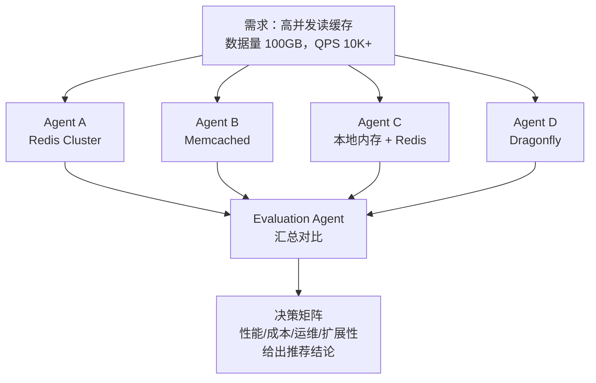

**每个 Agent 的研究任务**：

**对话方式**：

```
评估 4 种缓存方案（Redis Cluster / Memcached / 本地+Redis / Dragonfly）
用于高并发读场景（100GB 数据，QPS 10K+）。
启动 4 个子代理各自研究一种方案，最后汇总决策矩阵给出推荐。
```

**编程方式**：

```python
async def swarm_evaluation(requirement: str, candidates: list[str]):
    """Swarm 评估：每个候选方案由独立 Agent 评估"""
    async def evaluate_candidate(candidate: str) -> dict:
        prompt = f"""Evaluate {candidate} as a caching solution for:

        Requirement: {requirement}

        Analyze:
        1. Architecture overview and key features
        2. Performance characteristics (read/write latency, throughput)
        3. Operational complexity (deployment, monitoring, scaling)
        4. Cost estimation (infrastructure + operational)
        5. Community and ecosystem (maturity, plugins, support)
        6. Risk assessment (single point of failure, data loss risk)

        Output a structured JSON with scores (1-10) for each dimension.
        """
        result = subprocess.run(
            ["claude", "-p", prompt, "--output-format", "json",
             "--allowedTools", "WebSearch,WebFetch", "--max-turns", "15"],
            capture_output=True, text=True, timeout=300
        )
        return {"candidate": candidate, "analysis": json.loads(result.stdout)}

    # 并行评估所有候选方案
    results = await asyncio.gather(*[
        evaluate_candidate(c) for c in candidates
    ])

    # 汇总 Agent 根据各维度评分给出最终推荐
    synthesis_prompt = f"""Based on these evaluations:
    {json.dumps(results, indent=2)}

    Create a decision matrix comparing all candidates on:
    - Performance | Cost | Reliability | Operations | Scalability

    Give a final recommendation with rationale.
    """
    final = subprocess.run(
        ["claude", "-p", synthesis_prompt, "--output-format", "json"],
        capture_output=True, text=True
    )
    return json.loads(final.stdout)
```

### 案例 5：持续集成修复流水线（Sequential 模式）

**场景**：CI 失败后自动分析 → 修复 → 验证 → 提交的串行流水线。

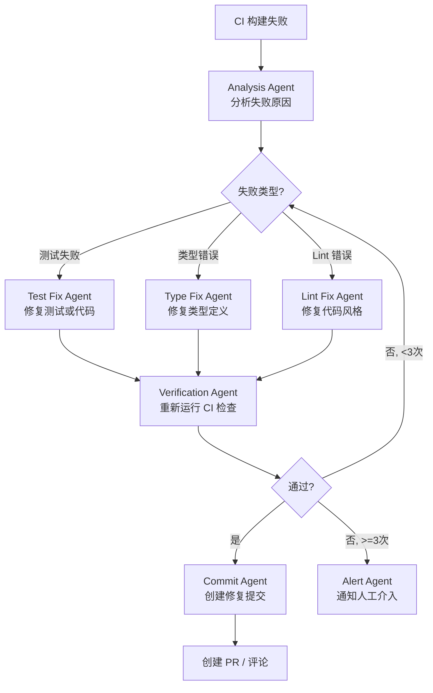

**实现**：

**对话方式**：

```
CI 失败了（日志见附件）。先启动一个分析子代理找出根因，
然后根据失败类型启动对应的修复子代理，修复后重新运行 CI 验证。
如果 3 次尝试后仍未通过，提示我人工介入。
```

> 注意：对话模式适合单次排查修复。若需每次 CI 失败都自动触发，应使用编程模式集成到 CI 流水线。

**编程方式**（CI 自动修复流水线）：

```python
async def auto_fix_ci_failure(ci_log: str, max_attempts: int = 3):
    """自动修复 CI 失败的流水线"""
    attempt = 0
    while attempt < max_attempts:
        attempt += 1
        print(f"[Attempt {attempt}/{max_attempts}]")

        # Step 1: 分析失败原因
        analysis = subprocess.run(
            ["claude", "-p",
             f"Analyze this CI failure log and identify the root cause:\n{ci_log}\n"
             "Output: {{'category': 'test|type|lint', 'files': [...], 'root_cause': '...'}}",
             "--output-format", "json",
             "--allowedTools", "Read,Grep"],
            capture_output=True, text=True, timeout=120
        )
        root_cause = json.loads(analysis.stdout)

        # Step 2: 修复（只允许修改相关文件）
        files_arg = " ".join(root_cause.get("files", []))
        fix_result = subprocess.run(
            ["claude", "-p",
             f"Fix the CI failure. Root cause: {root_cause['root_cause']}\n"
             f"Only modify these files: {files_arg}\n"
             f"Category: {root_cause['category']}",
             "--output-format", "json",
             "--allowedTools", "Read,Edit,Bash(npm test:*,npx tsc:*,npx eslint:*)",
             "--max-turns", "20"],
            capture_output=True, text=True, timeout=300
        )

        # Step 3: 验证
        verify = subprocess.run(
            ["npm", "test", "&&", "npx", "tsc", "--noEmit", "&&", "npx", "eslint", "."],
            capture_output=True, text=True, shell=True
        )

        if verify.returncode == 0:
            # Step 4: 提交修复
            subprocess.run(["git", "add", "-A"])
            subprocess.run(["git", "commit", "-m",
                          f"ci: auto-fix {root_cause['category']} failure\n\n"
                          f"Root cause: {root_cause['root_cause']}"])
            print("CI fix committed successfully")
            return {"status": "fixed", "attempts": attempt}

        ci_log = verify.stderr or verify.stdout

    # 超过最大尝试次数，通知人工介入
    print("Max attempts reached, manual intervention required")
    return {"status": "manual_intervention_required", "attempts": attempt}
```

### 案例 6：文档多语言翻译（Parallel Fork 模式）

**场景**：将项目文档从中文批量翻译为英文、日文、韩文。

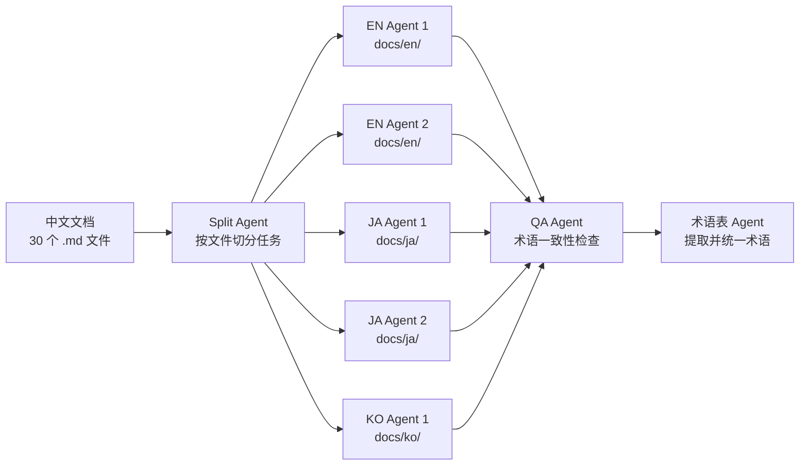

**对话方式**：

```
把 docs/ 下 30 个中文 .md 文档翻译成英文和日文。
先提取术语表确保翻译一致性，然后并行启动翻译子代理。
翻译完成后用 QA 子代理检查术语统一性。
```

> 小规模文档（<10 个文件）对话方式即可。大规模批量（30+ 文件）建议用下面的编程模式。

**编程方式**（批量并行翻译）：

```python
async def translate_docs(files: list[str], languages: list[str]):
    """并行翻译文档到多种语言"""
    async def translate_one(file: str, lang: str, glossary: dict) -> dict:
        glossary_hint = "\n".join(
            f"- {cn} → {trans[lang]}" if lang in trans else f"- {cn} (keep)"
            for cn, trans in glossary.items()
        ) if glossary else ""

        prompt = f"""Translate {file} to {lang}.

        Glossary (must use these translations):
        {glossary_hint}

        Rules:
        - Preserve markdown structure and code blocks
        - Keep file paths unchanged
        - Translate descriptions but keep code identifiers
        - Preserve Mermaid diagram node labels (translate text, keep structure)
        """
        result = subprocess.run(
            ["claude", "-p", prompt, "--output-format", "json",
             "--allowedTools", "Read,Write,Edit", "--max-turns", "15"],
            capture_output=True, text=True, timeout=300
        )
        return {"file": file, "lang": lang, "status": "success" if result.returncode == 0 else "failed"}

    # Phase 1: 先翻译一份术语表
    glossary = await extract_glossary(files)

    # Phase 2: 并行翻译所有文件到所有语言
    tasks = []
    for lang in languages:
        os.makedirs(f"docs/{lang}", exist_ok=True)
        for file in files:
            tasks.append(translate_one(file, lang, glossary))

    results = await asyncio.gather(*tasks)

    # Phase 3: QA 检查术语一致性
    await check_terminology_consistency(languages)
```

### 案例 7：生产故障排查（Swarm + Supervisor 混合）

**场景**：生产环境突发故障，需要多线并行排查。

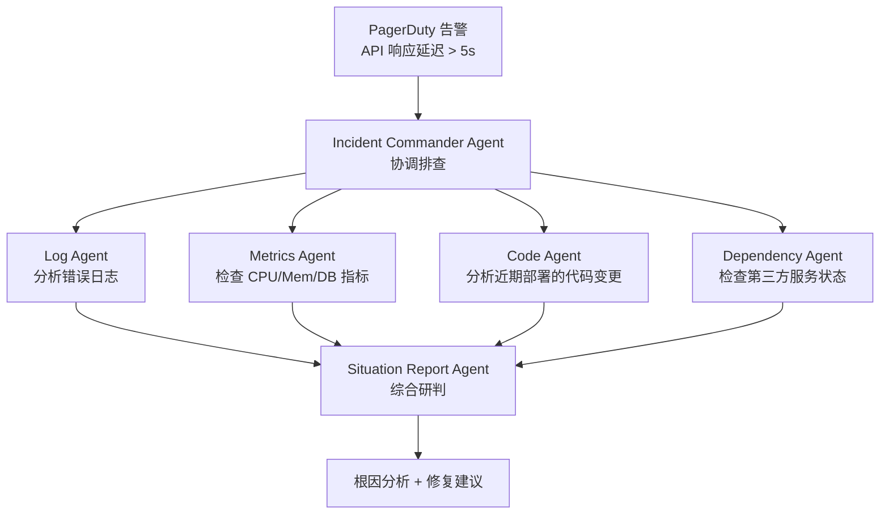

**Agent 分工**：

| Agent | 数据源 | 工具 |
|-------|--------|------|
| Log Agent | ELK / CloudWatch | `grep`, `jq` 分析日志 |
| Metrics Agent | Prometheus / Grafana | MCP 读取指标 |
| Code Agent | git log / diff | `git diff`, `git log` |
| Dependency Agent | 第三方 Status Page | `WebFetch` |

**对话方式**：

```
PagerDuty 告警：API 响应延迟 > 5s，影响登录和下单。
近期部署了 v2.3.1。并行启动 4 个子代理分别排查：
1. ELK 错误日志  2. Prometheus 指标  3. 代码变更 diff  4. 第三方依赖状态
最后汇总根因分析和修复建议。
```

> 故障排查场景中对话方式更快，因为可以实时调整调查方向。编程方式适合将排查流程固化到 oncall runbook。

**编程方式**（自动化故障排查脚本）：

Step 1 — Incident Commander 在主会话中分析告警，确定排查方向：

```bash
# Incident Commander 接收 PagerDuty 告警上下文，分发排查指令
claude -p "$(cat <<'PROMPT'
生产告警：API 响应延迟 > 5s，影响用户登录和下单。
近期部署：30 分钟前发布了 v2.3.1（新增推荐算法模块）。
请制定排查计划，确定需要并行调查的 4 个方向，输出 JSON：
{"directions": [{"name": "...", "prompt": "...", "tools": "...", "datasource": "..."}]}
PROMPT
)" --output-format json > investigation_plan.json
```

Step 2 — 4 个 Agent 并行调查（Headless 模式，各连接不同数据源）：

```python
import asyncio, subprocess, json

async def incident_investigation(alert_context: dict):
    """生产故障多线并行排查"""

    # 4 条调查线，各自有不同的工具和数据源
    investigations = {
        "log": {
            "prompt": f"""分析 ELK 错误日志，时间窗口：{alert_context['time_range']}。
            查找: 1. 5xx 错误激增 2. 超时日志 3. 连接池耗尽 4. 慢查询
            输出: 按时间线排列的异常事件列表 + 最可疑的根因假设""",
            "tools": "Read,Grep,Bash(grep:*,jq:*,awk:*)",
            "datasource": "ELK JSON 日志文件"
        },
        "metrics": {
            "prompt": f"""从 Prometheus 拉取以下指标（时间窗口：{alert_context['time_range']}）：
            1. API 响应时间 P50/P95/P99 2. CPU/Memory 使用率
            3. DB 连接数 4. Redis 命中率 5. GC 暂停时间
            对比 v2.3.1 部署前后的指标变化，标注突增点""",
            "tools": "Read,Bash(curl:*,jq:*)",
            "datasource": "Prometheus API (via MCP)"
        },
        "code": {
            "prompt": f"""分析 {alert_context['recent_deploy']} 的代码变更：
            1. git diff 变更了什么 2. 是否有新增的外部调用
            3. 是否有 N+1 查询 4. 缓存策略是否有改动
            输出: 可疑代码列表，按风险排序""",
            "tools": "Read,Grep,Bash(git:diff*,git:log*)",
            "datasource": "git 仓库"
        },
        "dependency": {
            "prompt": f"""检查依赖服务状态：
            1. 第三方 API 状态页（Stripe/SendGrid/AWS）
            2. 内部服务健康检查端点
            3. 网络连通性
            输出: 各依赖服务状态汇总""",
            "tools": "WebFetch,WebSearch,Bash(curl:*)",
            "datasource": "第三方 Status Page + 内部健康端点"
        }
    }

    async def run_investigation(name: str, config: dict) -> dict:
        result = subprocess.run(
            ["claude", "-p", config["prompt"],
             "--output-format", "json",
             "--allowedTools", config["tools"],
             "--max-turns", "12"],
            capture_output=True, text=True, timeout=180
        )
        return {"direction": name, "findings": json.loads(result.stdout)}

    # 4 线并行调查
    all_findings = await asyncio.gather(*[
        run_investigation(name, cfg) for name, cfg in investigations.items()
    ])
```

Step 3 — Situation Report Agent 综合研判：

```bash
claude -p "$(cat <<'PROMPT'
综合以下 4 条调查线的发现，进行根因分析：

Log 发现: $(cat log_findings.json)
Metrics 发现: $(cat metrics_findings.json)  
Code 发现: $(cat code_findings.json)
Dependency 发现: $(cat dependency_findings.json)

请输出：
1. 根因定位（最可能的故障原因 + 置信度）
2. 影响范围评估
3. 立即修复方案（可在 5 分钟内执行的）
4. 长期改进建议
5. 是否需要回滚 v2.3.1（判断标准：修复耗时 > 15 分钟则建议回滚）
PROMPT
)" --allowedTools "Read" --output-format json > incident_resolution.json
```

**关键设计要点**：

- 每条调查线**独立并行**，互不阻塞，最大化排查速度
- Incident Commander 只负责**编排和最终决策**，不参与具体调查
- 调查 Agent 输出结构化 JSON，便于 Situation Report Agent 解析
- 整个过程无需人工介入，自动生成修复或回滚建议

## 案例模式总结

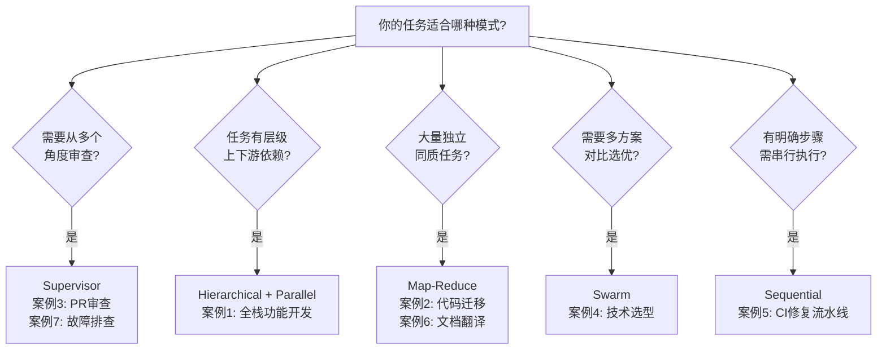

## 工作流模式总结

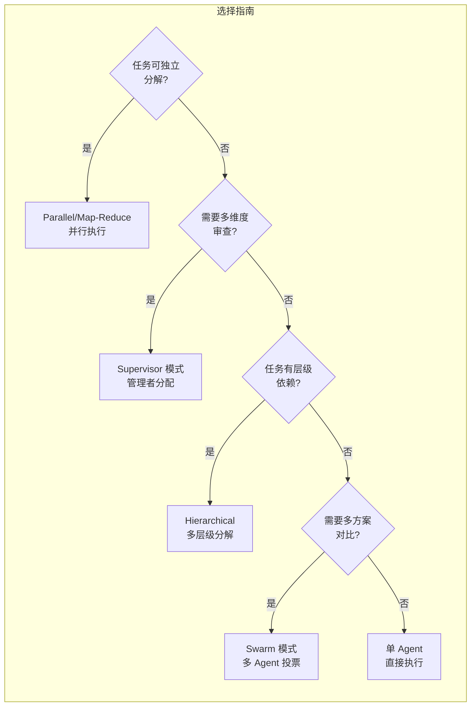

## 最佳实践

| 实践 | 说明 |
|------|------|
| **任务独立性** | 尽量使子任务不依赖彼此，最大化并行度 |
| **清晰的接口** | 每个 Agent 的输入/输出格式要明确 |
| **结果校验** | Supervisor 要验证 Worker 的输出质量 |
| **失败隔离** | 一个 Worker 失败不应影响其他 Worker |
| **Worktree 隔离** | 多 Agent 写入时使用独立 worktree |

## 反模式

| 反模式 | 为什么不好 |
|--------|-----------|
| 过度分解 | 管理成本超过执行成本 |
| 循环依赖 | Worker A 等 B 的结果，B 等 A |
| 无结果校验 | 错误在汇总阶段才暴露，难以定位 |
| 共享写入 | 多个 Agent 写同一文件导致冲突 |

## 实践练习

1. 用 Supervisor 模式实现 PR 的三维度审查
2. 用 Parallel 模式为 10 个文件同时生成测试
3. 体验 Worktree 隔离：同时运行 3 个 Claude Code 实例
4. 对比 4 种模式在不同场景的效率和准确性
