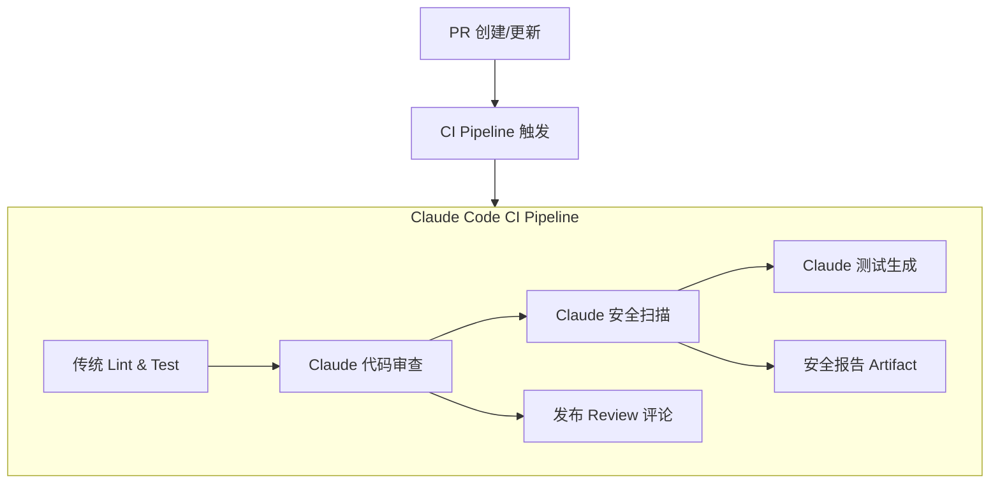

# CI/CD 与 DevOps 集成

## 概述

将 Claude Code 集成到 CI/CD 流水线中，可以实现自动化的代码审查、测试生成、安全扫描和部署验证。

## CI/CD 集成架构



## GitHub Actions 全流程

### 自动代码审查

```yaml
# .github/workflows/claude-code-review.yml
name: Claude Code PR Review

on:
  pull_request:
    types: [opened, synchronize, reopened]

permissions:
  contents: read
  pull-requests: write

jobs:
  review:
    runs-on: ubuntu-latest
    steps:
      - uses: actions/checkout@v4
        with:
          fetch-depth: 0

      - uses: actions/setup-node@v4
        with: { node-version: '20' }

      - name: Install Claude Code
        run: npm install -g @anthropic-ai/claude-code

      - name: Claude Code Review
        env:
          ANTHROPIC_API_KEY: ${{ secrets.ANTHROPIC_API_KEY }}
        run: |
          claude -p "$(cat <<PROMPT
          Review this PR's changes. Output in markdown:

          ## Summary
          Brief summary of changes

          ## Issues Found
          | Severity | File | Line | Issue | Suggestion |
          |----------|------|------|-------|------------|

          ## Security Concerns
          Any security-related issues

          ## Recommendations
          3-5 actionable suggestions
          PROMPT
          )" \
          --output-format json \
          --allowedTools "Read,Grep,Bash(git diff:*,git log:*)" \
          --max-turns 20 > review.json

      - name: Post Review Comment
        uses: actions/github-script@v7
        with:
          script: |
            const fs = require('fs');
            const review = JSON.parse(fs.readFileSync('review.json'));
            await github.rest.issues.createComment({
              ...context.repo,
              issue_number: context.issue.number,
              body: `## Claude Code Review\n\n${review.result}`
            });
```

### 自动化安全扫描

```yaml
# .github/workflows/security-scan.yml
name: Security Scan

on:
  push:
    branches: [main]
  schedule:
    - cron: '0 7 * * 1'  # 每周一

jobs:
  security-scan:
    runs-on: ubuntu-latest
    steps:
      - uses: actions/checkout@v4

      - name: Install Claude Code
        run: npm install -g @anthropic-ai/claude-code

      - name: Run Security Scan
        env:
          ANTHROPIC_API_KEY: ${{ secrets.ANTHROPIC_API_KEY }}
        run: |
          claude -p "Scan this project for security vulnerabilities:
          1. Hardcoded credentials and API keys
          2. SQL/NoSQL injection risks
          3. XSS vulnerabilities
          4. Path traversal risks
          5. Unsafe deserialization
          6. Missing authentication checks
          7. Weak cryptography usage

          Output a JSON report with:
          - severity (critical/high/medium/low)
          - file path and line number
          - vulnerability description
          - remediation suggestion" \
          --output-format json \
          --allowedTools "Read,Grep,Glob" \
          --max-turns 25 > security.json

      - name: Upload Report
        uses: actions/upload-artifact@v4
        with:
          name: security-report
          path: security.json

      - name: Alert on Critical
        run: |
          CRITICAL=$(jq '[.findings[] | select(.severity=="critical")] | length' security.json)
          if [ "$CRITICAL" -gt 0 ]; then
            echo "::error::Found $CRITICAL critical vulnerabilities!"
            exit 1
          fi
```

## GitLab CI 集成

```yaml
# .gitlab-ci.yml
stages:
  - review
  - test-gen
  - deploy-check

claude-review:
  stage: review
  image: node:20
  before_script:
    - npm install -g @anthropic-ai/claude-code
  script:
    - |
      claude -p "Review merge request changes. Focus on:
        1. Logic correctness
        2. Error handling completeness
        3. Test coverage gaps
        4. Code duplication" \
        --output-format json \
        --allowedTools "Read,Grep,Bash(git diff:*)" \
        --max-turns 20 > review.json
  artifacts:
    paths:
      - review.json
  only:
    - merge_requests

claude-generate-tests:
  stage: test-gen
  image: node:20
  before_script:
    - npm install -g @anthropic-ai/claude-code
  script:
    - |
      # 找出测试覆盖率最低的文件
      NEW_FILES=$(git diff --name-only origin/main... | grep '\.ts$' | grep -v '\.test\.')
      for file in $NEW_FILES; do
        test_file="${file/src/tests}"
        test_file="${test_file/.ts/.test.ts}"
        if [ ! -f "$test_file" ]; then
          echo "Generating tests for $file"
          claude -p "Generate tests for $file, write to $test_file" \
            --allowedTools "Read,Write,Bash(npm test:*)" \
            --max-turns 15
        fi
      done
  only:
    - merge_requests

claude-deploy-check:
  stage: deploy-check
  image: node:20
  before_script:
    - npm install -g @anthropic-ai/claude-code
  script:
    - |
      claude -p "Review this deployment:
        - Check for missing environment variables
        - Verify migration scripts are safe
        - Confirm rollback procedures are documented" \
        --output-format json \
        --allowedTools "Read,Grep" \
        --max-turns 15
  only:
    - main
```

## 预制的 CI/CD 工具

| 工具 | 说明 |
|------|------|
| **ClaudeForge** | 一键生成 GitHub Actions CI/CD 配置 |
| **DevFlow** | 完整的 context → dev → test → review → commit 流水线 |
| **Claude Code Orchestrator** | 39 Agent + 38 Skills 的大型编排工具包 |

## 成本控制

### Token 预算

```yaml
- name: Claude Review
  run: |
    claude -p "..." \
      --max-turns 15 \         # 限制最大轮次
      --model haiku \          # 使用经济模型
      --output-format json
```

### 条件触发

```yaml
# 只在特定文件变更时触发
on:
  pull_request:
    paths:
      - 'src/**/*.ts'
      - 'src/**/*.tsx'
      - 'prisma/**'
```

### 速率限制

```python
import time
from collections import deque


class RateLimiter:
    """限制 per-minute 调用次数"""
    def __init__(self, max_calls: int = 10):
        self.max_calls = max_calls
        self.calls = deque()

    def wait_if_needed(self):
        now = time.time()
        # 清理 60 秒前的记录
        while self.calls and self.calls[0] < now - 60:
            self.calls.popleft()

        if len(self.calls) >= self.max_calls:
            sleep_time = 60 - (now - self.calls[0])
            time.sleep(sleep_time)

        self.calls.append(now)
```

## 实践练习

1. 为你的项目配置 GitHub Actions Claude Code 审查
2. 实现安全扫描流水线，并设置 critical 告警
3. 添加测试自动生成为 CI 步骤
4. 实现 Token 预算和速率限制
