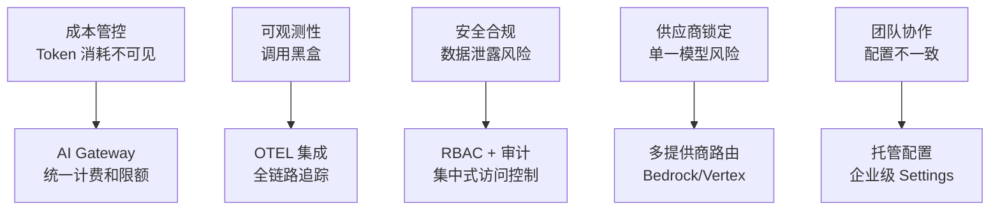
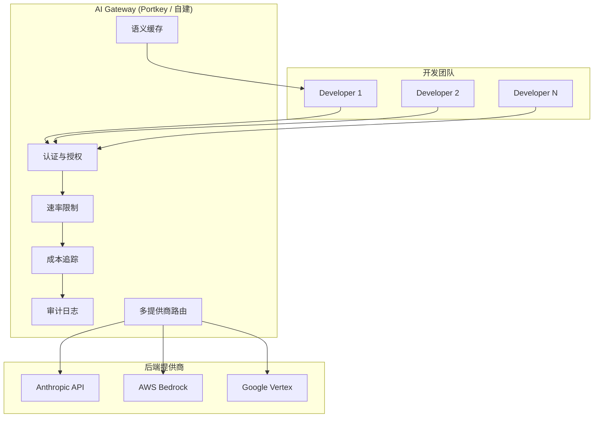

# 企业级治理

## 企业部署的挑战

当 Claude Code 从个人工具扩展到团队和企业级使用时，会面临一系列新的挑战：



## 配置层级治理

企业级配置按照严格的层级结构，上层不可被下层覆盖：

```
/etc/claude-code/managed-settings.json   ← 企业级（不可覆盖）
    ↓ 约束
~/.claude/settings.json                  ← 用户级（受企业策略限制）
    ↓ 约束
.claude/settings.json                    ← 项目级（受用户和企业限制）
    ↓ 约束
.claude/settings.local.json              ← 本地覆盖（不提交 Git）
```

### 企业级配置示例

```json
{
  "permissions": {
    "deny": [
      "Bash(sudo:*)",
      "Bash(rm -rf:*)",
      "Write(**/*.env)",
      "Write(**/*.pem)",
      "Write(**/*.key)"
    ]
  },
  "model": "sonnet",
  "allowedModels": ["sonnet", "haiku"],
  "hooks": {
    "PostToolUse": [
      {
        "matcher": "Edit|Write",
        "hooks": [
          {
            "type": "command",
            "command": "/opt/company/claude-hooks/audit-log.sh",
            "timeout": 10
          }
        ]
      }
    ]
  },
  "maxTokensPerSession": 500000,
  "maxSessionDurationMinutes": 120
}
```

## AI Gateway（API 网关）

使用 AI Gateway 统一管理 Claude Code 的所有 API 调用。



### Gateway 核心功能

| 功能 | 说明 |
|------|------|
| **成本追踪** | 按用户/团队/项目的 token 消耗统计 |
| **预算控制** | 设置每日/每月消费上限 |
| **访问控制** | 基于角色的 API 访问权限 |
| **审计日志** | 所有调用的完整记录 |
| **速率限制** | 防止单用户过度消耗 |
| **多提供商** | Anthropic / Bedrock / Vertex 自动切换 |
| **语义缓存** | 重复请求直接返回缓存，节省成本 |

## 可观测性

### OTEL 集成

```python
from opentelemetry import trace
from opentelemetry.exporter.otlp import OTLPSpanExporter


# 追踪 Claude Code 调用
tracer = trace.get_tracer("claude-code-automation")


@tracer.start_as_current_span("claude_task")
async def traced_claude_task(prompt: str, task_id: str):
    span = trace.get_current_span()
    span.set_attribute("task.id", task_id)
    span.set_attribute("prompt.length", len(prompt))

    # ... 执行 Claude Code 任务 ...

    span.set_attribute("result.status", "success")
    span.set_attribute("tokens.total", result.total_tokens)
```

### 关键指标

| 指标 | 说明 | 告警阈值 |
|------|------|---------|
| `tokens_per_session` | 每会话 token 消耗 | > 500K |
| `session_duration` | 会话时长 | > 60 分钟 |
| `tool_call_count` | 工具调用次数 | > 200 次/会话 |
| `error_rate` | 失败率 | > 5% |
| `cost_per_task` | 单任务费用 | > $2 |
| `cost_per_user_day` | 用户日费用 | > $50 |

### Dashboard 示例

```python
# 使用 Prometheus + Grafana
from prometheus_client import Counter, Histogram, Gauge

claude_tokens = Counter(
    'claude_tokens_total',
    'Total tokens consumed',
    ['model', 'user', 'project']
)

claude_duration = Histogram(
    'claude_session_duration_seconds',
    'Session duration',
    ['model', 'status']
)

claude_cost = Gauge(
    'claude_cost_per_session_dollars',
    'Cost per session in dollars',
    ['user', 'project']
)
```

## RBAC 访问控制

```json
{
  "roles": {
    "developer": {
      "allowedTools": ["Read", "Write", "Edit", "Grep", "Glob"],
      "allowedBash": ["git *", "npm *", "docker ps"],
      "maxTokensPerSession": 300000,
      "model": "sonnet"
    },
    "senior-developer": {
      "allowedTools": ["*"],
      "allowedBash": ["*"],
      "deniedBash": ["sudo *", "rm -rf *"],
      "maxTokensPerSession": 800000,
      "model": "opus"
    },
    "reviewer": {
      "allowedTools": ["Read", "Grep", "Glob"],
      "allowedBash": ["git log *", "git diff *"],
      "maxTokensPerSession": 200000,
      "model": "sonnet"
    }
  }
}
```

## MCP Gateway

集中管理 MCP Server 的访问：

```
企业 MCP Gateway（集中认证 + 审计）
├── GitHub Enterprise Server
├── PostgreSQL (生产只读副本)
├── Internal API (经过审批的)
└── Playwright (受限沙箱)
```

```json
{
  "mcpServers": {
    "github-enterprise": {
      "transport": "http",
      "url": "https://mcp-gateway.company.com/github",
      "headers": {
        "Authorization": "Bearer ${MCP_GATEWAY_TOKEN}"
      }
    }
  }
}
```

## 合规性

| 要求 | 实现方式 |
|------|---------|
| 数据不外泄 | 只允许经审批的 MCP Gateway 端点 |
| 可审计 | 所有调用记录在 OTEL + 审计日志 |
| 最小权限 | RBAC 角色 + permissions.deny 规则 |
| 加密传输 | HTTPS + TLS（MCP HTTP 模式） |
| 密钥管理 | 通过环境变量注入，永不在配置文件 |

## 实践练习

1. 设计一套企业级 permissions 配置（3 种角色）
2. 集成 Prometheus 指标收集到自动化任务中
3. 配置 MCP Gateway 集中管理外部系统访问
4. 实现审计日志记录所有 Claude Code 工具调用
