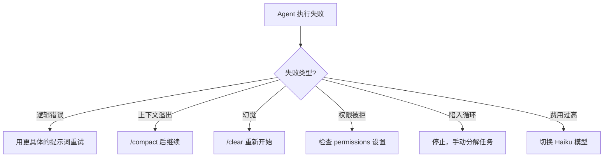

# 最佳实践与反模式

## Anthropic 团队的 5 条核心建议

### 1. 让 Claude 自我验证

> 给 Claude 一种检查自己输出的方式。

```
好: "添加用户认证功能并确保所有测试通过"
差: "添加用户认证功能"
```

Claude 可以运行 `npm test` 验证自己的改动。不给验证手段，就得不到可靠的结果。

### 2. Plan 模式先行

> 在计划上投入精力，Claude 可以一次性完成实现。

```
好: "先用 think 分析认证方案，确认后再实现"
差: "直接实现认证功能"
```

复杂的任务先在 Plan 模式下探索设计方案，得到确认后再执行。

### 3. Opus + Thinking

> 少操控 + 好工具使用 = 更快的整体结果。

对于复杂任务，使用 Opus 模型并开启 thinking 模式，让 Claude 深度思考而不是频繁交互纠正。

### 4. Skills 用于重复工作流

> 任何一天做两次以上的事，都应该写成 Skill。

```yaml
# .claude/skills/deploy/SKILL.md
---
name: deploy
description: Deploy the app to staging or production.
---
```

### 5. 子代理处理大型审查

> PR 审查时派遣多个代理，每个关注不同维度。

让 3 个子代理分别关注逻辑、安全、性能，最后汇总。

## 最佳实践清单

### 上下文管理

| 实践 | 说明 |
|------|------|
| 适度使用 `/clear` | 话题完全改变时清空上下文 |
| 及时 `/compact` | 上下文接近上限时压缩 |
| 子代理隔离 | 大型搜索/分析用子代理，不污染主上下文 |
| CLAUDE.md 保持更新 | 减少每次会话中的重复解释 |

### 安全

| 实践 | 说明 |
|------|------|
| 权限最小化 | deny 规则优先于 allow |
| PreToolUse 拦截 | 敏感文件和危险命令在调用前拦截 |
| Stop 验证 | 任务完成前的最终检查 |
| 密钥不落盘 | 凭据通过环境变量，永不在配置文件中 |

### 性能

| 实践 | 说明 |
|------|------|
| 选择合适模型 | 简单任务用 Haiku，复杂任务用 Opus |
| 限制 Max Turns | 防止 Agent Loop 失控 |
| MCP 工具精简 | 只安装需要的 MCP Server |
| Matcher 精确匹配 | Hook 的 matcher 不用 `*` |

### 团队协作

| 实践 | 说明 |
|------|------|
| CLAUDE.md 入 Git | 团队共享项目约定 |
| 命令/技能入 .claude/ | 放在项目中随代码一起 |
| Worktree 并行 | 多 Agent 并行工作时用 worktree 隔离 |
| PR Review 自动化 | 把 Claude 审查集成到 CI |

## 反模式（避免做的事）

### 1. 上下文反模式

```
差: 在一个会话中做 10 件完全不相关的事
好: 一个会话聚焦一个主题
```

会话太长且话题混杂会导致 Claude 行为不稳定。使用 `/clear` 切换话题。

### 2. 提示词反模式

```
差: "修这个 bug"                           ← 没有上下文
差: "根据我们之前的讨论，你知道该怎么做"    ← Claude 不记得 "之前的讨论"

好: "在 src/auth/login.ts 中，token 过期时
     前端没有刷新 token，而是直接跳转 401。
     需要在 axios interceptor 中检查 401，
     自动调用 refreshToken()，然后重试请求。"
```

### 3. Skills 反模式

| 反模式 | 问题 | 正确做法 |
|--------|------|---------|
| SKILL.md 超过 2000 词 | 加载慢、浪费上下文 | 拆分 references/ |
| description 太模糊 | 自动触发匹配不准 | 明确场景和关键词 |
| 硬编码路径 | 迁移到其他项目失败 | 使用 `${CLAUDE_PLUGIN_ROOT}` |

### 4. Hooks 反模式

| 反模式 | 问题 | 正确做法 |
|--------|------|---------|
| matcher 用 `"*"` | 每步都触发，严重影响性能 | 精确匹配 `"Edit|Write"` |
| 钩子间有依赖 | 并行执行顺序不确定 | 独立设计每个钩子 |
| 跳过 exit 2 反馈 | Claude 不知道为何被阻止 | 给出清晰的 stderr 信息 |

### 5. Agent 反模式

| 反模式 | 问题 | 正确做法 |
|--------|------|---------|
| 过度使用子代理 | 管理成本超过执行效益 | 简单任务直接处理 |
| 子代理提示词不完整 | 子代理没有上下文 | 编写自包含的提示词 |
| 期望子代理记住历史 | 子代理是独立会话 | 所有必要信息写进提示词 |

### 6. MCP 反模式

```
差: 安装 50 个 MCP Server
好: 只安装当前项目真正需要的 3-5 个
```

每个 MCP Server 的工具列表都会消耗上下文 token，越多越慢。

### 7. 过度自动化反模式

```
差: 把 Claude Code 放进一切流程
好: 评估每个场景：AI 增加了价值还是增加了不确定性？
```

Claude Code 最适合需要**推理和创造性**的任务，不适合 100% 确定性的纯粹自动化。

## 成本优化

| 策略 | 预期节省 |
|------|---------|
| 简单任务用 Haiku（不是 Sonnet） | 40-60% |
| 使用语义缓存（AI Gateway） | 10-30% |
| 限制 max-turns | 防止失控 |
| /compact 定期压缩 | 减少长会话浪费 |
| 使用子代理隔离大搜索 | 不浪费主会话 token |

## 故障恢复模式



## 最终检查清单

在将 Claude Code 用于生产前，确认：

- [ ] CLAUDE.md 已生成并提交到 Git
- [ ] permissions 已配置 deny 规则（敏感文件、危险命令）
- [ ] PreToolUse 钩子已部署安全拦截
- [ ] Stop 钩子已设置任务完成验证
- [ ] CI/CD 集成设置了 max-turns 和超时
- [ ] AI Gateway 已配置成本追踪和预算告警
- [ ] 团队的 Skills 和 Commands 已标准化
- [ ] 有回滚机制（git stash + checkout）

## 实践练习

1. 对比同一个任务使用 Haiku vs Sonnet vs Opus 的效率和成本
2. 找出你工作中重复执行的任务，把它写成 Skill
3. 审查你的 CLAUDE.md，确保简洁且有价值
4. 用检查清单审查你的项目是否准备好生产使用
