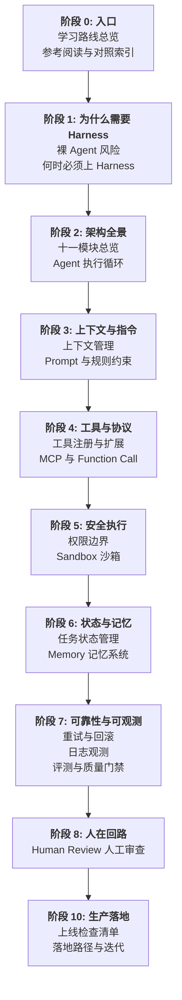
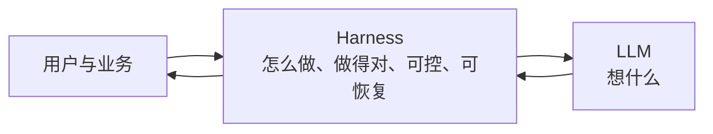

# 学习路线总览

## 目标

本学习路径帮助你系统掌握 Agent Harness——LLM 之外的工程执行与兜底系统。完成学习后，你将能设计稳定、可控、可上线的 Agent 架构，并用上线检查清单验收生产就绪度。

## 前置要求

- 基础 LLM 概念（Prompt、Token、Tool Calling）
- 了解 Agent 循环（ReAct / Plan-Execute）的基本思想
- 可选：已读 [agent-learning-path](../../agent-learning-path/) 阶段 03 入门

## 7 阶段学习路线

## 建议学习周期（6-8 周）

| 周次 | 阶段 | 内容 | 预计时间 |
|------|------|------|----------|
| 1 | 入口 + 为什么 | 路线总览、裸 Agent 风险、判断准则 | 4h |
| 2 | 架构全景 | 十一模块、执行循环 | 4h |
| 3 | 上下文与工具 | 上下文、Prompt、工具、MCP | 8h |
| 4 | 安全与状态 | 权限、Sandbox、状态、Memory | 8h |
| 5 | 可靠性 | 重试回滚、观测、评测 | 6h |
| 6 | HITL + 生产 | 人工审查、上线检查、落地 | 6h |

## 学习建议

1. **概念优先**：本路径讲通用工程能力，框架细节见各章「本仓库延伸阅读」
2. **对照速记稿**：[`agent-harmess/`](../../agent-harmess/) 四篇作复习卡片
3. **以检查清单验收**：阶段 10 的 15 项是生产准入标准

## 核心等式

