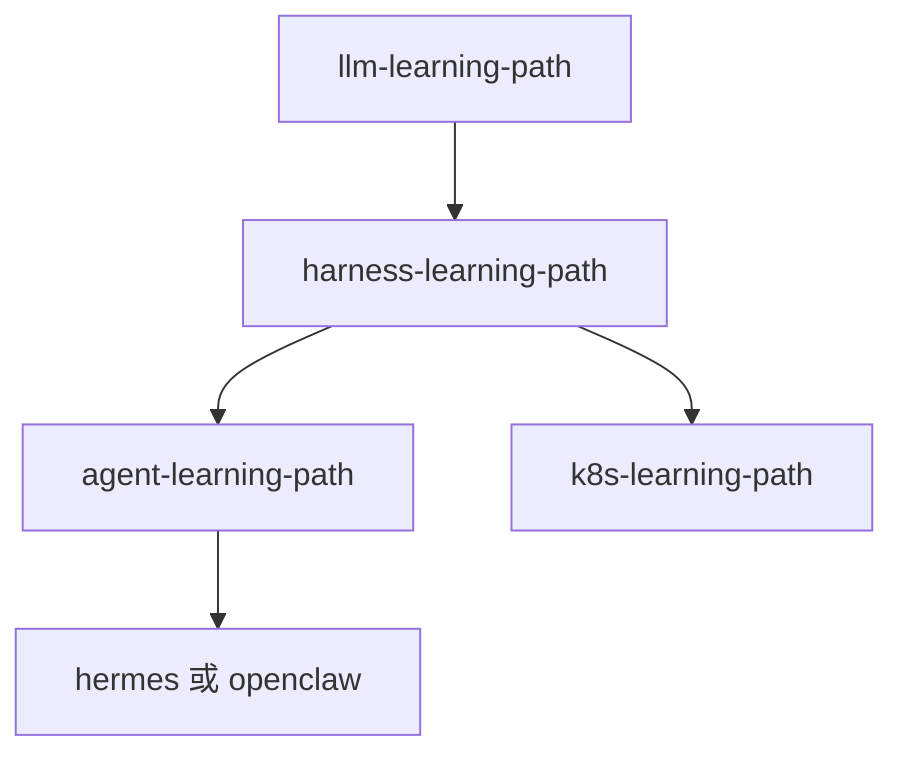

# 本仓库路径对照索引

Harness 讲**通用工程能力**；下表链到本仓库各路径中**如何实现**该能力的章节。每章正文末尾也有精简版延伸阅读。

## 按 Harness 模块

| Harness 模块 | 本仓库延伸阅读 |
|----------------|----------------|
| 架构 / 执行循环 | [Agent 架构概述](../../agent-learning-path/03-Agent/01-Agent架构概述.md)、[Hermes 核心循环](../../hermes-learning-path/01-Agent核心循环.md)、[OpenClaw ReAct](../../openclaw-learning-path/02-Agent核心循环/01-ReAct循环机制.md) |
| 上下文管理 | [Hermes 上下文压缩](../../hermes-learning-path/05-上下文压缩.md)、[OpenClaw 上下文管理](../../openclaw-learning-path/06-上下文管理/01-上下文压缩策略.md)、[Agent RAG](../../agent-learning-path/05-RAG/) |
| Prompt 与指令 | [Hermes System Prompt](../../hermes-learning-path/04-System%20Prompt构建.md)、[CLAUDE.md](../../claude-code-learning-path/01-项目记忆与配置/01-CLAUDE.md详解.md) |
| 工具注册 | [Tool Calling](../../agent-learning-path/03-Agent/02-Tool-Calling深度实践.md)、[Hermes 工具系统](../../hermes-learning-path/02-工具调用系统.md)、[Claude Code 内置工具](../../claude-code-learning-path/02-Tools工具系统/01-内置工具详解.md) |
| MCP / Function Call | [Claude Code MCP](../../claude-code-learning-path/05-MCP协议集成/)、[Hermes SDK](../../hermes-learning-path/09-SDK与API开发接口.md) |
| 权限边界 | [Agent 安全与防护](../../agent-learning-path/07-生产部署/03-安全与防护.md)、[Claude Code 权限](../../claude-code-learning-path/01-项目记忆与配置/03-权限与安全配置.md)、[OpenClaw 工具护栏](../../openclaw-learning-path/04-工具与技能系统/03-工具安全护栏.md) |
| Sandbox | [Hermes 工具系统（沙箱）](../../hermes-learning-path/02-工具调用系统.md)、[OpenClaw 安全模型](../../openclaw-learning-path/09-安全与可观测/01-安全模型.md) |
| 任务状态 | [LangGraph Checkpoint](../../agent-learning-path/02-图核心/04-状态管理与Checkpoint.md)、[Hermes Kanban](../../hermes-learning-path/11-Kanban看板系统.md) |
| Memory | [Hermes 记忆与技能](../../hermes-learning-path/06-记忆与技能系统.md)、[OpenClaw 记忆系统](../../openclaw-learning-path/05-记忆系统/) |
| 重试 / 回滚 | [Hermes Kanban（回收重试）](../../hermes-learning-path/11-Kanban看板系统.md)、[K8s Deployment 回滚](../../k8s-learning-path/02-工作负载/01-Deployment与ReplicaSet.md) |
| 可观测 | [LangSmith](../../agent-learning-path/07-生产部署/01-LangSmith可观测性.md)、[OpenClaw 可观测性](../../openclaw-learning-path/09-安全与可观测/02-可观测性.md) |
| 评测 | [LLM 评估体系](../../llm-learning-path/09-高级/09-LLM评估体系设计.md) |
| Human Review | [Agent HITL](../../agent-learning-path/03-Agent/04-Human-in-the-Loop.md)、[Hermes vs OpenClaw HITL](../../openclaw-learning-path/10-与Hermes对比/02-能力矩阵对比.md) |
| Skill（扩展） | [Agent Skill](../../agent-learning-path/04-Skill/)、[Claude Code Skills](../../claude-code-learning-path/03-Skills技能系统/) |
| 生产落地 | [Agent 生产部署](../../agent-learning-path/07-生产部署/)、[Claude Code 生产实践](../../claude-code-learning-path/07-生产实践/)、[K8s 学习路径](../../k8s-learning-path/) |
| 多 Agent | [Agent 多 Agent](../../agent-learning-path/06-多Agent/)、[Hermes 多 Agent](../../hermes-learning-path/10-多Agent协作模式.md) |

## 按本仓库路径分组

| 路径 | 体现的 Harness 能力 |
|------|---------------------|
| [llm-learning-path](../../llm-learning-path/) | 模型能力边界、评测体系 |
| [harness-learning-path](../README.md) | 工程兜底层（本路径） |
| [agent-learning-path](../../agent-learning-path/) | LangGraph 应用、Tool、HITL、生产 |
| [claude-code-learning-path](../../claude-code-learning-path/) | IDE Agent、权限、Hooks、MCP |
| [hermes-learning-path](../../hermes-learning-path/) | Python Agent 全栈实现 |
| [openclaw-learning-path](../../openclaw-learning-path/) | Node Agent、记忆、沙箱、可观测 |
| [k8s-learning-path](../../k8s-learning-path/) | 运行时部署与回滚类比 |

## 推荐学习顺序

