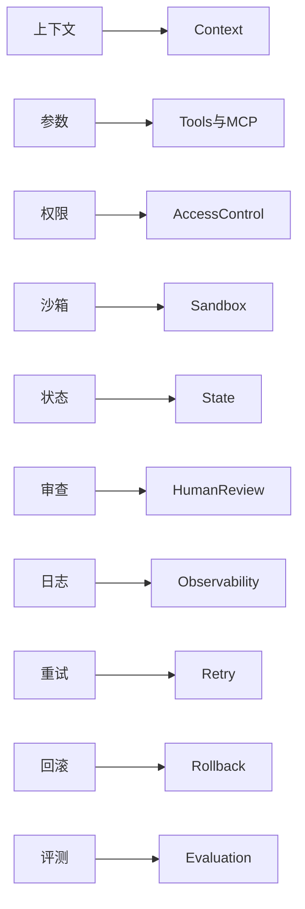

# 裸 Agent 为何不稳定

## 提出问题

Stable Agent 不是靠更大的模型，而是靠 **Harness 工程系统**兜底。裸 Agent（仅 LLM + 直接调工具）在真实环境里极易「翻车」。

> **类比**：裸 Agent 像没有仪表盘、刹车和安全气囊的自动驾驶；Harness 补上了这些。

## 裸 Agent vs Harness：10 项对比

| # | 问题 | 裸 Agent 会怎样翻车 | Harness 如何兜底 |
|---|------|---------------------|------------------|
| 1 | 上下文错乱 | 忘记关键信息，输出跑题 | 上下文管理：清洗、压缩、分层、检索 |
| 2 | 工具参数错误 | 格式乱填、调用失败 | 工具注册 + Schema 校验、默认值 |
| 3 | 权限过大 | 越权访问、误改生产 | 最小权限、审批流、二次确认 |
| 4 | 没有 Sandbox | 直接破坏真实环境 | 沙箱隔离、模拟验证后再落地 |
| 5 | 任务状态丢失 | 中断后从头开始 | 步骤持久化、断点续跑 |
| 6 | 无人审查 | 错误结果直接对外 | 关键节点人工确认、可撤销 |
| 7 | 无日志观测 | 无法定位原因 | 结构化日志、链路追踪、告警 |
| 8 | 无法重试 | 临时失败即放弃 | 策略化重试、幂等、失败分类 |
| 9 | 无法回滚 | 不可逆损害 | 快照、补偿事务、回滚预案 |
| 10 | 目标难保障 | 质量不一致 | 输出校验、评测、质量门禁 |

## 执行流程对比

### 裸 Agent（4 步，无兜底）

典型风险：参数错、越权、中断丢失、无人审核、无日志

### 有 Harness（分组 5 步）

展开对应：工具校验（Schema）→ 沙箱执行 → 结果迭代 → 必要时 HITL → 观测留痕

| 对比 | 裸 Agent | 有 Harness |
|------|----------|------------|
| 步数 | 4 步直通 | 5 组，内含校验/隔离/审查 |
| 结果 | 不确定、难排查 | 可预测、可观测、可恢复 |

## 10 问题到 Harness 模块映射

## 设计原则

- 稳定来自**工程**，不来自模型参数量
- 每个翻车点应对应明确的 Harness 模块
- 生产 Agent 默认假设模型会犯错

## 动手练习

1. 列举你用过的一个 Agent 产品，对照上表标出已具备/缺失的 Harness 能力
2. 画一张「裸 Agent」执行你的任务的流程，标出 3 个最可能翻车点
3. 为每个翻车点写出对应的 Harness 兜底机制

## 常见坑

- **以为换大模型就稳定**：参数错误、越权、无观测等问题与模型大小无关
- **只做 Prompt 工程**：Prompt 是 Harness 一部分，不能替代权限与沙箱
- **忽略状态持久化**：长任务必做 State + Checkpoint

## 本仓库延伸阅读

| 文档 | 说明 |
|------|------|
| [agent-harmess/没有 Harness 的 Agent 为什么不稳定.md](../../agent-harmess/没有%20Harness%20的%20Agent%20为什么不稳定.md) | 原始速记稿 |
| [agent-learning-path/03-Agent/01-Agent架构概述.md](../../agent-learning-path/03-Agent/01-Agent架构概述.md) | Agent 架构中的 Harness 要素 |

## 小结

- 裸 Agent 在上下文、工具、权限、状态、观测、恢复上系统性缺失
- Harness 用 11 模块 + 4 增强能力逐项兜底
- 模型负责「想什么」，Harness 负责「做得对、可控、可恢复」
