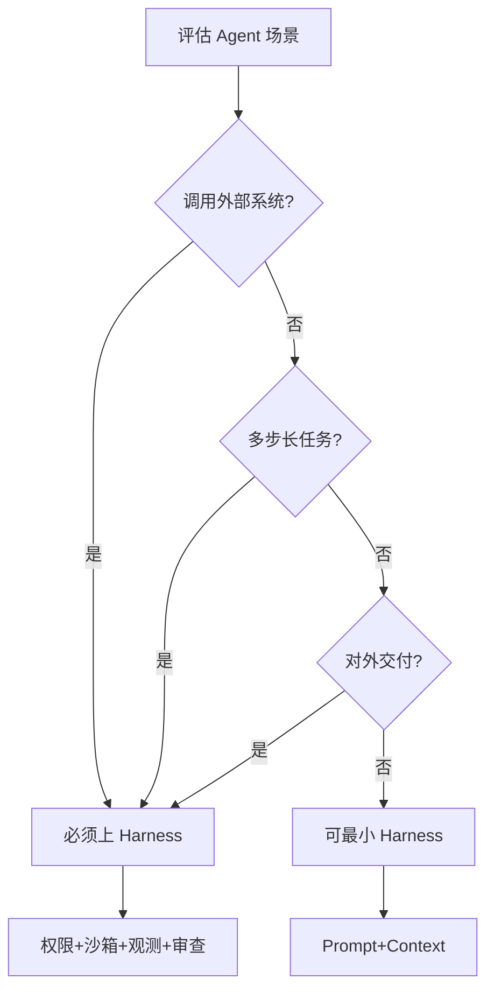

# 何时必须上 Harness

## 提出问题

不是所有 Demo 都需要完整 Harness，但涉及真实系统、长任务、对外交付时，**没有 Harness 等于裸奔**。

## 五条判断准则

| # | 准则 | 典型场景 |
|---|------|----------|
| 1 | 涉及外部系统或敏感操作 | 读写 DB/文件、调 API、发消息、支付 |
| 2 | 上下文依赖复杂或多轮交互 | 长对话、易遗漏、需断点恢复 |
| 3 | 多步骤复杂任务链 | 分步执行、某步可能失败、需重试与状态 |
| 4 | 有人协作或对外交付 | 需审核、可追溯、责任可界定 |
| 5 | 追求自动化与规模化 | 批量任务、监控告警、持续优化 |

## 场景矩阵

| 场景 | 是否需要 Harness | 最低模块集 |
|------|------------------|------------|
| 单次问答、无工具 | 可选 | Prompt + Context |
| 读文件写代码（IDE Agent） | **必须** | + Tools + Sandbox + 权限 |
| 企业知识助手 + 审批 | **必须** | + HITL + 观测 + 评测 |
| 自动化运营多系统 | **必须** | 全模块 + Retry/Rollback |
| 研发流程自动化 | **必须** | 全模块 + 状态 + Memory |

## 设计原则

- **默认偏保守**：不确定时按「必须」设计
- **渐进落地**：先边界与权限，再观测与审查，最后评测自动化
- **与业务风险对齐**：高风险场景模块不可省略

## 动手练习

1. 为你当前项目填场景矩阵，列出最低模块集
2. 用决策树判断：客服 Bot（只读 FAQ）vs 自动改生产配置
3. 写出「可以暂缓」的模块及理由（需业务签字）

## 常见坑

- **Demo 能跑 ≠ 能上线**：Demo 常跳过 Sandbox 与 HITL
- **内部工具忽视审计**：内部同样需日志与权限
- **一次性脚本不建状态**：第二次跑就踩坑

## 本仓库延伸阅读

| 文档 | 说明 |
|------|------|
| [agent-harmess/没有 Harness 的 Agent 为什么不稳定.md](../../agent-harmess/没有%20Harness%20的%20Agent%20为什么不稳定.md) | 判断准则原文 |
| [agent-learning-path/10-生产部署/](../../agent-learning-path/10-生产部署/) | 生产部署考量 |

## 小结

- 外部系统、长任务、对外交付、规模化 — 四条红线
- 最低模块集随场景升级，高风险不可省略 Sandbox 与 HITL
- 先用决策树评估，再选模块落地
